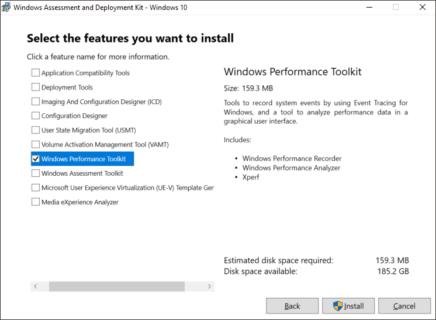
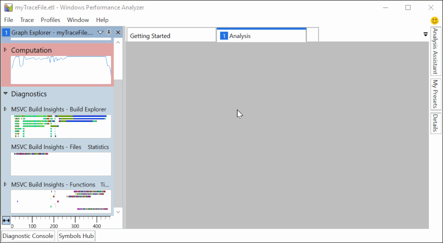

# Getting started with C++ Build Insights

## Introduction

C++ Build Insights is a collection of tools that provides increased visibility into the Microsoft Visual C++ (MSVC) tool chain. It collects data about your C++ builds and presents it in a format that can help you answer common questions like:

- Are my builds sufficiently parallelized?
- What should I include in my pre-compiled header (PCH)?
- Is there a specific bottleneck I should focus on to increase my build speeds?

The two principal components of this technology are the command-line utility *vcperf.exe* and an add-in for the Windows Performance Analyzer (WPA) trace viewer. The utility is used to collect traces of your build, while the add-in allows you to view them in WPA. On this page, we will show you how to quickly get started using these two tools.

## Step 1: Install and configure Windows Performance Analyzer

WPA is a trace viewer available in the Windows Assessment and Deployment Kit (ADK). It needs to be obtained separately from Visual Studio. Acquiring and setting up this component can be done by following the steps below.

### Acquisition steps

A version of WPA that supports C++ Build Insights is currently only available in the Windows ADK Insider Preview. To access this preview, you will need to sign up to the Windows Insider Program. You do not need to install the Windows 10 Insider Preview operating system to obtain the Windows ADK preview; simply registering your Microsoft account with the Windows Insider Program is enough.

1. Browse to the Windows ADK Insider Preview [download page](https://www.microsoft.com/software-download/windowsinsiderpreviewADK).
1. Download the Windows ADK Insider Preview. It is a disk image.
1. Open the disk image and run the *adksetup.exe* installer.
1. When prompted for the features that you want to install, select the Windows Performance Toolkit. You may select other features if you wish, but they are not required to install WPA.

The image below shows an appropriate feature selection:

### Configuration steps

1. Launch WPA.
1. Select Window -> Select Tables (Experimental).
1. Scroll down to the Diagnostics section.
1. Make sure all the C++ Build Insights views are selected.

A correctly configured table selection looks like the following image:

## Step 2: Trace your build with vcperf.exe

Viewing C++ Build Insights data requires you to first collect it into a trace file by following these steps:

1. Open a native tools or cross tools command prompt for Visual Studio 2019 in administrative mode.
1. Issue the following command: `vcperf.exe /start SessionName`. Choose a session name that you will remember.
1. Build your project as you normally would. You do not need to use the same command prompt.
1. Issue the following command: `vcperf.exe /stop SessionName traceFile.etl`. Use the same session name that was chosen when issuing the start command. Give your trace file an appropriate name. 

The image below illustrates the use of *vcperf.exe*:

### Important notes about vcperf.exe

- Starting and stopping a trace with *vcperf.exe* requires administrative privileges.
- Only one tracing session at a time may run on a machine.
- Make sure to remember the session name you used to start your trace. Stopping a running session without knowing its name can be troublesome.
- Just like *cl.exe* and *link.exe*, the command-line utility *vcperf.exe* is included in an MSVC installation. No additional step is required to obtain this component.
- *vcperf.exe* collects information about all MSVC tools running on your system. As a result, it is not necessary to start your build from the command prompt that you used to collect the trace. If desired, you can build your project from either a different command prompt or even Visual Studio.

## Step 3: View your trace in Windows Performance Analyzer

Launch WPA and open the trace you just collected. WPA should recognize it as a C++ Build Insights trace, and the following views should appear in the Graph Explorer panel on the left:

- Build Explorer
- Files
- Function

If you cannot see these views, double-check that WPA has been configured correctly as described in [Configuration steps](#configuration-steps). You can view your build data by dragging the views into the empty Analysis window on the right. This step is shown in the image below.

Other views might also be available in the Graph Explorer panel. Feel free to also drag them into the Analysis window if you are interested in the information they contain. A useful one is the CPU (Sampled) view, which shows CPU utilization throughout your build.

## More information

[Windows Performance Analyzer basics](wpa-basics.md) 
Learn about common WPA operations that can help you analyze your build traces.

[vcperf.exe reference](vcperf-reference.md) 
View this page for a list of *vcperf.exe* commands.

[Windows Performance Analyzer views reference](wpa-views-reference.md) 
Refer to this page for details about the C++ Build Insights views in WPA.

[Windows Performance Analyzer](https://docs.microsoft.com/windows-hardware/test/wpt/windows-performance-analyzer) 
The official WPA documentation site.
