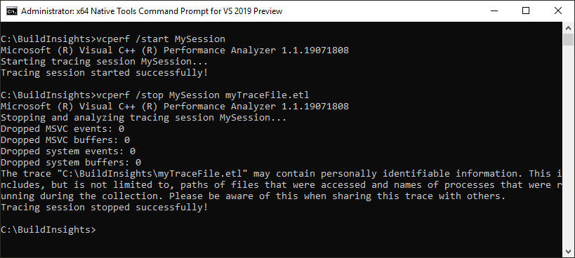

# Tutorial: vcperf and Windows Performance Analyzer

::: moniker range="<=msvc-150"

The C++ Build Insights tools are available in Visual Studio 2019 and later. To see the documentation for this version, set the Visual Studio **Version** selector control for this article to Visual Studio 2019 or later. It's found at the top of the table of contents on this page.

::: moniker-end
::: moniker range=">=msvc-160"

In this tutorial, you'll learn how to use *`vcperf.exe`* to collect a trace of your C++ build. You'll also learn how to view this trace in Windows Performance Analyzer.

## Step 1: Install and configure Windows Performance Analyzer

WPA is a trace viewer available in the Windows Assessment and Deployment Kit (ADK). It's a separate utility that's not part of the components you can install with the Visual Studio installer.

A version of WPA that supports C++ Build Insights is only available in versions of the Windows ADK numbered 10.1.19041.0 or later.

### To download and install WPA

NOTE: Windows 8 or above is required for installing the Windows Performance Analyzer.

1. Browse to the Windows ADK [download page](/windows-hardware/get-started/adk-install).

1. Download and install the latest version of the Windows ADK.

1. When prompted for the features that you want to install, select the **Windows Performance Toolkit**. You may select other features if you wish, but they're not required to install WPA.

   

###  To configure WPA

Viewing C++ Build Insights traces in WPA requires a special add-in. Follow these steps to install it:

1. Obtain the add-in by downloading one of the components below. You don't need to get both. Choose the one that you find most convenient.
    - Visual Studio 2019 version 16.6 and above. For the latest version, see [Visual Studio Downloads](https://visualstudio.microsoft.com/downloads/).
    - [C++ Build Insights NuGet package](https://www.nuget.org/packages/Microsoft.Cpp.BuildInsights/).

1. Copy the `perf_msvcbuildinsights.dll` file into your WPA installation directory.
    1. In Visual Studio 2019 version 16.6 and above, this file is located here: `C:\Program Files (x86)\Microsoft Visual Studio\{Year}\{Edition}\VC\Tools\MSVC\{Version}\bin\Host{Architecture}\{Architecture}`.
    1. In the C++ Build Insights NuGet package, this file is located here: `wpa\{Architecture}`.
    1. In the paths above, replace the variables surrounded by curly brackets as follows:
        1. `{Year}` is your Visual Studio product year, such as 2019 or 2022.
        1. `{Edition}` is your Visual Studio edition such as Community, Professional, or Enterprise.
        1. `{Version}` is your MSVC version. Choose the highest one available.
        1. `{Architecture}`: choose `x64` if you have a 64-bit version of Windows. Otherwise, choose `x86`.
    1. The WPA installation directory is typically: `C:\Program Files (x86)\Windows Kits\10\Windows Performance Toolkit`.

1. In your WPA installation directory, open the `perfcore.ini` file and add an entry for `perf_msvcbuildinsights.dll`.

## Step 2: Trace your build with vcperf.exe

To view C++ Build Insights data, first collect it into a trace file by following these steps:

1. Open an **x64** or **x86 Native Tools Command Prompt for VS** in administrator mode. (Right-click the Start menu item and choose **More** > **Run as administrator**.)
    1. Choose **x64** if you have a 64-bit version of Windows. Otherwise, choose **x86**.

1. In the command prompt window, enter this command:

   **vcperf.exe /start _SessionName_**

   Choose a session name you'll remember for *SessionName*.

1. Build your project as you normally would. You don't need to use the same command prompt window to build.

1. In the command prompt window, enter this command:

   **vcperf.exe /stop _SessionName_ _traceFile.etl_**

   Use the same session name you chose for *SessionName* before. Choose an appropriate name for the *traceFile.etl* trace file.

Here's what a typical *vcperf.exe* command sequence looks like in a developer command prompt window:

### Important notes about vcperf.exe

- Administrator privileges are required to start or stop a *vcperf.exe* trace. Use a developer command prompt window that you open by using **Run as administrator**.

- Only one tracing session at a time may run on a machine.

- Make sure to remember the session name you used to start your trace. It can be troublesome to stop a running session without knowing its name.

- Just like *cl.exe* and *link.exe*, the command-line utility *vcperf.exe* is included in an MSVC installation. No additional steps are required to obtain this component.

- *vcperf.exe* collects information about all MSVC tools running on your system. As a result, you don't have to start your build from the same command prompt you used to collect the trace. You can build your project from either a different command prompt, or even in Visual Studio.

### vcperf.exe is open-source

If you wish to build and run your own version of *vcperf.exe*, feel free to clone it from the [vcperf GitHub repository](https://github.com/microsoft/vcperf).

## Step 3: View your trace in Windows Performance Analyzer

Launch WPA and open the trace you just collected. WPA should recognize it as a C++ Build Insights trace, and the following views should appear in the Graph Explorer panel on the left:

- Build Explorer
- Files
- Functions
- Template Instantiations

If you can't see these views, double-check that WPA is configured correctly, as described in [Step 1](#configuration-steps). You can view your build data by dragging the views into the empty Analysis window on the right, as shown here:

Other views are available in the Graph Explorer panel. Drag them into the Analysis window when you're interested in the information they contain. A useful one is the CPU (Sampled) view, which shows CPU utilization throughout your build.

## More information

[Tutorial: Windows Performance Analyzer basics](wpa-basics.md)\
Learn about common WPA operations that can help you analyze your build traces.

[Reference: vcperf commands](../reference/vcperf-commands.md)\
The *vcperf.exe* command reference lists all the available command options.

[Reference: Windows Performance Analyzer views](../reference/wpa-views.md)\
Refer to this article for details about the C++ Build Insights views in WPA.

[Windows Performance Analyzer](/windows-hardware/test/wpt/windows-performance-analyzer)\
The official WPA documentation site.

::: moniker-end
