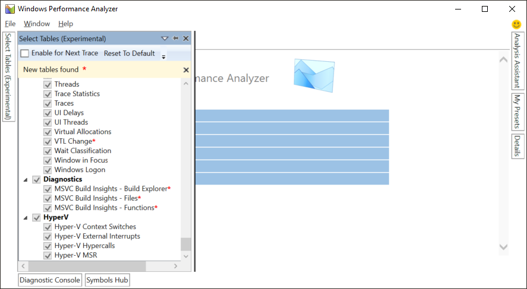

# Tutorial: vcperf and Windows Performance Analyzer

::: moniker range="<=vs-2017"

The C++ Build Insights tools are available in Visual Studio 2019. To see the documentation for this version, set the Visual Studio **Version** selector control for this article to Visual Studio 2019. It's found at the top of the table of contents on this page.

::: moniker-end
::: moniker range="vs-2019"

In this tutorial, you'll learn how to use *vcperf.exe* to collect a trace of your C++ build. You'll also learn how to view this trace in Windows Performance Analyzer.

## Step 1: Install and configure Windows Performance Analyzer

WPA is a trace viewer available in the Windows Assessment and Deployment Kit (ADK). It's a separate utility that's not part of the components you can install with the Visual Studio installer.

A version of WPA that supports C++ Build Insights is currently only available in the Windows ADK Insider Preview. To access this preview, you must sign up for the [Windows Insider program](https://insider.windows.com). You don't need to install the Windows 10 Insider Preview operating system to obtain the Windows ADK preview. You only need to register your Microsoft account with the Windows Insider Program.

### To download and install WPA

NOTE: Windows 8 or above is required for installing the Windows Performance Analyzer.

1. Browse to the Windows ADK Insider Preview [download page](https://www.microsoft.com/en-us/software-download/windowsinsiderpreviewADK).

1. Download the Windows ADK Insider Preview. It's a disk image.

1. Open the disk image and run the *adksetup.exe* installer.

1. When prompted for the features that you want to install, select the **Windows Performance Toolkit**. You may select other features if you wish, but they're not required to install WPA.

   

###  To configure Build Insights

1. Launch WPA.

1. Select **Window** > **Select Tables (Experimental)**.

1. Scroll down to the **Diagnostics** section.

1. Select all the MSVC Build Insights views.

   

## Step 2: Trace your build with vcperf.exe

To view C++ Build Insights data, first collect it into a trace file by following these steps:

1. Open a native tools or cross tools developer command prompt for Visual Studio 2019 in administrator mode. (Right-click the Start menu item and choose **More** > **Run as administrator**.)

1. In the command prompt window, enter this command:

   **vcperf.exe /start _SessionName_**

   Choose a session name you'll remember for *SessionName*.

1. Build your project as you normally would. You don't need to use the same command prompt window to build.

1. In the command prompt window, enter this command:

   **vcperf.exe /stop _SessionName_ _traceFile.etl_**

   Use the same session name you chose for *SessionName* before. Choose an appropriate name for the *traceFile.etl* trace file.

Here's what a typical *vcperf.exe* command sequence looks like in a developer command prompt window:

### Important notes about vcperf.exe

- Administrator privileges are required to start or stop a *vcperf.exe* trace. Use a developer command prompt window that you open by using **Run as administrator**.

- Only one tracing session at a time may run on a machine.

- Make sure to remember the session name you used to start your trace. It can be troublesome to stop a running session without knowing its name.

- Just like *cl.exe* and *link.exe*, the command-line utility *vcperf.exe* is included in an MSVC installation. No additional steps are required to obtain this component.

- *vcperf.exe* collects information about all MSVC tools running on your system. As a result, you don't have to start your build from the same command prompt you used to collect the trace. You can build your project from either a different command prompt, or even in Visual Studio.

## Step 3: View your trace in Windows Performance Analyzer

Launch WPA and open the trace you just collected. WPA should recognize it as a C++ Build Insights trace, and the following views should appear in the Graph Explorer panel on the left:

- Build Explorer
- Files
- Function

If you can't see these views, double-check that WPA is configured correctly, as described in [Step 1](#configuration-steps). You can view your build data by dragging the views into the empty Analysis window on the right, as shown here:

Other views are available in the Graph Explorer panel. Drag them into the Analysis window when you're interested in the information they contain. A useful one is the CPU (Sampled) view, which shows CPU utilization throughout your build.

## More information

[Tutorial: Windows Performance Analyzer basics](wpa-basics.md)\
Learn about common WPA operations that can help you analyze your build traces.

[Reference: vcperf commands](/cpp/build-insights/reference/vcperf-commands)\
The *vcperf.exe* command reference lists all the available command options.

[Reference: Windows Performance Analyzer views](/cpp/build-insights/reference/wpa-views)\
Refer to this article for details about the C++ Build Insights views in WPA.

[Windows Performance Analyzer](/windows-hardware/test/wpt/windows-performance-analyzer)\
The official WPA documentation site.

::: moniker-end
