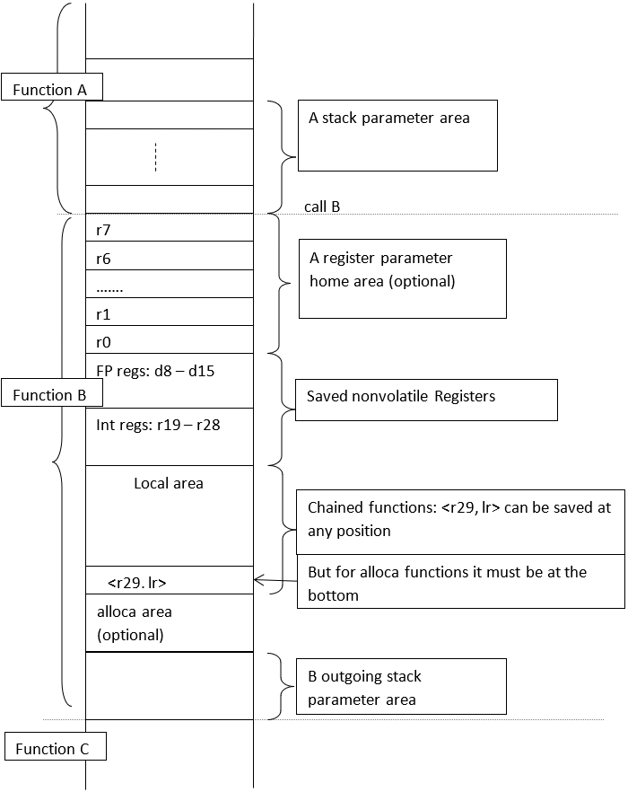
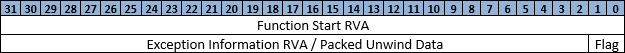
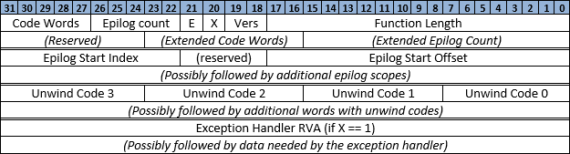
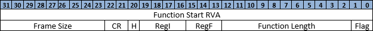

# ARM64 exception handling

Windows on ARM64 uses the same structured exception handling mechanism for asynchronous hardware-generated exceptions and synchronous software-generated exceptions. Language-specific exception handlers are built on top of Windows structured exception handling by using language helper functions. This document describes exception handling in Windows on ARM64. It illustrates the language helpers used by code that's generated by the Microsoft ARM assembler and the MSVC compiler.

## Goals and motivation

The exception unwinding data conventions, and this description, are intended to:

- Provide enough description to allow unwinding without code probing in all cases.

  - Analyzing the code requires the code to be paged in. It prevents unwinding in some circumstances where it's useful (tracing, sampling, debugging).

  - Analyzing the code is complex; the compiler must be careful to only generate instructions that the unwinder can decode.

  - If unwinding can't be fully described by using unwind codes, then in some cases it must fall back to instruction decoding. Instruction decoding increases the overall complexity, and ideally should be avoided.

- Support unwinding in mid-prolog and mid-epilog.

  - Unwinding is used in Windows for more than exception handling. It's critical that code can unwind accurately even when in the middle of a prolog or epilog code sequence.

- Take up a minimal amount of space.

  - The unwind codes must not aggregate to significantly increase the binary size.

  - Since the unwind codes are likely to be locked in memory, a small footprint ensures a minimal overhead for each loaded binary.

## Assumptions

These assumptions are made in the exception handling description:

- Prologs and epilogs tend to mirror each other. By taking advantage of this common trait, the size of the metadata needed to describe unwinding can be greatly reduced. Within the body of the function, it doesn't matter whether the prolog's operations are undone, or the epilog's operations are done in a forward manner. Both should produce identical results.

- Functions tend on the whole to be relatively small. Several optimizations for space rely on this fact to achieve the most efficient packing of data.

- There's no conditional code in epilogs.

- Dedicated frame pointer register: If the `sp` is saved in another register (`x29`) in the prolog, that register remains untouched throughout the function. It means the original `sp` may be recovered at any time.

- Unless the `sp` is saved in another register, all manipulation of the stack pointer occurs strictly within the prolog and epilog.

- The stack frame layout is organized as described in the next section.

## ARM64 stack frame layout



For frame chained functions, the `fp` and `lr` pair can be saved at any position in the local variable area, depending on optimization considerations. The goal is to maximize the number of locals that can be reached by a single instruction based on the frame pointer (`x29`) or stack pointer (`sp`). However, for `alloca` functions, it must be chained, and `x29` must point to the bottom of stack. To allow for better register-pair-addressing-mode coverage, nonvolatile register save areas are positioned at the top of the Local area stack. Here are examples that illustrate several of the most efficient prolog sequences. For the sake of clarity and better cache locality, the order of storing callee-saved registers in all canonical prologs is in "growing up" order. `#framesz` below represents the size of entire stack (excluding `alloca` area). `#localsz` and `#outsz` denote local area size (including the save area for the `<x29, lr>` pair) and outgoing parameter size, respectively.

1. Chained, #localsz \<= 512

    ```asm
        stp    x19,x20,[sp,#-96]!        // pre-indexed, save in 1st FP/INT pair
        stp    d8,d9,[sp,#16]            // save in FP regs (optional)
        stp    x0,x1,[sp,#32]            // home params (optional)
        stp    x2,x3,[sp,#48]
        stp    x4,x5,[sp,#64]
        stp    x6,x7,[sp,#82]
        stp    x29,lr,[sp,#-localsz]!   // save <x29,lr> at bottom of local area
        mov    x29,sp                   // x29 points to bottom of local
        sub    sp,sp,#outsz             // (optional for #outsz != 0)
    ```

1. Chained, #localsz > 512

    ```asm
        stp    x19,x20,[sp,#-96]!        // pre-indexed, save in 1st FP/INT pair
        stp    d8,d9,[sp,#16]            // save in FP regs (optional)
        stp    x0,x1,[sp,#32]            // home params (optional)
        stp    x2,x3,[sp,#48]
        stp    x4,x5,[sp,#64]
        stp    x6,x7,[sp,#82]
        sub    sp,sp,#(localsz+outsz)   // allocate remaining frame
        stp    x29,lr,[sp,#outsz]       // save <x29,lr> at bottom of local area
        add    x29,sp,#outsz            // setup x29 points to bottom of local area
    ```

1. Unchained, leaf functions (`lr` unsaved)

    ```asm
        stp    x19,x20,[sp,#-80]!       // pre-indexed, save in 1st FP/INT reg-pair
        stp    x21,x22,[sp,#16]
        str    x23,[sp,#32]
        stp    d8,d9,[sp,#40]           // save FP regs (optional)
        stp    d10,d11,[sp,#56]
        sub    sp,sp,#(framesz-80)      // allocate the remaining local area
    ```

   All locals are accessed based on `sp`. `<x29,lr>` points to the previous frame. For frame size \<= 512, the `sub sp, ...` can be optimized away if the regs saved area is moved to the bottom of stack. The downside is that it's not consistent with other layouts above. And, saved regs take part of the range for pair-regs and pre- and post-indexed offset addressing mode.

1. Unchained, non-leaf functions (saves `lr` in Int saved area)

    ```asm
        stp    x19,x20,[sp,#-80]!       // pre-indexed, save in 1st FP/INT reg-pair
        stp    x21,x22,[sp,#16]         // ...
        stp    x23,lr,[sp,#32]          // save last Int reg and lr
        stp    d8,d9,[sp,#48]           // save FP reg-pair (optional)
        stp    d10,d11,[sp,#64]         // ...
        sub    sp,sp,#(framesz-80)      // allocate the remaining local area
    ```

   Or, with even number saved Int registers,

    ```asm
        stp    x19,x20,[sp,#-80]!       // pre-indexed, save in 1st FP/INT reg-pair
        stp    x21,x22,[sp,#16]         // ...
        str    lr,[sp,#32]              // save lr
        stp    d8,d9,[sp,#40]           // save FP reg-pair (optional)
        stp    d10,d11,[sp,#56]         // ...
        sub    sp,sp,#(framesz-80)      // allocate the remaining local area
    ```

   Only `x19` saved:

    ```asm
        sub    sp,sp,#16                // reg save area allocation*
        stp    x19,lr,[sp]              // save x19, lr
        sub    sp,sp,#(framesz-16)      // allocate the remaining local area
    ```

   \* The reg save area allocation isn't folded into the `stp` because a pre-indexed reg-lr `stp` can't be represented with the unwind codes.

   All locals are accessed based on `sp`. `<x29>` points to the previous frame.

1. Chained, #framesz \<= 512, #outsz = 0

    ```asm
        stp    x29,lr,[sp,#-framesz]!       // pre-indexed, save <x29,lr>
        mov    x29,sp                       // x29 points to bottom of stack
        stp    x19,x20,[sp,#(framesz-32)]   // save INT pair
        stp    d8,d9,[sp,#(framesz-16)]     // save FP pair
    ```

   Compared to the first prolog example above, this example has an advantage: all register save instructions are ready to execute after only one stack allocation instruction. That means there's no anti-dependence on `sp` that prevents instruction level parallelism.

1. Chained, frame size > 512 (optional for functions without `alloca`)

    ```asm
        stp    x29,lr,[sp,#-80]!            // pre-indexed, save <x29,lr>
        stp    x19,x20,[sp,#16]             // save in INT regs
        stp    x21,x22,[sp,#32]             // ...
        stp    d8,d9,[sp,#48]               // save in FP regs
        stp    d10,d11,[sp,#64]
        mov    x29,sp                       // x29 points to top of local area
        sub    sp,sp,#(framesz-80)          // allocate the remaining local area
    ```

   For optimization purpose, `x29` can be put at any position in local area to provide a better coverage for "reg-pair" and pre-/post-indexed offset addressing mode. Locals below frame pointers can be accessed based on `sp`.

1. Chained, frame size > 4K, with or without alloca(),

    ```asm
        stp    x29,lr,[sp,#-80]!            // pre-indexed, save <x29,lr>
        stp    x19,x20,[sp,#16]             // save in INT regs
        stp    x21,x22,[sp,#32]             // ...
        stp    d8,d9,[sp,#48]               // save in FP regs
        stp    d10,d11,[sp,#64]
        mov    x29,sp                       // x29 points to top of local area
        mov    x15,#(framesz/16)
        bl     __chkstk
        sub    sp,sp,x15,lsl#4              // allocate remaining frame
                                            // end of prolog
        ...
        sub    sp,sp,#alloca                // more alloca() in body
        ...
                                            // beginning of epilog
        mov    sp,x29                       // sp points to top of local area
        ldp    d10,d11,[sp,#64]
        ...
        ldp    x29,lr,[sp],#80              // post-indexed, reload <x29,lr>
    ```

## ARM64 exception handling information

### `.pdata` records

The `.pdata` records are an ordered array of fixed-length items that describe every stack-manipulating function in a PE binary. The phrase "stack-manipulating" is significant: leaf functions that don't require any local storage, and don't need to save/restore non-volatile registers, don't require a `.pdata` record. These records should be explicitly omitted to save space. An unwind from one of these functions can get the return address directly from `lr` to move up to the caller.

Each `.pdata` record for ARM64 is 8 bytes in length. The general format of each record places the 32-bit RVA of the function start in the first word, followed by a second word that contains either a pointer to a variable-length `.xdata` block, or a packed word describing a canonical function unwinding sequence.



The fields are as follows:

- **Function Start RVA** is the 32-bit RVA of the start of the function.

- **Flag** is a 2-bit field that indicates how to interpret the remaining 30 bits of the second `.pdata` word. If **Flag** is 0, then the remaining bits form an **Exception Information RVA** (with the two lowest bits implicitly 0). If **Flag** is non-zero, then the remaining bits form a **Packed Unwind Data** structure.

- **Exception Information RVA** is the address of the variable-length exception information structure, stored in the `.xdata` section. This data must be 4-byte aligned.

- **Packed Unwind Data** is a compressed description of the operations needed to unwind from a function, assuming a canonical form. In this case, no `.xdata` record is required.

### `.xdata` records

When the packed unwind format is insufficient to describe the unwinding of a function, a variable-length `.xdata` record must be created. The address of this record is stored in the second word of the `.pdata` record. The format of the `.xdata` is a packed variable-length set of words:



This data is broken into four sections:

1. A 1-word or 2-word header describing the overall size of the structure and providing key function data. The second word is only present if both the **Epilog Count** and **Code Words** fields are set to 0. The header has these bit fields:

   a. **Function Length** is an 18-bit field. It indicates the total length of the function in bytes, divided by 4. If a function is larger than 1M, then multiple `.pdata` and `.xdata` records must be used to describe the function. For more information, see the [Large functions](#large-functions) section.

   b. **Vers** is a 2-bit field. It describes the version of the remaining `.xdata`. Currently, only version 0 is defined, so values of 1-3 aren't permitted.

   c. **X** is a 1-bit field. It indicates the presence (1) or absence (0) of exception data.

   d. **E** is a 1-bit field. It indicates that information describing a single epilog is packed into the header (1) rather than requiring more scope words later (0).

   e. **Epilog Count** is a 5-bit field that has two meanings, depending on the state of **E** bit:

      1. If **E** is 0, it specifies the count of the total number of epilog scopes described in section 2. If more than 31 scopes exist in the function, then the **Code Words** field must be set to 0 to indicate that an extension word is required.

      2. If **E** is 1, then this field specifies the index of the first unwind code that describes the one and only epilog.

   f. **Code Words** is a 5-bit field that specifies the number of 32-bit words needed to contain all of the unwind codes in section 3. If more than 31 words (that is, 124 unwind codes) are required, then this field must be 0 to indicate that an extension word is required.

   g. **Extended Epilog Count** and **Extended Code Words** are 16-bit and 8-bit fields, respectively. They provide more space for encoding an unusually large number of epilogs, or an unusually large number of unwind code words. The extension word that contains these fields is only present if both the **Epilog Count** and **Code Words** fields in the first header word are 0.

1. If the count of epilogs isn't zero, a list of information about epilog scopes, packed one to a word, comes after the header and optional extended header. They're stored in order of increasing starting offset. Each scope contains the following bits:

   a. **Epilog Start Offset** is an 18-bit field that has the offset in bytes, divided by 4, of the epilog relative to the start of the function.

   b. **Res** is a 4-bit field reserved for future expansion. Its value must be 0.

   c. **Epilog Start Index** is a 10-bit field (2 more bits than **Extended Code Words**). It indicates the byte index of the first unwind code that describes this epilog.

1. After the list of epilog scopes comes an array of bytes that contain unwind codes, described in detail in a later section. This array is padded at the end to the nearest full word boundary. Unwind codes are written to this array. They start with the one closest to the body of the function, and move towards the edges of the function. The bytes for each unwind code are stored in big-endian order so the most significant byte gets fetched first, which identifies the operation and the length of the rest of the code.

1. Finally, after the unwind code bytes, if the **X** bit in the header was set to 1, comes the exception handler information. It consists of a single **Exception Handler RVA** that provides the address of the exception handler itself. It's followed immediately by a variable-length amount of data required by the exception handler.

The `.xdata` record is designed so it's possible to fetch the first 8 bytes, and use them to compute the full size of the record, minus the length of the variable-sized exception data that follows. The following code snippet computes the record size:

```cpp
ULONG ComputeXdataSize(PULONG Xdata)
{
    ULONG Size;
    ULONG EpilogScopes;
    ULONG UnwindWords;

    if ((Xdata[0] >> 22) != 0) {
        Size = 4;
        EpilogScopes = (Xdata[0] >> 22) & 0x1f;
        UnwindWords = (Xdata[0] >> 27) & 0x1f;
    } else {
        Size = 8;
        EpilogScopes = Xdata[1] & 0xffff;
        UnwindWords = (Xdata[1] >> 16) & 0xff;
    }

    if (!(Xdata[0] & (1 << 21))) {
        Size += 4 * EpilogScopes;
    }

    Size += 4 * UnwindWords;

    if (Xdata[0] & (1 << 20)) {
        Size += 4;  // Exception handler RVA
    }

    return Size;
}
```

Although the prolog and each epilog has its own index into the unwind codes, the table is shared between them. It's entirely possible (and not altogether uncommon) that they can all share the same codes. (For an example, see Example 2 in the [Examples](#examples) section.) Compiler writers should optimize for this case in particular. It's because the largest index that can be specified is 255, which limits the total number of unwind codes for a particular function.

### Unwind codes

The array of unwind codes is a pool of sequences that describe exactly how to undo the effects of the prolog. They're stored in the same order the operations need to be undone. The unwind codes can be thought of as a small instruction set, encoded as a string of bytes. When execution is complete, the return address to the calling function is in the `lr` register. And, all non-volatile registers are restored to their values at the time the function was called.

If exceptions were guaranteed to only ever occur within a function body, and never within a prolog or any epilog, then only a single sequence would be necessary. However, the Windows unwinding model requires that code can unwind from within a partially executed prolog or epilog. To meet this requirement, the unwind codes have been carefully designed so they unambiguously map 1:1 to each relevant opcode in the prolog and epilog. This design has several implications:

- By counting the number of unwind codes, it's possible to compute the length of the prolog and epilog.

- By counting the number of instructions past the start of an epilog scope, it's possible to skip the equivalent number of unwind codes. We can execute the rest of a sequence to complete the partially executed unwind done by the epilog.

- By counting the number of instructions before the end of the prolog, it's possible to skip the equivalent number of unwind codes. We can execute the rest of the sequence to undo only those parts of the prolog that have completed execution.

The unwind codes are encoded according to the table below. All unwind codes are a single/double byte, except the one that allocates a huge stack (`alloc_l`). There are 22 unwind codes in total. Each unwind code maps exactly one instruction in the prolog/epilog, to allow for unwinding of partially executed prologs and epilogs.

| Unwind code | Bits and interpretation |
|--|--|
| `alloc_s` | 000xxxxx: allocate small stack with size \< 512 (2^5 * 16). |
| `save_r19r20_x` | 001zzzzz: save `<x19,x20>` pair at `[sp-#Z*8]!`, pre-indexed offset >= -248 |
| `save_fplr` | 01zzzzzz: save `<x29,lr>` pair at `[sp+#Z*8]`,  offset \<= 504. |
| `save_fplr_x` | 10zzzzzz: save `<x29,lr>` pair at `[sp-(#Z+1)*8]!`, pre-indexed offset >= -512 |
| `alloc_m` | 11000xxx'xxxxxxxx: allocate large stack with size \< 32K (2^11 * 16). |
| `save_regp` | 110010xx'xxzzzzzz: save `x(19+#X)` pair at `[sp+#Z*8]`, offset \<= 504 |
| `save_regp_x` | 110011xx'xxzzzzzz: save pair `x(19+#X)` at `[sp-(#Z+1)*8]!`, pre-indexed offset >= -512 |
| `save_reg` | 110100xx'xxzzzzzz: save reg `x(19+#X)` at `[sp+#Z*8]`, offset \<= 504 |
| `save_reg_x` | 1101010x'xxxzzzzz: save reg `x(19+#X)` at `[sp-(#Z+1)*8]!`, pre-indexed offset >= -256 |
| `save_lrpair` | 1101011x'xxzzzzzz: save pair `<x(19+2*#X),lr>` at `[sp+#Z*8]`, offset \<= 504 |
| `save_fregp` | 1101100x'xxzzzzzz: save pair `d(8+#X)` at `[sp+#Z*8]`, offset \<= 504 |
| `save_fregp_x` | 1101101x'xxzzzzzz: save pair `d(8+#X)` at `[sp-(#Z+1)*8]!`, pre-indexed offset >= -512 |
| `save_freg` | 1101110x'xxzzzzzz: save reg `d(8+#X)` at `[sp+#Z*8]`, offset \<= 504 |
| `save_freg_x` | 11011110'xxxzzzzz: save reg `d(8+#X)` at `[sp-(#Z+1)*8]!`, pre-indexed offset >= -256 |
| `alloc_l` | 11100000'xxxxxxxx'xxxxxxxx'xxxxxxxx: allocate large stack with size \< 256M (2^24 * 16) |
| `set_fp` | 11100001: set up `x29` with `mov x29,sp` |
| `add_fp` | 11100010'xxxxxxxx: set up `x29` with `add x29,sp,#x*8` |
| `nop` | 11100011: no unwind operation is required. |
| `end` | 11100100: end of unwind code. Implies `ret` in epilog. |
| `end_c` | 11100101: end of unwind code in current chained scope. |
| `save_next` | 11100110: save next non-volatile Int or FP register pair. |
|  | 11100111: reserved |
|  | 11101xxx: reserved for custom stack cases below only generated for asm routines |
|  | 11101000: Custom stack for `MSFT_OP_TRAP_FRAME` |
|  | 11101001: Custom stack for `MSFT_OP_MACHINE_FRAME` |
|  | 11101010: Custom stack for `MSFT_OP_CONTEXT` |
|  | 11101011: Custom stack for `MSFT_OP_EC_CONTEXT` |
|  | 11101100: Custom stack for `MSFT_OP_CLEAR_UNWOUND_TO_CALL` |
|  | 11101101: reserved |
|  | 11101110: reserved |
|  | 11101111: reserved |
|  | 11110xxx: reserved |
|  | 11111000'yyyyyyyy : reserved |
|  | 11111001'yyyyyyyy'yyyyyyyy : reserved |
|  | 11111010'yyyyyyyy'yyyyyyyy'yyyyyyyy : reserved |
|  | 11111011'yyyyyyyy'yyyyyyyy'yyyyyyyy'yyyyyyyy : reserved |
| `pac_sign_lr` | 11111100: sign the return address in `lr` with `pacibsp` |
|  | 11111101: reserved |
|  | 11111110: reserved |
|  | 11111111: reserved |

In instructions with large values covering multiple bytes, the most significant bits are stored first. This design makes it possible to find the total size in bytes of the unwind code by looking up only the first byte of the code. Since each unwind code is exactly mapped to an instruction in a prolog or epilog, you can compute the size of the prolog or epilog. Walk from the sequence start to the end, and use a lookup table or similar device to determine the length of the corresponding opcode.

Post-indexed offset addressing isn't allowed in a prolog. All offset ranges (#Z) match the encoding of `stp`/`str` addressing except `save_r19r20_x`, in which 248 is sufficient for all save areas (10 Int registers + 8 FP registers + 8 input registers).

`save_next` must follow a save for Int or FP volatile register pair: `save_regp`, `save_regp_x`, `save_fregp`, `save_fregp_x`, `save_r19r20_x`, or another `save_next`. It saves the next register pair at the next 16-byte slot in "growing up" order. A `save_next` refers to the first FP register pair when it follows the `save-next` that denotes the last Int register pair.

Since the sizes of regular return and jump instructions are the same, there's no need for a separated `end` unwind code in tail-call scenarios.

`end_c` is designed to handle noncontiguous function fragments for optimization purposes. An `end_c` that indicates the end of unwind codes in the current scope must be followed by another series of unwind codes ending with a real `end`. The unwind codes between `end_c` and `end` represent the prolog operations in the parent region (a "phantom" prolog). More details and examples are described in the section below.

### Packed unwind data

For functions whose prologs and epilogs follow the canonical form described below, packed unwind data can be used. It eliminates the need for an `.xdata` record entirely, and significantly reduces the cost of providing unwind data. The canonical prologs and epilogs are designed to meet the common requirements of a simple function: One that doesn't require an exception handler, and which does its setup and teardown operations in a standard order.

The format of a `.pdata` record with packed unwind data looks like this:



The fields are as follows:

- **Function Start RVA** is the 32-bit RVA of the start of the function.
- **Flag** is a 2-bit field as described above, with the following meanings:
  - 00 = packed unwind data not used; remaining bits point to an `.xdata` record
  - 01 = packed unwind data used with a single prolog and epilog at the beginning and end of the scope
  - 10 = packed unwind data used for code without any prolog and epilog. Useful for describing separated function segments
  - 11 = reserved.
- **Function Length** is an 11-bit field providing the length of the entire function in bytes, divided by 4. If the function is larger than 8k, a full `.xdata` record must be used instead.
- **Frame Size** is a 9-bit field indicating the number of bytes of stack that is allocated for this function, divided by 16. Functions that allocate greater than (8k-16) bytes of stack must use a full `.xdata` record. It includes the local variable area, outgoing parameter area, callee-saved Int and FP area, and home parameter area. It excludes the dynamic allocation area.
- **CR** is a 2-bit flag indicating whether the function includes extra instructions to set up a frame chain and return link:
  - 00 = unchained function, `<x29,lr>` pair isn't saved in stack
  - 01 = unchained function, `<lr>` is saved in stack
  - 10 = chained function with a `pacibsp` signed return address
  - 11 = chained function, a store/load pair instruction is used in prolog/epilog `<x29,lr>`
- **H** is a 1-bit flag indicating whether the function homes the integer parameter registers (x0-x7) by storing them at the very start of the function. (0 = doesn't home registers, 1 = homes registers).
- **RegI** is a 4-bit field indicating the number of non-volatile INT registers (x19-x28) saved in the canonical stack location.
- **RegF** is a 3-bit field indicating the number of non-volatile FP registers (d8-d15) saved in the canonical stack location. (RegF=0: no FP register is saved; RegF>0: RegF+1 FP registers are saved). Packed unwind data can't be used for function that save only one FP register.

Canonical prologs that fall into categories 1, 2 (without outgoing parameter area), 3 and 4 in section above can be represented by packed unwind format.  The epilogs for canonical functions follow a similar form, except **H** has no effect, the `set_fp` instruction is omitted, and the order of steps and the instructions in each step are reversed in the epilog. The algorithm for packed `.xdata` follows these steps, detailed in the following table:

Step 0: Pre-compute of the size of each area.

Step 1: Sign the return address.

Step 2: Save Int callee-saved registers.

Step 3: This step is specific for type 4 in early sections. `lr` is saved at the end of Int area.

Step 4: Save FP callee-saved registers.

Step 5: Save input arguments in the home parameter area.

Step 6: Allocate remaining stack, including local area, `<x29,lr>` pair, and outgoing parameter area. 6a corresponds to canonical type 1. 6b and 6c are for canonical type 2. 6d and 6e are for both type 3 and type 4.

| Step # | Flag values | # of instructions | Opcode | Unwind code |
|--|--|--|--|--|
| 0 |  |  | `#intsz = RegI * 8;`<br/>`if (CR==01) #intsz += 8; // lr`<br/>`#fpsz = RegF * 8;`<br/>`if(RegF) #fpsz += 8;`<br/>`#savsz=((#intsz+#fpsz+8*8*H)+0xf)&~0xf)`<br/>`#locsz = #famsz - #savsz` |
| 1 | **CR** == 10 | 1 | `pacibsp` | `pac_sign_lr` |
| 2 | 0 < **RegI** <= 10 | **RegI** / 2 +<br/> **RegI** % 2 | `stp x19,x20,[sp,#savsz]!`<br/>`stp x21,x22,[sp,#16]`<br/>`...` | `save_regp_x`<br/>`save_regp`<br/>`...` |
| 3 | **CR** == 01\* | 1 | `str lr,[sp,#(intsz-8)]`\* | `save_reg` |
| 4 | 0 < **RegF** <= 7 | (**RegF** + 1) / 2 +<br/>(**RegF** + 1) % 2) | `stp d8,d9,[sp,#intsz]`\*\*<br/>`stp d10,d11,[sp,#(intsz+16)]`<br/>`...`<br/>`str d(8+RegF),[sp,#(intsz+fpsz-8)]` | `save_fregp`<br/>`...`<br/>`save_freg` |
| 5 | **H** == 1 | 4 | `stp x0,x1,[sp,#(intsz+fpsz)]`<br/>`stp x2,x3,[sp,#(intsz+fpsz+16)]`<br/>`stp x4,x5,[sp,#(intsz+fpsz+32)]`<br/>`stp x6,x7,[sp,#(intsz+fpsz+48)]` | `nop`<br/>`nop`<br/>`nop`<br/>`nop` |
| 6a | (**CR** == 10 \|\| **CR** == 11) &&<br/> `#locsz` <= 512 | 2 | `stp x29,lr,[sp,#-locsz]!`<br/>`mov x29,sp`\*\*\* | `save_fplr_x`<br/>`set_fp` |
| 6b | (**CR** == 10 \|\| **CR** == 11) &&<br/>512 < `#locsz` <= 4080 | 3 | `sub sp,sp,#locsz`<br/>`stp x29,lr,[sp,0]`<br/>`add x29,sp,0` | `alloc_m`<br/>`save_fplr`<br/>`set_fp` |
| 6c | (**CR** == 10 \|\| **CR** == 11) &&<br/> `#locsz` > 4080 | 4 | `sub sp,sp,4080`<br/>`sub sp,sp,#(locsz-4080)`<br/>`stp x29,lr,[sp,0]`<br/>`add x29,sp,0` | `alloc_m`<br/>`alloc_s`/`alloc_m`<br/>`save_fplr`<br/>`set_fp` |
| 6d | (**CR** == 00 \|\| **CR** == 01) &&<br/>`#locsz` <= 4080 | 1 | `sub sp,sp,#locsz` | `alloc_s`/`alloc_m` |
| 6e | (**CR** == 00 \|\| **CR** == 01) &&<br/>`#locsz` > 4080 | 2 | `sub sp,sp,4080`<br/>`sub sp,sp,#(locsz-4080)` | `alloc_m`<br/>`alloc_s`/`alloc_m` |

\* If **CR** == 01 and **RegI** is an odd number, Step 2 and the last `save_rep` in step 1 are merged into one `save_regp`.

\*\* If **RegI** == **CR** == 0, and **RegF** != 0, the first `stp` for the floating-point does the predecrement.

\*\*\* No instruction corresponding to `mov x29,sp` is present in the epilog. Packed unwind data can't be used if a function requires restoration of `sp` from `x29`.

### Unwinding partial prologs and epilogs

In the most common unwinding situations, the exception or call occurs in the body of the function, away from the prolog and all epilogs. In these situations, unwinding is straightforward: the unwinder simply executes the codes in the unwind array. It begins at index 0 and continues until an `end` opcode is detected.

It's more difficult to correctly unwind in the case where an exception or interrupt occurs while executing a prolog or epilog. In these situations, the stack frame is only partially constructed. The problem is to determine exactly what's been done, to correctly undo it.

For example, take this prolog and epilog sequence:

```asm
0000:    stp    x29,lr,[sp,#-256]!          // save_fplr_x  256 (pre-indexed store)
0004:    stp    d8,d9,[sp,#224]             // save_fregp 0, 224
0008:    stp    x19,x20,[sp,#240]           // save_regp 0, 240
000c:    mov    x29,sp                      // set_fp
         ...
0100:    mov    sp,x29                      // set_fp
0104:    ldp    x19,x20,[sp,#240]           // save_regp 0, 240
0108:    ldp    d8,d9,[sp,224]              // save_fregp 0, 224
010c:    ldp    x29,lr,[sp],#256            // save_fplr_x  256 (post-indexed load)
0110:    ret    lr                          // end
```

Next to each opcode is the appropriate unwind code describing this operation. You can see how the series of unwind codes for the prolog is an exact mirror image of the unwind codes for the epilog (not counting the final instruction of the epilog). It's a common situation: It's why we always assume the unwind codes for the prolog are stored in reverse order from the prolog's execution order.

So, for both the prolog and epilog, we're left with a common set of unwind codes:

`set_fp`, `save_regp 0,240`, `save_fregp,0,224`, `save_fplr_x_256`, `end`

The epilog case is straightforward, since it's in normal order. Starting at offset 0 within the epilog (which starts at offset 0x100 in the function), we'd expect the full unwind sequence to execute, as no cleanup has yet been done. If we find ourselves one instruction in (at offset 2 in the epilog), we can successfully unwind by skipping the first unwind code. We can generalize this situation, and assume a 1:1 mapping between opcodes and unwind codes. Then, to start unwinding from instruction *n* in the epilog, we should skip the first *n* unwind codes, and begin executing from there.

It turns out that a similar logic works for the prolog, except in reverse. If we start unwinding from offset 0 in the prolog, we want to execute nothing. If we unwind from offset 2, which is one instruction in, then we want to start executing the unwind sequence one unwind code from the end. (Remember, the codes are stored in reverse order.) And here too, we can generalize: if we start unwinding from instruction *n* in the prolog, we should start executing *n* unwind codes from the end of the list of codes.

Prolog and epilog codes don't always match exactly, which is why the unwind array may need to contain several sequences of codes. To determine the offset of where to begin processing codes, use the following logic:

1. If unwinding from within the body of the function, begin executing unwind codes at index 0 and continue until hitting an `end` opcode.

1. If unwinding from within an epilog, use the epilog-specific starting index provided with the epilog scope as a starting point. Compute how many bytes the PC in question is from the start of the epilog. Then advance forward through the unwind codes, skipping unwind codes until all of the already-executed instructions are accounted for. Then execute starting at that point.

1. If unwinding from within the prolog, use index 0 as your starting point. Compute the length of the prolog code from the sequence, and then compute how many bytes the PC in question is from the end of the prolog. Then advance forward through the unwind codes, skipping unwind codes until all of the not-yet-executed instructions are accounted for. Then execute starting at that point.

These rules mean the unwind codes for the prolog must always be the first in the array. And, they're also the codes used to unwind in the general case of unwinding from within the body. Any epilog-specific code sequences should follow immediately after.

### Function fragments

For code optimization purposes and other reasons, it may be preferable to split a function into separated fragments (also called *regions*). When split, each resulting function fragment requires its own separate `.pdata` (and possibly `.xdata`) record.

For each separated secondary fragment that has its own prolog, it's expected that no stack adjustment is done in its prolog. All stack space required by a secondary region must be pre-allocated by its parent region (or called host region). This preallocation keeps stack pointer manipulation strictly in the function's original prolog.

A typical case of function fragments is "code separation", where the compiler may move a region of code out of its host function. There are three unusual cases that could result from code separation.

#### Example

- (region 1: begin)

    ```asm
        stp     x29,lr,[sp,#-256]!      // save_fplr_x  256 (pre-indexed store)
        stp     x19,x20,[sp,#240]       // save_regp 0, 240
        mov     x29,sp                  // set_fp
        ...
    ```

- (region 1: end)

- (region 3: begin)

    ```asm
        ...
    ```

- (region 3: end)

- (region 2: begin)

    ```asm
        ...
        mov     sp,x29                  // set_fp
        ldp     x19,x20,[sp,#240]       // save_regp 0, 240
        ldp     x29,lr,[sp],#256        // save_fplr_x  256 (post-indexed load)
        ret     lr                      // end
    ```

- (region 2: end)

1. Prolog only (region 1: all epilogs are in separated regions):

   Only the prolog must be described. This prolog can't be represented in the compact `.pdata` format. In the full `.xdata` case, it can be represented by setting Epilog Count = 0. See region 1 in the example above.

   Unwind codes: `set_fp`, `save_regp 0,240`, `save_fplr_x_256`, `end`.

1. Epilogs only (region 2: prolog is in host region)

   It's assumed that by the time control jumps into this region, all prolog codes have been executed. Partial unwind can happen in epilogs the same way as in a normal function. This type of region can't be represented by compact `.pdata`. In a full `.xdata` record, it can be encoded with a "phantom" prolog, bracketed by an `end_c` and `end` unwind code pair.  The leading `end_c` indicates the size of prolog is zero. Epilog start index of the single epilog points to `set_fp`.

   Unwind code for region 2: `end_c`, `set_fp`, `save_regp 0,240`, `save_fplr_x_256`, `end`.

1. No prologs or epilogs (region 3: prologs and all epilogs are in other fragments):

   Compact `.pdata` format can be applied via setting Flag = 10. With full `.xdata` record, Epilog Count = 1. Unwind code is the same as the code for region 2 above, but Epilog Start Index also points to `end_c`. Partial unwind will never happen in this region of code.

Another more complicated case of function fragments is "shrink wrapping." The compiler may choose to delay saving some callee-saved registers until outside of the function entry prolog.

- (region 1: begin)

    ```asm
        stp     x29,lr,[sp,#-256]!      // save_fplr_x  256 (pre-indexed store)
        stp     x19,x20,[sp,#240]       // save_regp 0, 240
        mov     x29,sp                  // set_fp
        ...
    ```

- (region 2: begin)

    ```asm
        stp     x21,x22,[sp,#224]       // save_regp 2, 224
        ...
        ldp     x21,x22,[sp,#224]       // save_regp 2, 224
    ```

- (region 2: end)

    ```asm
        ...
        mov     sp,x29                  // set_fp
        ldp     x19,x20,[sp,#240]       // save_regp 0, 240
        ldp     x29,lr,[sp],#256        // save_fplr_x  256 (post-indexed load)
        ret     lr                      // end
    ```

- (region 1: end)

In the prolog of region 1, stack space is pre-allocated. You can see that region 2 will have the same unwind code even it's moved out of its host function.

Region 1: `set_fp`, `save_regp 0,240`, `save_fplr_x_256`, `end`. Epilog Start Index points to `set_fp` as usual.

Region 2: `save_regp 2, 224`, `end_c`, `set_fp`, `save_regp 0,240`, `save_fplr_x_256`, `end`. Epilog Start Index points to first unwind code `save_regp 2, 224`.

### Large functions

Fragments can be used to describe functions larger than the 1M limit imposed by the bit fields in the `.xdata` header. To describe an unusually large function like this, it needs to be broken into fragments smaller than 1M. Each fragment should be adjusted so that it doesn't split an epilog into multiple pieces.

Only the first fragment of the function will contain a prolog; all other fragments are marked as having no prolog. Depending on the number of epilogs present, each fragment may contain zero or more epilogs. Keep in mind that each epilog scope in a fragment specifies its starting offset relative to the start of the fragment, not the start of the function.

If a fragment has no prolog and no epilog, it still requires its own `.pdata` (and possibly `.xdata`) record, to describe how to unwind from within the body of the function.

## Examples

### Example 1: Frame-chained, compact-form

```asm
|Foo|     PROC
|$LN19|
    str     x19,[sp,#-0x10]!        // save_reg_x
    sub     sp,sp,#0x810            // alloc_m
    stp     fp,lr,[sp]              // save_fplr
    mov     fp,sp                   // set_fp
                                    // end of prolog
    ...

|$pdata$Foo|
    DCD     imagerel     |$LN19|
    DCD     0x416101ed
    ;Flags[SingleProEpi] functionLength[492] RegF[0] RegI[1] H[0] frameChainReturn[Chained] frameSize[2080]
```

### Example 2: Frame-chained, full-form with mirror Prolog & Epilog

```asm
|Bar|     PROC
|$LN19|
    stp     x19,x20,[sp,#-0x10]!    // save_regp_x
    stp     fp,lr,[sp,#-0x90]!      // save_fplr_x
    mov     fp,sp                   // set_fp
                                    // end of prolog
    ...
                                    // begin of epilog, a mirror sequence of Prolog
    mov     sp,fp
    ldp     fp,lr,[sp],#0x90
    ldp     x19,x20,[sp],#0x10
    ret     lr

|$pdata$Bar|
    DCD     imagerel     |$LN19|
    DCD     imagerel     |$unwind$cse2|
|$unwind$Bar|
    DCD     0x1040003d
    DCD     0x1000038
    DCD     0xe42291e1
    DCD     0xe42291e1
    ;Code Words[2], Epilog Count[1], E[0], X[0], Function Length[6660]
    ;Epilog Start Index[0], Epilog Start Offset[56]
    ;set_fp
    ;save_fplr_x
    ;save_r19r20_x
    ;end
```

Epilog Start Index [0] points to the same sequence of Prolog unwind code.

### Example 3: Variadic unchained Function

```asm
|Delegate| PROC
|$LN4|
    sub     sp,sp,#0x50
    stp     x19,lr,[sp]
    stp     x0,x1,[sp,#0x10]        // save incoming register to home area
    stp     x2,x3,[sp,#0x20]        // ...
    stp     x4,x5,[sp,#0x30]
    stp     x6,x7,[sp,#0x40]        // end of prolog
    ...
    ldp     x19,lr,[sp]             // beginning of epilog
    add     sp,sp,#0x50
    ret     lr

    AREA    |.pdata|, PDATA
|$pdata$Delegate|
    DCD     imagerel |$LN4|
    DCD     imagerel |$unwind$Delegate|

    AREA    |.xdata|, DATA
|$unwind$Delegate|
    DCD     0x18400012
    DCD     0x200000f
    DCD     0xe3e3e3e3
    DCD     0xe40500d6
    DCD     0xe40500d6
    ;Code Words[3], Epilog Count[1], E[0], X[0], Function Length[18]
    ;Epilog Start Index[4], Epilog Start Offset[15]
    ;nop        // nop for saving in home area
    ;nop        // ditto
    ;nop        // ditto
    ;nop        // ditto
    ;save_lrpair
    ;alloc_s
    ;end
```

Epilog Start Index [4] points to the middle of Prolog unwind code (partially reuse unwind array).

## See also

[Overview of ARM64 ABI conventions](arm64-windows-abi-conventions.md)\
[ARM exception handling](arm-exception-handling.md)
