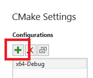
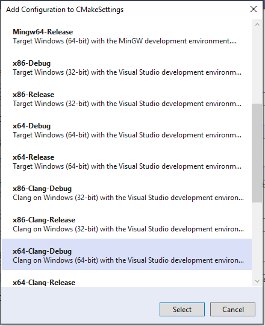
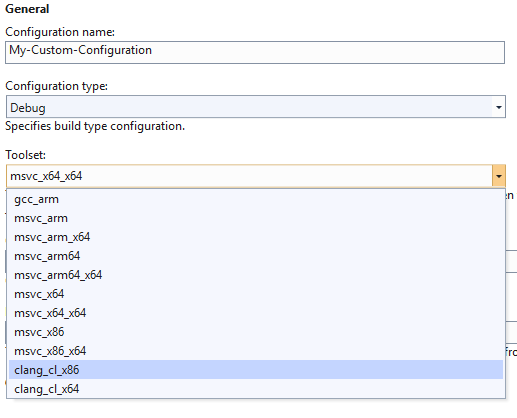
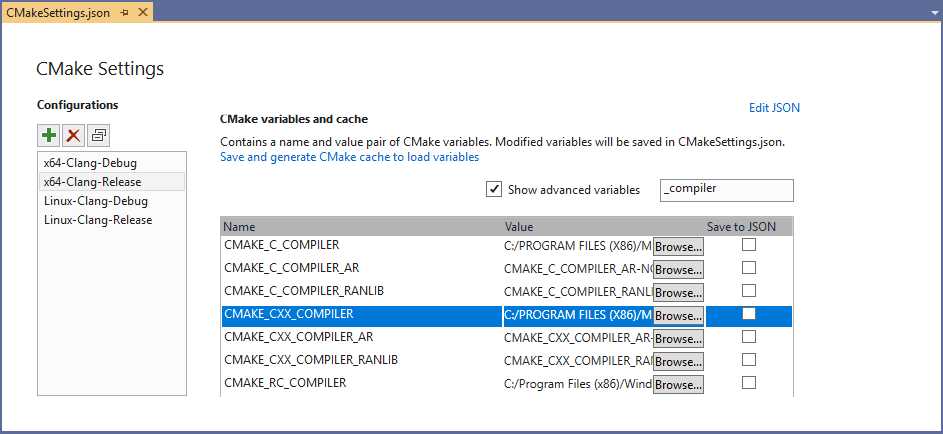
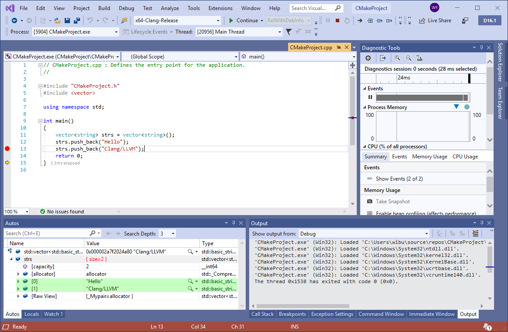

# Clang/LLVM support in Visual Studio CMake projects

::: moniker range="<=msvc-150"

Clang support is available in Visual Studio 2019.

::: moniker-end

::: moniker range="msvc-160"

You can use Visual Studio with Clang to edit and debug C++ CMake projects that target Windows or Linux.

**Windows**: Visual Studio 2019 version 16.1 includes support for editing, building, and debugging with Clang/LLVM in CMake projects targeting Windows.

**Linux**: For Linux CMake projects, no special Visual Studio support is required. You can install Clang using your distro's package manager, and add the appropriate commands in the CMakeLists.txt file.

## Install

For best IDE support in Visual Studio, we recommend using the latest Clang compiler tools for Windows. If you don't already have those, you can install them by opening the Visual Studio Installer and choosing **C++ Clang compiler for Windows** under **Desktop development with C++** optional components. When using a custom Clang installation, check the **C++ Clang-cl for v142 build tools** component.

## Create a new configuration

To add a new Clang configuration to a CMake project:

1. Right-click on CMakeLists.txt in **Solution Explorer** and choose **CMake settings for project**.

1. Under **Configurations**, press the **Add Configuration** button:

   

1. Choose the desired Clang configuration (note that separate Clang configurations are provided for Windows and Linux), then press **Select**:

   

1. To make modifications to this configuration, use the **CMake Settings Editor**. For more information, see [Customize CMake build settings in Visual Studio](customize-cmake-settings.md).

## Modify an existing configuration to use Clang

To modify an existing configuration to use Clang, follow these steps:

1. Right-click on CMakeLists.txt in **Solution Explorer** and choose **CMake settings for project**.

1. Under **General** select the **Toolset** dropdown and choose the desired Clang toolset:

   

## Custom Clang locations

By default, Visual Studio looks for Clang in two places:

- (Windows) The internally installed copy of Clang/LLVM that comes with the Visual Studio installer.
- (Windows and Linux) The PATH environment variable.

You can specify another location by setting the **CMAKE_C_COMPILER** and **CMAKE_CXX_COMPILER** CMake variables in **CMake Settings**:

## Clang compatibility modes

For Windows configurations, CMake by default invokes Clang in [clang-cl](https://llvm.org/devmtg/2014-04/PDFs/Talks/clang-cl.pdf) mode and links with the Microsoft implementation of the Standard Library. By default, **clang-cl.exe** is located in `C:\Program Files (x86)\Microsoft Visual Studio\2019\Common7\IDE\CommonExtensions\Microsoft\Llvm\bin`.

You can modify these values in **CMake Settings** under **CMake variables and cache**. Click **Show advanced variables**. Scroll down to find **CMAKE_CXX_COMPILER**, then click the **Browse**  button to specify a different compiler path.

## Edit, build, and debug

After you have set up a Clang configuration, you can build and debug the project. Visual Studio detects that you are using the Clang compiler and provides IntelliSense, highlighting, navigation, and other editing features. Errors and warnings are displayed in the **Output Window**.

When debugging, you can use breakpoints, memory and data visualization, and most other debugging features. Some compiler-dependent features such as Edit and Continue are not available for Clang configurations.

::: moniker-end
