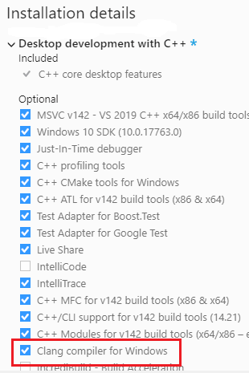
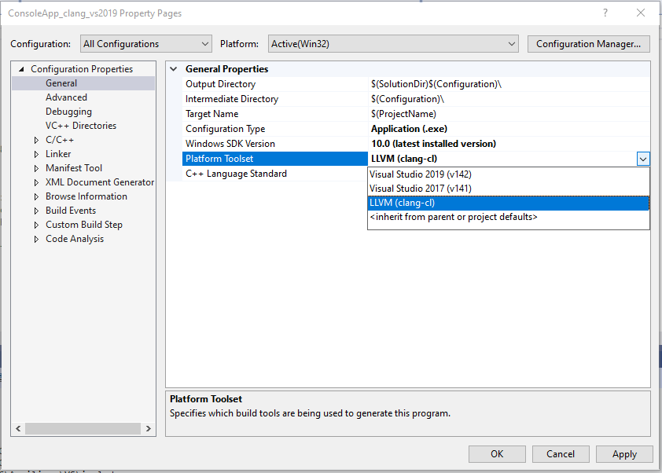
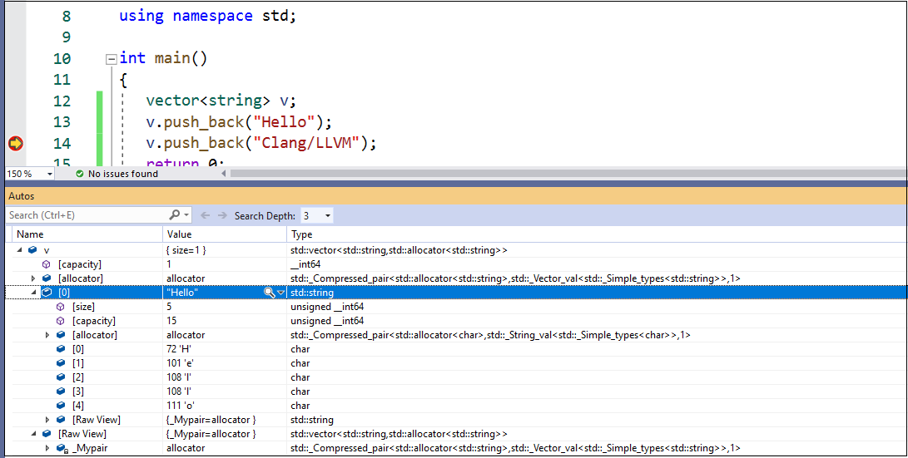

# Clang/LLVM support in Visual Studio projects

::: moniker range="<=msvc-150"

Clang support for both CMake and MSBuild projects is available in Visual Studio 2019.

::: moniker-end

::: moniker range="msvc-160"

You can use Visual Studio 2019 version 16.2 with Clang to edit, build, and debug C++ Visual Studio projects (MSBuild) that target Windows or Linux.

## Install

For best IDE support in Visual Studio, we recommend using the latest Clang compiler tools for Windows. If you don't already have those, you can install them by opening the Visual Studio Installer and choosing **C++ Clang tools for Windows** under **Desktop development with C++** optional components. If you prefer to use an existing Clang installation on your machine, choose the **C++ Clang-cl for v142 build tools.** optional component. The Microsoft C++ Standard Library currently requires at least Clang 8.0.0; the bundled version of Clang will automatically be updated to stay current with updates in the Microsoft implementation of the Standard Library.



## Configure a Windows project to use Clang tools

To configure a Visual Studio project to use Clang, right-click on the project node in **Solution Explorer** and choose **Properties**. Typically, you should first choose **All configurations** at the top of the dialog. Then, under **General** > **Platform Toolset**, choose **LLVM (clang-cl)** and then **OK**.



If you are using the Clang tools that are bundled with Visual Studio, no additional steps are required. For Windows projects, Visual Studio by default invokes Clang in [clang-cl](https://llvm.org/devmtg/2014-04/PDFs/Talks/clang-cl.pdf) mode and links with the Microsoft implementation of the Standard Library. By default, **clang-cl.exe** is located in *%VCINSTALLDIR%\\Tools\\Llvm\\bin\\* and *%VCINSTALLDIR%\\Tools\\Llvm\\x64\\bin\\*.

If you are using a custom Clang installation, you can either modify **Project** > **Properties** > **VC++ DIrectories** > **Configuration Properties** > **Executable Directories** by adding the custom Clang installation root as the first directory there, or change the value of the `LLVMInstallDir` property. See [Set a custom LLVM location](#custom_llvm_location) for more information.

## Configure a Linux project to use Clang tools

For Linux projects, Visual Studio uses the Clang GCC-compatible frontend. The project properties and nearly all compiler flags are identical

To configure a Visual Studio Linux project to use Clang:

1. Right-click on the project node in **Solution Explorer** and choose **Properties**.
1. Typically, you should first choose **All configurations** at the top of the dialog.
1. Under **General** > **Platform Toolset**, choose **WSL_Clang_1_0** if you are using Windows Subsystem for Linux, or **Remote_Clang_1_0** if you are using a remote machine or VM.
1. Press **OK**.


On Linux, Visual Studio by default uses the first Clang location that it encounters in the PATH environment property. If you are using a custom Clang installation, then you must change the value of the `LLVMInstallDir` property or else substitute a path under **Project** > **Properties** > **VC++ DIrectories** > **Configuration Properties** > **Executable Directories**. See [Set a custom LLVM location](#custom_llvm_location) for more information.

## <a name="custom_llvm_location"></a> Set a custom LLVM location

You can set a custom path for LLVM for one or more projects by creating a *Directory.build.props* file and adding that file to the root folder of any project. You can add it to the root solution folder to apply it to all projects in the solution. The file should look like this (but substitute your actual path):

```xml
<Project>
  <PropertyGroup>
    <LLVMInstallDir>c:\MyLLVMRootDir</LLVMInstallDir>
  </PropertyGroup>
</Project>
```

## Set additional properties, edit, build, and debug

After you have set up a Clang configuration, right-click again on the project node and choose **Reload project**. You can now build and debug the project using the Clang tools. Visual Studio detects that you are using the Clang compiler and provides IntelliSense, highlighting, navigation, and other editing features. Errors and warnings are displayed in the **Output Window**. The project property pages for a Clang configuration are very similar to those for MSVC, although some compiler-dependent features such as Edit and Continue are not available for Clang configurations. To set a Clang compiler or linker option that is not available in the property pages, you can add it manually in the property pages under **Configuration Properties** > **C/C++ (or Linker)** > **Command Line** > **Additional Options**.

When debugging, you can use breakpoints, memory and data visualization, and most other debugging features.  



::: moniker-end
