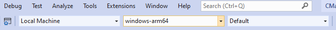
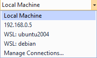

# Configure and build with CMake Presets in Visual Studio

CMake supports two files, `CMakePresets.json` and `CMakeUserPresets.json`, that allow users to specify common configure, build, and test options and share them with others.

Use `CMakePresets.json` and `CMakeUserPresets.json` to drive CMake in Visual Studio and Visual Studio Code, in a Continuous Integration (CI) pipReline, and from the command line. `CMakePresets.json` is intended to save project-wide builds, and `CMakeUserPresets.json` is intended for developers to save their own local builds. `CMakePresets.json` is supported in Visual Studio 2019 version 16.10 or later.

This article contains information about `CMakePresets.json` integration Visual Studio.
- For more information about the format of `CMakePresets.json`, see the official [CMake documentation](https://cmake.org/cmake/help/latest/manual/cmake-presets.7.html#id1). 
- For more information about the Microsoft vendor maps and macro expansion, see [`CMakePresets.json` and `CMakeUserPresets.json` Microsoft vendor maps](cmake-presets-json-reference.md).
- For more information about how to use `CMakePresets.json` in Visual Studio Code, see [Configure and build with CMake Presets](https://github.com/microsoft/vscode-cmake-tools/tree/develop/docs/cmake-presets.md).

 `CMakePresets.json` is a recommended alternative to `CMakeSettings.json`. Visual Studio will never read from both `CMakePresets.json` and `CMakeSettings.json` at the same time. See [Enable `CMakePresets.json` in Visual Studio 2019](#enable-cmakepresetsjson-integration-in-visual-studio-2019) to enable or disable `CMakePresets.json` integration in Visual Studio.

## Supported CMake and `CMakePresets.json` versions

Visual Studio supports `CMakePresets.json` and `CMakeUserPresets.json` files version 2 or higher. You can update your file version by incrementing the version field in the root object. For an example and more information, see [`CMakePresets.json` format](https://cmake.org/cmake/help/latest/manual/cmake-presets.7.html#format).

CMake version 3.20 or higher is required when invoking CMake with `CMakePresets.json` (version 2 or higher) from the command line. However, Visual Studio reads and evaluates `CMakePresets.json` and `CMakeUserPresets.json` itself and doesn't invoke CMake directly with the `--preset` option. This means CMake version 3.20 or higher isn't strictly required when building with `CMakePresets.json` inside Visual Studio. We recommend using at least CMake version 3.14 or higher.

## Enable `CMakePresets.json` integration in Visual Studio 2019

`CMakePresets.json` integration isn't enabled by default in Visual Studio 2019. You can enable it for all CMake projects in **Tools** > **Options** > **CMake** > **General**:


> [!Important]
> Close and reopen the folder in Visual Studio to activate the integration.

If you don't want to enable `CMakePresets.json` integration for all CMake projects, then you can enable `CMakePresets.json` integration for a single CMake project by adding a `CMakePresets.json` file to the root of the open folder. You must close and reopen the folder in Visual Studio to activate the integration.

The following table indicates when `CMakePresets.json` is used instead of `CMakeSettings.json` to drive CMake configuration and build. If no configuration file is present, then default Configure Presets are used.

Key: **Tools** > **Options** enabled means **Use CMakePresets.json to drive CMake configure, build, and test** is selected in **Tools** > **Options** > **CMake** > **General**.

| Configuration files | Tools > Options disabled | Tools > Options enabled |
|--|--|--|
| No configuration file present | `CMakeSettings.json` | `CMakePresets.json` |
| `CMakeSettings.json` present | `CMakeSettings.json` | `CMakePresets.json` |
| `CMakePresets.json` present | `CMakePresets.json` | `CMakePresets.json` |
| Both configuration files present | `CMakePresets.json` | `CMakePresets.json` |

## Auto configuration and cache notifications

By default, Visual Studio automatically invokes configure each time the active Target System or Configure Preset changes. You can modify this behavior by selecting **Never run configure step automatically** in **Tools** > **Options** > **CMake** > **General**. You can also disable all CMake cache notifications (gold bars) by deselecting **Show CMake cache notifications**.

## Default Configure Presets

If no `CMakePresets.json` or `CMakeUserPresets.json` file exists, or if `CMakePresets.json` or `CMakeUserPresets.json` are invalid, then Visual Studio will fall back on the following default Configure Presets:

**Windows example**

```json
{
  "name": "windows-default",
  "displayName": "Windows x64 Debug",
  "description": "Sets Ninja generator, compilers, x64 architecture, build and install directory, debug build type",
  "generator": "Ninja",
  "binaryDir": "${sourceDir}/out/build/${presetName}",
  "architecture": {
    "value": "x64",
    "strategy": "external"
  },
  "cacheVariables": {
    "CMAKE_BUILD_TYPE": "Debug",
    "CMAKE_INSTALL_PREFIX": "${sourceDir}/out/install/${presetName}"
  },
  "vendor": {
    "microsoft.com/VisualStudioSettings/CMake/1.0": {
      "hostOS": [ "Windows" ]
    }
  }
},
```

**Linux example**

```json
{
  "name": "linux-default",
  "displayName": "Linux Debug",
  "description": "Sets Ninja generator, compilers, build and install directory, debug build type",
  "generator": "Ninja",
  "binaryDir": "${sourceDir}/out/build/${presetName}",
  "cacheVariables": {
    "CMAKE_BUILD_TYPE": "Debug",
    "CMAKE_INSTALL_PREFIX": "${sourceDir}/out/install/${presetName}"
  },
  "vendor": {
    "microsoft.com/VisualStudioSettings/CMake/1.0": {
      "hostOS": [ "Linux" ]
    },
    "microsoft.com/VisualStudioRemoteSettings/CMake/1.0": {
      "sourceDir": "$env{HOME}/.vs/$ms{projectDirName}"
   }
  }
}
```

A `CMakePresets.json` file with the default Configure Presets is automatically created by Visual Studio at the root of your project if you attempt to open or modify a `CMakePresets.json` file that doesn't exist.

## Configure and build

Visual Studio provides three dropdowns when `CMakePresets.json` integration is enabled:



### Select a target system

The dropdown on the left indicates the active **Target System**. This is the system on which CMake will be invoked to configure and build the project. This dropdown lists your local machine, all SSH connections in the **Connection Manager** by host name, and all Windows Subsystem for Linux (WSL) installations that Visual Studio can find:


 
In the example above:
- **192.168.0.5** is a remote Linux system that was added to the **Connection Manager**.
- **ubuntu2004** and **debian** are WSL installations.

Select **Manage Connections…** to open the **Connection Manager**.

### Select a Configure Preset

The dropdown in the middle indicates the active **Configure Preset**. This is the `configurePreset` that will be used when CMake is invoked to generate the project build system. This dropdown lists the union of non-hidden Configure Presets defined in `CMakePresets.json` and `CMakeUserPresets.json`.

Visual Studio will use the value of `hostOS` in the Microsoft Visual Studio Settings vendor map to hide Configure Presets that don't apply to the active Target System. See the entry for `hostOS` in the table under [Visual Studio Settings vendor map](cmake-presets-json-reference.md#visual-studio-settings-vendor-map) for more information.

Select **Manage Configurations…** to open the `CMakePresets.json` file located at the root of the project. `CMakePresets.json` is created if it doesn't already exist.

### Select a Build Preset

The dropdown on the right indicates the active **Build Preset**. This is the `buildPreset` that will be used when CMake is invoked to build the project. This dropdown lists the union of non-hidden Build Presets defined in `CMakePresets.json` and `CMakeUserPresets.json`.
  
All Build Presets are required to specify an associated `configurePreset`. Visual Studio hides Build Presets that don't apply to the active Configure Preset. For more information, see [Build Presets](https://cmake.org/cmake/help/latest/manual/cmake-presets.7.html#build-preset). If there are no Build Presets associated with the active Configure Preset, then Visual Studio will list the Default Build Preset. The Default Build Preset is equivalent to passing `cmake --build` with no other arguments from the command line.

### Configure

Visual Studio automatically tries to configure the project when it detects that the CMake cache is out of date. To manually invoke configure, select **Project** > **Configure <project-name>** from the main menu. This is the same as running `cmake --preset <configurePreset>` from the command line, where `<configurePreset>` is the name of the active Configure Preset. To disable automatic cache generation, see [Auto configuration and cache notifications](#auto-configuration-and-cache-notifications).

### Build

To build the entire project, select **Build** > **Build All** from the main menu. This is the same as running `cmake --build --preset <buildPreset>` from the command line, where `<buildPreset>` is the name of the active Build Preset.

To build a single target, switch to **CMake Targets View** in the **Solution Explorer**. Then right-click any target and select **Build** from the context menu.

> [!NOTE]
> Visual Studio 2019 doesn't support the `buildPresets.targets` option to build a subset of targets specified in `CMakePresets.json`.

## Run CTest

There are two menu options supported by `CMakePresets.json` in Visual Studio 2019.

- **Test** > **Run CTests** for <project-name> invokes CTest and runs all tests associated with the active Configure Preset and Build Preset, with no additional arguments passed to CTest.
- **Test** > **Run Test Preset** for <configurePreset> will expand to show all Test Presets associated with the active Configure Preset. Selecting a single Test Preset is the same as running `ctest --preset <testPreset>` from the command line, where `<testPreset>` is the name of the selected Test Preset. This option will be grayed out if no Test Presets are defined for the active Configure Preset.

In Visual Studio 2019, the Test Explorer isn't integrated with `CMakePresets.json`.

## Add new presets

In Visual Studio 2019, all commands and preset templates modify `CMakePresets.json`. You can add new user-level presets by directly editing `CMakeUserPresets.json`

Use a forward slash (`/`) for paths in `CMakePresets.json` and `CMakeUserPresets.json`.

### Add new Configure Presets

To add a new Configure Preset to `CMakePresets.json`, from **Solution Explorer** right-click `CMakePresets.json` from **Folder View** and select **Add Configure Preset…** from the context menu. The dialog to select a Configure Preset template appears:


Choose the **Windows x64 Debug** template to configure on Windows systems. Choose the **Linux Debug** template to configure on WSL and remote Linux systems. See [Edit presets](#edit-presets) for more information about editing `CMakePresets.json`.

The selected template will be added to `CMakePresets.json` if it exists. Otherwise, the template will be copied into a new `CMakePresets.json`.

### Add new Build Presets and Test Presets

Visual Studio 2019 doesn't offer templates for new Build Presets and Test Presets. Build Presets and Test Presets can be added by directly editing `CMakePresets.json`. See [Build Presets](https://cmake.org/cmake/help/latest/manual/cmake-presets.7.html#build-preset), [Test Presets](https://cmake.org/cmake/help/latest/manual/cmake-presets.7.html#test-preset), or [Example `CMakePresets.json` file](#example-cmakepresetsjson-file) for more information.

## Edit presets

The official [CMake documentation](https://cmake.org/cmake/help/latest/manual/cmake-presets.7.html#id1) is the best resource for editing Configure Presets, Build Presets, and Test Presets. The following information is a subset of the CMake documentation that is especially relevant to Visual Studio developers.

### Select your compilers

C and C++ compilers can be set with `cacheVariables.CMAKE_C_COMPILER` and `cacheVariables.CMAKE_CXX_COMPILER` in a Configure Preset. This is equivalent to passing `-D CMAKE_C_COMPILER=<value> and -D CMAKE_CXX_COMPILER=<value>` to CMake from the command line. For more information, see [CMAKE_<LANG>_COMPILER](https://cmake.org/cmake/help/latest/variable/CMAKE_LANG_COMPILER.html#cmake-lang-compiler).

Use the following examples to build with `cl.exe` and `clang-cl.exe` from Visual Studio. The C++ Clang tools for Windows component must be installed to build with `clang-cl`.

**Build with `cl.exe`**
```json
"cacheVariables": {
  "CMAKE_BUILD_TYPE": "Debug",
  "CMAKE_INSTALL_PREFIX": "${sourceDir}/out/install/${presetName}",
  "CMAKE_C_COMPILER": "cl",
  "CMAKE_CXX_COMPILER": "cl"
},
```

**Build with `clang`**
```json
"cacheVariables": {
  "CMAKE_BUILD_TYPE": "Debug",
  "CMAKE_INSTALL_PREFIX": "${sourceDir}/out/install/${presetName}",
  "CMAKE_C_COMPILER": "clang-cl",
  "CMAKE_CXX_COMPILER": "clang-cl"
},

"vendor": {
  "microsoft.com/VisualStudioSettings/CMake/1.0": {
    "intelliSenseMode": "windows-clang-x64"
  }
}
```

> [!IMPORTANT]
> In Visual Studio 2019, you must explicitly specify a Clang IntelliSense mode when building with `clang` or `clang-cl`.

See [Run CMake from the command line or a continuous integration (CI) pipeline](#run-cmake-from-the-command-line-or-a-continuous-integration-ci-pipeline) to reproduce these builds outside of Visual Studio.

To build on Linux or without the Visual C++ toolset, specify the name of a compiler on your `PATH`, or an environment variable that evaluates to the full path of a compiler. Full paths are discouraged so that the file can remain shareable. A preset that builds with GCC version 8 might look like this:

**GCC**
```json
"cacheVariables": {
  "CMAKE_BUILD_TYPE": "Debug",
  "CMAKE_INSTALL_PREFIX": "${sourceDir}/out/install/${presetName}",
  "CMAKE_C_COMPILER": "gcc-8",
  "CMAKE_CXX_COMPILER": "g++-8"
},
```

You can also set compilers with a CMake toolchain file. Toolchain files can be set with `cacheVariables.CMAKE_TOOLCHAIN_FILE`, which is equivalent to passing` -D CMAKE_TOOLCHAIN_FILE=<value>` to CMake from the command line. A CMake toolchain file is most often used for cross-compilation. See [CMake toolchains](https://cmake.org/cmake/help/latest/manual/cmake-toolchains.7.html) for more information about authoring CMake toolchain files.

### Select your generator

The Windows and Linux Configure Preset templates both specify Ninja as the default generator. Other common generators are the [Visual Studio Generators](https://cmake.org/cmake/help/latest/manual/cmake-generators.7.html?highlight=visual%20studio%20generators#visual-studio-generators) on Windows and Unix Makefiles on Linux and macOS. You can specify a new generator with the `generator` option in a Configure Preset. This is equivalent to passing `-G` to CMake from the command line.

Set `architecture.strategy` and `toolset.strategy` to `set` when building with a Visual Studio Generator. See [CMake generators](https://cmake.org/cmake/help/latest/manual/cmake-generators.7.html#:~:text=A%20CMake%20Generator%20is%20responsible%20for%20writing%20the,what%20native%20build%20system%20is%20to%20be%20used) for more information.

Set `architecture.strategy` and `toolset.strategy` to `set` when building with a Visual Studio Generator.

### Select your configuration type

The configuration type (**Debug/Release**) for single configuration generators can be set with `cacheVariables.CMAKE_BUILD_TYPE`. This is equivalent to passing `-D CMAKE_BUILD_TYPE=<value>` to CMake from the command line. See[ CMAKE_BUILD_TYPE](https://cmake.org/cmake/help/latest/variable/CMAKE_BUILD_TYPE.html) for more information.

### Select your target and host architecture when building with the Visual C++ toolset.

The target architecture (x64, Win32, ARM64, or ARM) can be set with `architecture.value`. This is equivalent to passing` -A` to CMake from the command line. See [Platform Selection](https://cmake.org/cmake/help/latest/generator/Visual%20Studio%2016%202019.html#platform-selection) for more information.

> [!NOTE]
> Currently Visual Studio Generators expect the Win32 syntax and command-line generators (like Ninja) expect the x86 syntax when building for x86.

The host architecture (x64 or x86) and toolset can be set with `toolset.value`. This is equivalent to passing `-T` to CMake from the command line. See [Toolset Selection](https://cmake.org/cmake/help/latest/generator/Visual%20Studio%2016%202019.html#toolset-selection) for more information.

`architecture.strategy` and `toolset.strategy` tell CMake how to handle the architecture and toolset fields. `set` means CMake will set the respective value, and `external` means CMake won't set the respective value.

 `set` should be used with IDE generators like the Visual Studio Generator. `external` should be used with command-line generators like Ninja. This allows vendors like Visual Studio to source the required environment before CMake is invoked. See [Configure Presets](https://cmake.org/cmake/help/latest/manual/cmake-presets.7.html#configure-preset) for more information about the architecture and toolset fields.

For a full list of IDE generators that support the architecture field, see [CMAKE_GENERATOR_PLATFORM](https://cmake.org/cmake/help/latest/variable/CMAKE_GENERATOR_PLATFORM.html). For a full list of IDE generators that support the toolset field, see [CMAKE_GENERATOR_TOOLSET](https://cmake.org/cmake/help/latest/variable/CMAKE_GENERATOR_TOOLSET.html).

Use the examples below to target ARM64 with the Ninja generator, or Win32 (x86) with the Visual Studio 16 2019 generator:

```json
"generator": "Ninja",
"architecture": {
    "strategy": "external",
    "value": "arm64"
},

"generator": "Visual Studio 16 2019",
"architecture": {
    "strategy": "set",
     "value": "Win32"
},
```

### Set and reference environment variables

You can set environment variables using the environment map. Environment variables are inherited through the `inherits` field, but you can override them as desired. A preset’s environment will be the union of its own environment and the environment from all its parents. If multiple `inherits` presets provide conflicting values for the same variable, the earlier preset in the `inherits` list will be preferred. You can unset a variable inherited from another preset by setting it to `null`. Environment variables set in a Configure Preset also automatically flow through to associated Build Presets and Test Presets unless `inheritConfigureEnvironment` is set to `false`. See [Configure Presets](https://cmake.org/cmake/help/latest/manual/cmake-presets.7.html#configure-preset) for more information.

You can reference environment variables using the `$env{<variable-name>}` and `$penv{<variable-name>}` syntax. See [Macro Expansion](https://cmake.org/cmake/help/latest/manual/cmake-presets.7.html#macro-expansion) for more information.

### Configure IntelliSense for a cross-compiler

By default, Visual Studio will use the IntelliSense mode that matches your specified toolset and target architecture. If you're cross-compiling, then you may need to manually specify the correct IntelliSense mode with the `intelliSenseMode` option in the Visual Studio Settings vendor map. See the entry for `intelliSenseMode` in the table under [Visual Studio Settings vendor map](cmake-presets-json-reference.md#visual-studio-settings-vendor-map) for more information.

## Configure and build on a remote system or the Windows Subsystem for Linux (WSL)

With `CMakePresets.json` support in Visual Studio, you can easily configure and build your project on Windows, WSL, and remote systems. The steps to [Configure and build](#configure-and-build) your project on Windows, a remote system, or WSL are the same. However, there are a few behaviors that are specific to remote development.

### `${sourceDir}` behavior in remote copy scenarios

In local scenarios (including WSL1), `${sourceDir}` evaluates to the path to the project source directory that is open in Visual Studio. In remote copy scenarios, `${sourceDir}` evaluates to the path to the project source directory on the target system and not the project source directory on the local machine. The project source directory on the target system is determined by the value of `sourceDir` in the Visual Studio Remote Settings vendor map (defaults to `$env{HOME}/.vs/$ms{projectDirName}`). See the entry for `sourceDir` in the table under [Visual Studio Settings vendor map](cmake-presets-json-reference.md#visual-studio-settings-vendor-map) for more information.

### Local folder for remote output

Remote copy scenarios require a local directory to copy some remote files like CMake File-API response files or build files if `copyBuildOutput` in the Visual Studio Remote Settings vendor map is set to `true`. These files are automatically copied to `<local-source-directory>/out/<remote-connection-ID>/build/${presetName}`.

### Invoke the same Configure Preset on Windows and WSL1

You'll see an error if you try to use the same Configure Preset on Windows and WSL1. Windows and WSL1 both use the Windows file system, so CMake will try to use the same output directory (`binaryDir`) for both the Windows and WSL1 build tree. If you want to use the same Configure Preset with both Windows and the WSL1 toolset, create a second Configure Preset that inherits from the original preset and specifies a new `binaryDir`. In the following example, `windows-preset` can be used on Windows and `base-preset` can be used on WSL1:

```json
{
  "name": "windows-preset",
  "inherits": "base-preset",
  "binaryDir": "${sourceDir}/out/build/${presetName}",
  "vendor": {
    "microsoft.com/VisualStudioSettings/CMake/1.0": {
      "hostOS": "Windows"
    }
  }
}
```

> [!NOTE]
> In Visual Studio 2019, only the WSL1 toolset is supported. You'll see this behavior anytime you invoke configure on both Windows and WSL.

## Vcpkg integration

Vcpkg helps you manage C and C++ libraries on Windows, Linux, and macOS. A vcpkg toolchain file (`vcpkg.cmake`) must be passed to CMake to enable vcpkg integration. See the [vcpkg documentation](https://github.com/microsoft/vcpkg#vcpkg-overview) for more information.

Visual Studio no longer passes your vcpkg toolchain file to CMake automatically when `CMakePresets.json` integration is enabled. This eliminates Visual Studio specific behavior and ensures that your build can be reproduced from the command line.

Instead, set the path to `vcpkg.cmake` with the `VCPKG_ROOT` environment variable in `CMakePresets.json`:

```json
"cacheVariables": {
   "CMAKE_TOOLCHAIN_FILE": {
      "value": "$env{VCPKG_ROOT}/scripts/buildsystems/vcpkg.cmake",
       "type": "FILEPATH"
    }
 },
```

`VCPKG_ROOT` should be set to the root of your vcpkg installation. See [vcpkg environment variables](https://github.com/microsoft/vcpkg/blob/master/docs/users/config-environment.md) for more information.

If you're already using a CMake toolchain file and want to enable vcpkg integration, then see [Using multiple toolchain files](https://github.com/microsoft/vcpkg/blob/master/docs/users/integration.md#using-multiple-toolchain-files) and follow those instructions to use an external toolchain file with a project using vcpkg.

## Variable substitution in `launch.vs.json` and `tasks.vs.json`

`CMakePresets.json` supports variable substitution in `launch.vs.json` and `tasks.vs.json`.

* Environment variables set in the active Configure Preset automatically flow through to `launch.vs.json` and `tasks.vs.json` configurations. You can unset individual environment variables in `launch.vs.json` and `tasks.vs.json` by setting them to `null`. The following example sets the variable `DEBUG_LOGGING_LEVEL` to `null` in `launch.vs.json`: `"env": { "DEBUG_LOGGING_LEVEL":  null }`

* Key-values set in the active Configure Preset are available for consumption in `launch.vs.json` and `tasks.vs.json` with the syntax `${cmake.<KEY-NAME>}`. For example, use ` ${cmake.binaryDir}` to reference the output directory of the active Configure Preset.
* Individual environment variables set in the environment map of the active Configure Preset are available for consumption in `launch.vs.json` and `tasks.vs.json` using the syntax `${env.<VARIABLE-NAME>}`.

Update your `launch.vs.json` and `task.vs.json` files to reference `CMakePresets.json` syntax instead of `CMakeSettings.json` syntax. Macros that reference the old `CMakeSettings.json` syntax when `CMakePresets.json` is the active configuration file will be deprecated in a future release. For example, reference the output directory of the active Configure Preset with `${cmake.binaryDir}` instead of `${cmake.buildRoot}`, because `CMakePresets.json` uses the `binaryDir` syntax.

## Troubleshooting

If things aren’t working as expected, there are a few troubleshooting steps that you can take.

If either `CMakePrests.json` or `CMakeUserPresets.json` is invalid, then Visual Studio will fall back on its default behavior and show only the default Configure Presets. Visual Studio IntelliSense can help you catch many of these JSON errors, but it won’t know if you're referencing a preset with `inherits` or `configurePreset` by the wrong name. To check if your preset files are valid, run `cmake --list-presets` from the command line at the root of your project directory (CMake 3.20 or higher is required). If either file is invalid, then you'll see the following error:

```DOS
CMake Error: Could not read presets from
C:/Users/<user>/source/repos/<project-name>: JSON parse error
```

Other troubleshooting steps include:
* Delete the cache and reconfigure the project (**CMake: Delete Cache** and **Project** > **Configure <project-name>**)
* Close and reopen the folder in Visual Studio (**File** > **Close Folder**)
* Delete the `.vs` folder at the root your project

If you've identified a problem, the best way to report it is by clicking the **Send Feedback** button in the top right-hand corner of Visual Studio.

## Logging for remote connections

You can enable logging for remote connections if you're having trouble connecting or copying files to a remote system. See [logging for remote connections](https://docs.microsoft.com/cpp/linux/connect-to-your-remote-linux-computer#logging-for-remote-connections) for more information.

## Enable AddressSanitizer for Windows and Linux

AddressSanitizer (`ASan`) is a runtime memory error detector for C and C++ that is supported in Visual Studio for both Windows and Linux development. AddressSanitizer was enabled with an option (`addressSanitizerEnabled`) in `CMakeSettings.json`. This behavior isn't supported by `CMakePresets.json`.
 
Instead, enable and disable AddressSanitizer by setting the required compiler and linker flags yourself. This removes Visual Studio specific behavior and ensures that the same `CMakePresets.json` file can reproduce your build from the command line. The following sample can be added to a `CMakeLists.txt` to enable or disable AddressSanitizer for a target.

```
option(ASAN_ENABLED "Build this target with AddressSanitizer" ON)

if(ASAN_ENABLED)
	if(MSVC)
		target_compile_options(<target> PUBLIC /fsanitize=address)
	else()
		target_compile_options(<target> PUBLIC -fsanitize=address <additional-options>)
		target_link_options(<target> PUBLIC -fsanitize=address)
	endif()
endif()
```

`<additional-options>` are other compilation flags like `"-fno-omit-frame-pointer"`. See [Using AddressSanitizer](https://github.com/google/sanitizers/wiki/AddressSanitizer#using-addresssanitizer) for more information about `ASan` for Linux, and see [Use the AddressSanitizer from a Developer Command Prompt](https://docs.microsoft.com/cpp/sanitizers/asan#command-prompt) for more information about `ASan` with MSVC.

Pass additional runtime flags to AddressSanitizer with the `ASAN_OPTIONS` field in `launch.vs.json`. `ASAN_OPTIONS` defaults to `detect_leaks=0` when no other runtime options are specified because LeakSanitizer isn't supported in Visual Studio.

## Run CMake from the command line or a continuous integration (CI) pipeline

You can use the same `CMakePresets.json` and `CMakeUserPresets.json` files to invoke CMake in Visual Studio and from the command line. The [CMake](https://cmake.org/cmake/help/latest/manual/cmake.1.html) and [CTest](https://cmake.org/cmake/help/latest/manual/ctest.1.html) documentation are the best resources for invoking CMake and CTest with `--preset`. CMake version 3.20 or higher is required.

### Sourcing the environment when building with command-line generators on Windows

It’s up to the user to configure the environment before CMake is invoked when building with a command-line generator. If you’re building with Ninja and the Visual C++ toolset on Windows, then you'll need to source the environment before CMake is called to generate the build system. You can do this by calling `vcvarsall.bat` with the `architecture` argument. `architecture` specifies the host and target architecture to use. See [vcvarsall syntax](https://docs.microsoft.com/cpp/build/building-on-the-command-line#vcvarsall-syntax) for more information. If you build on Linux or on Windows with a Visual Studio Generator, then you don't need to take this step.

This is the same step that Visual Studio takes for you when CMake is invoked by the IDE. Visual Studio parses the active Configure Preset for the host and target architecture specified by `toolset` and `architecture` and then sources the specified environment from `vcvarsall.bat`. When you build from the Windows command line with Ninja, you'll need to take this step yourself.

`vcvarsall.bat` is installed with the Build Tools for Visual Studio. By default, `vcvarsall.bat` is installed in `C:\Program Files (x86)\Microsoft Visual Studio\2019\<edition>\VC\Auxiliary\Build`. You can add `vcvarsall.bat` to your `PATH` if you use the command-line workflow frequently.

### Example command-line workflow

The following commands can be used to configure and build a CMake project that uses Ninja to target arm64 with x64 build tools. CMake version 3.20 or higher is required. Run these commands from the directory where your `CMakePresets.json` is located:

```DOS
/path/to/vcvarsall.bat x64_arm64 
cmake --list-presets=all .
cmake --preset <configurePreset-name>
cmake --build --preset <buildPreset-name> 
```

## Example `CMakePresets.json` file

The `CMakePresets.json` file in [box2d-lite](https://github.com/esweet431/box2d-lite/blob/main/CMakePresets.json) contains examples of Configure Presets, Build Presets, and Test Presets.

## Next steps

Learn more about configuring and debugging CMake projects in Visual Studio:

> [!div class="nextstepaction"]
> [CMake Projects in Visual Studio](cmake-projects-in-visual-studio.md)<br/><br/>
> [Customize CMake build settings](customize-cmake-settings.md)<br/><br/>
> [Configure CMake debugging sessions](configure-cmake-debugging-sessions.md)<br/><br/>
> [CMake predefined configuration reference](cmake-predefined-configuration-reference.md)
>