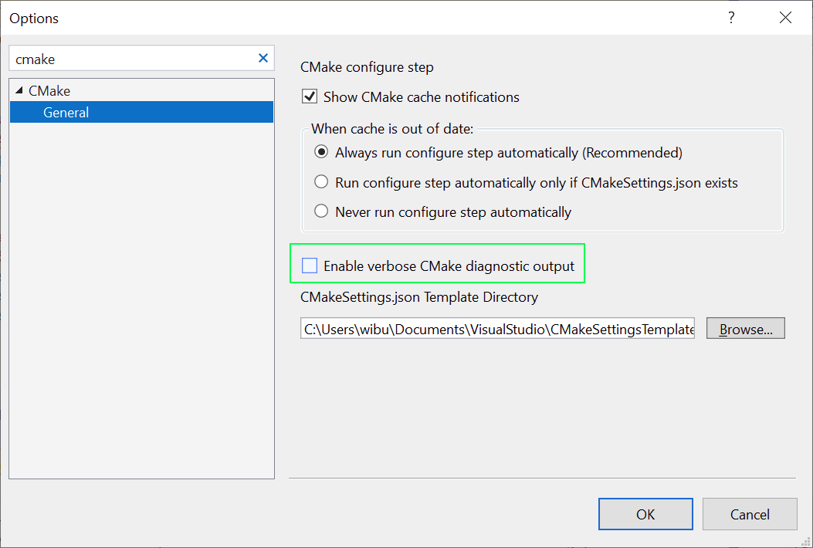

# CMake projects in Visual Studio

CMake is a cross-platform, open-source tool for defining build processes that run on multiple platforms. This article assumes you're familiar with CMake. You can learn more about it at [Build, Test and Package Your Software With CMake](https://cmake.org/).

> [!NOTE]
> CMake has become more and more integrated with Visual Studio over the past few releases. To see the correct information for the version you are using, make sure the version selector in the upper left of this page is set correctly.

::: moniker range="vs-2019"

The **C++ CMake tools for Windows** component uses the [Open Folder](open-folder-projects-cpp.md) feature to consume CMake project files (such as *CMakeLists.txt*) directly for the purposes of IntelliSense and browsing. Both Ninja and Visual Studio generators are supported. If you use a Visual Studio generator, it generates a temporary project file and passes it to msbuild.exe. However, the project is never loaded for IntelliSense or browsing purposes. You can also import an existing CMake cache.

## Installation

**C++ CMake tools for Windows** is installed as part of the **Desktop development with C++** and **Linux Development with C++** workloads. For more information, see [Cross-platform CMake projects](../linux/cmake-linux-project.md).

For more information, see [Install the C++ Linux workload in Visual Studio](../linux/download-install-and-setup-the-linux-development-workload.md).

## IDE Integration

When you choose **File > Open > Folder** to open a folder containing a *CMakeLists.txt* file, the following things happen:

- Visual Studio adds **CMake** items to the **Project** menu, with commands for viewing and editing CMake scripts.

- **Solution Explorer** displays the folder structure and files.

- Visual Studio runs cmake.exe and generates the CMake cache file (*CMakeCache.txt*) for the default (x64 Debug) configuration. The CMake command line is displayed in the **Output Window**, along with additional output from CMake.

- In the background, Visual Studio starts to index the source files to enable IntelliSense, browsing information, refactoring, and so on. As you work, Visual Studio monitors changes in the editor and also on disk to keep its index in sync with the sources.

You can open folders containing any number of CMake projects. Visual Studio detects and configures all the "root" *CMakeLists.txt* files in your workspace. CMake operations (configure, build, debug), C++ IntelliSense, and browsing are available to all CMake projects in your workspace.

You can also view your projects organized logically by targets. Choose **Targets view** from the dropdown in the **Solution Explorer** toolbar:

Click the **Show All Files** button at the top of **Solution Explorer** to see all the CMake-generated output in the *out/build/\<config>* folders.

Visual Studio uses a configuration file called **CMakeSettings.json**. This file lets you define and store multiple build configurations, and conveniently switch between them in the IDE. A *configuration* is a Visual Studio construct that encapsulates settings that are specific to a given build type. The settings are used to configure the default command-line options that Visual Studio passes to cmake.exe. You can also specify additional CMake options here, and define any additional variables you like. All options are written to the CMake cache either as internal or external variables. In Visual Studio 2019, the **CMake Settings Editor** provides a convenient way to edit your settings. For more information, see [Customize CMake settings](customize-cmake-settings.md).

One setting, `intelliSenseMode` isn't passed to CMake, but is used only by Visual Studio.

Use the **CMakeLists.txt** file in each project folder just as you would in any CMake project. You can specify source files, find libraries, set compiler and linker options, and specify other build system-related information.

To pass arguments to an executable at debug time, you can use another file called **launch.vs.json**. In some scenarios, Visual Studio automatically generates these files. You can edit them manually, or even create the file yourself.

> [!NOTE]
> For other kinds of Open Folder projects, two additional JSON files are used: **CppProperties.json** and **tasks.vs.json**. Neither of these are relevant for CMake projects.

## Open an existing cache

When you open an existing CMake cache file (*CMakeCache.txt*), Visual Studio doesn't try to manage your cache and build tree for you. Your custom or preferred tools have complete control over how CMake configures your project. To open an existing cache in Visual Studio, choose **File > Open > CMake**. Then, navigate to an existing *CMakeCache.txt* file.

You can add an existing CMake cache to an open project. It's done the same way you'd add a new configuration. For more information, see our blog post on [opening an existing cache in Visual Studio](https://devblogs.microsoft.com/cppblog/open-existing-cmake-caches-in-visual-studio/).

## Building CMake projects

To build a CMake project, you have these choices:

1. In the General toolbar, find the **Configurations** dropdown. It probably shows "x64-Debug" by default. Select the preferred configuration and press **F5**, or click the **Run** (green triangle) button on the toolbar. The project automatically builds first, just like a Visual Studio solution.

1. Right click on *CMakeLists.txt* and select **Build** from the context menu. If you have multiple targets in your folder structure, you can choose to build all or only one specific target.

1. From the main menu, select **Build > Build All** (**F7** or **Ctrl+Shift+B**). Make sure that a CMake target is already selected in the **Startup Item** dropdown in the **General** toolbar.

As you would expect, build results are shown in the **Output Window** and **Error List**.

In a folder with multiple build targets, you can specify which CMake target to build: Choose the **Build** item on the **CMake** menu or the *CMakeLists.txt* context menu to specify the target. If you enter **Ctrl+Shift+B** in a CMake project, it builds the current active document.

## Debugging CMake projects

To debug a CMake project, choose the preferred configuration and press **F5**, or press the **Run** button in the toolbar. If the **Run** button says "Select Startup Item", select the dropdown arrow. Choose the target that you want to run. (In a CMake project, the "Current document" option is only valid for .cpp files.)

The **Run** or **F5** commands first build the project if changes have been made since the previous build. Changes to *CMakeSettings.json* cause the CMake cache to be regenerated.

You can customize a CMake debugging session by setting properties in the **launch.vs.json** file. For more information, see [Configure CMake debugging sessions](configure-cmake-debugging-sessions.md).

## Just My Code for CMake projects

When you build for Windows using the MSVC compiler, CMake projects have support for Just My Code debugging. To change the Just My Code setting, go to **Tools** > **Options** > **Debugging** > **General**.

## Vcpkg integration

If you have installed [vcpkg](vcpkg.md), CMake projects opened in Visual Studio automatically integrate the vcpkg toolchain file. That means no additional configuration is required to use vcpkg with your CMake projects. This support works for both local vcpkg installations and vcpkg installations on remote systems that you're targeting. This behavior is disabled automatically when you specify any other toolchain in your CMake Settings configuration.

## Customize configuration feedback

By default, most configuration messages are suppressed unless there's an error. You can see all messages by enabling this feature in **Tools** > **Options** > **CMake**.

   

## Editing CMakeLists.txt files

To edit a *CMakeLists.txt* file, right-click on the file in **Solution Explorer** and choose **Open**. If you make changes to the file, a yellow status bar appears and informs you that IntelliSense will update. It gives you a chance to cancel the update operation. For information about *CMakeLists.txt*, see the [CMake documentation](https://cmake.org/documentation/).

   

As soon as you save the file, the configuration step automatically runs again and displays information in the **Output** window. Errors and warnings are shown in the **Error List** or **Output** window. Double-click on an error in the **Error List** to navigate to the offending line in *CMakeLists.txt*.

   

## CMake configure step

When you make significant changes to the *CMakeSettings.json* or to *CMakeLists.txt* files, Visual Studio automatically reruns the CMake configure step. If the configure step finishes without errors, the information that's collected is available in C++ IntelliSense and language services. It's also used in build and debug operations.

## Troubleshooting CMake cache errors

If you need more information about the state of the CMake cache to diagnose a problem, open the **Project** main menu or the *CMakeLists.txt* context menu in **Solution Explorer** to run one of these commands:

- **View Cache** opens the *CMakeCache.txt* file from the build root folder in the editor. (Any edits you make here to *CMakeCache.txt* are wiped out if you clean the cache. To make changes that persist after the cache is cleaned, see [Customize CMake settings](customize-cmake-settings.md).)

- **Open Cache Folder** opens an Explorer window to the build root folder.

- **Clean Cache** deletes the build root folder so that the next CMake configure step starts from a clean cache.

- **Generate Cache** forces the generate step to run even if Visual Studio considers the environment up to date.

Automatic cache generation can be disabled in the **Tools > Options > CMake > General** dialog.

## Run CMake from the command line

If you have installed CMake from the Visual Studio Installer, you can run it from the command line by following these steps:

1. Run the appropriate vsdevcmd.bat (x86/x64). For more information, see [Building on the Command Line](building-on-the-command-line.md).

1. Switch to your output folder.

1. Run CMake to build/configure your app.

::: moniker-end

::: moniker range="vs-2017"

Visual Studio 2017 has rich support for CMake, including [cross-platform CMake projects](../linux/cmake-linux-project.md). The **Visual C++ Tools for CMake** component uses the **Open Folder** feature to enable the IDE to consume CMake project files (such as *CMakeLists.txt*) directly for the purposes of IntelliSense and browsing. Both Ninja and Visual Studio generators are supported. If you use a Visual Studio generator, it generates a temporary project file and passes it to msbuild.exe. However, the project is never loaded for IntelliSense or browsing purposes. You also can import an existing CMake cache.

## Installation

**Visual C++ Tools for CMake** is installed as part of the **Desktop development with C++** and **Linux Development with C++** workloads.

For more information, see [Install the C++ Linux workload in Visual Studio](../linux/download-install-and-setup-the-linux-development-workload.md).

## IDE integration

When you choose **File > Open > Folder** to open a folder containing a *CMakeLists.txt* file, the following things happen:

- Visual Studio adds a **CMake** menu item to the main menu, with commands for viewing and editing CMake scripts.

- **Solution Explorer** displays the folder structure and files.

- Visual Studio runs CMake.exe and optionally generates the CMake cache for the default *configuration*, which is x86 Debug. The CMake command line is displayed in the **Output Window**, along with additional output from CMake.

- In the background, Visual Studio starts to index the source files to enable IntelliSense, browsing information, refactoring, and so on. As you work, Visual Studio monitors changes in the editor and also on disk to keep its index in sync with the sources.

You can open folders containing any number of CMake projects. Visual Studio detects and configures all the "root" *CMakeLists.txt* files in your workspace. CMake operations (configure, build, debug), C++ IntelliSense, and browsing are available to all CMake projects in your workspace.

You can also view your projects organized logically by targets. Choose **Targets view** from the dropdown in the **Solution Explorer** toolbar:

Visual Studio uses a file called *CMakeSettings.json* to store environment variables or command-line options for Cmake.exe. *CMakeSettings.json* also enables you to define and store multiple CMake build configurations. You can conveniently switch between them in the IDE.

Otherwise, use the *CMakeLists.txt* just as you would in any CMake project to specify source files, find libraries, set compiler and linker options, and specify other build system-related information.

If you need to pass arguments to an executable at debug time, you can use another file called **launch.vs.json**. In some scenarios, Visual Studio automatically generates these files. You can edit them manually, or even create the file yourself.

> [!NOTE]
> For other kinds of Open Folder projects, two additional JSON files are used: **CppProperties.json** and **tasks.vs.json**. Neither of these are relevant for CMake projects.

## Import an existing cache

When you import an existing *CMakeCache.txt* file, Visual Studio automatically extracts customized variables and creates a pre-populated *CMakeSettings.json* file based on them. The original cache isn't modified in any way. It can still be used from the command line, or with whatever tool or IDE used to generate it. The new  *CMakeSettings.json* file is placed alongside the project's root *CMakeLists.txt*. Visual Studio generates a new cache based the settings file. You can override automatic cache generation in the **Tools > Options > CMake > General** dialog.

Not everything in the cache is imported.  Properties such as the generator and the location of the compilers are replaced with defaults that are known to work well with the IDE.

### To import an existing cache

1. From the main menu, choose **File > Open > CMake**:

   

   This command brings up the **Import CMake from Cache** wizard.

2. Navigate to the *CMakeCache.txt* file that you want to import, and then click **OK**. The **Import CMake Project from Cache** wizard appears:

   

   When the wizard completes, you can see the new *CMakeCache.txt* file in **Solution Explorer** next to the root *CMakeLists.txt* file in your project.

## Building CMake projects

To build a CMake project, you have these choices:

1. In the General toolbar, find the **Configurations** dropdown. It's probably showing "Linux-Debug" or "x64-Debug" by default. Select the preferred configuration and press **F5**, or click the **Run** (green triangle) button on the toolbar. The project automatically builds first, just like a Visual Studio solution.

1. Right click on the *CMakeLists.txt* and select **Build** from the context menu. If you have multiple targets in your folder structure, you can choose to build all or only one specific target.

1. From the main menu, select **Build > Build Solution** (**F7** or **Ctrl+Shift+B**). Make sure that a CMake target is already selected in the **Startup Item** dropdown in the **General** toolbar.

You can customize build configurations, environment variables, command-line arguments, and other settings in the *CMakeSettings.json* file. It lets you make changes without modifying the *CMakeLists.txt* file. For more information, see [Customize CMake settings](customize-cmake-settings.md).

As you would expect, build results are shown in the **Output Window** and **Error List**.

In a folder with multiple build targets, you can specify which CMake target to build: Choose the **Build** item on the **CMake** menu or the *CMakeLists.txt* context menu to specify the target. If you enter **Ctrl+Shift+B** in a CMake project, it builds the current active document.

## Debugging CMake projects

To debug a CMake project, choose the preferred configuration and press **F5**. Or, press the **Run** button in the toolbar. If the **Run** button says "Select Startup Item", select the dropdown arrow and choose the target that you want to run. (In a CMake project, the "Current document" option is only valid for .cpp files.)

The **Run** or **F5** commands first build the project if changes have been made since the previous build.

You can customize a CMake debugging session by setting properties in the **launch.vs.json** file. For more information, see [Configure CMake debugging sessions](configure-cmake-debugging-sessions.md).

## Editing CMakeLists.txt files

To edit a *CMakeLists.txt* file, right-click on the file in **Solution Explorer** and choose **Open**. If you make changes to the file, a yellow status bar appears and informs you that IntelliSense will update. It gives you a chance to cancel the update operation. For information about *CMakeLists.txt*, see the [CMake documentation](https://cmake.org/documentation/).

   

As soon as you save the file, the configuration step automatically runs again and displays information in the **Output** window. Errors and warnings are shown in the **Error List** or **Output** window. Double-click on an error in the **Error List** to navigate to the offending line in *CMakeLists.txt*.

   

## CMake configure step

When significant changes are made to the  *CMakeSettings.json* or to *CMakeLists.txt* files, Visual Studio automatically reruns the CMake configure step. If the configure step finishes without errors, the information that's collected is available in C++ IntelliSense and language services. It's also used in build and debug operations.

Multiple CMake projects may use the same CMake configuration name (for example, x86-Debug). All of them are configured and built (in their own build root folder) when that configuration is selected. You can debug the targets from all of the CMake projects that participate in that CMake configuration.

   

You can limit builds and debug sessions to a subset of the projects in the workspace. Create a new configuration with a unique name in the  *CMakeSettings.json* file. Then, apply the configuration to those projects only. When that configuration is selected, IntelliSense and the build and debug commands only apply to those specified projects.

## Troubleshooting CMake cache errors

If you need more information about the state of the CMake cache to diagnose a problem, open the **CMake** main menu or the *CMakeLists.txt* context menu in **Solution Explorer** to run one of these commands:

- **View Cache** opens the  *CMakeCache.txt* file from the build root folder in the editor. (Any edits you make here to  *CMakeCache.txt* are wiped out if you clean the cache. To make changes that persist after the cache is cleaned, see [Customize CMake settings](customize-cmake-settings.md).)

- **Open Cache Folder** opens an Explorer window to the build root folder.

- **Clean Cache** deletes the build root folder so that the next CMake configure step starts from a clean cache.

- **Generate Cache** forces the generate step to run even if Visual Studio considers the environment up to date.

Automatic cache generation can be disabled in the **Tools > Options > CMake > General** dialog.

## Single file compilation

To build a single file in a CMake project, right-click on the file in **Solution Explorer**. Choose **Compile** from the pop-up menu. You can also build the currently open file in the editor by using the main **CMake** menu:

## Run CMake from the command line

If you have installed CMake from the Visual Studio Installer, you can run it from the command line by following these steps:

1. Run the appropriate vsdevcmd.bat (x86/x64). For more information, see [Building on the command line](building-on-the-command-line.md) .

1. Switch to your output folder.

1. Run CMake to build/configure your app.

::: moniker-end

::: moniker range="vs-2015"

In Visual Studio 2015, Visual Studio users can use a [CMake generator](https://cmake.org/cmake/help/latest/manual/cmake-generators.7.html) to generate MSBuild project files, which the IDE then consumes for IntelliSense, browsing, and compilation.

::: moniker-end

## See also

[Tutorial: Create C++ cross-platform projects in Visual Studio](get-started-linux-cmake.md)\
[Configure a Linux CMake project](../linux/cmake-linux-project.md)\
[Connect to your remote Linux computer](../linux/connect-to-your-remote-linux-computer.md)\
[Customize CMake build settings](customize-cmake-settings.md)\
[CMakeSettings.json schema reference](cmakesettings-reference.md)\
[Configure CMake debugging sessions](configure-cmake-debugging-sessions.md)\
[Deploy, run, and debug your Linux project](../linux/deploy-run-and-debug-your-linux-project.md)\
[CMake predefined configuration reference](cmake-predefined-configuration-reference.md)
