# CMake projects in Visual Studio

[CMake](https://cmake.org) is a cross-platform, open-source tool for defining build processes that run on multiple platforms. This article assumes you're familiar with CMake. For more information about CMake, see the [CMake documentation](https://cmake.org/cmake/help/latest/index.html#). The [CMake tutorial](https://cmake.org/cmake/help/latest/guide/tutorial/index.html#guide:CMake%20Tutorial) is a good starting point to learn more.

> [!NOTE]
> CMake has become more and more integrated with Visual Studio over the past few releases. To see the documentation for your preferred version of Visual Studio, use the **Version** selector control. It's found at the top of the table of contents on this page.

::: moniker range=">=msvc-160"

Visual Studio's native support for CMake enables you to edit, build, and debug CMake projects on Windows, the Windows Subsystem for Linux (WSL), and remote systems from the same instance of Visual Studio. CMake project files (such as *`CMakeLists.txt`*) are consumed directly by Visual Studio for the purposes of IntelliSense and browsing. `cmake.exe` is invoked directly by Visual Studio for CMake configuration and build.

## Installation

**C++ CMake tools for Windows** is installed as part of the **Desktop development with C++** and **Linux Development with C++** workloads. Both **C++ CMake tools for Windows** and **Linux Development with C++** are required for cross-platform CMake development.

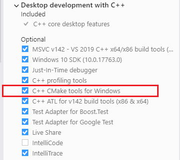

For more information, see [Install the C++ Linux workload in Visual Studio](../linux/download-install-and-setup-the-linux-development-workload.md).

## IDE integration

When you **open a folder** containing a *`CMakeLists.txt`* file, the following things happen.

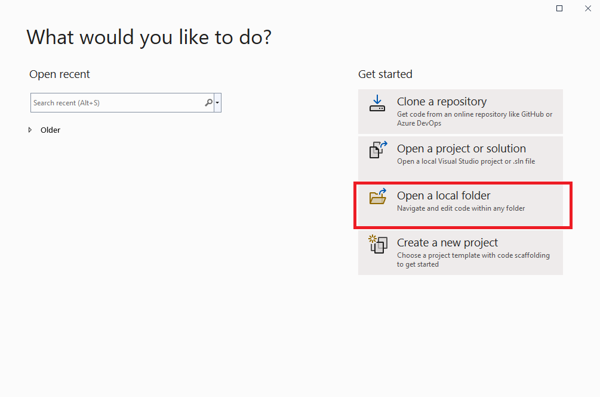

- Visual Studio adds **CMake** items to the **Project** menu, with commands for viewing and editing CMake scripts.

- The **Solution Explorer** displays the folder structure and files.

- Visual Studio runs CMake and generates the CMake cache file (*`CMakeCache.txt`*) for the default configuration. The CMake command line is displayed in the **Output Window**, along with other output from CMake.

- In the background, Visual Studio starts to index the source files to enable IntelliSense, browsing information, refactoring, and so on. As you work, Visual Studio monitors changes in the editor and also on disk to keep its index in sync with the sources.

> [!NOTE]
> Starting in Visual Studio 2022 version 17.1 Preview 2, if your top-level `CMakeLists.txt` exists in a subfolder and not at the root of the workspace, you'll be prompted whether you'd like to enable CMake integration or not. For more information, see [CMake partial activation](#cmake-partial-activation).

Once CMake cache generation has succeeded, you can also view your projects organized logically by targets. Choose the **Select View** button on the **Solution Explorer** toolbar. From the list in **Solution Explorer - Views**, select **CMake Targets View** and press **Enter** to open the targets view:

:::image type="content" source="media/cmake-targets-view2.png" alt-text="Screenshot of the Solution Explorer Views window with the C Make Targets View highlighted.":::

Choose the **Show All Files** button at the top of **Solution Explorer** to see all the CMake-generated output in the *`out/build/<config>`* folders.

Use the *`CMakeLists.txt`* file in each project folder just as you would in any CMake project. You can specify source files, find libraries, set compiler and linker options, and specify other build system-related information. For more information on CMake language services provided by Visual Studio, see [Editing CMakeLists.txt files](#editing-cmakeliststxt-files).

Visual Studio uses a CMake configuration file to drive CMake cache generation and build. For more information, see [Configuring CMake projects](#configuring-cmake-projects) and [Building CMake projects](#building-cmake-projects).

To pass arguments to an executable at debug time, you can use another file called *`launch.vs.json`*. For more information on debugging cross-platform CMake projects in Visual Studio, see [Debugging CMake projects](#debugging-cmake-projects).

Most Visual Studio and C++ language features are supported by CMake projects in Visual Studio. Examples include:

- [Edit and Continue for CMake projects](#edit-and-continue-for-cmake-projects)

- [Incredibuild integration for CMake projects](https://devblogs.microsoft.com/cppblog/seamlessly-accelerate-cmake-projects-in-visual-studio-with-incredibuild/)

- [AddressSanitizer support for CMake projects](cmake-presets-vs.md#enable-addresssanitizer-for-windows-and-linux)

- [Clang/LLVM support](https://devblogs.microsoft.com/cppblog/clang-llvm-support-in-visual-studio/)

> [!NOTE]
> For other kinds of Open Folder projects, an additional JSON file *`CppProperties.json`* is used. This file is not relevant for CMake projects.

## Configuring CMake projects

The CMake configure step generates the project build system. It's equivalent to invoking `cmake.exe` from the command line. For more information on the CMake configure step, see the [CMake documentation](https://cmake.org/cmake/help/latest/manual/cmake.1.html#generate-a-project-buildsystem).

Visual Studio uses a CMake configuration file to drive CMake generation and build. *`CMakePresets.json`* is supported by Visual Studio 2019 version 16.10 or later and is the recommended CMake configuration file. *`CMakePresets.json`* is supported directly by CMake and can be used to drive CMake generation and build from Visual Studio, from VS Code, in a Continuous Integration pipeline, and from the command line on Windows, Linux, and Mac. For more information on *`CMakePresets.json`*, see [Configure and build with CMake Presets](cmake-presets-vs.md). *`CMakeSettings.json`* is available for customers using an earlier version of Visual Studio. For more information on *`CMakeSettings.json`*, see [Customize CMake build settings](customize-cmake-settings.md).

When you make significant changes to your CMake configuration file or a *`CMakeLists.txt`* file, Visual Studio will automatically run the CMake configure step. You can invoke the configure step manually: Select **Project > Configure Cache** from the toolbar. You can also change your configuration preferences in **Tools** > **Options** > **CMake** > **General**.

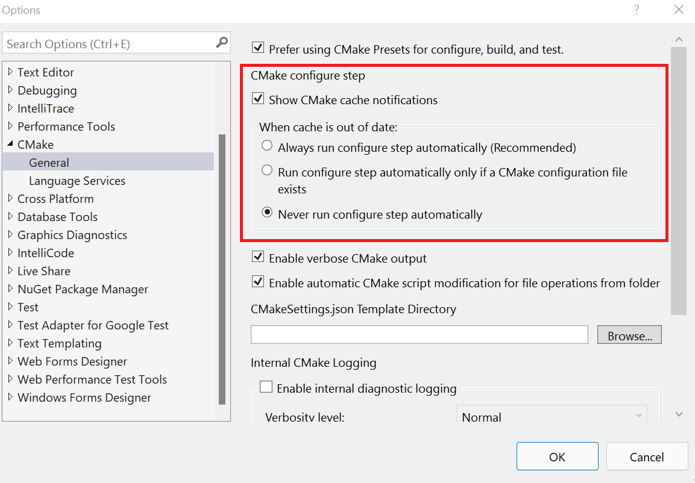

If the configure step finishes without errors, then the information that's available drives C++ IntelliSense and language services. It's also used in build and debug operations.

You can also open an existing CMake cache in Visual Studio. For more information, see [Open an existing cache](#open-an-existing-cache).

### Customize configuration feedback and notifications

By default, most configuration messages are suppressed unless there's an error. To see all messages, select **Tools** > **Options** > **CMake** > **Enable verbose CMake diagnostic output**.

You can also disable all CMake cache notifications (gold bars) by deselecting **Show CMake cache notification**.

### Troubleshooting CMake cache errors

If you need more information about the state of the CMake cache to diagnose a problem, open the **Project** main menu or the *`CMakeLists.txt`* context menu in **Solution Explorer** to run one of these commands:

- **View CMakeCache.txt** opens the *`CMakeCache.txt`* file from the build directory in the editor. Any edits you make here to *`CMakeCache.txt`* are wiped out if you clean the cache. To make changes that persist after you clean the cache, see [Customize CMake settings](customize-cmake-settings.md) or [Configure and build with CMake Presets](cmake-presets-vs.md).

- **Delete Cache and Reconfigure** deletes the build directory and reconfigures from a clean cache.

- **Configure Cache** forces the generate step to run even if Visual Studio considers the environment up to date.

## Building CMake projects

The CMake build step builds an already generated project binary tree. It's equivalent to invoking `cmake --build` from the command line. For more information on the CMake build step, see the [CMake documentation](https://cmake.org/cmake/help/latest/manual/cmake.1.html#build-a-project).

To build a CMake project, you have these choices:

1. In the toolbar, find the **Startup Item** dropdown. Select the preferred target and press **F5**, or choose the **Run** button on the toolbar. The project automatically builds first, just like a Visual Studio solution.

1. Right-click on CMake target with **CMake Targets View** active in the **Solution Explorer** and select **Build** from the context menu.

1. From the main menu, select **Build > Build All**. Make sure that a CMake target is already selected in the **Startup Item** dropdown in the toolbar.

As you would expect, build results are shown in the **Output Window** and **Error List**.

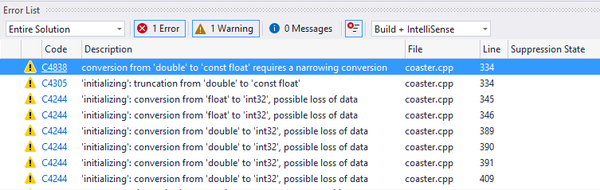

### Edit build settings

Visual Studio uses a CMake configuration file to drive CMake builds. CMake configuration files encapsulate build options like native build tool switches and environment variables. If *`CMakePresets.json`* is your active configuration file, see [Configure and build with CMake Presets](cmake-presets-vs.md#configure-and-build). If *`CMakeSettings.json`* is your active configuration file, see [Customize CMake build settings](customize-cmake-settings.md). *`CMakePresets.json`* is available in Visual Studio 2019 version 16.10 or later and is the recommended CMake configuration file.

## Debugging CMake projects

All executable CMake targets are shown in the **Startup Item** dropdown in the toolbar. To start debugging, select one and press the **Debug > Start Debugging** button in the toolbar. In a CMake project, the "Current document" option is only valid for .cpp files.

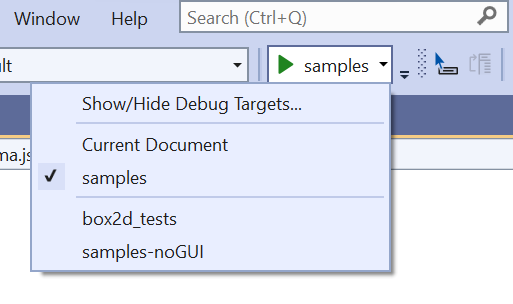

The **Debug** or **F5** commands first build the project if changes have been made since the previous build. Changes to the CMake configuration file (*`CMakePresets.json`* or *`CMakeSettings.json`*) or a *`CMakeLists.txt`* causes the CMake cache to be regenerated.

You can customize a CMake debugging session by setting properties in the *`launch.vs.json`* file. To customize debug settings for a specific target, select the target in the **Startup Item** dropdown and press **Debug > Debug and Launch Settings for \<active-target>**. For more information on CMake debugging sessions, see [Configure CMake debugging sessions](configure-cmake-debugging-sessions.md).

### Just My Code for CMake projects

When you build for Windows using the MSVC compiler, CMake projects have support for Just My Code debugging. To change the Just My Code setting, go to **Tools** > **Options** > **Debugging** > **General**.

### Edit and Continue for CMake projects

When you build for Windows with the MSVC compiler, CMake projects have support for Edit and Continue. Add the following code to your *`CMakeLists.txt`* file to enable Edit and Continue.

```
if(MSVC)
  target_compile_options(<target> PUBLIC "/ZI")
  target_link_options(<target> PUBLIC "/INCREMENTAL")
endif()
```

### Attach to a CMake project running on Linux

Visual Studio allows you to debug a process running on a remote Linux system or WSL and debug it with the GDB debugger. To get started, select **Debug** > **Attach to Process...**, set the **Connection type** to **SSH**, and select your **Connection target** from the list of connections in the Connection Manager. Select a process from the list of available processes and press **Attach**. GDB must be installed on your Linux machine. For more information on SSH connections, see the [Connection Manager](../linux/connect-to-your-remote-linux-computer.md)

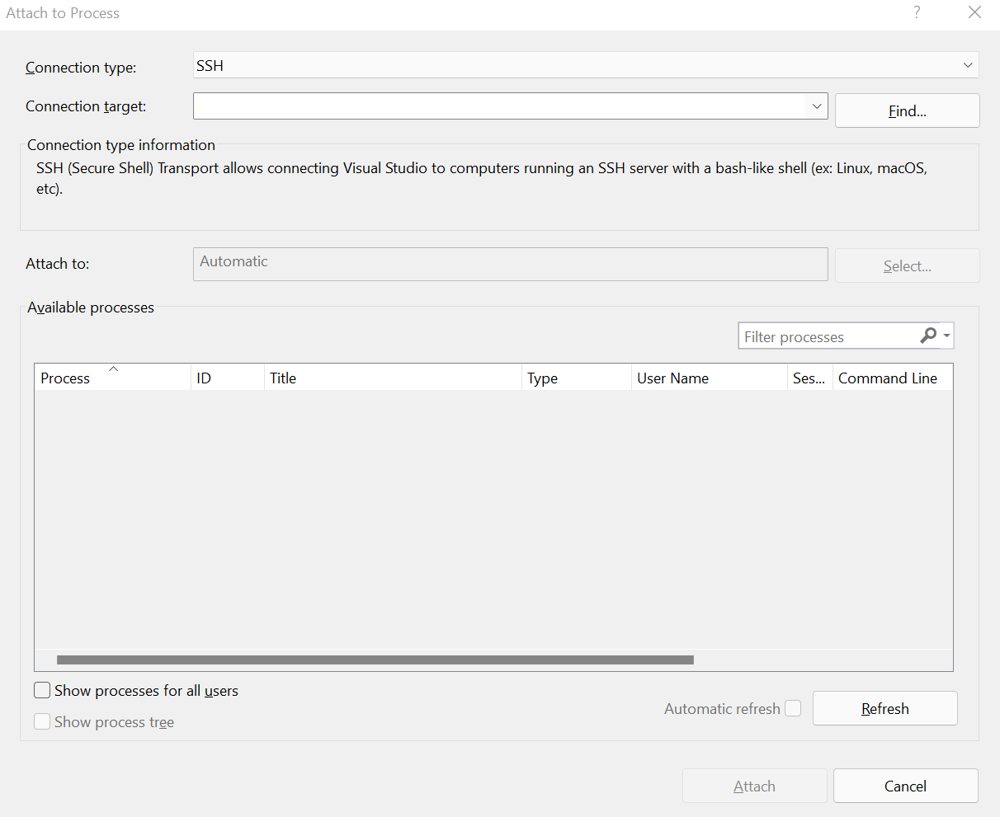

## <a name="cmake-partial-activation"></a> CMake partial activation

In Visual Studio 2022 version 17.1 and later, CMake functionality won't be enabled automatically if your root folder doesn't contain a `CMakeLists.txt` file. Instead, a dialog will prompt you on whether you'd like to enable CMake functionality for your project. If you decline, CMake cache generation won't start and CMake configurations (from `CMakeSettings.json` or `CMakePresets.json`) won't appear in the configuration dropdown. If you accept, you'll be taken to a workspace-level configuration file, `CMakeWorkspaceSettings.json` (stored in the `.vs` directory), to specify the folders you'd like to enable CMake for. (These folders contain your root `CMakeLists.txt` files).

The accepted properties are:

| Property | Description |
|--|--|
| `enableCMake` | Enable Visual Studio's integration for this workspace. |
| `sourceDirectory` | A string or array of strings specifying the directory or directories with `CMakeLists.txt`. Macros (such as `${workspaceRoot}`) are allowed. Relative paths are based on the workspace root. Directories outside of the current workspace will be ignored. |

You can reach `CMakeWorkspaceSettings.json` through the **Project** > **CMake Workspace Settings** menu command at any time, even if CMake functionality is currently disabled.

## Open an existing cache

When you open an existing CMake cache file (*`CMakeCache.txt`*), Visual Studio doesn't try to manage your cache and build tree for you. Your custom or preferred tools have complete control over how CMake configures your project.

You can add an existing CMake cache to an open project. It's done the same way you'd add a new configuration. For more information, see our blog post on [opening an existing cache in Visual Studio](https://devblogs.microsoft.com/cppblog/open-existing-cmake-caches-in-visual-studio/).

> [!NOTE]
> The default existing cache experience relies on `cmake-server`, which was removed from CMake in version 3.20. To continue using existing cache functionality in Visual Studio 2019 version 16.10 and later, take one of these steps:
>
> - Manually install CMake version 3.19 or lower. Then, set the `cmakeExecutable` property in your existing cache configuration to use that version of CMake.
> - In your existing cache configuration, set the `cacheGenerationCommand` property to let Visual Studio request the necessary CMake file-based API files. For more information on that property, see [CMakeSettings.json reference](cmakesettings-reference.md#configurations).
> - Use a query file to request the CMake file-based API files when generating your cache before it's opened in Visual Studio. For query file instructions, see the next section, [Advanced CMake cache troubleshooting](#advanced).

### <a name="advanced"></a> Advanced CMake cache troubleshooting

Visual Studio uses the CMake [file-based API](https://cmake.org/cmake/help/latest/manual/cmake-file-api.7.html) (in versions 3.14 and later) to populate the editor with information specific to your project structure. For more information, see the C++ team blog post on [multi-root workspaces and file-based API](https://devblogs.microsoft.com/cppblog/visual-studio-code-cmake-tools-extension-multi-root-workspaces-and-file-based-api/).

Before generating the CMake cache, your custom or preferred tools may need to create a query file named *`.cmake/api/v1/query/client-MicrosoftVS/query.json`* in your build output folder (the folder that contains *`CMakeCache.txt`*). The query file should contain this content:

```json
{"requests":[{"kind":"cache","version":2},{"kind":"cmakeFiles","version":1},{"kind":"codemodel","version":2}]}
```

When your custom or preferred tools generate your cache, CMake places files under *`.cmake/api/v1/response`* that Visual Studio uses to populate the editor with information specific to your project structure.

## Editing *`CMakeLists.txt`* files

To edit a *`CMakeLists.txt`* file, right-click on the file in **Solution Explorer** and choose **Open**. If you make changes to the file, a yellow status bar appears and informs you that IntelliSense will update. It gives you a chance to cancel the update operation. For information about *`CMakeLists.txt`*, see the [CMake documentation](https://cmake.org/documentation/).

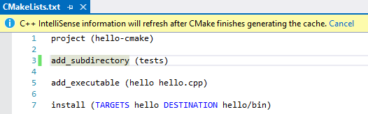

As soon as you save the file, the configuration step automatically runs again and displays information in the **Output** window. Errors and warnings are shown in the **Error List** or **Output** window. Double-click on an error in the **Error List** to navigate to the offending line in *`CMakeLists.txt`*.

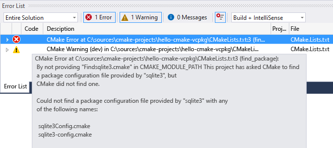

### Language services for CMake

Language services for CMake are available in Visual Studio 2019 version 16.5 or later. It supports code navigation features like Go To Definition, Peek Definition, and Find All References for CMake variables, functions, and targets in CMake script files. For more information, see [Code Navigation for CMake Scripts](https://devblogs.microsoft.com/cppblog/code-navigation-for-cmake-scripts/).

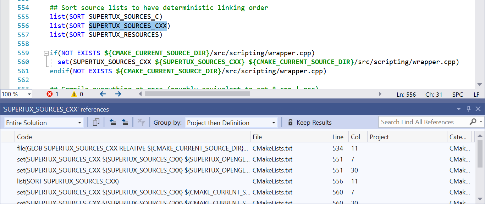

### CMake project manipulation

CMake project manipulation is available in Visual Studio 2019 version 16.5 or later. Project manipulation enables you to add, remove, and rename source files and targets in your CMake project without manually editing your CMake scripts. When you add or remove files from the Solution Explorer, Visual Studio automatically edits your CMake project. There could be more than one place where it makes sense to add or remove a reference to a CMake script. If so, Visual Studio asks you where you want to make the change and displays a preview of the proposed changes. For step-by-step instructions, see [Add, Remove, and Rename Files and Targets in CMake Projects](https://devblogs.microsoft.com/cppblog/easily-add-remove-and-rename-files-and-targets-in-cmake-projects/).


## IntelliSense for CMake projects

By default, Visual Studio uses the IntelliSense mode that matches the compiler and target architecture specified by the active CMake configuration.

If *`CMakePresets.json`* is your active CMake configuration file, then you can specify IntelliSense options using `intelliSenseMode` and `intelliSenseOptions` in the Visual Studio Settings vendor map. For more information, see the [Visual Studio Settings vendor map reference](cmake-presets-json-reference.md#visual-studio-settings-vendor-map).

If *`CMakeSettings.json`* is your active CMake configuration file, then you can specify IntelliSense options using `intelliSenseMode` in *`CMakeSettings.json`*. For more information, see the [`CMakeSettings.json` reference](cmakesettings-reference.md).

### Configure IntelliSense with CMake toolchain files

In Visual Studio 2019 version 16.9 and later, Visual Studio automatically configures IntelliSense in CMake projects based on CMake variables when you use a CMake toolchain file. For more information, see [Configure IntelliSense with CMake Toolchain Files](https://devblogs.microsoft.com/cppblog/configure-intellisense-with-cmake-toolchain-files-in-visual-studio-2019-16-9-preview-2/).

## Vcpkg integration

CMake projects opened in Visual Studio integrate with vcpkg, a cross-platform C/C++ dependency manager. Before using vcpkg with Visual Studio, you must run `vcpkg integrate install`. For instructions and more information on vcpkg, see the [vcpkg documentation](https://vcpkg.io/).

If *`CMakeSettings.json`* is your active configuration file, Visual Studio automatically passes the vcpkg toolchain file (`vcpkg.cmake`) to CMake. This behavior is disabled automatically when you specify any other toolchain in your CMake Settings configuration.

If *`CMakePresets.json`* is your active configuration file, you'll need to set the path to `vcpkg.cmake` in *`CMakePresets.json`*. We recommend using the `VCPKG_ROOT` environment variable instead of an absolute path to keep the file shareable. For more information, see [Enable vcpkg integration with CMake Presets](cmake-presets-vs.md#enable-vcpkg-integration). *`CMakePresets.json`* is available in Visual Studio 2019 version 16.10 or later and is the recommended CMake configuration file.

## Run CMake from the command line

If *`CMakePresets.json`* is your active CMake configuration file, then you can easily reproduce your local builds outside of Visual Studio. For more information, see [Run CMake from the command line or a CI pipeline](cmake-presets-vs.md#run-cmake-from-the-command-line-or-a-ci-pipeline). *`CMakePresets.json`* is supported in Visual Studio 2019 version 16.10 or later and is the recommended CMake configuration file.

If *`CMakeSettings.json`* is your active CMake configuration file, then you'll need to manually pass the arguments that are encoded in your *`CMakeSettings.json`* file to CMake. If you have installed CMake from the Visual Studio Installer, you can run it from the command line by following these steps:

1. Run the appropriate *`vsdevcmd.bat`* file (x86/x64). For more information, see [Building on the command line](building-on-the-command-line.md) .

1. Switch to your output folder.

1. Run CMake to build or configure your app.

::: moniker-end

::: moniker range="msvc-150"

Visual Studio 2017 has rich support for CMake, including [cross-platform CMake projects](../linux/cmake-linux-project.md). The **Visual C++ Tools for CMake** component uses the **Open Folder** feature to enable the IDE to consume CMake project files (such as *`CMakeLists.txt`*) directly for the purposes of IntelliSense and browsing. Both Ninja and Visual Studio generators are supported. If you use a Visual Studio generator, it generates a temporary project file and passes it to MSBuild. However, the project is never loaded for IntelliSense or browsing purposes. You also can import an existing CMake cache.

## Installation

**Visual C++ Tools for CMake** is installed as part of the **Desktop development with C++** and **Linux Development with C++** workloads.

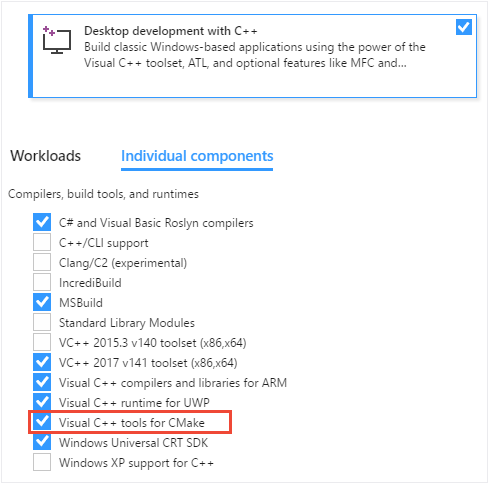

For more information, see [Install the C++ Linux workload in Visual Studio](../linux/download-install-and-setup-the-linux-development-workload.md).

## IDE integration

When you choose **File > Open > Folder** to open a folder containing a *`CMakeLists.txt`* file, the following things happen:

- Visual Studio adds a **CMake** menu item to the main menu, with commands for viewing and editing CMake scripts.

- **Solution Explorer** displays the folder structure and files.

- Visual Studio runs CMake and optionally generates the CMake cache for the default *configuration*, which is x86 Debug. The CMake command line is displayed in the **Output Window**, along with other output from CMake.

- In the background, Visual Studio starts to index the source files to enable IntelliSense, browsing information, refactoring, and so on. As you work, Visual Studio monitors changes in the editor and also on disk to keep its index in sync with the sources.

You can open folders containing any number of CMake projects. Visual Studio detects and configures all the "root" *`CMakeLists.txt`* files in your workspace. CMake operations (configure, build, debug), C++ IntelliSense, and browsing are available to all CMake projects in your workspace.


You can also view your projects organized logically by targets. Choose **Targets view** from the dropdown in the **Solution Explorer** toolbar:


Visual Studio uses a file called *`CMakeSettings.json`* to store environment variables or command-line options for CMake. *`CMakeSettings.json`* also enables you to define and store multiple CMake build configurations. You can conveniently switch between them in the IDE.

Otherwise, use the *`CMakeLists.txt`* just as you would in any CMake project to specify source files, find libraries, set compiler and linker options, and specify other build system-related information.

If you need to pass arguments to an executable at debug time, you can use another file called *`launch.vs.json`*. In some scenarios, Visual Studio automatically generates these files. You can edit them manually, or even create the file yourself.

> [!NOTE]
> For other kinds of Open Folder projects, two additional JSON files are used: *`CppProperties.json`* and *`tasks.vs.json`*. Neither of these are relevant for CMake projects.

## Import an existing cache

When you import an existing *`CMakeCache.txt`* file, Visual Studio automatically extracts customized variables and creates a pre-populated *`CMakeSettings.json`* file based on them. The original cache isn't modified in any way. It can still be used from the command line, or with whatever tool or IDE used to generate it. The new  *`CMakeSettings.json`* file is placed alongside the project's root *`CMakeLists.txt`*. Visual Studio generates a new cache based the settings file. You can override automatic cache generation in the **Tools > Options > CMake > General** dialog.

Not everything in the cache is imported.  Properties such as the generator and the location of the compilers are replaced with defaults that are known to work well with the IDE.

### To import an existing cache

1. From the main menu, choose **File > Open > CMake**:

   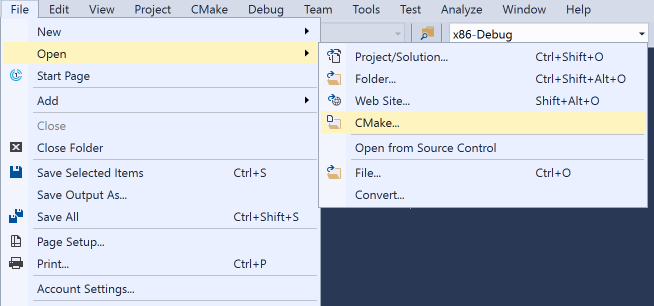

   This command brings up the **Import CMake from Cache** wizard.

2. Navigate to the *`CMakeCache.txt`* file that you want to import, and then choose **OK**. The **Import CMake Project from Cache** wizard appears:

   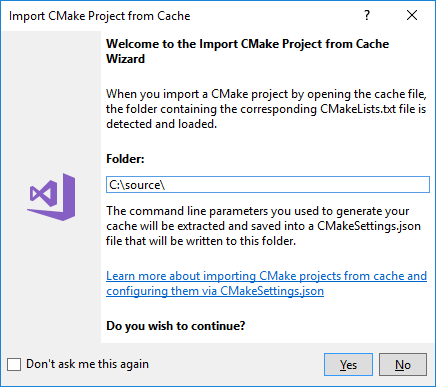

   When the wizard completes, you can see the new *`CMakeCache.txt`* file in **Solution Explorer** next to the root *`CMakeLists.txt`* file in your project.

## Building CMake projects

To build a CMake project, you have these choices:

1. In the General toolbar, find the **Configurations** dropdown. It's probably showing "Linux-Debug" or "x64-Debug" by default. Select the preferred configuration and press **F5**, or choose the **Run** (green triangle) button on the toolbar. The project automatically builds first, just like a Visual Studio solution.

1. Right-click on *`CMakeLists.txt`* in **Solution Explorer** and select **Build** from the context menu. If you have multiple targets in your folder structure, you can choose to build all or only one specific target.

1. From the main menu, select **Build > Build Solution** (**F7** or **Ctrl+Shift+B**). Make sure that a CMake target is already selected in the **Startup Item** dropdown in the **General** toolbar.

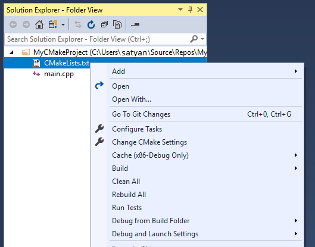

You can customize build configurations, environment variables, command-line arguments, and other settings in the *`CMakeSettings.json`* file. It lets you make changes without modifying the *`CMakeLists.txt`* file. For more information, see [Customize CMake settings](customize-cmake-settings.md).

As you would expect, build results are shown in the **Output Window** and **Error List**.


In a folder with multiple build targets, you can specify which CMake target to build: Choose the **Build** item on the **CMake** menu or the *`CMakeLists.txt`* context menu to specify the target. If you enter **Ctrl+Shift+B** in a CMake project, it builds the current active document.

## Debugging CMake projects

To debug a CMake project, choose the preferred configuration and press **F5**. Or, press the **Run** button in the toolbar. If the **Run** button says "Select Startup Item", select the dropdown arrow and choose the target that you want to run. (In a CMake project, the "Current document" option is only valid for .cpp files.)


The **Run** or **F5** commands first build the project if changes have been made since the previous build.

You can customize a CMake debugging session by setting properties in the *`launch.vs.json`* file. For more information, see [Configure CMake debugging sessions](configure-cmake-debugging-sessions.md).

## Editing *`CMakeLists.txt`* files

To edit a *`CMakeLists.txt`* file, right-click on the file in **Solution Explorer** and choose **Open**. If you make changes to the file, a yellow status bar appears and informs you that IntelliSense will update. It gives you a chance to cancel the update operation. For information about *`CMakeLists.txt`*, see the [CMake documentation](https://cmake.org/documentation/).

   

As soon as you save the file, the configuration step automatically runs again and displays information in the **Output** window. Errors and warnings are shown in the **Error List** or **Output** window. Double-click on an error in the **Error List** to navigate to the offending line in *`CMakeLists.txt`*.

   

## CMake configure step

When significant changes are made to the  *`CMakeSettings.json`* or to *`CMakeLists.txt`* files, Visual Studio automatically reruns the CMake configure step. If the configure step finishes without errors, the information that's collected is available in C++ IntelliSense and language services. It's also used in build and debug operations.

Multiple CMake projects may use the same CMake configuration name (for example, x86-Debug). All of them are configured and built (in their own build root folder) when that configuration is selected. You can debug the targets from all of the CMake projects that participate in that CMake configuration.

   

You can limit builds and debug sessions to a subset of the projects in the workspace. Create a new configuration with a unique name in the  *`CMakeSettings.json`* file. Then, apply the configuration to those projects only. When that configuration is selected, IntelliSense and the build and debug commands only apply to those specified projects.

## Troubleshooting CMake cache errors

If you need more information about the state of the CMake cache to diagnose a problem, open the **CMake** main menu or the *`CMakeLists.txt`* context menu in **Solution Explorer** to run one of these commands:

- **View Cache** opens the  *`CMakeCache.txt`* file from the build root folder in the editor. (Any edits you make here to  *`CMakeCache.txt`* are wiped out if you clean the cache. To make changes that persist after the cache is cleaned, see [Customize CMake settings](customize-cmake-settings.md).)

- **Open Cache Folder** opens an Explorer window to the build root folder.

- **Clean Cache** deletes the build root folder so that the next CMake configure step starts from a clean cache.

- **Generate Cache** forces the generate step to run even if Visual Studio considers the environment up to date.

Automatic cache generation can be disabled in the **Tools > Options > CMake > General** dialog.

## Single file compilation

To build a single file in a CMake project, right-click on the file in **Solution Explorer**. Choose **Compile** from the pop-up menu. You can also build the currently open file in the editor by using the main **CMake** menu:


## Run CMake from the command line

If you have installed CMake from the Visual Studio Installer, you can run it from the command line by following these steps:

1. Run the appropriate *`vsdevcmd.bat`* file (x86/x64). For more information, see [Building on the Command Line](building-on-the-command-line.md).

1. Switch to your output folder.

1. Run CMake to build or configure your app.

::: moniker-end

::: moniker range="msvc-140"

In Visual Studio 2015, Visual Studio users can use a [CMake generator](https://cmake.org/cmake/help/latest/manual/cmake-generators.7.html) to generate MSBuild project files, which the IDE then consumes for IntelliSense, browsing, and compilation.

::: moniker-end

## See also

[Tutorial: Create C++ cross-platform projects in Visual Studio](get-started-linux-cmake.md)\
[Configure a Linux CMake project](../linux/cmake-linux-project.md)\
[Connect to your remote Linux computer](../linux/connect-to-your-remote-linux-computer.md)\
[Customize CMake build settings](customize-cmake-settings.md)\
[`CMakeSettings.json` schema reference](cmakesettings-reference.md)\
[Configure CMake debugging sessions](configure-cmake-debugging-sessions.md)\
[Deploy, run, and debug your Linux project](../linux/deploy-run-and-debug-your-linux-project.md)\
[CMake predefined configuration reference](cmake-predefined-configuration-reference.md)
