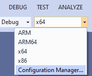
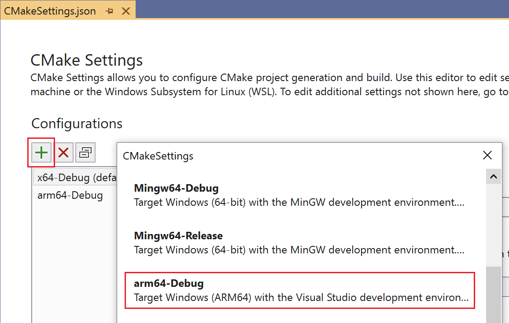
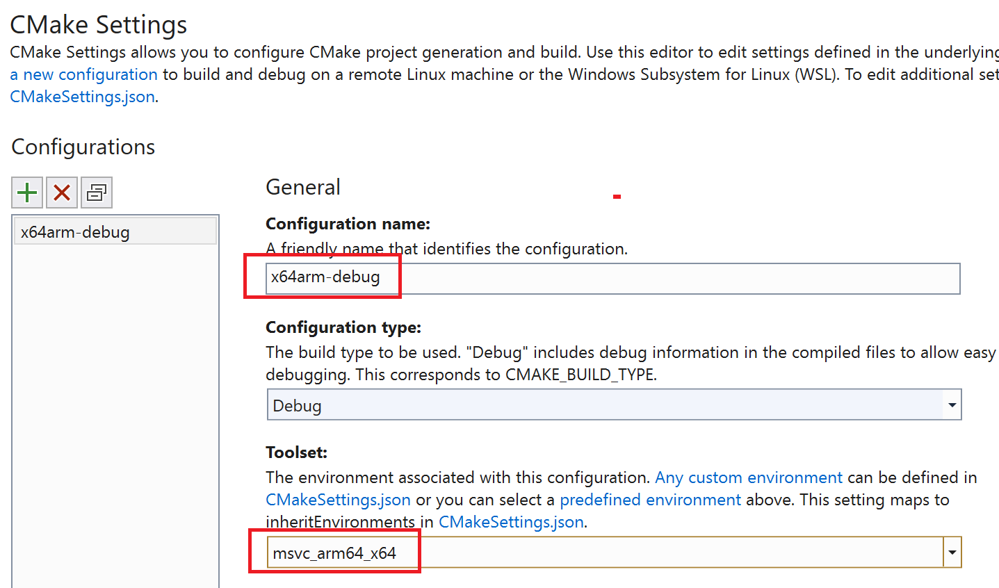
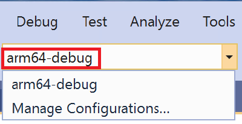
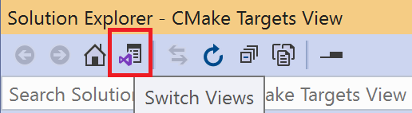
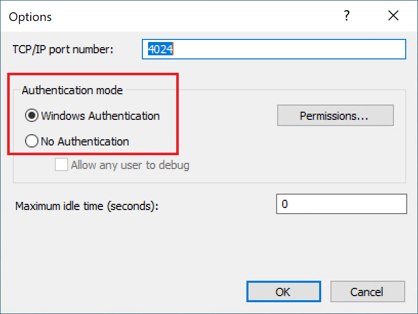
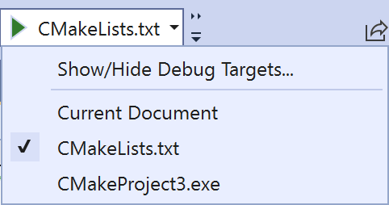
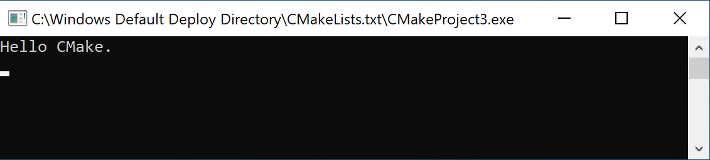

# Tutorial: Debug a CMake project on a remote Windows machine

This tutorial uses Visual Studio C++ on Windows to create and build a CMake project that you can deploy and debug on a remote Windows machine. The tutorial is specific to Windows ARM64, but the steps can be generalized for other architectures.

In Visual Studio, the default debugging experience for ARM64 is remote debugging an ARM64 Windows machine. Configure your debug settings as shown in this tutorial. Otherwise, when you try to debug an ARM64 CMake project, you'll get an error that Visual Studio can't find the remote machine.

In this tutorial, you'll learn how to:

> [!div class="checklist"]
>
> * create a CMake project
> * configure a CMake project to build for ARM64
> * configure a CMake project to run on a remote ARM64 Windows machine
> * debug a CMake project running on a remote ARM64 Windows machine

## Prerequisites

### On the host machine

To set up Visual Studio for cross-platform C++ development, install the build tools for the target architecture. For this tutorial, install the ARM64 build tools by doing these steps:

1. Run the Visual Studio Installer. If you haven't installed Visual Studio yet, see [Install Visual Studio](/visualstudio/install/install-visual-studio)
1. On the Visual Studio Installer home screen, choose **Modify**.
1. From the choices at the top, choose **Individual components**.
1. Scroll down to the **Compilers, build tools, and runtimes** section.
1. Ensure that the following are selected:
    - **C++ CMake tools for Windows**
    - **MSVC v142 - VS 2019 C++ ARM64 build tools (Latest)** It's important that you choose the `ARM64` build tools and not the `ARM` build tools (look for the 64) and that you choose the version that goes with `VS 2019`.
1. Select **Modify** to install the tools.

### On the remote machine

1. Install the remote tools on the remote machine. For this tutorial, install the ARM64 tools by following the instructions in [Download and Install the remote tools](/visualstudio/debugger/remote-debugging-cpp#download-and-install-the-remote-tools).
1. Start and configure the remote debugger on the remote machine. For this tutorial, do so by following the directions in [set up the remote debugger](/visualstudio/debugger/remote-debugging-cpp#BKMK_setup) on the remote  Windows machine.

## Create a CMake project

On the Windows host machine:

1. Run Visual Studio
1. From the main menu, select **File** > **New** > **Project**.
1. Select **CMake Project** > **Next**
1. Give the project a name and choose a location. Then select **Create**.

Give Visual Studio a few moments to create the project and populate the **Solution Explorer**.

## Configure for ARM64

To target an ARM64 Windows machine, you need to build using ARM64 build tools.

Select the Visual Studio **Configuration** dropdown and select **Manage Configurations**.



Add a new configuration by selecting **Add a new configuration** (the green **+** button).\
In the **CMakeSettings** dialog that appears, select **arm64-debug**, and then choose **Select**:



This command adds a debug configuration named `arm64-Debug` to your *`CmakeSettings.json`* file. This configuration name is a unique, friendly name that makes it easier for you to identify these settings in the **Configuration** dropdown.

The **Toolset** dropdown is set to **msvc_arm64_x64**. Your settings should now look like this:



> [!Note]
> In the **Toolset** dropdown, **msvc_arm64** selects 32-bit host tools to cross-compile to ARM64, whereas **msvc_arm64 x64** selects 64-bit host tools to cross-compile to ARM64, which is what you'll do in this tutorial. For more information about the available toolset environments, see [Pre-defined environments](cppproperties-schema-reference.md#pre-defined-environments).

Save the *`CMakeSettings.json`* file. In the configuration dropdown, select **arm64-debug**. (It may take a moment after saving the *`CMakeSettings.json`* file for it to appear in the list):



## Add a debug configuration file

Next, add configuration information that tells Visual Studio where to find your remote machine, along with other configuration details.

Change the **Solution Explorer** view to targets view by selecting the **Switch Views** button:



Then, in the **Solution Explorer**, double-click **CMake Targets View** to see the project.

Open the project folder (in this example, **CMakeProject3 Project**), and then right-click the executable and select **Add Debug Configuration**:


This command creates a *`launch.vs.json`* file in your project. Open it and change the following entries to enable remote debugging:

- `projectTarget`: this value is set for you if you added the debug configuration file from the **Solution Explorer** targets view per the instructions above.
- `remoteMachineName`: set to the IP address of the remote ARM64 machine, or its machine name.

For more information about *`launch.vs.json`* settings, see [`launch.vs.json` schema reference](launch-vs-schema-reference-cpp.md).

> [!Note]
> If you're using the folder view instead of the targets view in **Solution Explorer**, right-click the *`CMakeLists.txt`* file and select **Add Debug Configuration**. This experience differs from adding the debug configuration from the targets view in the following ways:
>
> - You'll be asked to select a debugger (select  **C/C++ Remote Windows Debug**).
> - Visual Studio will provide less configuration template information in the *`launch.vs.json`* file so you'll need to add it yourself. You'll need to provide the `remoteMachineName` and `projectTarget` entries. When you add the configuration from the targets view, you only need to specify `remoteMachineName`.
> - For the `projectTarget` setting value, check the startup item dropdown to get the unique name of your target, for example, in this tutorial it is *`CMakeProject3.exe`*'.

## Start the remote debugger monitor on the remote Windows machine

Before you run your CMake project, ensure that the Visual Studio 2019 remote debugger is running on the remote Windows machine.  You may need to change the remote debugger options depending on your authentication situation.

For example, on the remote machine, from the Visual Studio Remote Debugger menu bar, select **Tools** > **Options**. Set the **authentication mode** to match how your environment is set up:



Then, in Visual Studio on the host machine, update the *`launch.vs.json`* file to match. For example, if you choose **No Authentication** on the remote debugger, update the *`launch.vs.json`* file in your project by adding `"authenticationType": "none"` to the `configurations` section *`launch.vs.json`*. Otherwise, `"authenticationType"` defaults to `"windows"` and doesn't need to be explicitly stated. This example shows a *`launch.vs.json`* file configured for no authentication:

``` XAML
{
  "version": "0.2.1",
  "defaults": {},
  "configurations": [
    {
        "type": "remoteWindows",
        "authenticationType": "none"
        "name": "CMakeLists.txt",
        "project": "CMakeLists.txt",
        "projectTarget": "CMakeProject3.exe",
        "remoteMachineName": "<ip address goes here>",
        "cwd": "${debugInfo.defaultWorkingDirectory}",
        "program": "${debugInfo.fullTargetPath}",
        "deploy": [],
        "args": [],
        "env": {}
    },
    {
      "type": "default",
      "project": "CMakeLists.txt",
      "projectTarget": "CMakeProject3.exe",
      "name": "CMakeProject3.exe"
    }
  ]
}
```

## Debug the app

On the host machine, in the Visual Studio **Solution Explorer**, open the CPP file for your CMake project. If you're still in **CMake Targets View**, you'll need to open the **(executable)** node to see it.

The default CPP file is a simple hello world console app. Set a breakpoint on `return 0;`.

On the Visual Studio toolbar, use the **Startup Item** dropdown to select the name you specified for `"name"` in your *`launch.vs.json`* file:



To start debugging, on the Visual Studio toolbar choose **Debug** > **Start Debugging** (or press **F5**).

If it doesn't start, ensure that the following are set correctly in the *`launch.vs.json`* file:

- `"remoteMachineName"` should be set to the IP address, or the machine name, of the remote ARM64 Windows machine.
- `"name"` should match the selection in the Visual Studio startup item dropdown.
- `"projectTarget"` should match the name of the CMake target you want to debug.
- `"type"` should be `"remoteWindows"`
- If the authentication type on the remote debugger is set to **No Authentication**, you should have `"authenticationType": "none"` set in the *`launch.vs.json`* file.
- If you're using Windows authentication, sign in when prompted using an account recognized by the remote machine.

After the project builds, the app should appear on the remote ARM64 Windows machine:



Visual Studio on the host machine should be stopped at the breakpoint for `return 0;`.

## What you learned

In this tutorial, you created a CMake project, configured it to build for Windows on ARM64, and debugged it on a remote ARM64 Windows machine.

## Next steps

Learn more about configuring and debugging CMake projects in Visual Studio:

> [!div class="nextstepaction"]
> [CMake Projects in Visual Studio](cmake-projects-in-visual-studio.md)\
> [Customize CMake build settings](customize-cmake-settings.md)\
> [Configure CMake debugging sessions](configure-cmake-debugging-sessions.md)\
> [CMake predefined configuration reference](cmake-predefined-configuration-reference.md)\
> [`launch.vs.json` schema reference](launch-vs-schema-reference-cpp.md)
