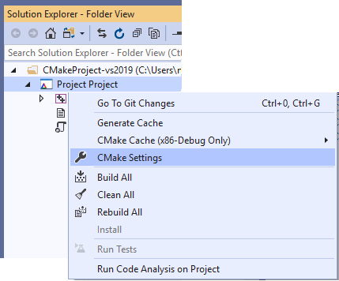

# Customize CMake build settings (Visual Studio 2019)

In Visual Studio 2019 and later, you can add configurations and customize their settings by right-clicking on the project node in **Solution Explorer** and choosing **CMake Settings**.

If no configurations are defined yet, Visual Studio will display a list for you to choose from:

After you choose a configuration, Visual Studio shows the CMake Settings editor. The settings that you see in the editor might vary depending on which configuration is selected.

 The options that you choose here are written to a file called CMakeSettings.json. This file provides command-line arguments and environment variables that are passed to CMake when you build the projects. Visual Studio never modifies CMakeLists.txt automatically; by using CMakeSettings.json you can customize the build through Visual Studio while leaving the CMake project files untouched so that others on your team can consume them with whatever tools they are using.

## CMake General Settings

The following settings are available under the **General** heading:

### Configuration name

- **name**: the name that appears in the C++ configuration dropdown. The `${name}` macro enables you to use this value when composing other property values such as paths. For an example, see the **buildRoot** definition in  `CMakeSettings.json`.

### Configuration type

- **configurationType**: defines the build configuration type for the selected generator. Currently supported values are "Debug", "MinSizeRel", "Release", and "RelWithDebInfo".

### Toolset
### CMake toolchain file
### Build root

- **buildRoot**: maps to **-DCMAKE_BINARY_DIR** switch and specifies where the CMake cache will be created. If the folder does not exist, it is created.

## Command arguments

The following settings are available under the **Command arguments** heading:

### CMake command arguments

- **cmakeCommandArgs**: specifies any additional switches you want to pass to CMake.exe.

### Build command arguments

- **buildCommandArgs**: specifies additional switches to pass to the underlying build system. For example, passing -v when using the Ninja generator forces Ninja to output command lines.

### CTest command arguments

- **ctestCommandArgs**: specifies additional switches to pass to CTest when running tests.

## CMake variables and cache

These settings enable you to set CMake variables and save them in CMakeSettings.json. They will be passed to CMake at build time and will override whatever values might be in the CMakeLists.txt file.

- **variables**: contains a name-value pair of CMake variables that will get passed as **-D** *_name_=_value_* to CMake. If your CMake project build instructions specify the addition of any variables directly to the CMake cache file, it is recommended that you add them here instead.

## Advanced settings

### CMake generator

- **generator**: maps to the CMake **-G** switch and specifies the generator to be used. This property can also be used as a macro, `${generator}`, when composing other property values. Visual Studio currently supports the following CMake generators:

  - "Ninja"
  - "Visual Studio 14 2015"
  - "Visual Studio 14 2015 ARM"
  - "Visual Studio 14 2015 Win64"
  - "Visual Studio 15 2017"
  - "Visual Studio 15 2017 ARM"
  - "Visual Studio 15 2017 Win64"

  Because Ninja is designed for fast build speeds instead of flexibility and function, it is set as the default. However, some CMake projects may be unable to correctly build using Ninja. If this occurs, you can instruct CMake to generate a Visual Studio project instead.

### IntelliSense mode

For accurate IntelliSense, set this to the appropriate value for your project.

### Install directory

### CMake executable