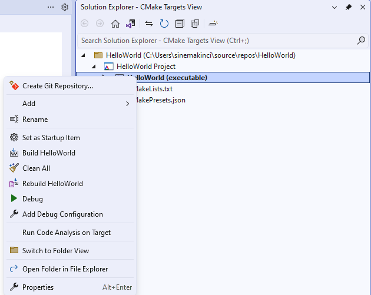
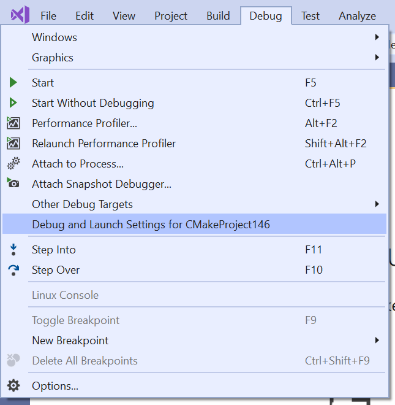
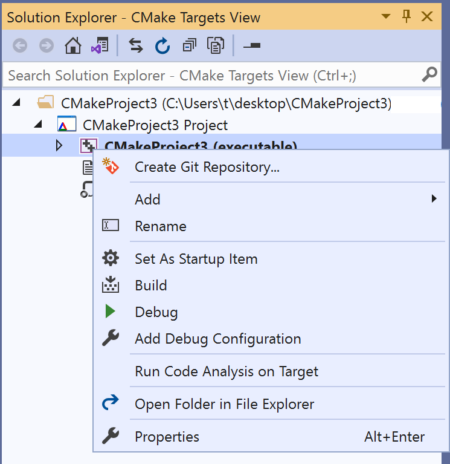
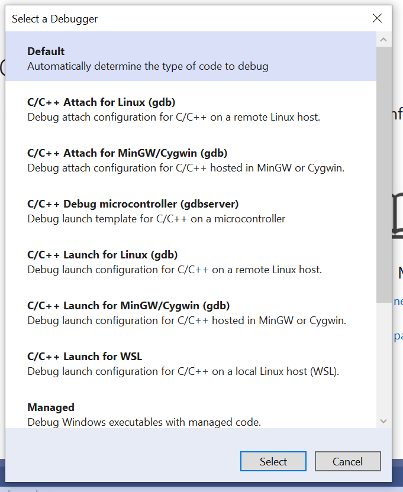

# Configure CMake debugging sessions

::: moniker range="msvc-140"

Native CMake support is available in Visual Studio 2017 and later. To see the documentation for these versions, set the Visual Studio **Version** selector control for this article to Visual Studio 2017 or Visual Studio 2019. It's found at the top of the table of contents on this page.

::: moniker-end

::: moniker range=">=msvc-150"

All executable CMake targets are shown in the **Startup Item** dropdown in the toolbar. Select one to start a debugging session and launch the debugger.


You can also start a debug session from Solution Explorer. First, switch to **CMake Targets View** in the **Solution Explorer** window.



Then, right-click on an executable and select **Debug**. This command automatically starts debugging the selected target based on your active configuration.

## Customize debugger settings

You can customize the debugger settings for any executable CMake target in your project. They're found in a configuration file called *launch.vs.json*, located in a *`.vs`* folder in your project root. A launch configuration file is useful in most debugging scenarios, because you can configure and save your debugging setup details. There are three entry points to this file:

- **Debug Menu:** Select **Debug > Debug and Launch Settings for ${activeDebugTarget}** from the main menu to customize the debug configuration specific to your active debug target. If you don't have a debug target selected, this option is grayed out.



- **Targets View:** Navigate to **Targets View** in Solution Explorer. Then, right-click on a debug target and select **Add Debug Configuration** to customize the debug configuration specific to the selected target.



- **Root CMakeLists.txt:** Right-click on a root *CMakeLists.txt* and select **Add Debug Configuration** to open the **Select a Debugger** dialog box. The dialog allows you to add *any* type of debug configuration, but you must manually specify the CMake target to invoke via the `projectTarget` property.



You can edit the *launch.vs.json* file to create debug configurations for any number of CMake targets. When you save the file, Visual Studio creates an entry for each new configuration in the **Startup Item** dropdown.

## Reference keys in CMakeSettings.json

To reference any key in a *CMakeSettings.json* file, prepend `cmake.` to it in *launch.vs.json*. The following example shows a simple *launch.vs.json* file that pulls in the value of the `remoteCopySources` key in the *CMakeSettings.json* file for the currently selected configuration:

```json
{
  "version": "0.2.1",
  "configurations": [
    {
      "type": "default",
      "project": "CMakeLists.txt",
      "projectTarget": "CMakeHelloWorld.exe (Debug\\CMakeHelloWorld.exe)",
      "name": "CMakeHelloWorld.exe (Debug\\CMakeHelloWorld.exe)",
      "args": ["${cmake.remoteCopySources}"]
    }
  ]
}
```

**Environment variables** defined in *CMakeSettings.json* can also be used in launch.vs.json using the syntax `${env.VARIABLE_NAME}`. In Visual Studio 2019 version 16.4 and later, debug targets are automatically launched using the environment you specify in *CMakeSettings.json*. You can unset an environment variable by setting it to **null**.

## Launch.vs.json reference

There are many *launch.vs.json* properties to support all your debugging scenarios. The following properties are common to all debug configurations, both remote and local:

- `projectTarget`: Specifies the CMake target to invoke when building the project. Visual Studio autopopulates this property if you enter *launch.vs.json* from the **Debug Menu** or **Targets View**. This value must match the name of an existing debug target listed in the **Startup Item** dropdown.

- `env`: Additional environment variables to add using the syntax:

  ```json
  "env": {
        "DEBUG_LOGGING_LEVEL": "trace;info",
        "ENABLE_TRACING": "true"
      }
  ```

- `args`: Command-line arguments passed to the program to debug.

## Launch.vs.json reference for remote projects and WSL

In Visual Studio 2019 version 16.6, we added a new debug configuration of `type: cppgdb` to simplify debugging on remote systems and WSL. Old debug configurations of `type: cppdbg` are still supported.

### Configuration type `cppgdb`

- `name`: A friendly name to identify the configuration in the **Startup Item** dropdown.
- `project`: Specifies the relative path to the project file. Normally, you don't need to change this path when debugging a CMake project.
- `projectTarget`: Specifies the CMake target to invoke when building the project. Visual Studio autopopulates this property if you enter *launch.vs.json* from the **Debug Menu** or **Targets View**. This target value must match the name of an existing debug target listed in the **Startup Item** dropdown.
- `debuggerConfiguration`: Indicates which set of debugging default values to use. In Visual Studio 2019 version 16.6, the only valid option is `gdb`. Visual Studio 2019 version 16.7 or later also supports `gdbserver`.
- `args`: Command-line arguments passed on startup to the program being debugged.
- `env`: Additional environment variables passed to the program being debugged. For example, `{"DISPLAY": "0.0"}`.
- `processID`: Linux process ID to attach to. Only used when attaching to a remote process. For more information, see [Troubleshoot attaching to processes using GDB](https://github.com/Microsoft/MIEngine/wiki/Troubleshoot-attaching-to-processes-using-GDB).

#### Additional options for the `gdb` configuration

- `program`: Defaults to `"${debugInfo.fullTargetPath}"`. The Unix path to the application to debug. Only required if different than the target executable in the build or deploy location.
- `remoteMachineName`: Defaults to `"${debugInfo.remoteMachineName}"`. Name of the remote system that hosts the program to debug. Only required if different than the build system. Must have an existing entry in the [Connection Manager](../linux/connect-to-your-remote-linux-computer.md). Press **Ctrl+Space** to view a list of all existing remote connections.
- `cwd`: Defaults to `"${debugInfo.defaultWorkingDirectory}"`. The Unix path to the directory on the remote system where `program` is run. The directory must exist.
- `gdbpath`: Defaults to `/usr/bin/gdb`. Full Unix path to the `gdb` used to debug. Only required if using a custom version of `gdb`.
- `preDebugCommand`: A Linux command to run immediately before invoking `gdb`. `gdb` doesn't start until the command completes. You can use the option to run a script before the execution of `gdb`.

#### Additional options allowed with the `gdbserver` configuration (16.7 or later)

- `program`: Defaults to `"${debugInfo.fullTargetPath}"`. The Unix path to the application to debug. Only required if different than the target executable in the build or deploy location.

  > [!TIP]
  > Deploy is not yet supported for local cross-compilation scenarios. If you are cross-compiling on Windows (for example, using a cross-compiler on Windows to build a Linux ARM executable) then you'll need to manually copy the binary to the location specified by `program` on the remote ARM machine before debugging.

- `remoteMachineName`:  Defaults to `"${debugInfo.remoteMachineName}"`. Name of the remote system that hosts the program to debug. Only required if different than the build system. Must have an existing entry in the [Connection Manager](../linux/connect-to-your-remote-linux-computer.md). Press **Ctrl+Space** to view a list of all existing remote connections.
- `cwd`: Defaults to `"${debugInfo.defaultWorkingDirectory}"`. Full Unix path to the directory on the remote system where `program` is run. The directory must exist.
- `gdbPath`: Defaults to `${debugInfo.vsInstalledGdb}`. Full Windows path to the `gdb` used to debug. Defaults to the `gdb` installed with the Linux development with C/C++ workload.
- `gdbserverPath`: Defaults to `usr/bin/gdbserver`. Full Unix path to the `gdbserver` used to debug.
- `preDebugCommand`: A Linux command to run immediately before starting `gdbserver`. `gdbserver` doesn't start until the command completes.

#### Deployment options

Use the following options to separate your build machine (defined in CMakeSettings.json) from your remote debug machine.

- `remoteMachineName`: Remote debug machine. Only required if different than the build machine. Must have an existing entry in the [Connection Manager](../linux/connect-to-your-remote-linux-computer.md). Press **Ctrl+Space** to view a list of all existing remote connections.
- `disableDeploy`: Defaults to **`false`**. Indicates whether build/debug separation is disabled. When **`false`**, this option allows build and debug to occur on two separate machines.
- `deployDirectory`: Full Unix path to the directory on `remoteMachineName` that the executable gets copied to.
- `deploy`: An array of advanced deployment settings. You only need to configure these settings when you want more granular control over the deployment process. By default, only the files necessary for the process to debug get deployed to the remote debug machine.
  - `sourceMachine`: The machine from which the file or directory is copied. Press **Ctrl+Space** to view a list of all the remote connections stored in the Connection Manager. When building natively on WSL, this option is ignored.
  - `targetMachine`: The machine to which the file or directory is copied. Press **Ctrl+Space** to view a list of all the remote connections stored in the Connection Manager.
  - `sourcePath`: The file or directory location on `sourceMachine`.
  - `targetPath`: The file or directory location on `targetMachine`.
  - `deploymentType`: A description of the deployment type. `LocalRemote` and `RemoteRemote` are supported. `LocalRemote` means copying from the local file system to the remote system specified by `remoteMachineName` in *launch.vs.json*. `RemoteRemote` means copying from the remote build system specified in *CMakeSettings.json* to the different remote system specified in *launch.vs.json*.
  - `executable`: Indicates whether the deployed file is an executable.

### Execute custom `gdb` commands

Visual Studio supports executing custom `gdb` commands to interact with the underlying debugger directly. For more information, see [Executing custom `gdb` lldb commands](https://github.com/microsoft/MIEngine/wiki/Executing-custom-gdb-lldb-commands).

### Enable logging

Enable MIEngine logging to see what commands get sent to `gdb`, what output `gdb` returns, and how long each command takes. [Learn more](https://github.com/microsoft/MIEngine/wiki/Logging)

### Configuration type `cppdbg`

The following options can be used when debugging on a remote system or WSL using the `cppdbg` configuration type. In Visual Studio 2019 version 16.6 or later, configuration type `cppgdb` is recommended.

- `name`: A friendly name to identify the configuration in the **Startup Item** dropdown.

- `project`: Specifies the relative path to the project file. Normally, you don't need to change this value when debugging a CMake project.

- `projectTarget`: Specifies the CMake target to invoke when building the project. Visual Studio autopopulates this property if you enter *launch.vs.json* from the **Debug Menu** or **Targets View**. This value must match the name of an existing debug target listed in the **Startup Item** dropdown.

- `args`: Command-line arguments passed on startup to the program being debugged.

- `processID`: Linux process ID to attach to. Only used when attaching to a remote process. For more information, see [Troubleshoot attaching to processes using GDB](https://github.com/Microsoft/MIEngine/wiki/Troubleshoot-attaching-to-processes-using-GDB).

- `program`: Defaults to `"${debugInfo.fullTargetPath}"`. The Unix path to the application to debug. Only required if different than the target executable in the build or deploy location.

- `remoteMachineName`:  Defaults to `"${debugInfo.remoteMachineName}"`. Name of the remote system that hosts the program to debug. Only required if different than the build system. Must have an existing entry in the [Connection Manager](../linux/connect-to-your-remote-linux-computer.md). Press **Ctrl+Space** to view a list of all existing remote connections.

- `cwd`: Defaults to `"${debugInfo.defaultWorkingDirectory}"`. Full Unix path to the directory on the remote system where `program` is run. The directory must exist.

- `environment`: Additional environment variables passed to the program being debugged. For example,

  ```json
    "environment": [
        {
          "name": "ENV1",
          "value": "envvalue1"
        },
        {
          "name": "ENV2",
          "value": "envvalue2"
        }
      ]
  ```

- `pipeArgs`: An array of command-line arguments passed to the pipe program to configure the connection. The pipe program is used to relay standard input/output between Visual Studio and `gdb`. Most of this array **doesn't need to be customized** when debugging CMake projects. The exception is the `${debuggerCommand}`, which launches `gdb` on the remote system. It can be modified to:

  - Export the value of the environment variable DISPLAY on your Linux system. In the following example, this value is `:1`.

    ```json
    "pipeArgs": [
        "/s",
        "${debugInfo.remoteMachineId}",
        "/p",
        "${debugInfo.parentProcessId}",
        "/c",
        "export DISPLAY=:1;${debuggerCommand}",
        "--tty=${debugInfo.tty}"
      ],
    ```

  - Run a script before the execution of `gdb`. Ensure execute permissions are set on your script.

    ```json
    "pipeArgs": [
        "/s",
        "${debugInfo.remoteMachineId}",
        "/p",
        "${debugInfo.parentProcessId}",
        "/c",
        "/path/to/script.sh;${debuggerCommand}",
        "--tty=${debugInfo.tty}"
      ],
    ```

- `stopOnEntry`: A boolean that specifies whether to break as soon as the process is launched. The default is false.

- `visualizerFile`: A [.natvis file](/visualstudio/debugger/create-custom-views-of-native-objects) to use when debugging this process. This option is incompatible with `gdb` pretty printing. Also set `showDisplayString` when you set this property.

- `showDisplayString`: A boolean that enables the display string when a `visualizerFile` is specified. Setting this option to **`true`** can cause slower performance during debugging.

- `setupCommands`: One or more `gdb` command(s) to execute, to set up the underlying debugger.

- `miDebuggerPath`: The full path to `gdb`. When unspecified, Visual Studio searches PATH first for the debugger.

- Finally, all of the deployment options defined for the `cppgdb` configuration type can be used by the `cppdbg` configuration type as well.

### Debug using `gdbserver`

You can configure the `cppdbg` configuration to debug using `gdbserver`. You can find more details and a sample launch configuration in the Microsoft C++ Team Blog post [Debugging Linux CMake Projects with `gdbserver`](https://devblogs.microsoft.com/cppblog/debugging-linux-cmake-projects-with-gdbserver/).

::: moniker-end

::: moniker range=">=msvc-150"

## See also

[CMake projects in Visual Studio](cmake-projects-in-visual-studio.md)\
[Configure a Linux CMake project](../linux/cmake-linux-project.md)\
[Connect to your remote Linux computer](../linux/connect-to-your-remote-linux-computer.md)\
[Customize CMake build settings](customize-cmake-settings.md)\
[Configure CMake debugging sessions](configure-cmake-debugging-sessions.md)\
[Deploy, run, and debug your Linux project](../linux/deploy-run-and-debug-your-linux-project.md)\
[CMake predefined configuration reference](cmake-predefined-configuration-reference.md)

::: moniker-end
