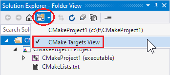

# Configure CMake debugging sessions

::: moniker range="vs-2015"

Native CMake support is available in Visual Studio 2017 and later.

::: moniker-end

::: moniker range=">=vs-2017"

All executable CMake targets are shown in the **Startup Item** dropdown in the **General** toolbar. Select one to start a debugging session and launch the debugger.


You can also start a debug session from Solution Explorer. First, switch to **CMake Targets View** in the **Solution Explorer** window.



Then, right-click on any executable and select **Debug**. This automatically starts debugging the selected target, based on your active configuration. 

## Customize debugger settings

You can customize the debugger settings for any executable CMake target in your project in a configuration file called *launch.vs.json* located in a *.vs* folder in your project root. For most debugging scenarios, creating a launch configuration file is beneficial because it allows you to configure and save debugging setup details. There are three entry points to this file:

- Select **Debug > Debug and Launch Settings for ${activeDebugTarget}** from the main menu to edit the debug configuration specific to your active debug target. If you don't have a debug target selected, this option will be grayed out. 

- Navigate to **Targets View** in Solution Explorer. Then, right-click on a debug target and select **Add Debug Configuration** to edit the debug configuration specific to the selected target. 

- Right-click on a root CMakeLists.txt and select **Add  Debug Configuration** to open the **Select a Debugger** dialog box. The dialog allows you to add any type of debug configuration, but you must manually specify the CMake target to invoke via the `projectTarget` property.

When you save the *launch.vs.json* file, Visual Studio creates an entry for the new name in the **Startup Item** dropdown. You can edit the *launch.vs.json* file to create multiple debug configurations, for any number of CMake targets.

## Reference keys in CMakeSettings.json

To reference any key in a *CMakeSettings.json* file, preface it with `cmake.` in *launch.vs.json*. The following example shows a simple *launch.vs.json* file that pulls in the value of the `remoteCopySources` key in the *CMakeSettings.json* file for the currently selected configuration:

```json
{
  "version": "0.2.1",
  "defaults": {},
  "configurations": [
    {
      "type": "default",
      "project": "CMakeLists.txt",
      "projectTarget": "CMakeHelloWorld.exe (Debug\\CMakeHelloWorld.exe)",
      "name": "CMakeHelloWorld.exe (Debug\\CMakeHelloWorld.exe)",
      "args": ["${cmake.remoteCopySources}"]
    }
  ]
}
```
**Environment variables** defined in CMakeSettings.json can also be used in launch.vs.json using the syntax `${env.VARIABLE_NAME}`. In Visual Studio 2019 version 16.4 and later, debug targets are automatically launched with the environment you specify in CMakeSettings.json. You can unset an environment variable by setting it to **null**. 

## Launch.vs.json reference

There are many *launch.vs.json* properties to support all your debugging scenarios. The following properties are common to all debug configurations, both remote and local:

- `projectTarget`: Specifies the CMake target to invoke when building the project. Visual Studio autopopulates this property if you enter *launch.vs.json* from **Debug > Debug and Launch Settings for ${activeDebugTarget}** or **Targets View**.

- `env`: Additional environment variables to add with the syntax:

```json
  "env": {
        "DEBUG_LOGGING_LEVEL": "trace;info"
        "ENABLE_TRACING": "true"
      }
```

- `args`: Command-line arguments passed to the program to debug.

## Launch.vs.json reference for remote projects and WSL

In Visual Studio 2019 version 16.6 we added a new debug configuration of `type: cppgdb` to simplify debugging with **gdb** and **gdbserver** on a remote system or WSL. Old debug configurations of `type: cppdbg` are still supported.

### Configuration type `cppgdb`

- `name`: A friendly name to identify the configuration in the **Startup Item** dropdown. 
- `project`: Specifies the relative path to the project file. You shouldn't need to change this when debugging a CMake project. 
- `projectTarget`: Specifies the CMake target to invoke when building the project. Visual Studio autopopulates this property if you enter *launch.vs.json* from **Debug > Debug and Launch Settings for ${activeDebugTarget}** or **Targets View**. This value must match the name of an existing debug target listed in the **Startup Item** dropdown. 
- `debuggerConfiguration`: Indicates which set of debugging default values to use. Valid options are **gdb** and **gdbserver**. 
- `args`: Command-line arguments passed on startup to the program being debugged.
- `env`: Additional environment variables passed to the program being debugged. For example, `{"DISPLAY": "0.0"}`.
- `processID`: Linux process ID to attach to. Only used when attaching to a remote process.

#### Additional options allowed with the `gdb` configuration

- `program`: Defaults to `"${debugInfo.fullTargetPath}"`. The Unix path to the application to debug. Only required if different than the target executable in the build or deploy location.
- `remoteMachineName`: Defaults to `"${debugInfo.remoteMachineName}"`. Name of the remote system that hosts the program to debug. Only required if different than the build system. Must have an existing entry in the [Connection Manager](../linux/connect-to-your-remote-linux-computer.md). Press **Ctrl+Space** to view a list of all existing remote connections.
- `cwd`: Defaults to `"${debugInfo.defaultWorkingDirectory}"`. The Unix path to the directory on the remote system where `program` is run. The directory must exist. 
- `gdbpath`: Defaults to `/usr/bin/gdb`. Full Unix path to the gdb used to debug. Only required if using a custom version of gdb.
- `preDebugCommand`: A Linux command to run immediately before invoking gdb. Gdb will not start until it completes. You can use this to run a script before the execution of gdb. 

#### Additional options allowed with the `gdbserver` configuration


The following properties are specific to **remote debug configurations**. You can also [execute custom gdb commands](https://github.com/microsoft/MIEngine/wiki/Executing-custom-gdb-lldb-commands) to send commands directly to the underlying debugger, and [enable MIEngine logging](https://github.com/microsoft/MIEngine/wiki/Logging) to see what commands get sent to gdb, what output gdb returns, and how long each command takes.

- `cwd`: Current working directory for finding dependencies and other files on the remote machine. The macro `${debugInfo.defaultWorkingDirectory}` can be used. The default value is the remote workspace root unless overridden in *CMakeLists.txt*. This property is only used for remote configurations; `currentDir` is used to set the current directory of the launching app for a local project.

- `environment`: Additional environment variables to add to the environment for the program with this syntax:

```json
  "environment": [
      {
        "name": "ENV1",
        "value": "envvalue1"
      },
      {
        "name": "ENV2",
        "value": "envvalue2"
      }
    ]
```

- `pipeArgs`: Command-line arguments passed to the pipe program to configure the connection. The pipe program is used to relay standard input/output between Visual Studio and gdb. The command `${debuggerCommand}` launches gdb on the remote system, and can be modified to:

  - Export the value of the environment variable DISPLAY on your Linux system. In the following example, this value is `:1`.

  ```json
  "pipeArgs": [
      "/s",
      "${debugInfo.remoteMachineId}",
      "/p",
      "${debugInfo.parentProcessId}",
      "/c",
      "export DISPLAY=:1;${debuggerCommand}",
      "--tty=${debugInfo.tty}"
    ],
  ```

  - Run a script before the execution of gdb. Ensure execute permissions are set on your script.

    ```json
    "pipeArgs": [
        "/s",
        "${debugInfo.remoteMachineId}",
        "/p",
        "${debugInfo.parentProcessId}",
        "/c",
        "/path/to/script.sh;${debuggerCommand}",
        "--tty=${debugInfo.tty}"
      ],
    ```

- `stopOnEntry`: A boolean that specifies whether to break as soon as the process is launched. The default is false.

- `visualizerFile`: A [.natvis file](/visualstudio/debugger/create-custom-views-of-native-objects) to use when debugging this process. This option is incompatible with gdb pretty printing. Also set `showDisplayString` when you set this property.

- `showDisplayString`: A boolean that enables the display string when a `visualizerFile` is specified. Setting this option to `true` can cause slower performance during debugging.

- `setupCommands`: One or more gdb command(s) to execute, to set up the underlying debugger.

- `externalConsole`: A boolean that specifies whether a console is launched for the debuggee.

- `miDebuggerPath`: The full path to gdb. When unspecified, Visual Studio searches PATH first for the debugger.

::: moniker-end

::: moniker range="vs-2017"

- `remoteMachineName`: The remote Linux system that hosts gdb and the program to debug.

::: moniker-end

::: moniker range="vs-2019"

The following properties can be used to separate your **remote build system** from your **remote debug system**. For more information, see [Specify different machines for building and debugging](../linux/deploy-run-and-debug-your-linux-project.md#cmake-projects).

- `remoteMachineName`: The remote Linux system that hosts gdb and the program to debug. This entry doesn't need to match the remote Linux system used for build specified in *CMakeSettings.json*. Press **Ctrl+Space** to view a list of all remote connections stored in the [Connection Manager](../linux/connect-to-your-remote-linux-computer.md).

- `disableDeploy`: Indicates whether build/debug separation is disabled. When enabled, this feature allows build and debug to occur on two separate machines.

- `deployDirectory`: The directory on the remote debug machine (specified by `remoteMachineName`) that the executable will be copied to.

- `deploy`: An array of advanced deployment settings. You only need to configure these settings when you want more granular control over the deployment process. By default, only the files necessary for the process to debug will be deployed to the remote debug machine.

  - `sourceMachine`: The machine from which the file or directory will be copied. Press **Ctrl+Space** to view a list of all the remote connections stored in the Connection Manager.

  - `targetMachine`: The machine to which the file or directory will be copied. Press **Ctrl+Space** to view a list of all the remote connections stored in the Connection Manager.

  - `sourcePath`: The file or directory location on `sourceMachine`.

  - `targetPath`: The file or directory location on `targetMachine`.

  - `deploymentType`: A description of the deployment type. `LocalRemote` and `RemoteRemote` are supported. `LocalRemote` means copying from the local file system to the remote system specified by `remoteMachineName` in *launch.vs.json*. `RemoteRemote` means copying from the remote build system specified in *CMakeSettings.json* to the different remote system specified in *launch.vs.json*.

  - `executable`: Indicates whether the deployed file is an executable.

::: moniker-end

::: moniker range=">=vs-2017"

## Attach to a remote process

You can attach to a process running on your Linux system by setting `processId` to the Process ID to attach the debugger to. For more information, see [Troubleshoot attaching to processes using GDB](https://github.com/Microsoft/MIEngine/wiki/Troubleshoot-attaching-to-processes-using-GDB).

::: moniker-end

::: moniker range="vs-2019"

## Debug on Linux using gdbserver

Visual Studio 2019 version 16.5 Preview 1 or later supports the remote debugging of CMake projects with gdbserver. For more information, see [debugging Linux CMake projects with gdbserver](https://devblogs.microsoft.com/cppblog/debugging-linux-cmake-projects-with-gdbserver/).

::: moniker-end

::: moniker range=">=vs-2017"

## See also

[CMake projects in Visual Studio](cmake-projects-in-visual-studio.md)\
[Configure a Linux CMake project](../linux/cmake-linux-project.md)\
[Connect to your remote Linux computer](../linux/connect-to-your-remote-linux-computer.md)\
[Customize CMake build settings](customize-cmake-settings.md)\
[Configure CMake debugging sessions](configure-cmake-debugging-sessions.md)\
[Deploy, run, and debug your Linux project](../linux/deploy-run-and-debug-your-linux-project.md)\
[CMake predefined configuration reference](cmake-predefined-configuration-reference.md)

::: moniker-end
