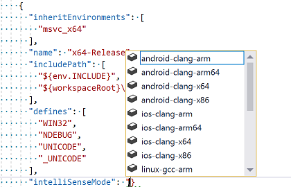
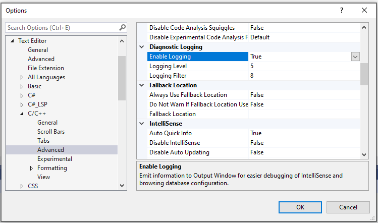

# CppProperties.json reference

Open Folder projects that don't use CMake can store project configuration settings for IntelliSense in a *CppProperties.json* file. (CMake projects use a [CMakeSettings.json](customize-cmake-settings.md) file.) A configuration consists of name/value pairs and defines #include paths, compiler switches, and other parameters. See [Open Folder projects for C++](open-folder-projects-cpp.md) for more information about how to add configurations in an Open Folder project. The following sections summarize the various settings. For a complete description of the schema, navigate to *CppProperties_schema.json*, whose full path is given at the top of the code editor when *CppProperties.json* is open.

## Configuration properties

A configuration may have any of the following properties:

|Name|Description|
|-|-|
|`inheritEnvironments`| Specifies which environments apply to this configuration.|
|`name`|The configuration name that will appear in the C++ configuration dropdown|
|`includePath`|A comma-separated list of folders that should be specified in the include path (maps to /I for most compilers)|
|`defines`|The list of macros that should be defined (maps to /D for most compilers)|
|`compilerSwitches`|One or more additional switches that can influence IntelliSense behavior|
|`forcedInclude`|Header to be automatically included in every compilation unit (maps to /FI for MSVC or -include for clang)|
|`undefines`|The list of macros to be undefined (maps to /U for MSVC)|
|`intelliSenseMode`|The IntelliSense engine to be used. You can specify one of the predefined architecture-specific variants for MSVC, gcc, or Clang.|
|`environments`|User-defined sets of variables that behave like environment variables in a command prompt and are accessed with the ${env.\<VARIABLE>} macro.|

### intelliSenseMode values

The code editor shows the available options when you start to type:



These are the supported values:

- windows-msvc-x86
- windows-msvc-x64
- windows-msvc-arm
- windows-msvc-arm64
- android-clang-x86
- android-clang-x64
- android-clang-arm
- android-clang-arm64
- ios-clang-x86
- ios-clang-x64
- ios-clang-arm
- ios-clang-arm64
- windows-clang-x86
- windows-clang-x64
- windows-clang-arm
- windows-clang-arm64
- linux-gcc-x86
- linux-gcc-x64
- linux-gcc-arm

Note: The values `msvc-x86` and `msvc-x64` are supported for legacy reasons only. Use the `windows-msvc-*` variants instead.

## Pre-defined Environments

Visual Studio provides the following predefined environments for Microsoft C++ which map to the corresponding Developer Command Prompt. When you inherit one of these environments, you can refer to any of the environment variables by using the global property `env` with this macro syntax: ${env.\<VARIABLE>}.

|Variable Name|Description|
|-----------|-----------------|
|vsdev|The default Visual Studio environment|
|msvc_x86|Compile for x86 using x86 tools|
|msvc_x64|Compile for AMD64 using 64-bit tools|
|msvc_arm|Compile for ARM using x86 tools|
|msvc_arm64|Compile for ARM64 using x86 tools|
|msvc_x86_x64|Compile for AMD64 using x86 tools|
|msvc_arm_x64|Compile for ARM using 64-bit tools|
|msvc_arm64_x64|Compile for ARM64 using 64-bit tools|

When the Linux workload is installed, the following environments are available for remotely targeting Linux and WSL:

|Variable Name|Description|
|-----------|-----------------|
|linux_x86|Target x86 Linux remotely|
|linux_x64|Target x64 Linux remotely|
|linux_arm|Target ARM Linux remotely|

## <a name="user_defined_environments"></a> User-defined environments

You can optionally use the `environments` property to define sets of variables in *CppProperties.json* either globally or per-configuration. These variables behave like environment variables in the context of an Open Folder project and can be accessed with the ${env.\<VARIABLE>} syntax from *tasks.vs.json* and *launch.vs.json* after they are defined here. However, they are not necessarily set as actual environment variables in any command prompt that Visual Studio uses internally.

**Visual Studio 2019 version 16.4 and later:** Configuration-specific variables defined in *CppProperties.json* are automatically picked up by debug targets and tasks without the need to set `inheritEnvironments`. Debug targets are launched automatically with the environment you specify in *CppProperties.json*.

**Visual Studio 2019 version 16.3 and earlier:** When you consume an environment, then you have to specify it in the `inheritsEnvironments` property even if the environment is defined as part of the same configuration; the `environment` property specifies the name of the environment. The following example shows a sample configuration for enabling IntelliSense for GCC in an MSYS2 installation. Note how the configuration both defines and inherits the `mingw_64` environment, and how the `includePath` property can access the `INCLUDE` variable.

```json
"configurations": [
    {

      "inheritEnvironments": [
        "mingw_64"
      ],
      "name": "Mingw64",
      "includePath ,": [
        "${env.INCLUDE}",
        "${workspaceRoot}\\**",
      ],
      "intelliSenseMode": "linux-gcc-x64",
      "environments": [
        {
          "MINGW64_ROOT": "C:\\msys64\\mingw64",
          "BIN_ROOT": "${env.MINGW64_ROOT}\\bin",
          "FLAVOR": "x86_64-w64-mingw32",
          "TOOLSET_VERSION": "9.1.0",
          "PATH": "${env.MINGW64_ROOT}\\bin;${env.MINGW64_ROOT}\\..\\usr\\local\\bin;${env.MINGW64_ROOT}\\..\\usr\\bin;${env.MINGW64_ROOT}\\..\\bin;${env.PATH}",
          "INCLUDE": "${env.MINGW64_ROOT}\\include\\c++\\${env.TOOLSET_VERSION};${env.MINGW64_ROOT}\\include\\c++\\${env.TOOLSET_VERSION}\\tr1;${env.MINGW64_ROOT}\\include\\c++\\${env.TOOLSET_VERSION}\\${env.FLAVOR};",
          "environment": "mingw_64"
        }
      ]
    }
  ]
```

When you define an **environments** property inside a configuration, it overrides any global variables of the same name.

## Built-in macros

You have access to the following built-in macros inside *CppProperties.json*:

|Macro|Description|
|-|-|
|`${workspaceRoot}`| The full path to the workspace folder|
|`${projectRoot}`| The full path to the folder where *CppProperties.json* is placed|
|`${env.vsInstallDir}`| The full path to the folder where the running instance of Visual Studio is installed|

### Example

If your project has an include folder and also includes *windows.h* and other common headers from the Windows SDK, you may want to update your *CppProperties.json* configuration file with the following includes:

```json
{
  "configurations": [
    {
      "name": "Windows",
      "includePath": [
        // local include folder
        "${workspaceRoot}\include",
        // Windows SDK and CRT headers
        "${env.WindowsSdkDir}\include\${env.WindowsSDKVersion}\ucrt",
        "${env.NETFXSDKDir}\include\um",
        "${env.WindowsSdkDir}\include\${env.WindowsSDKVersion}\um",
        "${env.WindowsSdkDir}\include\${env.WindowsSDKVersion}\shared",
        "${env.VCToolsInstallDir}\include"
      ]
    }
  ]
}
```

> [!Note]
> `%WindowsSdkDir%` and `%VCToolsInstallDir%` are not set as global environment variables so make sure you start devenv.exe from a Developer Command Prompt that defines these variables. (Type "developer" in the Windows Start Menu.)

## Troubleshoot IntelliSense errors

If you are not seeing the IntelliSense that you expect, you can troubleshoot by going to **Tools** > **Options** > **Text Editor** > **C/C++** > **Advanced** and setting **Enable Logging** to **`true`**. To start with, try setting **Logging Level** to 5, and **Logging Filters** to 8.



Output is piped to the **Output Window** and is visible when you choose **Show Output From: Visual C++ Log**. The output contains, among other things, the list of actual include paths that IntelliSense is trying to use. If the paths do not match the ones in *CppProperties.json*, try closing the folder and deleting the *.vs* sub-folder which contains cached browsing data.

To troubleshoot IntelliSense errors caused by missing include paths, open the **Error List** and filter its output to "IntelliSense only" and error code E1696 "cannot open source file ...".
