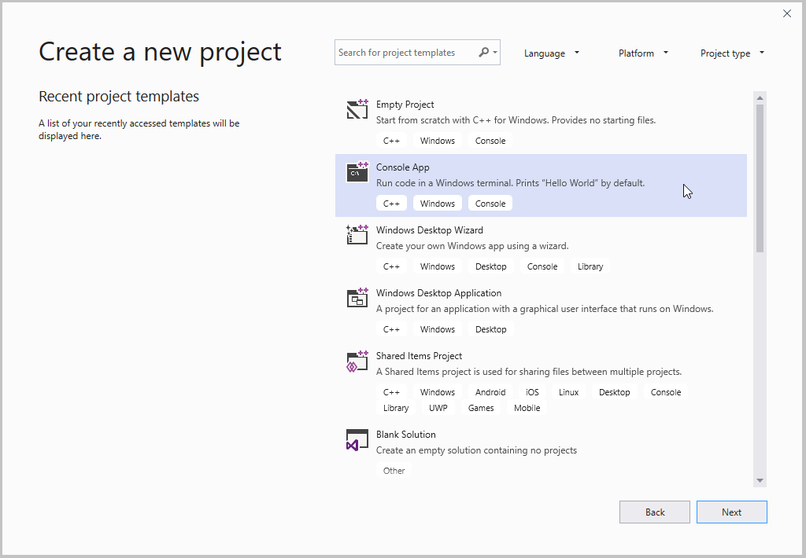

# Visual Studio projects - C++

A *Visual Studio project* is a collection of code files and assets such as icons, images, and so on, that are built together using the MSBuild build system. MSBuild is the native build system for Visual Studio and is generally the best build system to use for Windows-specific programs. MSBuild is tightly integrated with Visual Studio, but you can also use it from the command line.

For information about upgrading MSBuild projects from older versions of Visual Studio, see the [Microsoft C++ Porting and Upgrading Guide](../porting/visual-cpp-porting-and-upgrading-guide.md).

For cross-platform projects, or projects that use open-source libraries, we recommend using [CMake projects in Visual Studio](cmake-projects-in-visual-studio.md) in Visual Studio 2017 and later.

## Create a Visual Studio C++ project

::: moniker range=">=msvc-160"

1. Create a C++ project by choosing **File** > **New** > **Project**.
1. In the **Create a new project** dialog, set the **Language** dropdown to **C++**. This filters the list of project templates to C++ projects. You can filter the templates by setting the **Platform**, **Project Type**, or by entering keywords in the search box.

   

1. Select a project template, then choose **Next**.
1. On the **Configure your new project page**, enter project-specific settings such as the project name or location and then choose **Create** to create your project.

::: moniker-end

::: moniker range="msvc-150"

1. Create a C++ project by choosing **File** > **New** > **Project**.
1. Choose **Visual C++** in the left pane. In the center pane, a list of project templates appears:

   

::: moniker-end

For more information about the default project templates included in Visual Studio, see [C++ project templates in Visual Studio](reference/visual-cpp-project-types.md).

You can create your own project templates. For more information, see [How to: Create project templates](/visualstudio/ide/how-to-create-project-templates).

After you create a project, it appears in the [Solution Explorer](/visualstudio/ide/solutions-and-projects-in-visual-studio) window:

   

When you create a new project, a solution file (.sln) is also created. A *Visual Studio solution* is a collection of one or more projects. You can add another project to the solution by right-clicking the solution name in **Solution Explorer** > **Add** > **New project**.

The solution file coordinates build dependencies when you have multiple related projects. Compiler options are set at the project level.

## Add code, icons, and other assets to a project

Add source code files, icons, or any other items to your project by right-clicking on the project in **Solution Explorer** and choosing **Add > New** or **Add > Existing**.

## Add third-party libraries to a project

Over 900 C++ open source libraries are available via the [vcpkg](https://vcpkg.io/) package manager. Run the Visual Studio integration step to set up the paths to that library when you reference it from any Visual Studio project.

There are also commercial third-party libraries that you can install. Follow their installation instructions.

## Set compiler options and build properties

To configure build settings for a project, right-click on the project in **Solution Explorer** and choose **Properties**. For more information, see [Set C++ compiler and build properties in Visual Studio](working-with-project-properties.md).

## Compile and run a project

To compile and run the new project, press **F5** or click the *debug dropdown* with the green arrow on the main toolbar. The *configuration dropdown* is where you choose whether to perform a *Debug* or *Release* build (or some other custom configuration).

A new project compiles without errors. When adding your own code, you may occasionally introduce an error or trigger a warning. An error prevents the build from completing; a warning doesn't. All errors and warnings appear both in the Output Window and in the Error List when you build the project.

   

In the **Error List**, you can press **F1** on the highlighted error to go to its documentation topic.

## See also

[Create a project from existing code](how-to-create-a-cpp-project-from-existing-code.md)\
[Set C++ compiler and build properties in Visual Studio](working-with-project-properties.md)\
[Custom build steps and build events](understanding-custom-build-steps-and-build-events.md)\
[Reference libraries and components at build time](adding-references-in-visual-cpp-projects.md)\
[Organize project output files](how-to-organize-project-output-files-for-builds.md)\
[Projects and build systems](projects-and-build-systems-cpp.md)\
[Microsoft C++ porting and upgrade guide](../porting/visual-cpp-porting-and-upgrading-guide.md)
