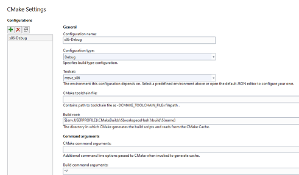
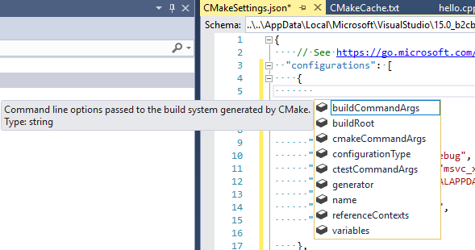
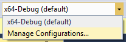
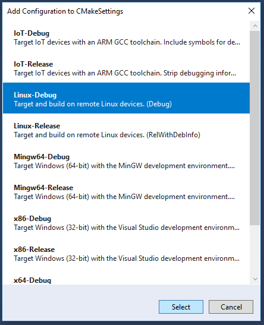
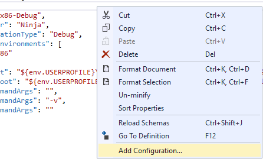

# Customize CMake build settings

::: moniker range="vs-2019"

In Visual Studio 2019 and later, you can add configurations and customize their settings by using the **CMake settings editor**. The editor is intended to be a simpler alternative to manually editing the CMakeSettings.json file, but if you prefer to edit the file directly, you can click the **Edit JSON** link in the upper right of the editor. 

To open the editor, click on the **Configuration** drop-down in the main toolbar and choose **Manage Configurations**.


Now you see the **Settings Editor** with the installed configurations on the left. 



Visual Studio provides two configurations by default: `x64-Debug` and `x86-Debug`. You can add additional configurations by clicking the green plus sign.The settings that you see in the editor might vary depending on which configuration is selected.

The options that you choose in the editor are written to a file called CMakeSettings.json. This file provides command-line arguments and environment variables that are passed to CMake when you build the projects. Visual Studio never modifies CMakeLists.txt automatically; by using CMakeSettings.json you can customize the build through Visual Studio while leaving the CMake project files untouched so that others on your team can consume them with whatever tools they are using.

## CMake General Settings

The following settings are available under the **General** heading:

### Configuration name

Corresponds to the **name** setting. This is the name that appears in the C++ configuration dropdown. You can use the `${name}` macro to compose other property values such as paths.


### Configuration type

Corresponds to the **configurationType** setting. Defines the build configuration type for the selected generator. Currently supported values are "Debug", "MinSizeRel", "Release", and "RelWithDebInfo".

### Toolset

Corresponds to the **inheritedEnvironments** setting. Defines the compiler environment that will be used to build the selected configuration. Supported values depend on the type of configuration. To create a custom environment, click the **Edit JSON** link in the upper right corner of the Settings editor and edit the CMakeSettings.json file directly.

### CMake toolchain file

Path to the CMake toolchain file. Will be passed to CMake as "-DCMAKE_TOOLCHAIN_FILE = \<filepath>".

### Build root

Corresponds to **buildRoot**. Maps to **-DCMAKE_BINARY_DIR** switch and specifies where the CMake cache will be created. If the folder does not exist, it is created.

## Command arguments

The following settings are available under the **Command arguments** heading:

### CMake command arguments

Corresponds to **cmakeCommandArgs**. Specifies any additional switches you want to pass to CMake.exe.

### Build command arguments

Corresponds to **buildCommandArgs**: specifies additional switches to pass to the underlying build system. For example, passing -v when using the Ninja generator forces Ninja to output command lines.


### CTest command arguments

Corresponds to**ctestCommandArgs**: specifies additional switches to pass to CTest when running tests.

## General settings for remote builds

For configurations such as Linux that use remote builds, the following settings are also available:

### rsync command arguments

Provide any command arguments to be passed to rsync. 

## CMake variables and cache

These settings enable you to set CMake variables and save them in CMakeSettings.json. They will be passed to CMake at build time and will override whatever values might be in the CMakeLists.txt file. You can use this section in the same way that you might use the CMakeGUI to view a list of all the CMake variables available to edit. Click the **Save and generate cache** button to view a list of all CMake variables available to edit, including advanced variables (per the CMakeGUI). You can filter the list by variables name. 

Corresponds to **variables**: contains a name-value pair of CMake variables that will get passed as **-D** *_name_=_value_* to CMake. If your CMake project build instructions specify the addition of any variables directly to the CMake cache file, it is recommended that you add them here instead.

## Advanced settings

### CMake generator

Corresponds to **generator**: maps to the CMake **-G** switch and specifies the generator to be used. This property can also be used as a macro, `${generator}`, when composing other property values. Visual Studio currently supports the following CMake generators:

  - "Ninja"
  - "Unix Makefiles"
  - "Visual Studio 16 2019"
  - "Visual Studio 16 2019 Win64"
  - - "Visual Studio 16 2019 ARM"
  - "Visual Studio 15 2017"
  - "Visual Studio 15 2017 Win64"
  - "Visual Studio 15 2017 ARM"
  - "Visual Studio 14 2015"
  - "Visual Studio 14 2015 Win64"
  - "Visual Studio 14 2015 ARM"
  
  Because Ninja is designed for fast build speeds instead of flexibility and function, it is set as the default. However, some CMake projects may be unable to correctly build using Ninja. If this occurs, you can instruct CMake to generate a Visual Studio project instead.

### IntelliSense mode

For accurate IntelliSense, set this to the appropriate value for your project.

### Install directory

The directory in which CMake installs the targets that it builds.

### CMake executable

The full path to the CMake executable, including file name and extension. For remote builds, specify the CMake location on the remote machine.

For configurations such as Linux that use remote builds, the following settings are also available:

### Remote CMakeLists.txt root

The directory on the remote machine that contains the root CMakeLists.txt file.

### Remote install root

The directory on the remote machine in which CMake installs targets.

### Remote copy sources

Specifies whether to copy source files to the remote machine and enables you to specify whether to yse rsync or sftp. 

## Directly edit CMakeSettings.json

You can also directly edit  `CMakeSettings.json` to create custom configurations. The **Settings Editor** has an **Edit JSON** button in the upper right that opens the file for editing. 

The following example shows a sample configuration, which you can use as a starting point:

```json
    {
      "name": "x86-Debug",
      "generator": "Ninja",
      "configurationType": "Debug",
      "inheritEnvironments": [ "msvc_x86" ],
      "buildRoot": "${env.USERPROFILE}\\CMakeBuilds\\${workspaceHash}\\build\\${name}",
      "installRoot": "${env.USERPROFILE}\\CMakeBuilds\\${workspaceHash}\\install\\${name}",
      "cmakeCommandArgs": "",
      "buildCommandArgs": "-v",
      "ctestCommandArgs": ""
    },

```

JSON IntelliSense helps you edit the `CMakeSettings.json` file:

   

The JSON editor will also inform you when you choose incompatible settings.

For more information about each of the properties in the file, see [CMakeSettings.json schema reference](cmakesettings-reference.md).

::: moniker-end

::: moniker range="<=vs-2017"

Visual Studio 2017 provides several CMake configurations that define how CMake.exe is invoked to create the CMake cache for a given project. To add a new configuration, click the configuration drop-down in the toolbar and choose **Manage Configurations**:

   

You can choose from the list of predefined configurations:

   

The first time you select a configuration, Visual Studio creates a  `CMakeSettings.json` file in your project's root folder. This file is used to re-create the CMake cache file, for example after a **Clean** operation. 

To add an additional configuration, right click  `CMakeSettings.json` and choose **Add Configuration**. 

   

You can also edit the file using the **CMake Settings Editor**. Right click on `CMakeSettings.json` in **Solution Explorer** and choose **Edit CMake Settings**. Or, select **Manage Configurations** from the configuration drop-down at the top of the editor window. 

You can also directly edit  `CMakeSettings.json` to create custom configurations The following example shows a sample configuration, which you can use as a starting point:

```json
    {
      "name": "x86-Debug",
      "generator": "Ninja",
      "configurationType": "Debug",
      "inheritEnvironments": [ "msvc_x86" ],
      "buildRoot": "${env.USERPROFILE}\\CMakeBuilds\\${workspaceHash}\\build\\${name}",
      "installRoot": "${env.USERPROFILE}\\CMakeBuilds\\${workspaceHash}\\install\\${name}",
      "cmakeCommandArgs": "",
      "buildCommandArgs": "-v",
      "ctestCommandArgs": ""
    },

```

JSON IntelliSense helps you edit the  `CMakeSettings.json` file:

   

For more information about each of the properties in the file, see [CMakeSettings.json schema reference](cmakesettings-reference.md).

::: moniker-end

## See also

[CMake Projects in Visual Studio](cmake-projects-in-visual-studio.md)<br/>
[Configure a Linux CMake project](../linux/cmake-linux-project.md)<br/>
[Connect to your remote Linux computer](../linux/connect-to-your-remote-linux-computer.md)<br/>
[Configure CMake debugging sessions](configure-cmake-debugging-sessions.md)<br/>
[Deploy, run, and debug your Linux project](../linux/deploy-run-and-debug-your-linux-project.md)<br/>
[CMake predefined configuration reference](cmake-predefined-configuration-reference.md)<br/>
