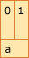
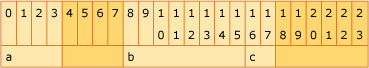

# Examples of Structure Alignment

The following four examples each declare an aligned structure or union, and the corresponding figures illustrate the layout of that structure or union in memory. Each column in a figure represents a byte of memory, and the number in the column indicates the displacement of that byte. The name in the second row of each figure corresponds to the name of a variable in the declaration. The shaded columns indicate padding that is required to achieve the specified alignment.

## Example 1

```C
// Total size = 2 bytes, alignment = 2 bytes (word).

_declspec(align(2)) struct {
    short a;      // +0; size = 2 bytes
}
```



## Example 2

```C
// Total size = 24 bytes, alignment = 8 bytes (quadword).

_declspec(align(8)) struct {
    int a;       // +0; size = 4 bytes
    double b;    // +8; size = 8 bytes
    short c;     // +16; size = 2 bytes
}
```



## Example 3

```C
// Total size = 22 bytes, alignment = 4 bytes (doubleword).

_declspec(align(4)) struct {
    char a;       // +0; size = 1 byte
    short b;      // +2; size = 2 bytes
    char c;       // +4; size = 1 byte
    int d;        // +8; size = 4 bytes
}
```


## Example 4

```C
// Total size = 8 bytes, alignment = 8 bytes (quadword).

_declspec(align(8)) union {
    char *p;      // +0; size = 8 bytes
    short s;      // +0; size = 2 bytes
    long l;       // +0; size = 4 bytes
}
```


## See also

[Types and Storage](../build/types-and-storage.md)<br/>
