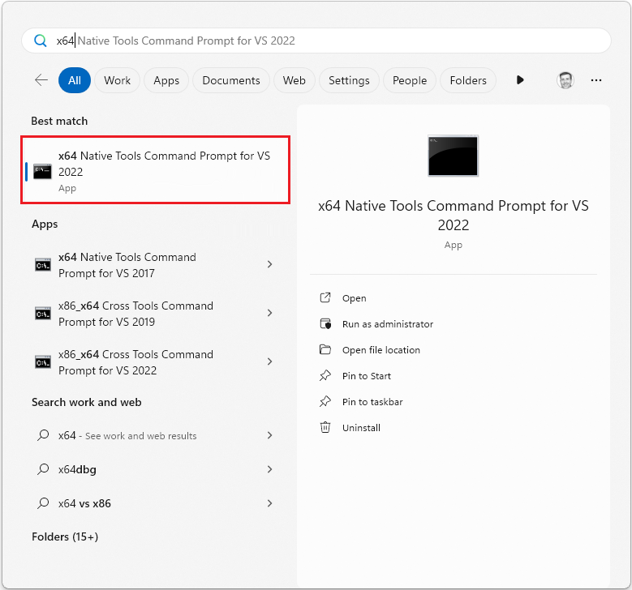

# How to: Enable a 64-Bit, x64 hosted MSVC toolset on the command line

Visual Studio includes C++ compilers, linkers, and other tools that you can use to create platform-specific versions of your apps that can run on 32-bit, 64-bit, or ARM-based Windows operating systems. Other optional Visual Studio workloads let you use C++ tools to target other platforms, such as iOS, Android, and Linux. The default build architecture uses 32-bit, x86-hosted tools to build 32-bit, x86-native Windows code. However, you probably have a 64-bit computer. When Visual Studio is installed on a 64-bit Windows operating system, additional developer command prompt shortcuts for the 64-bit, x64-hosted native and cross compilers are available. You can take advantage of the processor and memory space available to 64-bit code by using the 64-bit, x64-hosted toolset when you build code for x86, x64, or ARM processors.

## Use a 64-bit hosted developer command prompt shortcut

To access these command prompts on Windows 10, on the **Start** menu, open the folder for your version of Visual Studio, for example **Visual Studio 2019**, and then choose one of the x64 native or cross-tool developer command prompts.

To access these command prompts on Windows 8, on the **Start** screen, open **All apps**. Under the heading for the installed version of Visual Studio, open the **Visual Studio** folder (in older versions of Visual Studio, it may be named **Visual Studio Tools**). On earlier versions of Windows, choose **Start**, expand **All Programs**, the folder for your version of **Visual Studio** (and on older versions of Visual Studio, **Visual Studio Tools**). For more information, see [Developer command prompt shortcuts](building-on-the-command-line.md#developer_command_prompt_shortcuts).

## Use Vcvarsall.bat to set a 64-bit hosted build architecture

Any of the native or cross compiler tools build configurations can be used on the command line by running the vcvarsall.bat command file. This command file configures the path and environment variables that enable a particular build architecture in an existing command prompt window. For specific instructions, see [Developer command file locations](building-on-the-command-line.md#developer_command_file_locations).

## Remarks

> [!NOTE]
> For information about the specific tools that are included with each Visual Studio edition, see [Visual C++ Tools and Features in Visual Studio Editions](../overview/visual-cpp-tools-and-features-in-visual-studio-editions.md).
>
> For information about how to use the Visual Studio IDE to create 64-bit applications, see [How to: Configure Visual C++ Projects to Target 64-Bit, x64 Platforms](how-to-configure-visual-cpp-projects-to-target-64-bit-platforms.md).

When you install a C++ workload in the Visual Studio installer, it always installs 32-bit, x86-hosted, native and cross compiler tools to build x86 and x64 code. If you include the Universal Windows Platform workload, it also installs x86-hosted cross compiler tools to build ARM code. If you install these workloads on a 64-bit, x64 processor, you also get 64-bit native and cross compiler tools to build x86, x64, and ARM code. The 32-bit and 64-bit tools generate identical code, but the 64-bit tools support more memory for precompiled header symbols and the Whole Program Optimization ([/GL](reference/gl-whole-program-optimization.md) and [/LTCG](reference/ltcg-link-time-code-generation.md)) options. If you run into memory limits when you use the 32-bit tools, try the 64-bit tools.

## See also

[Configure C++ projects for 64-bit, x64 targets](configuring-programs-for-64-bit-visual-cpp.md) 
