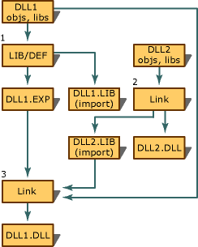

# Mutual Imports

Exporting or importing to another executable file presents complications when the imports are mutual (or circular). For example, two DLLs import symbols from each other, similar to mutually recursive functions.

The problem with mutually importing executable files (usually DLLs) is that neither can be built without building the other first. Each build process requires, as input, an import library produced by the other build process.

The solution is to use the LIB utility with the /DEF option, which produces an import library without building the executable file. Using this utility, you can build all the import libraries you need, no matter how many DLLs are involved or how complicated the dependencies are.

The general solution for handling mutual imports is:

1. Take each DLL in turn. (Any order is feasible, although some orders are more optimal.) If all the needed import libraries exist and are current, run LINK to build the executable file (DLL). This produces an import library. Otherwise, run LIB to produce an import library.

   Running LIB with the /DEF option produces an additional file with an .EXP extension. The .EXP file must be used later to build the executable file.

1. After using either LINK or LIB to build all of the import libraries, go back and run LINK to build any executable files that were not built in the previous step. Note that the corresponding .exp file must be specified on the LINK line.

   If you had run the LIB utility earlier to produce an import library for DLL1, LIB would have produced the file DLL1.exp as well. You must use DLL1.exp as input to LINK when building DLL1.dlll.

The following illustration shows a solution for two mutually importing DLLs, DLL1 and DLL2. Step 1 is to run LIB, with the /DEF option set, on DLL1. Step 1 produces DLL1.lib, an import library, and DLL1.exp. In step 2, the import library is used to build DLL2, which in turn produces an import library for DLL2's symbols. Step 3 builds DLL1, by using DLL1.exp and DLL2.lib as input. Note that an .exp file for DLL2 is not necessary because LIB was not used to build DLL2's import library.

<br/>
Linking Two DLLs with Mutual Imports

## Limitations of _AFXEXT

You can use the `_AFXEXT` preprocessor symbol for your MFC extension DLLs as long as you do not have multiple layers of MFC extension DLLs. If you have MFC extension DLLs that call or derive from classes in your own MFC extension DLLs, which then derive from the MFC classes, you must use your own preprocessor symbol to avoid ambiguity.

The problem is that in Win32, you must explicitly declare any data as **`__declspec(dllexport)`** if it is to be exported from a DLL, and **`__declspec(dllimport)`** if it is to be imported from a DLL. When you define `_AFXEXT`, the MFC headers make sure that **AFX_EXT_CLASS** is defined correctly.

When you have multiple layers, one symbol such as **AFX_EXT_CLASS** is not sufficient, because an MFC extension DLL might be exporting new classes as well as importing other classes from another MFC extension DLL. To solve this problem, use a special preprocessor symbol that indicates that you are building the DLL itself versus using the DLL. For example, imagine two MFC extension DLLs, A.dll and B.dll. They each export some classes in A.h and B.h, respectively. B.dll uses the classes from A.dll. The header files would look something like this:

```
/* A.H */
#ifdef A_IMPL
   #define CLASS_DECL_A   __declspec(dllexport)
#else
   #define CLASS_DECL_A   __declspec(dllimport)
#endif

class CLASS_DECL_A CExampleA : public CObject
{ ... class definition ... };

// B.H
#ifdef B_IMPL
   #define CLASS_DECL_B   __declspec(dllexport)
#else
   #define CLASS_DECL_B   __declspec(dllimport)
#endif

class CLASS_DECL_B CExampleB : public CExampleA
{ ... class definition ... };
...
```

When A.dll is built, it is built with `/D A_IMPL` and when B.dll is built, it is built with `/D B_IMPL`. By using separate symbols for each DLL, `CExampleB` is exported and `CExampleA` is imported when building B.dll. `CExampleA` is exported when building A.dll and imported when used by B.dll (or some other client).

This type of layering cannot be done when using the built-in **AFX_EXT_CLASS** and `_AFXEXT` preprocessor symbols. The technique described above solves this problem in a manner not unlike the mechanism MFC itself uses when building its Active technologies, Database, and Network MFC extension DLLs.

## Not Exporting the Entire Class

When you are not exporting an entire class, you have to ensure that the necessary data items created by the MFC macros are exported correctly. This can be done by redefining `AFX_DATA` to your specific class's macro. This should be done any time you are not exporting the entire class.

For example:

```
/* A.H */
#ifdef A_IMPL
   #define CLASS_DECL_A  _declspec(dllexport)
#else
   #define CLASS_DECL_A  _declspec(dllimport)
#endif

#undef  AFX_DATA
#define AFX_DATA CLASS_DECL_A

class CExampleA : public CObject
{
   DECLARE_DYNAMIC()
   CLASS_DECL_A int SomeFunction();
   //... class definition ...
};

#undef AFX_DATA
#define AFX_DATA
```

### What do you want to do?

- [Export from a DLL](exporting-from-a-dll.md)

- [Export from a DLL using .DEF files](exporting-from-a-dll-using-def-files.md)

- [Export from a DLL using __declspec(dllexport)](exporting-from-a-dll-using-declspec-dllexport.md)

- [Export and import using AFX_EXT_CLASS](exporting-and-importing-using-afx-ext-class.md)

- [Export C++ functions for use in C-language executables](exporting-cpp-functions-for-use-in-c-language-executables.md)

- [Determine which exporting method to use](determining-which-exporting-method-to-use.md)

- [Import into an application using __declspec(dllimport)](importing-into-an-application-using-declspec-dllimport.md)

### What do you want to know more about?

- [The LIB utility and the /DEF option](reference/lib-reference.md)

## See also

[Importing and Exporting](importing-and-exporting.md)
