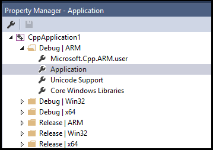

# Property inheritance in Visual Studio projects

The Visual Studio native project system is based on MSBuild. MSBuild defines file formats and rules for building projects of any kind. It manages most of the complexity of building for multiple configurations and platforms. You'll find it useful to understand how it works. That's especially important if you want to define custom configurations. Or, to create reusable sets of properties that you can share and import into multiple projects.

## The .vcxproj file, .props files and .targets files

::: moniker range="msvc-140"

Project properties are stored in several files. Some are stored directly in the *`.vcxproj`* project file. Others come from other *`.targets`* or *`.props`* files that the project file imports and which supply default values. You'll find the Visual Studio 2015 project files in a locale-specific folder under the base directory, *`%ProgramFiles(x86)%\MSBuild\Microsoft.Cpp\v4.0\v140`*.

::: moniker-end

::: moniker range="msvc-150"

Project properties are stored in several files. Some are stored directly in the *`.vcxproj`* project file. Others come from other *`.targets`* or *`.props`* files that the project file imports and which supply default values. You'll find the Visual Studio 2017 project files in a locale-specific folder under the base directory, *`%VSINSTALLDIR%Common7\IDE\VC\VCTargets\`*.

::: moniker-end

::: moniker range=">=msvc-160"

Project properties are stored in several files. Some are stored directly in the *`.vcxproj`* project file. Others come from other *`.targets`* or *`.props`* files that the project file imports and which supply default values. You'll find the Visual Studio project files in a locale-specific folder under the base directory, *`%VSINSTALLDIR%MSBuild\Microsoft\VC\<version>`*. The `<version>` is specific to the version of Visual Studio. It's *`v160`* for Visual Studio 2019.

::: moniker-end

Properties are also stored in any custom *`.props`* files that you might add to your own project. We highly recommend that you *NOT* edit those files manually. Instead, use the property pages in the IDE to modify all properties, especially the ones that participate in inheritance, unless you have a deep understanding of MSBuild and *`.vcxproj`* files.

As shown earlier, the same property for the same configuration may be assigned a different value in these different files. When you build a project, the MSBuild engine evaluates the project file and all the imported files in a well-defined order that's described later. As each file is evaluated, any property values defined in that file will override the existing values. Any values that aren't specified are inherited from files that were evaluated earlier. When you set a property with property pages, it's also important to pay attention to where you set it. If you set a property to "X" in a *`.props`* file, but the property is set to "Y" in the project file, then the project will build with the property set to "Y". If the same property is set to "Z" on a project item, such as a *`.cpp`* file, then the MSBuild engine will use the "Z" value.

Here's the basic inheritance tree:

1. Default settings from the MSBuild CPP Toolset (the *`Microsoft.Cpp.Default.props`* file in the base directory, which is imported by the *`.vcxproj`* file.)

1. Property sheets

1. *`.vcxproj`* file. (This file can override the default and property sheet settings.)

1. Items metadata

> [!TIP]
> On a property page, a property in **bold** is defined in the current context. A property in normal font is inherited.

## View an expanded project file with all imported values

Sometimes it's useful to view the expanded file to determine how a given property value is inherited. To view the expanded version, enter the following command at a Visual Studio command prompt. (Change the placeholder file names to the one you want to use.)

> **msbuild /pp:**_temp_**.txt** _myapp_**.vcxproj**

Expanded project files can be large and difficult to understand unless you're familiar with MSBuild. Here's the basic structure of a project file:

1. Fundamental project properties, which aren't exposed in the IDE.

1. Import of *`Microsoft.cpp.default.props`*, which defines some basic, toolset-independent properties.

1. Global Configuration properties (exposed as **PlatformToolset** and **Project** default properties on the **Configuration General** page. These properties determine which toolset and intrinsic property sheets are imported in *`Microsoft.cpp.props`* in the next step.

1. Import of *`Microsoft.cpp.props`*, which sets most of the project defaults.

1. Import of all property sheets, including *`.user`* files. These property sheets can override everything except the **PlatformToolset** and **Project** default properties.

1. The rest of the project configuration properties. These values can override what was set in the property sheets.

1. Items (files) together with their metadata. These items are always the last word in MSBuild evaluation rules, even if they occur before other properties and imports.

For more information, see [MSBuild Properties](/visualstudio/msbuild/msbuild-properties).

## Build configurations

A configuration is just an arbitrary group of properties that are given a name. Visual Studio provides Debug and Release configurations. Each sets various properties appropriately for a debug build or release build. You can use the **Configuration Manager** to define custom configurations. They're a convenient way to group properties for a specific flavor of build.

To get a better idea of build configurations, open **Property Manager**. You can open it by choosing **View > Property Manager** or **View > Other Windows > Property Manager**, depending on your settings. **Property Manager** has nodes for each configuration and platform pair in the project. Under each of these nodes are nodes for property sheets (*`.props`* files) that set some specific properties for that configuration.

For example, you can go to the General pane in the Property Pages. Change the Character Set property to "Not Set" instead of "Use Unicode", and then click **OK**. The Property Manager now shows no **Unicode Support** property sheet. It's removed for the current configuration, but it's still there for other configurations.

For more information about Property Manager and property sheets, see [Share or reuse Visual Studio C++ project settings](create-reusable-property-configurations.md).

> [!TIP]
> The *`.user`* file is a legacy feature. We recommend that you delete it, to keep properties correctly grouped according to configuration and platform.
