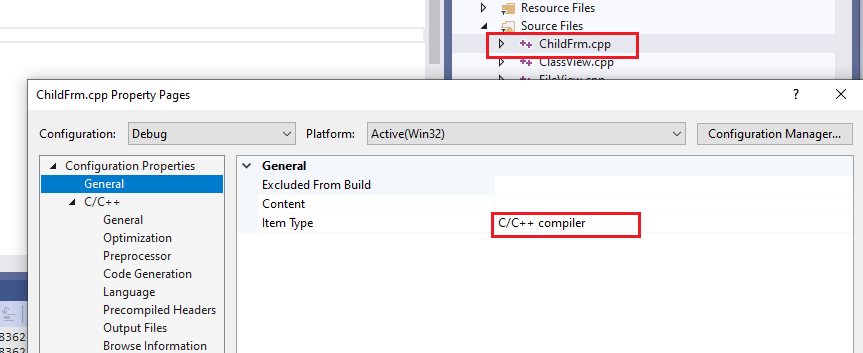

# General Property Page (File)

This topic applies to Windows projects. For non-Windows projects, see [Linux C++ Property Page Reference](../../linux/prop-pages-linux.md).

When you right-click on a file node **Solution Explorer**, the **General** property page under the **Configuration Properties** node opens. It contains the following properties:

- **Excluded From Build**

   Specifies whether the file should be in the build for the current configuration.

   To programmatically access this property, see <xref:Microsoft.VisualStudio.VCProjectEngine.VCFileConfiguration.ExcludedFromBuild%2A>.

- **Content** (Applies to UWP apps only.) Specifies whether the file contains content to be included in the app package.

- **Item Type**

   The **Item Type** specifies the tool that will be used to process the file during the build process. [Files whose extension is known to Visual Studio](/visualstudio/extensibility/visual-cpp-project-extensibility#project-items) have a default value in this property. You can specify a custom tool here if you have a custom file type or wish to override the default tool for a known file type. See [Specifying Custom Build Tools](../specifying-custom-build-tools.md) for more information. You can also use this property page to specify that a file is not part of the build process.

   The following illustration shows the property page for a *.cpp* file. The default **Item Type** for this kind of file is the **C/C++ Compiler** (*cl.exe*) and the property page exposes various compiler settings that can be applied to this file only.

   

    The following table lists the default Item Types:

    |File extension|Item Type|Default Tool|
    |-|-|-|
    |.appx|XAML Application Definition|[App packager](/windows/win32/appxpkg/make-appx-package--makeappx-exe-)|
    |.hlsl, .cso|HLSL Compiler|[fxc.exe](/windows/win32/direct3dtools/fxc)|
    |.h|C/C++ Header|[C/C++ Preprocessor](../../preprocessor/c-cpp-preprocessor-reference.md)|
    |n/a|Does not participate in build|n/a|
    |.xml, .xslt, .xsl|Xml|[XML Editor](/visualstudio/xml-tools/xml-editor)|
    |.resw, .resjson|PRI Resource (UWP Apps)|[MakePri.exe](/windows/uwp/app-resources/compile-resources-manually-with-makepri)|
    ||Media (UWP)|[App packager](/windows/win32/appxpkg/make-appx-package--makeappx-exe-)|
    |.xsd|XML Data Generator Tool|[XML Schema Definition Tool (Xsd.exe)](/dotnet/standard/serialization/xml-schema-definition-tool-xsd-exe) (Requires .NET workload. Not included with MSVC.)|
    ||Manifest Tool|[mt.exe](/windows/win32/sbscs/mt-exe)|
    |.rc|Resource|[Windows Resource Compiler (rc.exe)](/windows/win32/menurc/resource-compiler)|
    |.appxmanifest|App Package Manifest|[App packager](/windows/win32/appxpkg/make-appx-package--makeappx-exe-)|
    |.obj|Object|[C/C++ Linker (link.exe)](cl-invokes-the-linker.md)|
    |.ttf|Font|n/a|
    |.txt|Text|n/a|
    |n/a|Custom Build Tool|User-defined|
    |n/a|Copy file|n/a|
    |.packagelayout|App Package Layout|[App packager](/windows/win32/appxpkg/make-appx-package--makeappx-exe-)|
    |.resx|Compiler Managed Resource|[Resgen.exe (Resource File Generator)](/dotnet/framework/tools/resgen-exe-resource-file-generator)|
    |.natvis|C++ Debugger visualization file|[Natvis framework](/visualstudio/debugger/create-custom-views-of-native-objects)|
    |.jpg, .bmp, .ico, etc.|Image|Resource compiler based on application type.|
    |.cpp|C/C++ Compiler|cl.exe|

   To programmatically access this property, see <xref:Microsoft.VisualStudio.VCProjectEngine.VCFileConfiguration.Tool%2A>.

For information on how to access the **General** property page under the **Configuration Properties** node, see [Set C++ compiler and build properties in Visual Studio](../working-with-project-properties.md).

## See also

[C++ project property page reference](property-pages-visual-cpp.md)
