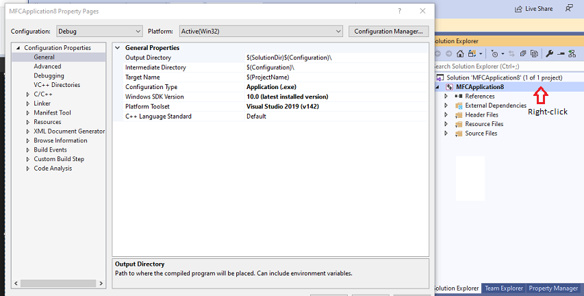

# Windows C++ project property page reference

:::moniker range="msvc-180"

In Visual Studio, you specify compiler and linker options, file paths, and other build settings through the property pages for the project. The properties and property pages that are available depend on the project type. For example, a makefile project has an NMake property page, which isn't present in a Win32 console project. To open the **Property Pages** window, choose  **Project** > **Properties** from the main menu, or right-click the project node in **Solution Explorer** and choose **Properties**. Individual files also have property pages that enable you to set compile and build options for just that file. The following image shows the property pages for a C++ console project.

:::image type="content" source="media/example-property-page.png" alt-text="Screenshot of the project Property Pages window." lightbox="media/example-property-page.png":::
:::moniker-end

:::moniker range="< msvc-180"

In Visual Studio, you specify compiler and linker options, file paths, and other build settings through the property pages for the project. The properties and property pages that are available depend on the project type. For example, a makefile project has an NMake property page, which is not present in an MFC or Win32 console project. To open the **Property Pages**, choose  **Project** > **Properties** from the main menu, or right-click on the project node in **Solution Explorer** and choose **Properties**. Individual files also have property pages that enable you to set compile and build options for just that file. The following image shows the property pages for an MFC project.

:::moniker-end

This section provides a quick reference for the property pages themselves. The options and settings exposed in the property pages are documented more completely in their own articles and are linked from the property page articles. For more information about project properties, see [Set C++ compiler and build properties in Visual Studio](../working-with-project-properties.md).

For property pages in Linux projects, see [Linux C++ Property Page Reference](../../linux/prop-pages-linux.md).

## In this section

- [General property page (project)](general-property-page-project.md)
- [General property page (file)](general-property-page-file.md)
- [Advanced property page](advanced-property-page.md)
- [Debugging property pages](debugging-prop-pages.md)
- [VC++ Directories property page](vcpp-directories-property-page.md)
- [C/C++ property pages](c-cpp-prop-page.md)
- [Linker property pages](linker-property-pages.md)
- [Manifest Tool property pages](manifest-tool-property-pages.md)
- [HLSL Property pages](hlsl-property-pages.md)
- [Command Line property pages](command-line-property-pages.md)
- [Custom Build Step property page: General](custom-build-step-property-page-general.md)
- [Adding references](../adding-references-in-visual-cpp-projects.md)
- [Managed Resources property page](managed-resources-property-page.md)
- [MIDL property pages](midl-property-pages.md)
- [NMake property page](nmake-property-page.md)
- [Resources property pages](resources-property-pages.md)
- [Web References property page](web-references-property-page.md)
- [XML Data Generator Tool property page](xml-data-generator-tool-property-page.md)
- [XML Document Generator Tool property pages](xml-document-generator-tool-property-pages.md)

## See also

- [Create and remove project dependencies](/visualstudio/ide/how-to-create-and-remove-project-dependencies)
- [Create and edit configurations](/visualstudio/ide/how-to-create-and-edit-configurations)
- [Linux C++ Property Page Reference](../../linux/prop-pages-linux.md)
