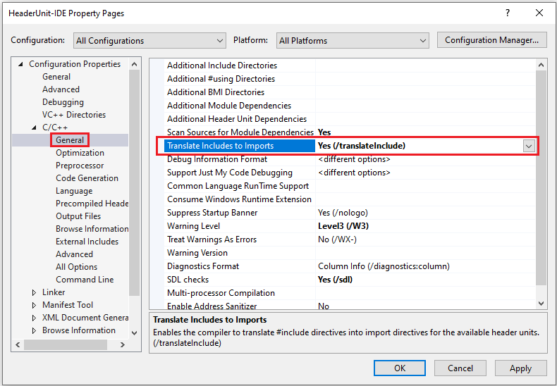

# `/translateInclude`

This switch instructs the compiler to treat `#include` as `import` for header files that have been built into header unit (`.ifc`) files and that are specified on the command line with [`/headerUnit`](headerunit.md).

When used with [`/scanDependencies`](scandependencies.md) or [`/sourceDependencies-directives`](sourcedependencies-directives.md), the compiler lists as imported header units in the generated dependency file those headers that are both included in the source and have a corresponding entry in a `header-units.json` file. This dependency info is used by the build system to generate compiled header unit `.ifc` files. Once the header units are built, they're treated by the compiler as an `import` instead of an `#include`.

The `header-units.json` file is only consulted when `/translateInclude` is specified. For more information about the format and purpose of the `header-units.json` file,  see [`header-units.json`](header-unit-json-reference.md).

If an `#include` file isn't listed in the `header-units.json` file, it's treated as a normal `#include`.

For an example of how this switch is used, see [Walkthrough: Build and import header units in Microsoft Visual C++](../walkthrough-header-units.md).

## Syntax

> **`/translateInclude`**

## Remarks

**`/translateInclude`** is available in Visual Studio 2019 version 16.10, or later.\
**`/translateInclude`** requires [/std:c++20](std-specify-language-standard-version.md) or later.

## To set this compiler option in Visual Studio

To enable `/translateInclude`, in the project properties dialog, set **Translate Includes to Imports**:

1. In the left-hand pane of the project property pages, select **Configuration Properties** > **C/C++** > **General**.

1. Change the **Translate Includes to Imports** dropdown to **Yes**.

   

1. Choose **OK** or **Apply** to save your changes.

## See also

[`/headerUnit` (Use header unit IFC)](headerunit.md).\
[`/exportHeader` (Create header units)](module-exportheader.md)\
[`/reference` (Use named module IFC)](module-reference.md)\
[`/scanDependencies`](scandependencies.md)\
[`/sourceDependencies-directives`](sourcedependencies-directives.md)\
[Walkthrough: Build and import header units in Microsoft Visual C++](../walkthrough-header-units.md)
