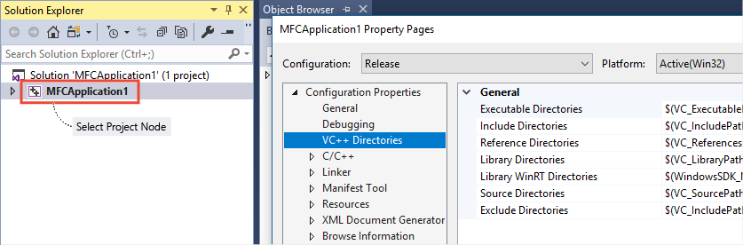
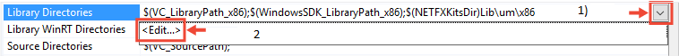
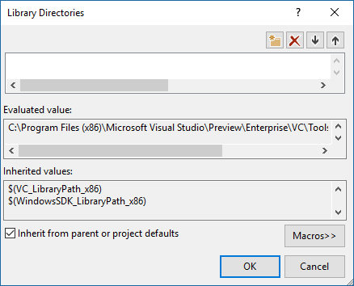
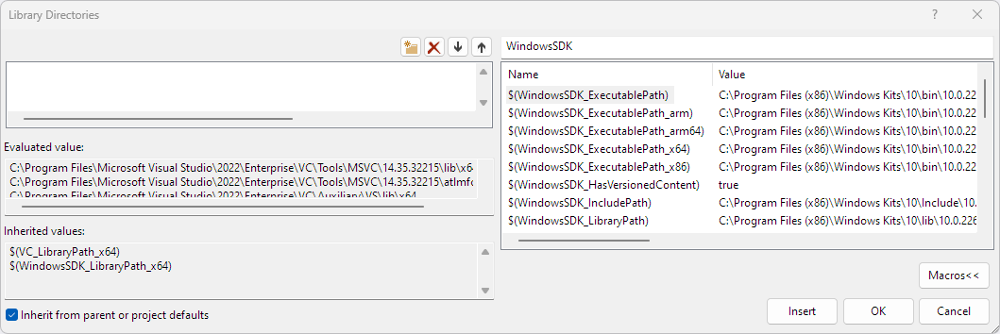

# VC++ Directories Property Page (Windows)

Use this property page to tell Visual Studio which directories to use when building the currently-selected project. To set directories for multiple projects in a solution, use a custom property sheet as described in [Share or reuse Visual Studio C++ project settings](../create-reusable-property-configurations.md).

For the Linux version of this page, see [VC++ Directories (Linux C++)](../../linux/prop-pages/directories-linux.md).

To access the **VC++ Directories** property page:

1. If the **Solution Explorer** window is not visible, then on the main menu choose **View** > **Solution Explorer**.
1. Right-click on a project node (not the top-level solution) and choose **Properties**.
1. In the left pane of the **Property Pages** dialog box, select **Configuration Properties** > **VC++ Directories**.

VC++ Directories properties apply to a project, not the top-level solution node. If you do not see **VC++ Directories** under **Configuration Properties**, select a C++ project node in the **Solution Explorer** window:

Note that the **VC++ Directories** property page for cross-platform projects looks different. For information specific to Linux C++ projects, see [VC++ Directories (Linux C++)](../../linux/prop-pages/directories-linux.md).

If you are not familiar with *project properties* in Visual Studio, you might find it helpful to first read [Set C++ compiler and build properties in Visual Studio](../working-with-project-properties.md).

The default settings for **VC++ Directories** properties depend on project type. For desktop projects they include the C++ tools locations for a particular Platform Toolset and the Windows SDK location. You can change the **Platform Toolset** and **Windows SDK version** on the **Configuration Properties** > **General** page.

To view the values for any of the directories:

1. Select one of the properties in the **VC++ Directories** page. For example, choose **Library Directories**.
1. Choose the down-arrow button at the end of the property value field.
1. In the drop-down menu, choose **Edit**.

You now see a dialog box like this:

Use this dialog to view the current directories. However, if you want to change or add a directory, it is better to use **Property Manager** to create a property sheet or modify the default user property sheet. For more information, see [Share or reuse Visual Studio C++ project settings](../create-reusable-property-configurations.md).

As shown above, many of the inherited paths are given as macros.  To examine the current value of a macro, choose the **Macros** button in the lower right corner of the dialog box. Note that many macros depend on the configuration type. A macro in a debug build might evaluate to a different path than the same macro in a release build.

You can search for partial or complete matches in the edit box. The following illustration shows all the macros that contain the string "WindowsSDK" and it also shows the current path that the macro evaluates to:

Note: The list is populated as you type. Don't press **Enter**.

For more information about macros and why you should use them instead of hard-coded paths whenever possible, see [Set C++ compiler and build properties in Visual Studio](../working-with-project-properties.md).

For a list of commonly used macros, see [Common macros for build commands and properties](common-macros-for-build-commands-and-properties.md).

You can define your own macros in two ways:

- Set environment variables in a developer command prompt. All environment variables are treated as MSBuild properties/macros.

- Define user macros in a .props file. For more information, see [Property page macros](../working-with-project-properties.md).

For more information, see [Property inheritance in Visual Studio projects](../project-property-inheritance.md), and these blog posts: [VC++ Directories](/archive/blogs/vsproject/vc-directories), [Visual Studio 2010 C++ Project Upgrade Guide](https://devblogs.microsoft.com/cppblog/visual-studio-2010-c-project-upgrade-guide/).

## Directory Types

You can also specify other directories, as follows.

**Executable Directories** 
Directories in which to search for executable files. Corresponds to the **PATH** environment variable.

**Include Directories** 
Directories in which to search for include files that are referenced in the source code. Corresponds to the **INCLUDE** environment variable.

**Reference Directories** 
Directories in which to search for assembly and module (metadata) files that are referenced in the source code by the [#using](../../preprocessor/hash-using-directive-cpp.md) directive. Corresponds to the **LIBPATH** environment variable.

**Library Directories** 
Directories in which to search for libraries (.lib) files; this includes run-time libraries. Corresponds to the **LIB** environment variable. This setting does not apply to .obj files; to link to an .obj file, on the  **Configuration Properties** > **Linker** > **General** property page, select **Additional Library Dependencies** and then specify the relative path of the file. For more information, see [Linker property pages](linker-property-pages.md).

**Library WinRT Directories** 
Directories to search for WinRT library files for use in Universal Windows Platform (UWP) apps.

**Source Directories** 
Directories in which to search for source files to use for IntelliSense.

**Exclude Directories** 
Before each compilation, Visual Studio queries the timestamp on all files to determine whether any have been modified since the previous compilation. If your project has large stable libraries, you can potentially speed up build times by excluding those directories from the timestamp check.

## Sharing the Settings

You can share project properties with other users or across multiple computers. For more information, see [Set C++ compiler and build properties in Visual Studio](../working-with-project-properties.md).
