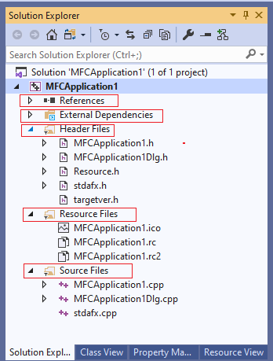

## Vcxproj.filters file format

The *filters* files (*.vcxproj.filters) is an XML file in MSBuild format that specifies, on a per-project basis, which file types go into which logical folder in **Solution Explorer**. In the following illustration, note that the .cpp files are under the **Source Files** node and the .h files are under the **Header Files** node. This placement is controlled by the filters file. 



Visual Studio creates this file automatically with predefined logical folders (filters): **References**, **External Dependencies**, **Source Files**, **Header Files** and **Resources**. It automatically assigns known file types to each folder. If you want to create a filter with a custom name or a filter that holds custom file types, you can create your own filters file in the root folder of the project.

## Example

The following example shows a simple filters file with a flat hierarchy; in other words, there are no nested logical folders.

```xml
<?xml version="1.0" encoding="utf-8"?>
<Project ToolsVersion="4.0" xmlns="http://schemas.microsoft.com/developer/msbuild/2003">
  <ItemGroup>
    <Filter Include="Source Files">
      <UniqueIdentifier>{4FC737F1-C7A5-4376-A066-2A32D752A2FF}</UniqueIdentifier>
      <Extensions>cpp;c;cc;cxx;def;odl;idl;hpj;bat;asm;asmx</Extensions>
    </Filter>
    <Filter Include="Header Files">
      <UniqueIdentifier>{93995380-89BD-4b04-88EB-625FBE52EBFB}</UniqueIdentifier>
      <Extensions>h;hh;hpp;hxx;hm;inl;inc;ipp;xsd</Extensions>
    </Filter>
    <Filter Include="Resource Files">
      <UniqueIdentifier>{67DA6AB6-F800-4c08-8B7A-83BB121AAD01}</UniqueIdentifier>
      <Extensions>rc;ico;cur;bmp;dlg;rc2;rct;bin;rgs;gif;jpg;jpeg;jpe;resx;tiff;tif;png;wav;mfcribbon-ms</Extensions>
    </Filter>
  </ItemGroup>
  <ItemGroup>
    <ClCompile Include="string_utils.cpp">
      <Filter>Source Files</Filter>
    </ClCompile>
    <ClCompile Include="stringutilities.cpp">
      <Filter>Source Files</Filter>
    </ClCompile>
  </ItemGroup>
  <ItemGroup>
    <ClInclude Include="string_utils.h">
      <Filter>Header Files</Filter>
    </ClInclude>
  </ItemGroup>
</Project>
```

To create nested logical folders, declare all nodes in filters `ItemGroup` as shown below. Each child node must declare the full logical path to the topmost parent. The `UniqueIdentifier` is optional; it enables Visual Studio automation interfaces to find the filter. `Extensions` is also optional; when a new file is added to a project, it is added to the topmost filter with a matching file extension.

```xml
  <ItemGroup>
    <Filter Include="ParentFilter">
    </Filter>
    <Filter Include="ParentFilter\Source Files"> <!-- Full path to topmost parent.-->  
      <UniqueIdentifier>{4FC737F1-C7A5-4376-A066-2A32D752A2FF}</UniqueIdentifier> <!--  Optional-->
      <Extensions>cpp;c;cc;cxx;def;odl;idl;hpj;bat;asm;asmx</Extensions> <!-- Optional -->
    </Filter>
    <Filter Include="Header Files">
      <UniqueIdentifier>{93995380-89BD-4b04-88EB-625FBE52EBFB}</UniqueIdentifier>
      <Extensions>h;hh;hpp;hxx;hm;inl;inc;ipp;xsd</Extensions>
    </Filter>
  </ItemGroup>
```

