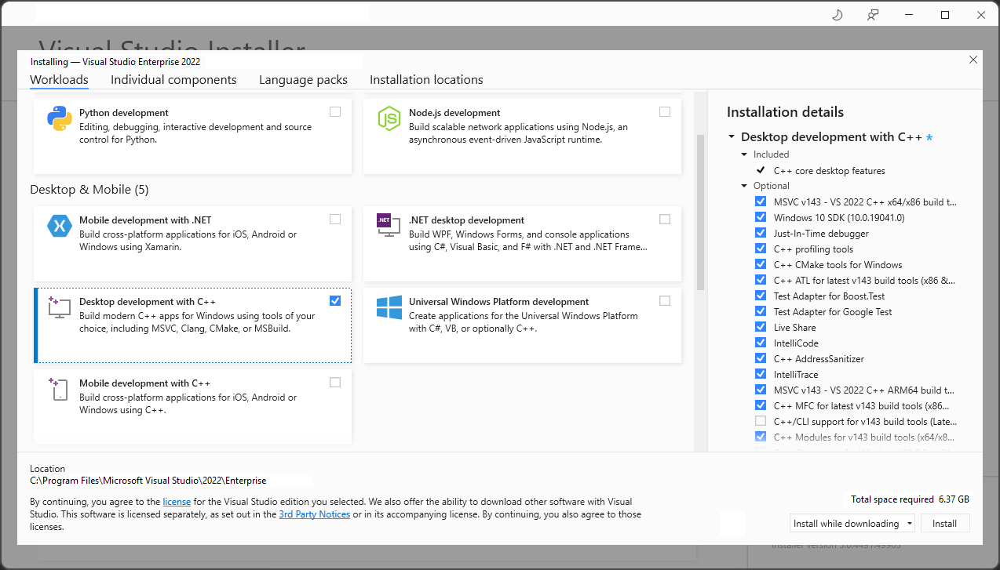
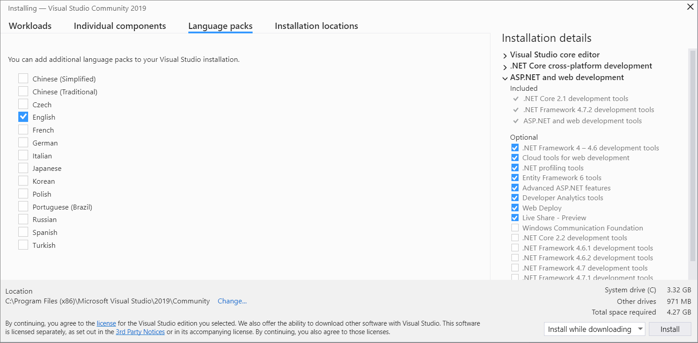
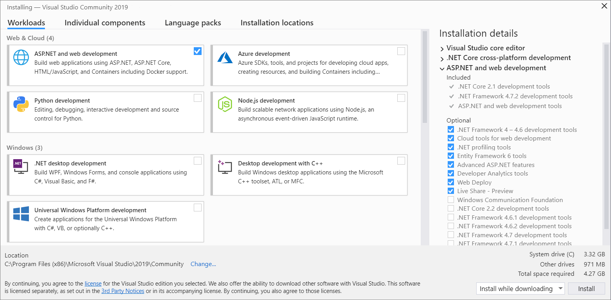
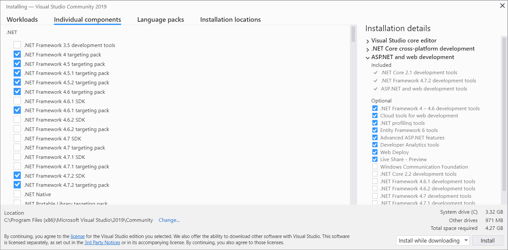
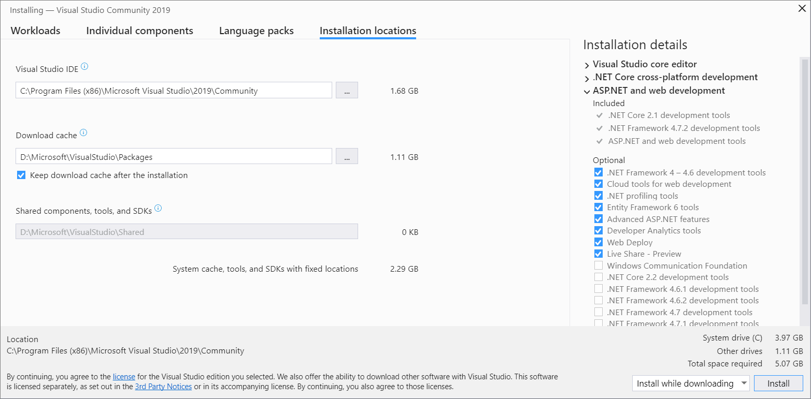
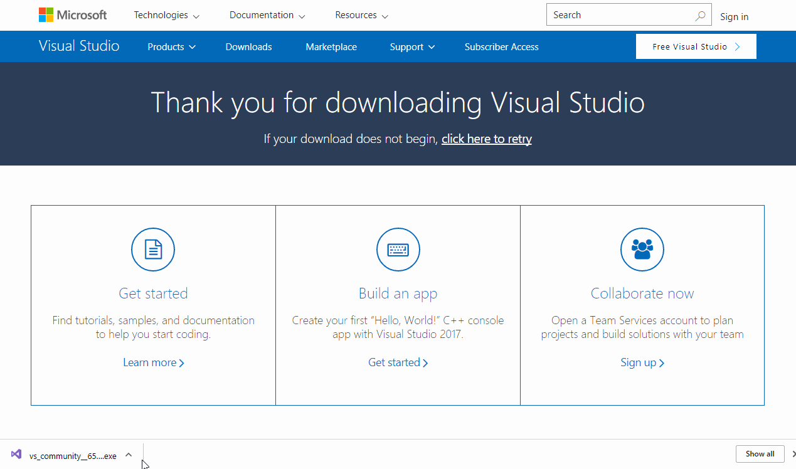
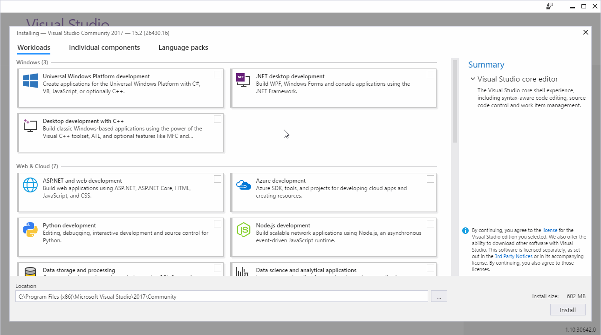
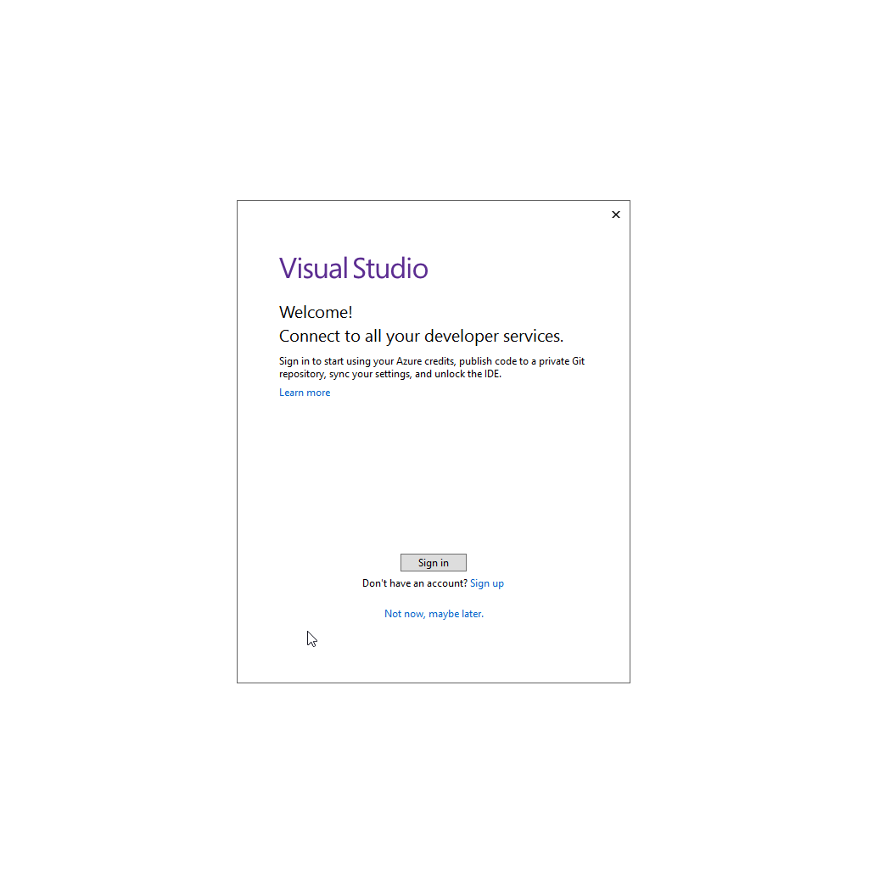
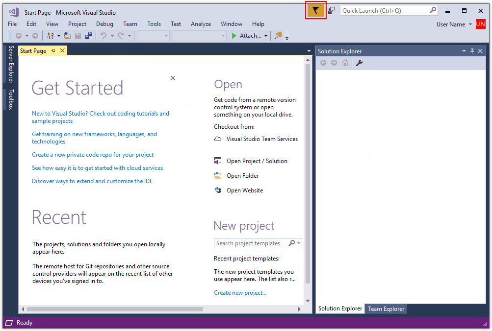

# Install C and C++ support in Visual Studio

If you haven't downloaded and installed Visual Studio and the Microsoft C/C++ tools yet, here's how to get started.

::: moniker range="msvc-170"

## Visual Studio 2022 Installation

Welcome to Visual Studio 2022! In this version, it's easy to choose and install just the features you need. And because of its reduced minimum footprint, it installs quickly and with less system impact.

> [!NOTE]
> This topic applies to installation of Visual Studio on Windows. [Visual Studio Code](https://code.visualstudio.com/) is a lightweight, cross-platform development environment that runs on Windows, Mac, and Linux systems. The Microsoft [C/C++ for Visual Studio Code](https://marketplace.visualstudio.com/items?itemName=ms-vscode.cpptools) extension supports IntelliSense, debugging, code formatting, auto-completion. Visual Studio for Mac doesn't support Microsoft C++, but does support .NET languages and cross-platform development. For installation instructions, see [Install Visual Studio for Mac](/visualstudio/mac/installation/).

Want to know more about what else is new in this version? See the Visual Studio [release notes](/visualstudio/releases/2022/release-notes/).

Ready to install? We'll walk you through it, step-by-step.

### Step 1 - Make sure your computer is ready for Visual Studio

Before you begin installing Visual Studio:

1. Check the [system requirements](/visualstudio/releases/2022/system-requirements). These requirements help you know whether your computer supports Visual Studio 2022.

1. Apply the latest Windows updates. These updates ensure that your computer has both the latest security updates and the required system components for Visual Studio.

1. Reboot. The reboot ensures that any pending installs or updates don't hinder the Visual Studio install.

1. Free up space. Remove unneeded files and applications from your %SystemDrive% by, for example, running the Disk Cleanup app.

For questions about running previous versions of Visual Studio side by side with Visual Studio 2022, see the [Visual Studio 2022 Platform Targeting and Compatibility](/visualstudio/releases/2022/compatibility/) page.

### Step 2 - Download Visual Studio

Next, download the Visual Studio bootstrapper file. To do so, choose the following button to go to the Visual Studio download page. Select the edition of Visual Studio that you want and choose the **Free trial** or **Free download** button.

 > [!div class="button"]
 > [Download Visual Studio](https://visualstudio.microsoft.com/downloads/)

### Step 3 - Install the Visual Studio installer

Run the bootstrapper file you downloaded to install the Visual Studio Installer. This new lightweight installer includes everything you need to both install and customize Visual Studio.

1. From your **Downloads** folder, double-click the bootstrapper that matches or is similar to one of the following files:

   - **vs_community.exe** for Visual Studio Community
   - **vs_professional.exe** for Visual Studio Professional
   - **vs_enterprise.exe** for Visual Studio Enterprise

   If you receive a User Account Control notice, choose **Yes** to allow the bootstrapper to run.

1. We'll ask you to acknowledge the Microsoft [License Terms](https://visualstudio.microsoft.com/license-terms/) and the Microsoft [Privacy Statement](https://privacy.microsoft.com/privacystatement). Choose **Continue**.

### Step 4 - Choose workloads

After the installer is installed, you can use it to customize your installation by selecting the *workloads*, or feature sets, that you want. Here's how.

1. Find the workload you want in the **Installing Visual Studio** screen.

   

   For core C and C++ support, choose the "Desktop development with C++" workload. It comes with the default core editor, which includes basic code editing support for over 20 languages, the ability to open and edit code from any folder without requiring a project, and integrated source code control.

   Additional workloads support other kinds of development. For example, choose the "Universal Windows Platform development" workload to create apps that use the Windows Runtime for the Microsoft Store. Choose "Game development with C++" to create games that use DirectX, Unreal, and Cocos2d. Choose "Linux development with C++" to target Linux platforms, including IoT development.

   The **Installation details** pane lists the included and optional components installed by each workload. You can select or deselect optional components in this list. For example, to support development by using the Visual Studio 2017 or 2015 compiler toolsets, choose the MSVC v141 or MSVC v140 optional components. You can add support for MFC, the experimental Modules language extension, IncrediBuild, and more.

1. After you choose the workload(s) and optional components you want, choose **Install**.

   Next, status screens appear that show the progress of your Visual Studio installation.

> [!TIP]
> At any time after installation, you can install workloads or components that you didn't install initially. If you have Visual Studio open, go to **Tools** > **Get Tools and Features...** which opens the Visual Studio Installer. Or, open **Visual Studio Installer** from the Start menu. From there, you can choose the workloads or components that you wish to install. Then, choose **Modify**.

### Step 5 - Choose individual components (Optional)

If you don't want to use the Workloads feature to customize your Visual Studio installation, or you want to add more components than a workload installs, you can do so by installing or adding individual components from the **Individual components** tab. Choose what you want, and then follow the prompts.

### Step 6 - Install language packs (Optional)

By default, the installer program tries to match the language of the operating system when it runs for the first time. To install Visual Studio in a language of your choosing, choose the **Language packs** tab from the Visual Studio Installer, and then follow the prompts.

  

#### Change the installer language from the command line

Another way that you can change the default language is by running the installer from the command line. For example, you can force the installer to run in English by using the following command: `vs_installer.exe --locale en-US`. The installer will remember this setting when it's run the next time. The installer supports the following language tokens: zh-cn, zh-tw, cs-cz, en-us, es-es, fr-fr, de-de, it-it, ja-jp, ko-kr, pl-pl, pt-br, ru-ru, and tr-tr.

### Step 7 - Change the installation location (Optional)

You can reduce the installation footprint of Visual Studio on your system drive. You can choose to move the download cache, shared components, SDKs, and tools to different drives, and keep Visual Studio on the drive that runs it the fastest.

> [!IMPORTANT]
> You can select a different drive only when you first install Visual Studio. If you've already installed it and want to change drives, you must uninstall Visual Studio and then reinstall it.

### Step 8 - Start developing

1. After Visual Studio installation is complete, choose the **Launch** button to get started developing with Visual Studio.

1. On the start window, choose **Create a new project**.

1. In the search box, enter the type of app you want to create to see a list of available templates. The list of templates depends on the workload(s) that you chose during installation. To see different templates, choose different workloads.

   You can also filter your search for a specific programming language by using the **Language** drop-down list. You can filter by using the **Platform** list and the **Project type** list, too.

1. Visual Studio opens your new project, and you're ready to code!

::: moniker-end

::: moniker range="msvc-160"

## Visual Studio 2019 Installation

Welcome to Visual Studio 2019! In this version, it's easy to choose and install just the features you need. And because of its reduced minimum footprint, it installs quickly and with less system impact.

> [!NOTE]
> This topic applies to installation of Visual Studio on Windows. [Visual Studio Code](https://code.visualstudio.com/) is a lightweight, cross-platform development environment that runs on Windows, Mac, and Linux systems. The Microsoft [C/C++ for Visual Studio Code](https://marketplace.visualstudio.com/items?itemName=ms-vscode.cpptools) extension supports IntelliSense, debugging, code formatting, auto-completion. Visual Studio for Mac doesn't support Microsoft C++, but does support .NET languages and cross-platform development. For installation instructions, see [Install Visual Studio for Mac](/visualstudio/mac/installation/).

Want to know more about what else is new in this version? See the Visual Studio [release notes](/visualstudio/releases/2019/release-notes/).

Ready to install? We'll walk you through it, step-by-step.

### Step 1 - Make sure your computer is ready for Visual Studio

Before you begin installing Visual Studio:

1. Check the [system requirements](/visualstudio/releases/2019/system-requirements). These requirements help you know whether your computer supports Visual Studio 2019.

1. Apply the latest Windows updates. These updates ensure that your computer has both the latest security updates and the required system components for Visual Studio.

1. Reboot. The reboot ensures that any pending installs or updates don't hinder the Visual Studio install.

1. Free up space. Remove unneeded files and applications from your %SystemDrive% by, for example, running the Disk Cleanup app.

For questions about running previous versions of Visual Studio side by side with Visual Studio 2019, see the [Visual Studio 2019 Platform Targeting and Compatibility](/visualstudio/releases/2019/compatibility/) page.

### Step 2 - Download Visual Studio

Next, download the Visual Studio bootstrapper file. To do so, choose the following button to go to the Visual Studio download page. Choose the Download button, then you can select the edition of Visual Studio that you want.

 > [!div class="button"]
 > [Download Visual Studio 2019](https://visualstudio.microsoft.com/vs/older-downloads/#visual-studio-2019-and-other-products)

### Step 3 - Install the Visual Studio installer

Run the bootstrapper file you downloaded to install the Visual Studio Installer. This new lightweight installer includes everything you need to both install and customize Visual Studio.

1. From your **Downloads** folder, double-click the bootstrapper that matches or is similar to one of the following files:

   - **vs_community.exe** for Visual Studio Community
   - **vs_professional.exe** for Visual Studio Professional
   - **vs_enterprise.exe** for Visual Studio Enterprise

   If you receive a User Account Control notice, choose **Yes** to allow the bootstrapper to run.

1. We'll ask you to acknowledge the Microsoft [License Terms](https://visualstudio.microsoft.com/license-terms/) and the Microsoft [Privacy Statement](https://privacy.microsoft.com/privacystatement). Choose **Continue**.

### Step 4 - Choose workloads

After the installer is installed, you can use it to customize your installation by selecting the *workloads*, or feature sets, that you want. Here's how.

1. Find the workload you want in the **Installing Visual Studio** screen.

   

   For core C and C++ support, choose the "Desktop development with C++" workload. It comes with the default core editor, which includes basic code editing support for over 20 languages, the ability to open and edit code from any folder without requiring a project, and integrated source code control.

   Additional workloads support other kinds of development. For example, choose the "Universal Windows Platform development" workload to create apps that use the Windows Runtime for the Microsoft Store. Choose "Game development with C++" to create games that use DirectX, Unreal, and Cocos2d. Choose "Linux development with C++" to target Linux platforms, including IoT development.

   The **Installation details** pane lists the included and optional components installed by each workload. You can select or deselect optional components in this list. For example, to support development by using the Visual Studio 2017 or 2015 compiler toolsets, choose the MSVC v141 or MSVC v140 optional components. You can add support for MFC, the experimental Modules language extension, IncrediBuild, and more.

1. After you choose the workload(s) and optional components you want, choose **Install**.

   Next, status screens appear that show the progress of your Visual Studio installation.

> [!TIP]
> At any time after installation, you can install workloads or components that you didn't install initially. If you have Visual Studio open, go to **Tools** > **Get Tools and Features...** which opens the Visual Studio Installer. Or, open **Visual Studio Installer** from the Start menu. From there, you can choose the workloads or components that you wish to install. Then, choose **Modify**.

### Step 5 - Choose individual components (Optional)

If you don't want to use the Workloads feature to customize your Visual Studio installation, or you want to add more components than a workload installs, you can do so by installing or adding individual components from the **Individual components** tab. Choose what you want, and then follow the prompts.

  

### Step 6 - Install language packs (Optional)

By default, the installer program tries to match the language of the operating system when it runs for the first time. To install Visual Studio in a language of your choosing, choose the **Language packs** tab from the Visual Studio Installer, and then follow the prompts.

  

#### Change the installer language from the command line

Another way that you can change the default language is by running the installer from the command line. For example, you can force the installer to run in English by using the following command: `vs_installer.exe --locale en-US`. The installer will remember this setting when it's run the next time. The installer supports the following language tokens: zh-cn, zh-tw, cs-cz, en-us, es-es, fr-fr, de-de, it-it, ja-jp, ko-kr, pl-pl, pt-br, ru-ru, and tr-tr.

### Step 7 - Change the installation location (Optional)

You can reduce the installation footprint of Visual Studio on your system drive. You can choose to move the download cache, shared components, SDKs, and tools to different drives, and keep Visual Studio on the drive that runs it the fastest.

  

> [!IMPORTANT]
> You can select a different drive only when you first install Visual Studio. If you've already installed it and want to change drives, you must uninstall Visual Studio and then reinstall it.

### Step 8 - Start developing

1. After Visual Studio installation is complete, choose the **Launch** button to get started developing with Visual Studio.

1. On the start window, choose **Create a new project**.

1. In the search box, enter the type of app you want to create to see a list of available templates. The list of templates depends on the workload(s) that you chose during installation. To see different templates, choose different workloads.

   You can also filter your search for a specific programming language by using the **Language** drop-down list. You can filter by using the **Platform** list and the **Project type** list, too.

1. Visual Studio opens your new project, and you're ready to code!

::: moniker-end

::: moniker range="msvc-150"

## Visual Studio 2017 Installation

In Visual Studio 2017, it's easy to choose and install just the features you need. And because of its reduced minimum footprint, it installs quickly and with less system impact.

### Prerequisites

- A broadband internet connection. The Visual Studio installer can download several gigabytes of data.

- A computer that runs Microsoft Windows 7 or later versions. We recommend the latest version of Windows for the best development experience. Make sure that the latest updates are applied to your system before you install Visual Studio.

- Enough free disk space. Visual Studio requires at least 7 GB of disk space, and can take 50 GB or more if many common options are installed. We recommend you install it on your C: drive.

For details on the disk space and operating system requirements, see [Visual Studio Product Family System Requirements](/visualstudio/productinfo/vs2017-system-requirements-vs). The installer reports how much disk space is required for the options you select.

### Download and install

1. To download the latest Visual Studio 2017 installer for Windows, go to the Microsoft Visual Studio [Older downloads](https://visualstudio.microsoft.com/vs/older-downloads/#visual-studio-2017-and-other-products) page. Expand the **2017** section, and choose the **Download** button.

   >[!Tip]
   > The Community edition is for individual developers, classroom learning, academic research, and open source development. For other uses, install Visual Studio 2017 Professional or Visual Studio 2017 Enterprise.

1. Find the installer file you downloaded and run it. The downloaded file may be displayed in your browser, or you may find it in your Downloads folder. The installer needs Administrator privileges to run. You may see a **User Account Control** dialog asking you to give permission to let the installer make changes to your system; choose **Yes**. If you're having trouble, find the downloaded file in File Explorer, right-click on the installer icon, and choose **Run as Administrator** from the context menu.

   

1. The installer presents you with a list of workloads, which are groups of related options for specific development areas. Support for C++ is now part of optional workloads that aren't installed by default.

   

   For C and C++, select the **Desktop development with C++** workload and then choose **Install**.

   

1. When the installation completes, choose the **Launch** button to start Visual Studio.

   The first time you run Visual Studio, you're asked to sign in with a Microsoft Account. If you don't have one, you can create one for free. You must also choose a theme. Don't worry, you can change it later if you want to.

   It may take Visual Studio several minutes to get ready for use the first time you run it. Here's what it looks like in a quick time-lapse:

   

   Visual Studio starts much faster when you run it again.

1. When Visual Studio opens, check to see if the flag icon in the title bar is highlighted:

   

   If it's highlighted, select it to open the **Notifications** window. If there are any updates available for Visual Studio, we recommend you install them now. Once the installation is complete, restart Visual Studio.

::: moniker-end

::: moniker range="<msvc-150"

## Visual Studio 2015 Installation

To install Visual Studio 2015, go to the Microsoft Visual Studio [Older downloads](https://visualstudio.microsoft.com/vs/older-downloads/#visual-studio-2015-and-other-products) page. Expand the **2015** section, and choose the **Download** button. Run the downloaded setup program and choose **Custom installation** and then choose the C++ component. To add C and C++ support to an existing Visual Studio 2015 installation, click on the Windows Start button and type **Add Remove Programs**. Open the program from the results list and then find your Visual Studio 2015 installation in the list of installed programs. Double-click it, then choose **Modify** and select the Visual C++ components to install.

In general, we highly recommend that you use the latest version of Visual Studio even if you need to compile your code using the Visual Studio 2015 compiler. For more information, see [Use native multi-targeting in Visual Studio to build old projects](../porting/use-native-multi-targeting.md).

::: moniker-end

When Visual Studio is running, you're ready to continue to the next step.

## Next Steps

> [!div class="nextstepaction"]
> [Create a C++ project](vscpp-step-1-create.md)
