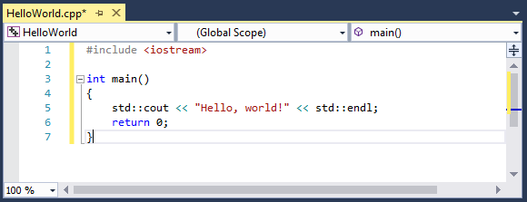

# Create a C++ console app project

The usual starting point for a C++ programmer is a "Hello, world!" application that runs on the command line. That's what you'll create in Visual Studio in this step.

## Prerequisites

- Have Visual Studio with the Desktop development with C++ workload installed and running on your computer. If it's not installed yet, see [Install C++ support in Visual Studio 2017](vscpp-step-0-installation.md).

## Create your app project

Visual Studio uses *projects* to organize the code for an app, and *solutions* to organize your projects. A project contains all the options, configurations, and rules used to build your apps, and manages the relationship between all the project's files and any external files. To create your app, first, you'll create a new project and solution.

1. In Visual Studio, open the **File** menu and choose **New > Project** to open the **New Project** dialog.

   

1. In the **New Project** dialog, select **Installed**, **Visual C++** if it isn't selected already, and then choose the **Empty Project** template. In the **Name** field, enter *HelloWorld*. Choose **OK** to create the project.

   

Visual Studio creates a new, empty project, ready for you to specialize for the kind of app you want to create and to add your source code files. You'll do that next.

[I ran into a problem.](#create-your-app-project-issues)

## Make your project a console app

Visual Studio can create all kinds of apps and components for Windows and other platforms. The **Empty Project** template isn't specific about what kind of app it creates. To create a *console app*, one that runs in a console or command prompt window, you must tell Visual Studio to build your app to use the console subsystem.

1. In Visual Studio, open the **Project** menu and choose **Properties** to open the **HelloWorld Property Pages** dialog.

1. In the **Property Pages** dialog, under **Configuration Properties**, select **Linker**, **System**, and then choose the edit box next to the **Subsystem** property. In the dropdown menu that appears, select **Console (/SUBSYSTEM:CONSOLE)**. Choose **OK** to save your changes.

   

Visual Studio now knows to build your project to run in a console window. Next, you'll add a source code file and enter the code for your app.

[I ran into a problem.](#make-your-project-a-console-app-issues)

## Add a source code file

1. In **Solution Explorer**, select the HelloWorld project. On the menu bar, choose **Project**, **Add New Item** to open the **Add New Item** dialog.

1. In the **Add New Item** dialog, select **Visual C++** under **Installed** if it isn't selected already. In the center pane, select **C++ file (.cpp)**. Change the **Name** to *HelloWorld.cpp*. Choose **Add** to close the dialog and create the file.

   

Visual studio creates a new, empty source code file and opens it in an editor window, ready to enter your source code.

[I ran into a problem.](#add-a-source-code-file-issues)

## Add code to the source file

1. Copy this code into the HelloWorld.cpp editor window.

   ```cpp
   #include <iostream>

   int main()
   {
       std::cout << "Hello, world!" << std::endl;
       return 0;
   }
   ```

   The code should look like this in the editor window:

   

When the code looks like this in the editor, you're ready to go on to the next step and build your app.

[I ran into a problem.](#add-a-source-code-file-issues)

## Next Steps

> [!div class="nextstepaction"]
> [Build and run a C++ project](vscpp-step-2-build.md)

## Troubleshooting guide

Come here for solutions to common issues when you create your first C++ project.

### Create your app project issues

If the **New Project** dialog doesn't show a **Visual C++** entry under **Installed**, your copy of Visual Studio probably doesn't have the **Desktop development with C++** workload installed. You can run the installer right from the **New Project** dialog. Choose the **Open Visual Studio Installer** link to start the installer again. If the **User Account Control** dialog requests permissions, choose **Yes**. In the installer, make sure the **Desktop development with C++** workload is checked, and choose **OK** to update your Visual Studio installation.

If another project with the same name already exists, choose another name for your project, or delete the existing project and try again. To delete an existing project, delete the solution folder (the folder that contains the helloworld.sln file) in File Explorer.

[Go back](#create-your-app-project).

### Make your project a console app issues

If you don't see **Linker** listed under **Configuration Properties**, choose **Cancel** to close the **Property Pages** dialog and then make sure that the **HelloWorld** project is selected in **Solution Explorer**, not the solution or another file or folder, before you try again.

The dropdown control does not appear in the **SubSystem** property edit box until you select the property. You can select it by using the pointer, or you can press Tab to cycle through the dialog controls until **SubSystem** is highlighted. Choose the dropdown control or press Alt+Down to open it.

[Go back](#make-your-project-a-console-app)

### Add a source code file issues

It's okay if you give the source code file a different name. However, don't add more than one source code file that contains the same code to your project.

If you added the wrong kind of file to your project, for example, a header file, delete it and try again. To delete the file, select it in **Solution Explorer** and press the Delete key.

[Go back](#add-a-source-code-file).

### Add code to the source file issues

If you accidentally closed the source code file editor window, to open it again, double-click on HelloWorld.cpp in the **Solution Explorer** window.

If red squiggles appear under anything in the source code editor, check that your code matches the example in spelling, punctuation, and case. Case is significant in C++ code.

[Go back](#add-code-to-the-source-file).

<iframe src="" height="0" width="0" frameborder="0" name="frameTarget" />
