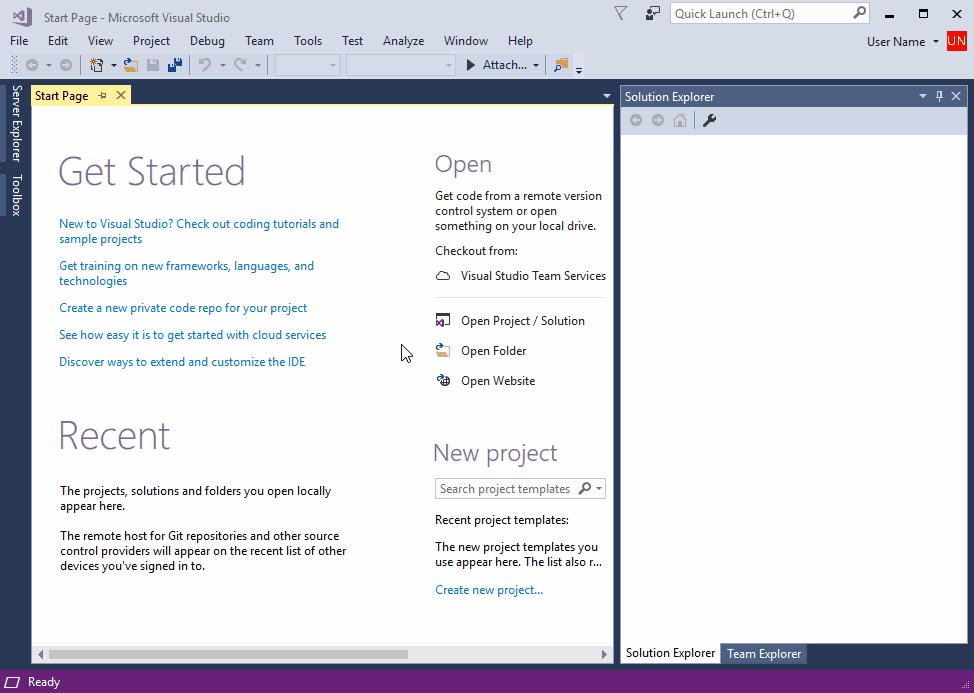
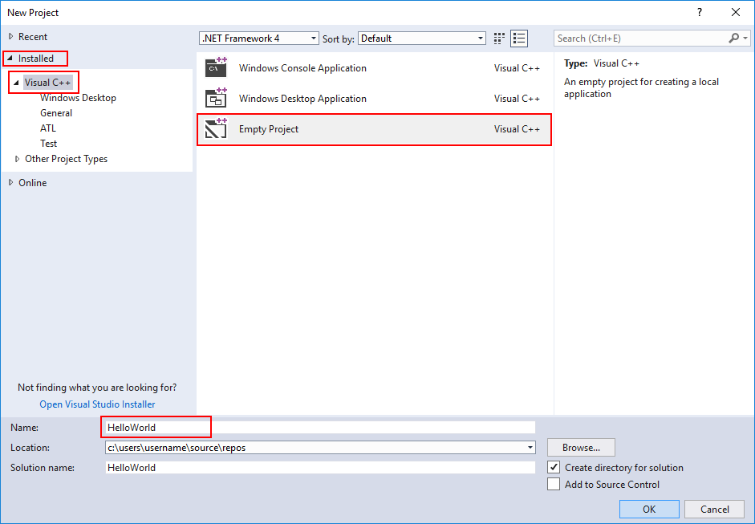
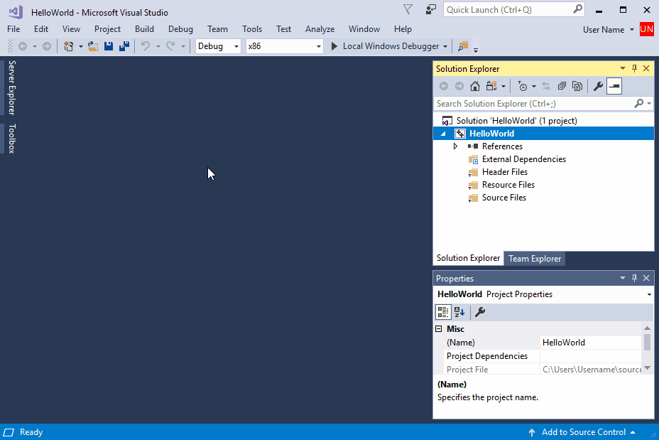
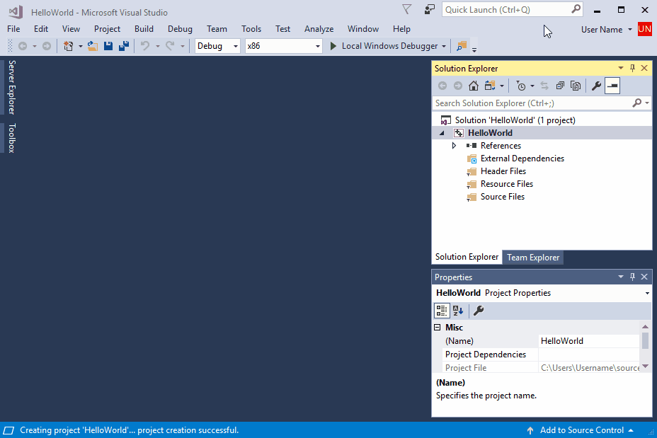

# Create a C++ console app project

The usual starting point for a C++ programmer is a "Hello, world!" application that runs on the command line. That's what you create in Visual Studio in this step.

## Prerequisites

- Have Visual Studio with the Desktop development with C++ workload installed and running on your computer. If it's not installed yet, see [Install C++ support in Visual Studio](vscpp-step-0-installation.md).

## Create your app project

Visual Studio uses *projects* to organize the code for an app, and *solutions* to organize your projects. A project contains all the options, configurations, and rules used to build your apps. It manages the relationship between all the project's files and any external files. To create your app, first, create a new project and solution.

::: moniker range=">=msvc-160"

1. In Visual Studio, open the **File** menu and choose **New > Project** to open the **Create a new Project** dialog. Select the **Console App** template that has **C++**, **Windows**, and **Console** tags, and then choose **Next**.

    :::image type="complex" source="media/vs2019-choose-console-app.png" alt-text="Screenshot of the create a new project dialog.":::
    The create a new project dialog with the Console App template selected. That template says: Run code in a windows terminal. Prints hello world by default. Has the tags c++, Windows, and Console.
    :::image-end:::

1. In the **Configure your new project** dialog, enter *HelloWorld* in the **Project name** edit box. Choose **Create** to create the project.

    :::image type="complex" source="media/vs2019-configure-new-project-hello-world.png" alt-text="Screenshot of Configure your new project dialog.":::
    The Configure your new project dialog with HelloWorld entered into the Project name field.
    :::image-end:::

    Visual Studio creates a new project. It's ready for you to add and edit your source code. By default, the Console App template provides source code for a "Hello World" app, like this:

   :::image type="complex" source="media/vs2019-hello-world-code.png" alt-text="Screenshot of the NEW Hello World project.":::
   Shows the new project. The HelloWorld.cpp file is open, showing the default code that is included with this template. That code consists of #include iostream and a main() function that contains the line: std::cout << quote hello world!\n quote;
   :::image-end:::

   When the code looks like this in the editor, you're ready to go on to the next step and build your app.

[I ran into a problem.](#create-your-app-project-issues)

::: moniker-end

::: moniker range="<=msvc-150"

1. In Visual Studio, open the **File** menu and choose **New > Project** to open the **New Project** dialog.

   

1. In the **New Project** dialog, select **Installed > Visual C++** if it isn't selected already, and then choose the **Empty Project** template. In the **Name** field, enter *HelloWorld*. Choose **OK** to create the project.

   

Visual Studio creates a new, empty project. It's ready for you to specialize for the kind of app you want to create and to add your source code files. You do that next.

[I ran into a problem.](#create-your-app-project-issues)

## Make your project a console app

Visual Studio can create all kinds of apps and components for Windows and other platforms. The **Empty Project** template isn't specific about what kind of app it creates. A *console app* is one that runs in a console or command prompt window. To create one, you must tell Visual Studio to build your app to use the console subsystem.

1. In Visual Studio, open the **Project** menu and choose **Properties** to open the **HelloWorld Property Pages** dialog.

1. In the **Property Pages** dialog, select **Configuration Properties > Linker > System**, and then choose the edit box next to the **Subsystem** property. In the dropdown menu that appears, select **Console (/SUBSYSTEM:CONSOLE)**. Choose **OK** to save your changes.

   

Visual Studio now knows to build your project to run in a console window. Next, you add a source code file and enter the code for your app.

[I ran into a problem.](#make-your-project-a-console-app-issues)

## Add a source code file

1. In **Solution Explorer**, select the HelloWorld project. On the menu bar, choose **Project**, **Add New Item** to open the **Add New Item** dialog.

1. In the **Add New Item** dialog, select **Visual C++** under **Installed** if it isn't selected already. In the center pane, select **C++ file (.cpp)**. Change the **Name** to *HelloWorld.cpp*. Choose **Add** to close the dialog and create the file.

   

Visual studio creates a new, empty source code file and opens it in an editor window, ready to enter your source code.

[I ran into a problem.](#add-a-source-code-file-issues)

## Add code to the source file

1. Copy this code into the HelloWorld.cpp editor window.

   ```cpp
   #include <iostream>

   int main()
   {
       std::cout << "Hello, world!" << std::endl;
       return 0;
   }
   ```

   The code should look like this in the editor window:

    function that contains the line: std::cout << \"hello world!\n\"; followed by return 0;")

When the code looks like this in the editor, you're ready to go on to the next step and build your app.

[I ran into a problem.](#add-a-source-code-file-issues)

::: moniker-end

## Next steps

> [!div class="nextstepaction"]
> [Build and run a C++ project](vscpp-step-2-build.md)

## Troubleshooting guide

Come here for solutions to common issues when you create your first C++ project.

### Create your app project: issues

::: moniker range=">=msvc-160"

The **New Project** dialog should show a **Console App** template that has **C++**, **Windows**, and **Console** tags. If you don't see it, there are two possible causes. It might be filtered out of the list, or it might not be installed. First, check the filter dropdowns at the top of the list of templates. Set them to **C++**, **Windows**, and **Console**. The C++ **Console App** template should appear; otherwise, the **Desktop development with C++** workload isn't installed.

To install **Desktop development with C++**, you can run the installer right from the **New Project** dialog. Choose the **Install more tools and features** link at the bottom of the template list to start the installer. If the **User Account Control** dialog requests permissions, choose **Yes**. In the installer, make sure the **Desktop development with C++** workload is checked. Then choose **Modify** to update your Visual Studio installation.

If another project with the same name already exists, choose another name for your project. Or, delete the existing project and try again. To delete an existing project, delete the solution folder (the folder that contains the `helloworld.sln` file) in File Explorer.

[Go back](#create-your-app-project).

::: moniker-end

::: moniker range="msvc-150"

If the **New Project** dialog doesn't show a **Visual C++** entry under **Installed**, your copy of Visual Studio probably doesn't have the **Desktop development with C++** workload installed. You can run the installer right from the **New Project** dialog. Choose the **Open Visual Studio Installer** link to start the installer again. If the **User Account Control** dialog requests permissions, choose **Yes**. Update the installer if necessary. In the installer, make sure the **Desktop development with C++** workload is checked, and choose **OK** to update your Visual Studio installation.

::: moniker-end

::: moniker range="<=msvc-150"

If another project with the same name already exists, choose another name for your project. Or, delete the existing project and try again. To delete an existing project, delete the solution folder (the folder that contains the `helloworld.sln` file) in File Explorer.

[Go back](#create-your-app-project).

### Make your project a console app: issues

If you don't see **Linker** listed under **Configuration Properties**, choose **Cancel** to close the **Property Pages** dialog. Make sure that the **HelloWorld** project is selected in **Solution Explorer** before you try again. Don't select the **HelloWorld** solution, or another item, in **Solution Explorer**.

The dropdown control doesn't appear in the **SubSystem** property edit box until you select the property. Click in the edit box to select it. Or, you can press **Tab** to cycle through the dialog controls until **SubSystem** is highlighted. Choose the dropdown control or press **Alt+Down** to open it.

[Go back](#make-your-project-a-console-app)

### Add a source code file: issues

It's okay if you give the source code file a different name. However, don't add more than one file that contains the same code to your project.

If you added the wrong file type to your project, such as a header file, delete it and try again. To delete the file, select it in **Solution Explorer**. Then press the **Delete** key.

[Go back](#add-a-source-code-file).

### Add code to the source file: issues

If you accidentally closed the source code file editor window, you can easily open it again. To open it, double-click on HelloWorld.cpp in the **Solution Explorer** window.

If red squiggles appear under anything in the source code editor, check that your code matches the example in spelling, punctuation, and case. Case is significant in C++ code.

[Go back](#add-code-to-the-source-file).

::: moniker-end
