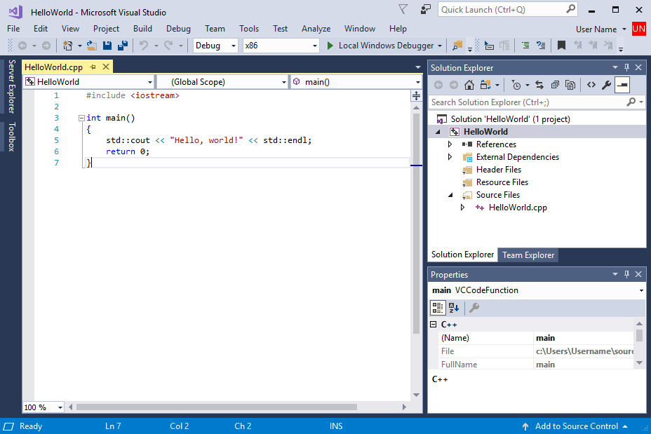
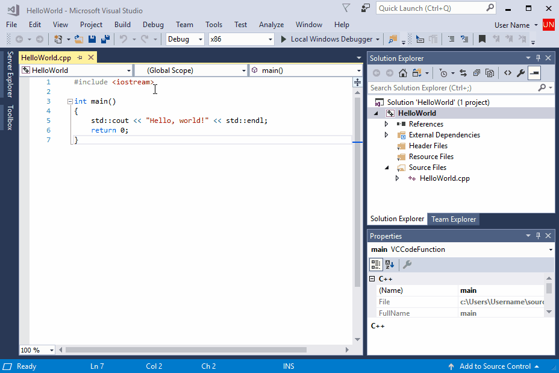
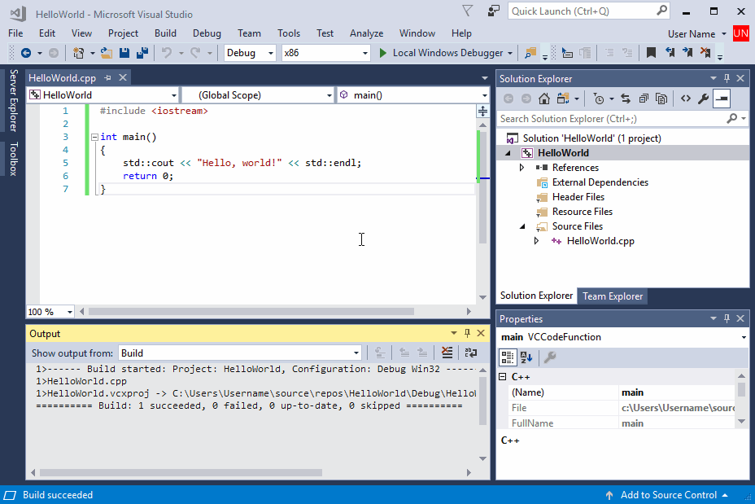
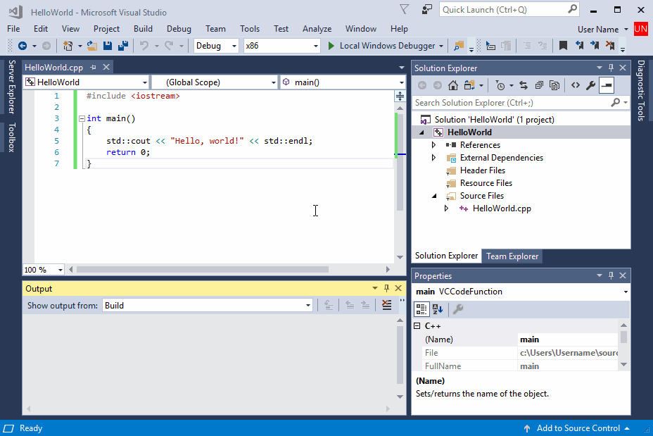

# Build and run a C++ console app project

You've created a C++ console app project and entered your code. Now you can build and run it within Visual Studio. Then, run it as a stand-alone app from the command line.

## Prerequisites

- Have Visual Studio with the Desktop development with C++ workload installed and running on your computer. If it's not installed yet, follow the steps in [Install C++ support in Visual Studio](vscpp-step-0-installation.md).

- Create a "Hello, World!" project. By default, it contains code to print `Hello World!`. If you haven't done this step yet, follow the steps in [Create a C++ console app project](vscpp-step-1-create.md).

If Visual Studio looks like this, you're ready to build and run your app:

   

## Build and run your code in Visual Studio

1. To build your project, choose **Build Solution** from the **Build** menu. The **Output** window shows the results of the build process.

   

1. To run the code, on the menu bar, choose **Debug**, **Start without debugging**.

   

   A console window opens and then runs your app. When you start a console app in Visual Studio, it runs your code, then prints "Press any key to continue . . ." to give you a chance to see the output.

Congratulations! You've created your first "Hello, world!" console app in Visual Studio! Press a key to dismiss the console window and return to Visual Studio.

[I ran into a problem.](#build-and-run-your-code-in-visual-studio-issues)

## Run your code in a command window

Normally, you run console apps at the command prompt, not in Visual Studio. Once Visual Studio builds your app, you can run it from a command window. Here's how to find and run your new app in a command prompt window.

1. In **Solution Explorer**, select the HelloWorld solution (not the HelloWorld project) and right-click to open the context menu. Choose **Open Folder in File Explorer** to open a **File Explorer** window in the HelloWorld solution folder.

::: moniker range="<msvc-170"

2. In the **File Explorer** window, open the `Debug` folder. This folder contains your app, `HelloWorld.exe`, and debugging files. Hold down the **Shift** key and right-click on `HelloWorld.exe` to open the context menu. Choose **Copy as path** to copy the path to your app to the clipboard.

::: moniker-end
::: moniker range=">=msvc-170"

2. In the **File Explorer** window, open the `x64` folder and then the `Debug` folder. This folder contains your app, `HelloWorld.exe`, and debugging files. Hold down the **Shift** key and right-click on `HelloWorld.exe` to open the context menu. Choose **Copy as path** to copy the path to your app to the clipboard.

::: moniker-end

3. To open a command prompt window, press **Windows+R** to open the **Run** dialog. Enter *cmd.exe* in the **Open** textbox, then choose **OK** to run a command prompt window.

4. In the command prompt window, right-click to paste the path to your app into the command prompt. Press Enter to run your app.

   

Congratulations, you've built and run a console app in Visual Studio!

[I ran into a problem.](#run-your-code-in-a-command-window-issues)

## Next Steps

Once you've built and run this simple app, you're ready for more complex projects. For more information, see [Using the Visual Studio IDE for C++ Desktop Development](../ide/using-the-visual-studio-ide-for-cpp-desktop-development.md). It has more detailed walkthroughs that explore the capabilities of Microsoft C++ in Visual Studio.

## Troubleshooting guide

Come here for solutions to common issues when you create your first C++ project.

### Build and run your code in Visual Studio: issues

If red squiggles appear under anything in the source code editor, the build may have errors or warnings. Check that your code matches the example in spelling, punctuation, and case.

[Go back.](#build-and-run-your-code-in-visual-studio)

### Run your code in a command window: issues

::: moniker range="<msvc-170"

If the path shown in File Explorer ends in `\HelloWorld\HelloWorld`, you've opened the HelloWorld *project* instead of the HelloWorld *solution*. You'll be confused by a `Debug` folder that doesn't contain your app. Navigate up a level in File Explorer to get to the solution folder, the first *HelloWorld* in the path. This folder also contains a `Debug` folder, and you'll find your app there.

You can also navigate to the solution `Debug` folder at the command line to run your app. Your app won't run from other directories without specifying the path to the app. However, you can copy your app to another directory and run it from there. It's also possible to copy it to a directory specified by your `PATH` environment variable, then run it from anywhere.

::: moniker-end
::: moniker range=">=msvc-170"

If the path shown in File Explorer ends in `\HelloWorld\HelloWorld`, you've opened the HelloWorld *project* instead of the HelloWorld *solution*. You'll be confused by a `x64\Debug` folder that doesn't contain your app. Navigate up a level in File Explorer to get to the solution folder, the first `HelloWorld` in the path. This folder also contains a `x64\Debug` folder, and you'll find your app there.

You can also navigate to the solution `x64\Debug` folder at the command line to run your app. Your app won't run from other directories without specifying the path to the app. However, you can copy your app to another directory and run it from there. It's also possible to copy it to a directory specified by your `PATH` environment variable, then run it from anywhere.

::: moniker-end

If you don't see **Copy as path** in the shortcut menu, dismiss the menu, and then hold down the **Shift** key while you open it again. This command is just for convenience. You can also copy the path to the folder from the File Explorer search bar, and paste it into the **Run** dialog, and then enter the name of your executable at the end. It's just a little more typing, but it has the same result.

[Go back.](#run-your-code-in-a-command-window)
