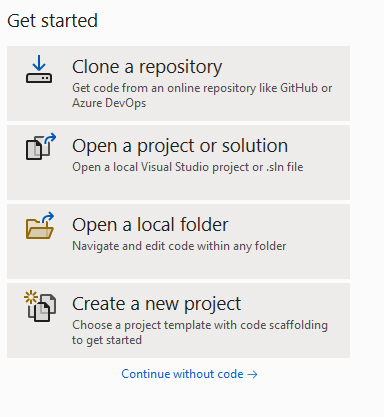
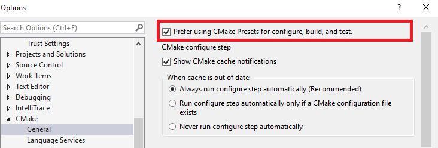
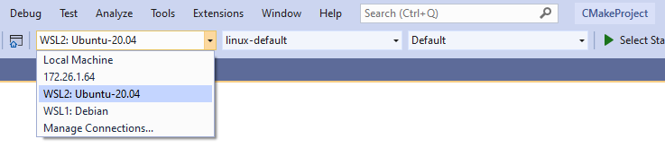
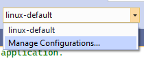
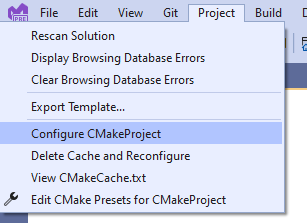
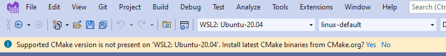
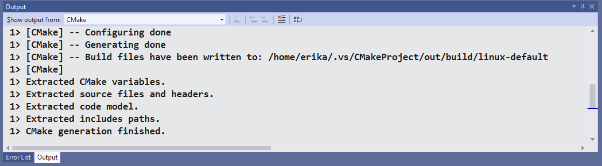
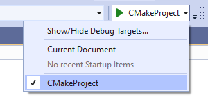
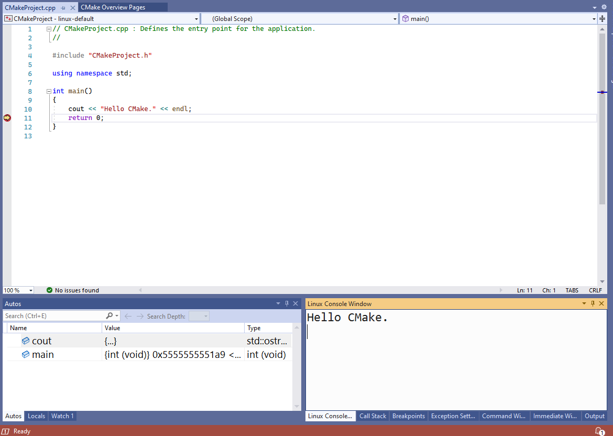
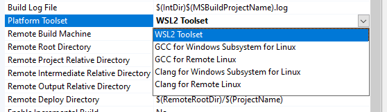

# Walkthrough: Build and Debug C++ with WSL 2 and Visual Studio 2022

Visual Studio 2022 introduces a native Windows Subsystem for Linux version 2 (WSL 2) toolset for C++ development. This toolset is available now in [Visual Studio 2022 version 17.0 Preview 2](https://visualstudio.microsoft.com/vs/preview/vs2022/). WSL 2 is the new, recommended version of the [Windows Subsystem for Linux](/windows/wsl/about) (WSL). It provides better Linux file system performance, GUI support, and full system call compatibility. Visual Studio’s WSL 2 toolset allows you use Visual Studio to build and debug C++ code on WSL 2 distros without ever adding an SSH connection. You can already build and debug C++ code on WSL 1 distros using the native [WSL 1 toolset](https://devblogs.microsoft.com/cppblog/c-with-visual-studio-2019-and-windows-subsystem-for-linux-wsl/) introduced in Visual Studio 2019 version 16.1.

Visual Studio’s WSL 2 toolset supports both CMake and MSBuild-based Linux projects. However, CMake is our recommendation for all C++ cross-platform development with Visual Studio. We recommend it because it allows you to build and debug the same project on Windows, WSL, and remote systems.

For a video overview of what is covered in this topic, see:

> [!VIDEO <iframe width="557" height="310" src="https://www.youtube.com/embed/IKI2w75aAow" title="YouTube video player" frameborder="0" allow="accelerometer; autoplay; clipboard-write; encrypted-media; gyroscope; picture-in-picture" allowfullscreen></iframe>>]

## WSL 2 toolset background

Our C++ cross-platform support in Visual Studio assumes all source files originate in the Windows file system. When targeting a WSL 2 distro, Visual Studio will execute a local rsync copy to copy files from the Windows file system to the WSL file system. This local rsync copy will occur automatically when Visual Studio detects you're using a WSL 2 distro. It doesn't require any user intervention. See [Comparing WSL 1 and WSL 2](/windows/wsl/compare-versions) to learn more about the differences between WSL 1 and WSL 2.

The WSL 2 toolset is supported by our CMake Presets integration in Visual Studio. You can learn more about CMake Presets in our[ announcement blog post](https://devblogs.microsoft.com/cppblog/cmake-presets-integration-in-visual-studio-and-visual-studio-code/) and [documentation](cmake-presets-vs.md).

Continue reading for a step-by-step guide on getting started with CMake and WSL 2.

## Install build tools

1. Install WSL and a WSL 2 distro. Follow the instructions at [Install WSL](/windows/wsl/install-win10).
1. Use the following commands to install the required build tools on your WSL 2 distro. They ensure that will have:
    * A C++ compiler
    * `gdb`
    * `CMake`
    * `rsync`
    * `zip`
    * An underlying build system generator

Install these dependencies on distros that use `apt` with the following commands:

```bash
sudo apt update
sudo apt install g++ gdb make ninja-build rsync zip
```

## Cross-platform CMake development with a WSL 2 distro

This walkthrough uses GCC and Ninja on Ubuntu. You'll install a recent version of CMake using Visual Studio’s CMake binary deployment in step 7.

1. Open a CMake project in Visual Studio 2022 version 17.0 Preview 2 or later. Visual Studio defines a CMake project as a folder with a CMakeLists.txt file at the project root. In this walkthrough, I’m going to create a new CMake project with the CMake Project template.



2. Enable Visual Studio’s CMake Presets integration. You can add a `CMakePresets.json` file to the root of the project or enable the integration globally in **Tools** > **Options** > **CMake** > **General**. Close and reopen the folder in Visual Studio to activate the integration. For more information, see [Enable CMake Presets integration](cmake-presets-vs.md).



3. There are three dropdowns across the Visual Studio main menu bar. Use the dropdown on the left to select your active Target System. This is the system where CMake will be invoked to configure and build the project. Visual Studio queries for WSL installations with wsl -l -v. In the following image, the **Target System** selected is **WSL2: Ubuntu-20.04**:



> [!NOTE]
> If Visual Studio starts to configure your project automatically, read step 7 to manage CMake binary deployment, and then continue to the next step below. See [Modify automatic configuration and cache notifications](cmake-presets-vs.md) to customize this behavior.

4. Use the dropdown in the middle to select your active Configure Preset. Configure Presets tell Visual Studio how to invoke CMake and generate the underlying build system. In the example in step 3 (above), my active Configure Preset is the **linux-default** Preset created by Visual Studio. If you want to create a custom Configure Preset, select **Manage Configurations…** For more information, see [Select a Configure Preset](cmake-presets-vs.md#select-a-configure-preset) and [Edit Presets](cmake-presets-vs.md#edit-presets).



5. Use the dropdown on the right to select your active Build Preset. Build Presets tell Visual Studio how to invoke build. In the example in step 3 (above), the active Build Preset is the **Default** Preset created by Visual Studio. For more information, see [Select a Build Preset](cmake-presets-vs.md#select-a-build-preset).

6. Configure the project on WSL 2. If project generation doesn't start automatically, then manually invoke configure with **Project** > **Configure** *project-name*



7. If you don't have a supported version of CMake installed on your WSL 2 distro, then Visual Studio will prompt you to deploy a recent version of CMake. Select “Yes” to deploy CMake binaries to your WSL 2 distro.



8. Confirm that the configure step has completed and that you can see the **CMake generation finished** message in the CMake pane of the Output Window. Build files are written to a directory in the WSL 2 distro’s file system.



9. Select the active debug target. The debug dropdown menu lists all the CMake targets available to the project.



10. Set a breakpoint. Expand the project subfolder in the Solution Explorer and in the .cpp file set a breakpoint in `main()`. You can also navigate to CMake Targets View by selecting the View Picker button in the **Solution Explorer**:


11. Select **Debug** > **Start**, or press **F5**. Your project will build, the executable will launch on your WSL 2 distro, and you'll hit your breakpoint. You can see the output of your program (in this case, “Hello CMake.”) in the Linux Console Window:



## MSBuild-based Linux development with WSL 2

CMake is our recommendation for all C++ cross-platform development with Visual Studio because it allows you to build and debug the same project on Windows, WSL, and remote systems. If you're already using a MSBuild-based Linux project, then you can upgrade to the WSL 2 toolset in Visual Studio via **Property pages** > **General** > **Platform Toolset**:


 


## See also

[Download Visual Studio 2022 preview](https://visualstudio.microsoft.com/vs/preview/)\
[Create a CMake Linux project in Visual Studio](../linux/cmake-linux-project.md)\
[Tutorial: Debug a CMake project on a remote Windows machine](cmake-remote-debugging.md)