# Walkthrough: Create and use your own Dynamic Link Library (C++)

This step-by-step walkthrough shows how to use the Visual Studio IDE to create your own dynamic link library (DLL) written in Microsoft C++ (MSVC). Then it shows how to use the DLL from another C++ app. DLLs (also known as *shared libraries* in UNIX-based operating systems) are one of the most useful kinds of Windows components. You can use them as a way to share code and resources, and to shrink the size of your apps. DLLs can even make it easier to service and extend your apps.

In this walkthrough, you'll create a DLL that implements some math functions. Then you'll create a console app that uses the functions from the DLL. You'll also get an introduction to some of the programming techniques and conventions used in Windows DLLs.

This walkthrough covers these tasks:

- Create a DLL project in Visual Studio.

- Add exported functions and variables to the DLL.

- Create a console app project in Visual Studio.

- Use the functions and variables imported from the DLL in the console app.

- Run the completed app.

Like a statically linked library, a DLL _exports_ variables, functions, and resources by name. A client app _imports_ the names to use those variables, functions, and resources. Unlike a statically linked library, Windows connects the imports in your app to the exports in a DLL at load time or at run time, instead of connecting them at link time. Windows requires extra information that isn't part of the standard C++ compilation model to make these connections. The MSVC compiler implements some Microsoft-specific extensions to C++ to provide this extra information. We explain these extensions as we go.

This walkthrough creates two Visual Studio solutions; one that builds the DLL, and one that builds the client app. The DLL uses the C calling convention. It can be called from apps written in other programming languages, as long as the platform, calling conventions, and linking conventions match. The client app uses _implicit linking_, where Windows links the app to the DLL at load-time. This linking lets the app call the DLL-supplied functions just like the functions in a statically linked library.

This walkthrough doesn't cover some common situations. The code doesn't show the use of C++ DLLs by other programming languages. It doesn't show how to [create a resource-only DLL](creating-a-resource-only-dll.md), or how to use [explicit linking](linking-an-executable-to-a-dll.md#linking-explicitly) to load DLLs at run-time rather than at load-time. Rest assured, you can use MSVC and Visual Studio to do all these things.

For links to more information about DLLs, see [Create C/C++ DLLs in Visual Studio](dlls-in-visual-cpp.md). For more information about implicit linking and explicit linking, see [Determine which linking method to use](linking-an-executable-to-a-dll.md#determining-which-linking-method-to-use). For information about creating C++ DLLs for use with programming languages that use C-language linkage conventions, see [Exporting C++ functions for use in C-language executables](exporting-cpp-functions-for-use-in-c-language-executables.md). For information about how to create DLLs for use with .NET languages, see [Calling DLL Functions from Visual Basic Applications](calling-dll-functions-from-visual-basic-applications.md).

## Prerequisites

- A computer that runs Microsoft Windows 7 or later versions. We recommend Windows 10 for the best development experience.

::: moniker range=">=msvc-150"

- A copy of Visual Studio. For information on how to download and install Visual Studio, see [Install Visual Studio](/visualstudio/install/install-visual-studio). When you run the installer, make sure that the **Desktop development with C++** workload is checked. Don't worry if you didn't install this workload when you installed Visual Studio. You can run the installer again and install it now.

   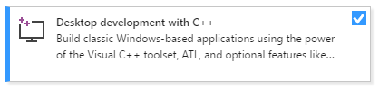

::: moniker-end

::: moniker range="msvc-140"

- A copy of Visual Studio. For information on how to download and install Visual Studio 2015, see [Install Visual Studio 2015](/visualstudio/install/install-visual-studio-2015?view=vs-2015&preserve-view=true). Use a **Custom** installation to install the C++ compiler and tools, since they're not installed by default.

::: moniker-end

- An understanding of the basics of using the Visual Studio IDE. If you've used Windows desktop apps before, you can probably keep up. For an introduction, see [Visual Studio IDE feature tour](/visualstudio/ide/visual-studio-ide).

- An understanding of enough of the fundamentals of the C++ language to follow along. Don't worry, we don't do anything too complicated.

::: moniker range="msvc-150"

> [!NOTE]
> This walkthrough assumes you're using Visual Studio 2017 version 15.9 or later. Some earlier versions of Visual Studio 2017 had defects in the code templates, or used different user interface dialogs. To avoid problems, use the Visual Studio Installer to update Visual Studio 2017 to version 15.9 or later.

::: moniker-end

## Create the DLL project

In this set of tasks, you create a project for your DLL, add code, and build it. To begin, start the Visual Studio IDE, and sign in if you need to. The instructions vary slightly depending on which version of Visual Studio you're using. Make sure you have the correct version selected in the control in the upper left of this page.

::: moniker range=">=msvc-160"

### To create a DLL project in Visual Studio 2019

1. On the menu bar, choose **File** > **New** > **Project** to open the **Create a New Project** dialog box.

   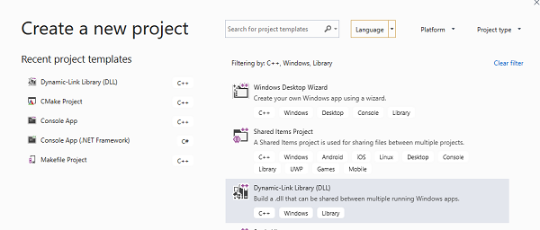

1. At the top of the dialog, set  **Language** to **C++**, set **Platform** to **Windows**, and set **Project type** to **Library**.

1. From the filtered list of project types, select **Dynamic-link Library (DLL)**, and then choose **Next**.

1. In the **Configure your new project** page, enter *MathLibrary* in the **Project name** box to specify a name for the project. Leave the default **Location** and **Solution name** values. Set **Solution** to **Create new solution**. Uncheck **Place solution and project in the same directory** if it's checked.

1. Choose the **Create** button to create the project.

When the solution is created, you can see the generated project and source files in the **Solution Explorer** window in Visual Studio.

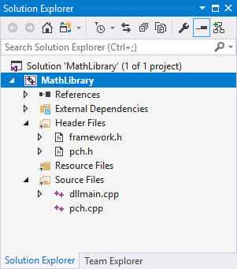

::: moniker-end

::: moniker range="msvc-150"

### To create a DLL project in Visual Studio 2017

1. On the menu bar, choose **File** > **New** > **Project** to open the **New Project** dialog box.

1. In the left pane of the **New Project** dialog box, select **Installed** > **Visual C++** > **Windows Desktop**. In the center pane, select **Dynamic-Link Library (DLL)**. Enter *MathLibrary* in the **Name** box to specify a name for the project. Leave the default **Location** and **Solution name** values. Set **Solution** to **Create new solution**. Check **Create directory for solution** if it's unchecked.

   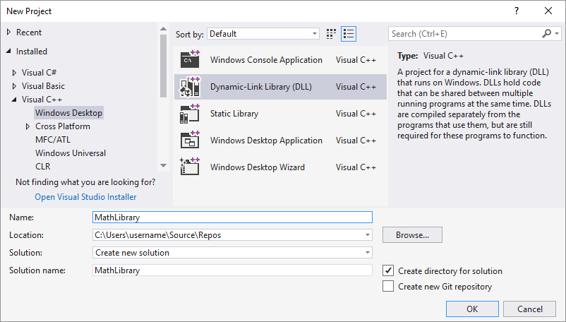

1. Choose the **OK** button to create the project.

When the solution is created, you can see the generated project and source files in the **Solution Explorer** window in Visual Studio.

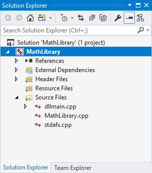

::: moniker-end

::: moniker range="msvc-140"

### To create a DLL project in Visual Studio 2015 and older versions

1. On the menu bar, choose **File** > **New** > **Project**.

1. In the left pane of the **New Project** dialog box, expand **Installed** > **Templates**, and select **Visual C++**, and then in the center pane, select **Win32 Console Application**. Enter *MathLibrary* in the **Name** edit box to specify a name for the project. Leave the default **Location** and **Solution name** values. Set **Solution** to **Create new solution**. Check **Create directory for solution** if it's unchecked.

   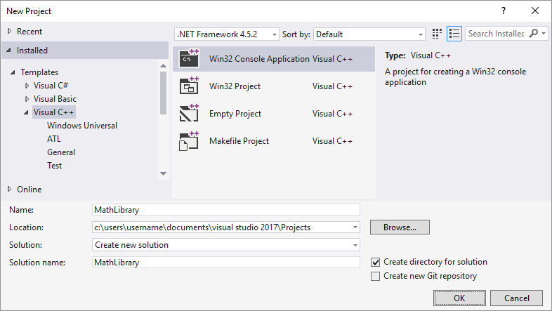

1. Choose the **OK** button to dismiss the **New Project** dialog and start the **Win32 Application Wizard**.

   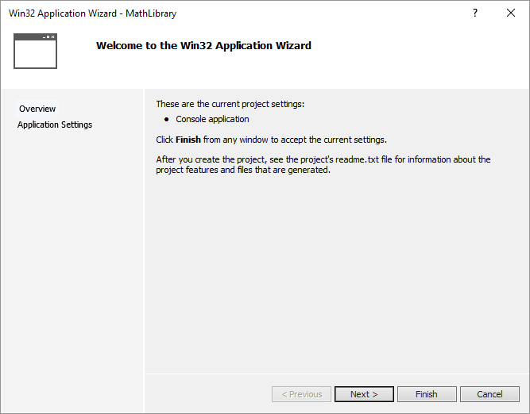

1. Choose the **Next** button. On the **Application Settings** page, under **Application type**, select **DLL**.

   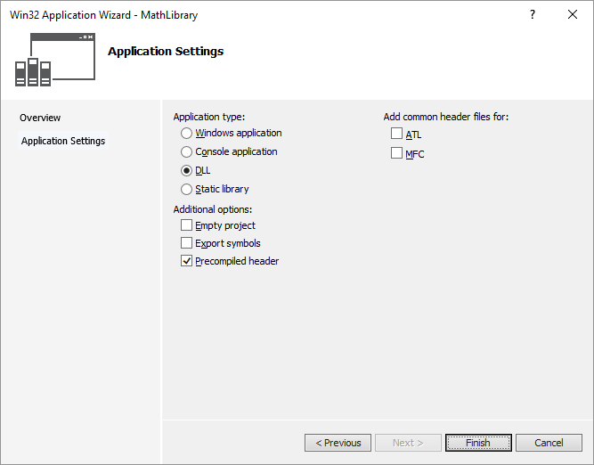

1. Choose the **Finish** button to create the project.

When the wizard completes the solution, you can see the generated project and source files in the **Solution Explorer** window in Visual Studio.

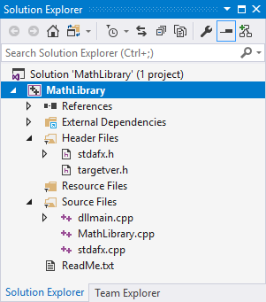

::: moniker-end

Right now, this DLL doesn't do very much. Next, you'll create a header file to declare the functions your DLL exports, and then add the function definitions to the DLL to make it more useful.

### To add a header file to the DLL

1. To create a header file for your functions, on the menu bar, choose **Project** > **Add New Item**.

1. In the **Add New Item** dialog box, in the left pane, select **Visual C++**. In the center pane, select **Header File (.h)**. Specify *MathLibrary.h* as the name for the header file.

   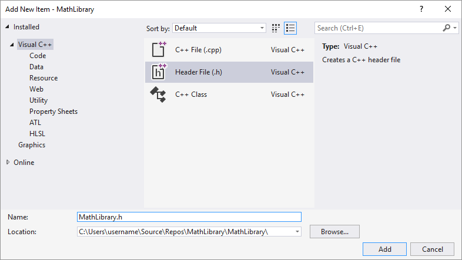

1. Choose the **Add** button to generate a blank header file, which is displayed in a new editor window.

   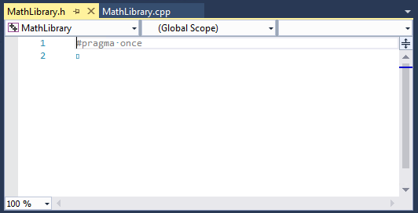

1. Replace the contents of the header file with this code:

   ```cpp
   // MathLibrary.h - Contains declarations of math functions
   #pragma once

   #ifdef MATHLIBRARY_EXPORTS
   #define MATHLIBRARY_API __declspec(dllexport)
   #else
   #define MATHLIBRARY_API __declspec(dllimport)
   #endif

   // The Fibonacci recurrence relation describes a sequence F
   // where F(n) is { n = 0, a
   //               { n = 1, b
   //               { n > 1, F(n-2) + F(n-1)
   // for some initial integral values a and b.
   // If the sequence is initialized F(0) = 1, F(1) = 1,
   // then this relation produces the well-known Fibonacci
   // sequence: 1, 1, 2, 3, 5, 8, 13, 21, 34, ...

   // Initialize a Fibonacci relation sequence
   // such that F(0) = a, F(1) = b.
   // This function must be called before any other function.
   extern "C" MATHLIBRARY_API void fibonacci_init(
       const unsigned long long a, const unsigned long long b);

   // Produce the next value in the sequence.
   // Returns true on success and updates current value and index;
   // false on overflow, leaves current value and index unchanged.
   extern "C" MATHLIBRARY_API bool fibonacci_next();

   // Get the current value in the sequence.
   extern "C" MATHLIBRARY_API unsigned long long fibonacci_current();

   // Get the position of the current value in the sequence.
   extern "C" MATHLIBRARY_API unsigned fibonacci_index();
   ```

This header file declares some functions to produce a generalized Fibonacci sequence, given two initial values. A call to `fibonacci_init(1, 1)` generates the familiar Fibonacci number sequence.

Notice the preprocessor statements at the top of the file. The new project template for a DLL project adds **_PROJECTNAME_&#95;EXPORTS** to the defined preprocessor macros. In this example, Visual Studio defines **MATHLIBRARY&#95;EXPORTS** when your MathLibrary DLL project is built.

When the **MATHLIBRARY&#95;EXPORTS** macro is defined, the **MATHLIBRARY&#95;API** macro sets the `__declspec(dllexport)` modifier on the function declarations. This modifier tells the compiler and linker to export a function or variable from the DLL for use by other applications. When **MATHLIBRARY&#95;EXPORTS** is undefined, for example, when the header file is included by a client application, **MATHLIBRARY&#95;API** applies the `__declspec(dllimport)` modifier to the declarations. This modifier optimizes the import of the function or variable in an application. For more information, see [dllexport, dllimport](../cpp/dllexport-dllimport.md).

### To add an implementation to the DLL

::: moniker range=">=msvc-160"

1. In **Solution Explorer**, right-click on the **Source Files** node and choose **Add** > **New Item**. Create a new .cpp file called *MathLibrary.cpp*, in the same way that you added a new header file in the previous step.

1. In the editor window, select the tab for **MathLibrary.cpp** if it's already open. If not, in **Solution Explorer**, double-click **MathLibrary.cpp** in the **Source Files** folder of the **MathLibrary** project to open it.

1. In the editor, replace the contents of the MathLibrary.cpp file with the following code:

   ```cpp
   // MathLibrary.cpp : Defines the exported functions for the DLL.
   #include "pch.h" // use stdafx.h in Visual Studio 2017 and earlier
   #include <utility>
   #include <limits.h>
   #include "MathLibrary.h"

   // DLL internal state variables:
   static unsigned long long previous_;  // Previous value, if any
   static unsigned long long current_;   // Current sequence value
   static unsigned index_;               // Current seq. position

   // Initialize a Fibonacci relation sequence
   // such that F(0) = a, F(1) = b.
   // This function must be called before any other function.
   void fibonacci_init(
       const unsigned long long a,
       const unsigned long long b)
   {
       index_ = 0;
       current_ = a;
       previous_ = b; // see special case when initialized
   }

   // Produce the next value in the sequence.
   // Returns true on success, false on overflow.
   bool fibonacci_next()
   {
       // check to see if we'd overflow result or position
       if ((ULLONG_MAX - previous_ < current_) ||
           (UINT_MAX == index_))
       {
           return false;
       }

       // Special case when index == 0, just return b value
       if (index_ > 0)
       {
           // otherwise, calculate next sequence value
           previous_ += current_;
       }
       std::swap(current_, previous_);
       ++index_;
       return true;
   }

   // Get the current value in the sequence.
   unsigned long long fibonacci_current()
   {
       return current_;
   }

   // Get the current index position in the sequence.
   unsigned fibonacci_index()
   {
       return index_;
   }
   ```

::: moniker-end

::: moniker range="<=msvc-150"

1. In the editor window, select the tab for **MathLibrary.cpp** if it's already open. If not, in **Solution Explorer**, double-click **MathLibrary.cpp** in the **Source Files** folder of the **MathLibrary** project to open it.

1. In the editor, replace the contents of the MathLibrary.cpp file with the following code:

   ```cpp
   // MathLibrary.cpp : Defines the exported functions for the DLL.
   #include "stdafx.h" // use pch.h in Visual Studio 2019 and later
   #include <utility>
   #include <limits.h>
   #include "MathLibrary.h"

   // DLL internal state variables:
   static unsigned long long previous_;  // Previous value, if any
   static unsigned long long current_;   // Current sequence value
   static unsigned index_;               // Current seq. position

   // Initialize a Fibonacci relation sequence
   // such that F(0) = a, F(1) = b.
   // This function must be called before any other function.
   void fibonacci_init(
       const unsigned long long a,
       const unsigned long long b)
   {
       index_ = 0;
       current_ = a;
       previous_ = b; // see special case when initialized
   }

   // Produce the next value in the sequence.
   // Returns true on success, false on overflow.
   bool fibonacci_next()
   {
       // check to see if we'd overflow result or position
       if ((ULLONG_MAX - previous_ < current_) ||
           (UINT_MAX == index_))
       {
           return false;
       }

       // Special case when index == 0, just return b value
       if (index_ > 0)
       {
           // otherwise, calculate next sequence value
           previous_ += current_;
       }
       std::swap(current_, previous_);
       ++index_;
       return true;
   }

   // Get the current value in the sequence.
   unsigned long long fibonacci_current()
   {
       return current_;
   }

   // Get the current index position in the sequence.
   unsigned fibonacci_index()
   {
       return index_;
   }
   ```

::: moniker-end

To verify that everything works so far, compile the dynamic link library. To compile, choose **Build** > **Build Solution** on the menu bar. The DLL and related compiler output are placed in a folder called *Debug* directly below the solution folder. If you create a Release build, the output is placed in a folder called *Release*. The output should look something like this:

::: moniker range=">=msvc-160"

```Output
1>------ Build started: Project: MathLibrary, Configuration: Debug Win32 ------
1>pch.cpp
1>dllmain.cpp
1>MathLibrary.cpp
1>Generating Code...
1>   Creating library C:\Users\username\Source\Repos\MathLibrary\Debug\MathLibrary.lib and object C:\Users\username\Source\Repos\MathLibrary\Debug\MathLibrary.exp
1>MathLibrary.vcxproj -> C:\Users\username\Source\Repos\MathLibrary\Debug\MathLibrary.dll
========== Build: 1 succeeded, 0 failed, 0 up-to-date, 0 skipped ==========
```

::: moniker-end

::: moniker range="msvc-150"

```Output
1>------ Build started: Project: MathLibrary, Configuration: Debug Win32 ------
1>stdafx.cpp
1>dllmain.cpp
1>MathLibrary.cpp
1>Generating Code...
1>   Creating library C:\Users\username\Source\Repos\MathLibrary\Debug\MathLibrary.lib and object C:\Users\username\Source\Repos\MathLibrary\Debug\MathLibrary.exp
1>MathLibrary.vcxproj -> C:\Users\username\Source\Repos\MathLibrary\Debug\MathLibrary.dll
========== Build: 1 succeeded, 0 failed, 0 up-to-date, 0 skipped ==========
```

::: moniker-end

::: moniker range="msvc-140"

```Output
1>------ Build started: Project: MathLibrary, Configuration: Debug Win32 ------
1>MathLibrary.cpp
1>dllmain.cpp
1>Generating Code...
1>   Creating library C:\Users\username\Source\Repos\MathLibrary\Debug\MathLibrary.lib and object C:\Users\username\Source\Repos\MathLibrary\Debug\MathLibrary.exp
1>MathLibrary.vcxproj -> C:\Users\username\Source\Repos\MathLibrary\Debug\MathLibrary.dll
1>MathLibrary.vcxproj -> C:\Users\username\Source\Repos\MathLibrary\Debug\MathLibrary.pdb (Partial PDB)
========== Build: 1 succeeded, 0 failed, 0 up-to-date, 0 skipped ==========
```

::: moniker-end

Congratulations, you've created a DLL using Visual Studio! Next, you'll create a client app that uses the functions exported by the DLL.

## Create a client app that uses the DLL

When you create a DLL, think about how client apps may use it. To call the functions or access the data exported by a DLL, client source code must have the declarations available at compile time. At link time, the linker requires information to resolve the function calls or data accesses. A DLL supplies this information in an *import library*, a file that contains information about how to find the functions and data, instead of the actual code. And at run time, the DLL must be available to the client, in a location that the operating system can find.

Whether it's your own or from a third-party, your client app project needs several pieces of information to use a DLL. It needs to find the headers that declare the DLL exports, the import libraries for the linker, and the DLL itself. One solution is to copy all of these files into your client project. For third-party DLLs that are unlikely to change while your client is in development, this method may be the best way to use them. However, when you also build the DLL, it's better to avoid duplication. If you make a local copy of DLL files that are under development, you may accidentally change a header file in one copy but not the other, or use an out-of-date library.

To avoid out-of-sync code, we recommend you set the include path in your client project to include the DLL header files directly from your DLL project. Also, set the library path in your client project to include the DLL import libraries from the DLL project. And finally, copy the built DLL from the DLL project into your client build output directory. This step allows your client app to use the same DLL code you build.

::: moniker range=">=msvc-160"

### To create a client app in Visual Studio

1. On the menu bar, choose **File** > **New** > **Project** to open the **Create a new project** dialog box.

1. At the top of the dialog, set  **Language** to **C++**, set **Platform** to **Windows**, and set **Project type** to **Console**.

1. From the filtered list of project types, choose **Console App** then choose **Next**.

1. In the **Configure your new project** page, enter *MathClient* in the **Project name** box to specify a name for the project. Leave the default **Location** and **Solution name** values. Set **Solution** to **Create new solution**. Uncheck **Place solution and project in the same directory** if it's checked.

   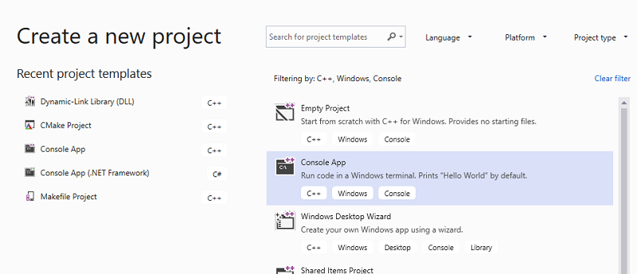

1. Choose the **Create** button to create the client project.

A minimal console application project is created for you. The name for the main source file is the same as the project name that you entered earlier. In this example, it's named **MathClient.cpp**. You can build it, but it doesn't use your DLL yet.

::: moniker-end

::: moniker range="msvc-150"

### To create a client app in Visual Studio 2017

1. To create a C++ app that uses the DLL that you created, on the menu bar, choose **File** > **New** > **Project**.

1. In the left pane of the **New Project** dialog, select **Windows Desktop** under **Installed** > **Visual C++**. In the center pane, select **Windows Console Application**. Specify the name for the project, *MathClient*, in the **Name** edit box.  Leave the default **Location** and **Solution name** values. Set **Solution** to **Create new solution**. Check **Create directory for solution** if it's unchecked.

   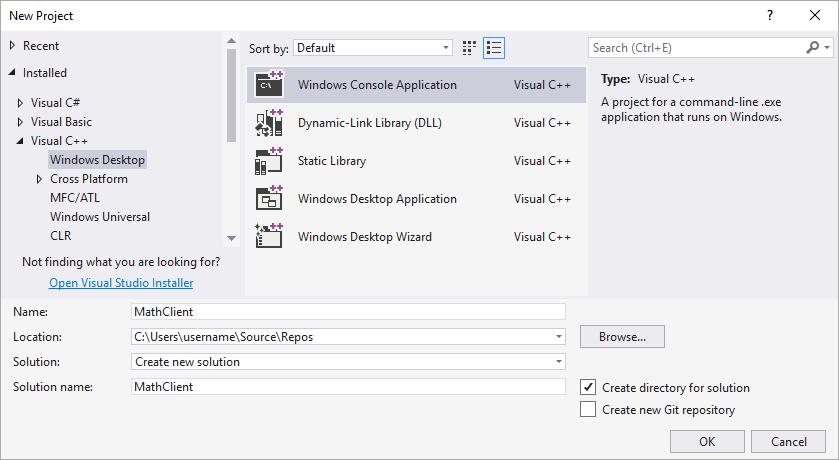

1. Choose **OK** to create the client app project.

A minimal console application project is created for you. The name for the main source file is the same as the project name that you entered earlier. In this example, it's named **MathClient.cpp**. You can build it, but it doesn't use your DLL yet.

::: moniker-end

::: moniker range="msvc-140"

### To create a client app in Visual Studio 2015

1. To create a C++ app that uses the DLL that you created, on the menu bar, choose **File** > **New** > **Project**.

1. In the left pane of the **New Project** dialog, select **Win32** under **Installed** > **Templates** > **Visual C++**. In the center pane, select **Win32 Console Application**. Specify the name for the project, *MathClient*, in the **Name** edit box. Leave the default **Location** and **Solution name** values. Set **Solution** to **Create new solution**. Check **Create directory for solution** if it's unchecked.

   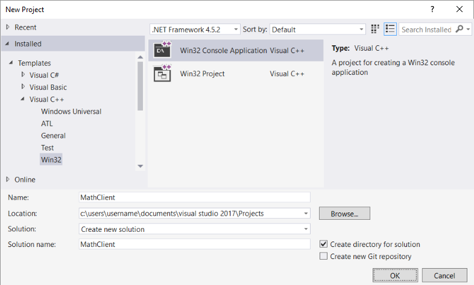

1. Choose the **OK** button to dismiss the **New Project** dialog and start the **Win32 Application Wizard**. On the **Overview** page of the **Win32 Application Wizard** dialog box, choose the **Next** button.

1. On the **Application Settings** page, under **Application type**, select **Console application** if it isn't already selected.

1. Choose the **Finish** button to create the project.

When the wizard finishes, a minimal console application project is created for you. The name for the main source file is the same as the project name that you entered earlier. In this example, it's named **MathClient.cpp**. You can build it, but it doesn't use your DLL yet.

::: moniker-end

Next, to call the MathLibrary functions in your source code, your project must include the *MathLibrary.h* file. You could copy this header file into your client app project, then add it to the project as an existing item. This method can be a good choice for third-party libraries. However, if you're working on the code for your DLL and your client at the same time, the header files could get out of sync. To avoid this issue, set the **Additional Include Directories** path in your project to include the path to the original header.

### To add the DLL header to your include path

1. Right-click on the **MathClient** node in **Solution Explorer** to open the **Property Pages** dialog.

1. In the **Configuration** drop-down box, select **All Configurations** if it's not already selected.

1. In the left pane, select **Configuration Properties** > **C/C++** > **General**.

1. In the property pane, select the drop-down control next to the **Additional Include Directories** edit box, and then choose **Edit**.

   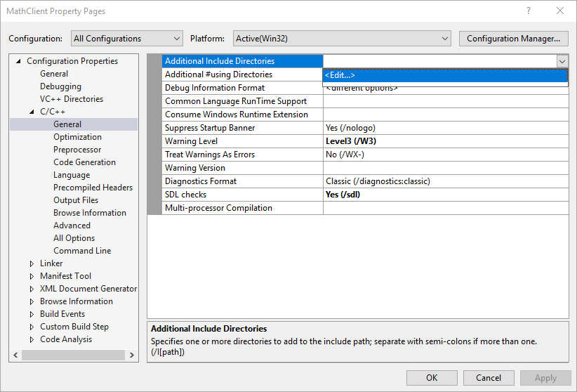

1. Double-click in the top pane of the **Additional Include Directories** dialog box to enable an edit control. Or, choose the folder icon to create a new entry.

1. In the edit control, specify the path to the location of the **MathLibrary.h** header file. You can choose the ellipsis (**...**) control to browse to the correct folder.

   You can also enter a relative path from your client source files to the folder that contains the DLL header files. If you followed the directions to put your client project in a separate solution from the DLL, the relative path should look like this:

   `..\..\MathLibrary\MathLibrary`

   If your DLL and client projects are in the same solution, the relative path might look like this:

   `..\MathLibrary`

   When the DLL and client projects are in other folders, adjust the relative path to match. Or, use the ellipsis control to browse for the folder.

   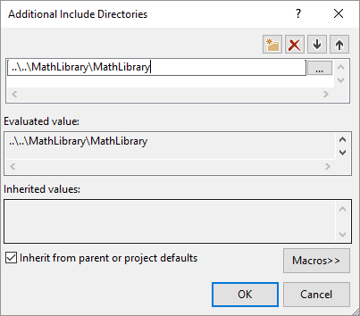

1. After you've entered the path to the header file in the **Additional Include Directories** dialog box, choose the **OK** button. In the **Property Pages** dialog box, choose the **OK** button to save your changes.

You can now include the **MathLibrary.h** file and use the functions it declares in your client application. Replace the contents of **MathClient.cpp** by using this code:

```cpp
// MathClient.cpp : Client app for MathLibrary DLL.
// #include "pch.h" Uncomment for Visual Studio 2017 and earlier
#include <iostream>
#include "MathLibrary.h"

int main()
{
    // Initialize a Fibonacci relation sequence.
    fibonacci_init(1, 1);
    // Write out the sequence values until overflow.
    do {
        std::cout << fibonacci_index() << ": "
            << fibonacci_current() << std::endl;
    } while (fibonacci_next());
    // Report count of values written before overflow.
    std::cout << fibonacci_index() + 1 <<
        " Fibonacci sequence values fit in an " <<
        "unsigned 64-bit integer." << std::endl;
}
```

This code can be compiled, but not linked. If you build the client app now, the error list shows several LNK2019 errors. That's because your project is missing some information: You haven't specified that your project has a dependency on the *MathLibrary.lib* library yet. And, you haven't told the linker how to find the *MathLibrary.lib* file.

To fix this issue, you could copy the library file directly into your client app project. The linker would find and use it automatically. However, if both the library and the client app are under development, that might lead to changes in one copy that aren't shown in the other. To avoid this issue, you can set the **Additional Dependencies** property to tell the build system that your project depends on *MathLibrary.lib*. And, you can set an **Additional Library Directories** path in your project to include the path to the original library when you link.

### To add the DLL import library to your project

1. Right-click on the **MathClient** node in **Solution Explorer** and choose **Properties** to open the **Property Pages** dialog.

1. In the **Configuration** drop-down box, select **All Configurations** if it's not already selected. It ensures that any property changes apply to both Debug and Release builds.

1. In the left pane, select **Configuration Properties** > **Linker** > **Input**. In the property pane, select the drop-down control next to the **Additional Dependencies** edit box, and then choose **Edit**.

   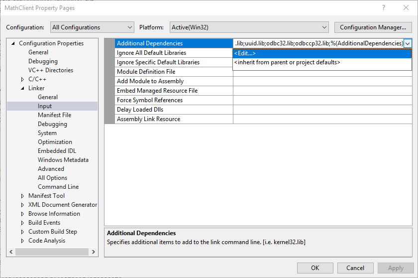

1. In the **Additional Dependencies** dialog, add *MathLibrary.lib* to the list in the top edit control.

   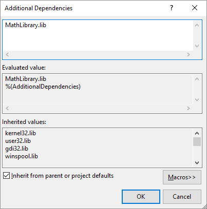

1. Choose **OK** to go back to the **Property Pages** dialog box.

1. In the left pane, select **Configuration Properties** > **Linker** > **General**. In the property pane, select the drop-down control next to the **Additional Library Directories** edit box, and then choose **Edit**.

   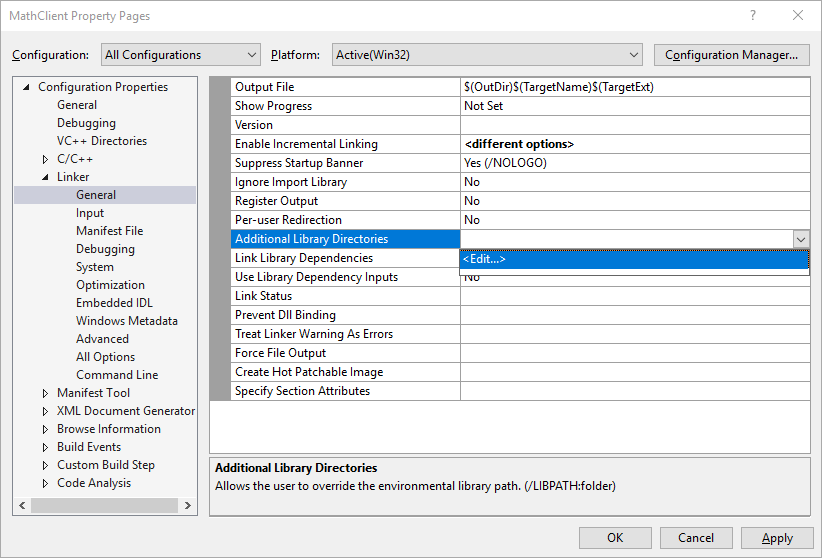

1. Double-click in the top pane of the **Additional Library Directories** dialog box to enable an edit control. In the edit control, specify the path to the location of the **MathLibrary.lib** file. By default, it's in a folder called *Debug* directly under the DLL solution folder. If you create a release build, the file is placed in a folder called *Release*. You can use the `$(IntDir)` macro so that the linker can find your DLL, no matter which kind of build you create. If you followed the directions to put your client project in a separate solution from the DLL project, the relative path should look like this:

   `..\..\MathLibrary\$(IntDir)`

   If your DLL and client projects are in other locations, adjust the relative path to match.

   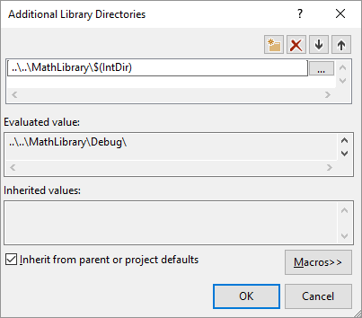

1. Once you've entered the path to the library file in the **Additional Library Directories** dialog box, choose the **OK** button to go back to the **Property Pages** dialog box. Choose **OK** to save the property changes.

Your client app can now compile and link successfully, but it still doesn't have everything it needs to run. When the operating system loads your app, it looks for the MathLibrary DLL. If it can't find the DLL in certain system directories, the environment path, or the local app directory, the load fails. Depending on the operating system, you'll see an error message like this:

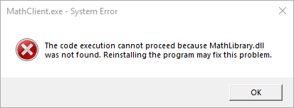

One way to avoid this issue is to copy the DLL to the directory that contains your client executable as part of the build process. You can add a **Post-Build Event** to your project, to add a command that copies the DLL to your build output directory. The command specified here copies the DLL only if it's missing or has changed. It uses macros to copy to and from the Debug or Release locations, based on your build configuration.

### To copy the DLL in a post-build event

1. Right-click on the **MathClient** node in **Solution Explorer** and choose **Properties** to open the **Property Pages** dialog.

1. In the **Configuration** drop-down box, select **All Configurations** if it isn't already selected.

1. In the left pane, select **Configuration Properties** > **Build Events** > **Post-Build Event**.

1. In the property pane, select the edit control in the **Command Line** field. If you followed the directions to put your client project in a separate solution from the DLL project, then enter this command:

   `xcopy /y /d "..\..\MathLibrary\$(IntDir)MathLibrary.dll" "$(OutDir)"`

   If your DLL and client projects are in other directories, change the relative path to the DLL to match.

   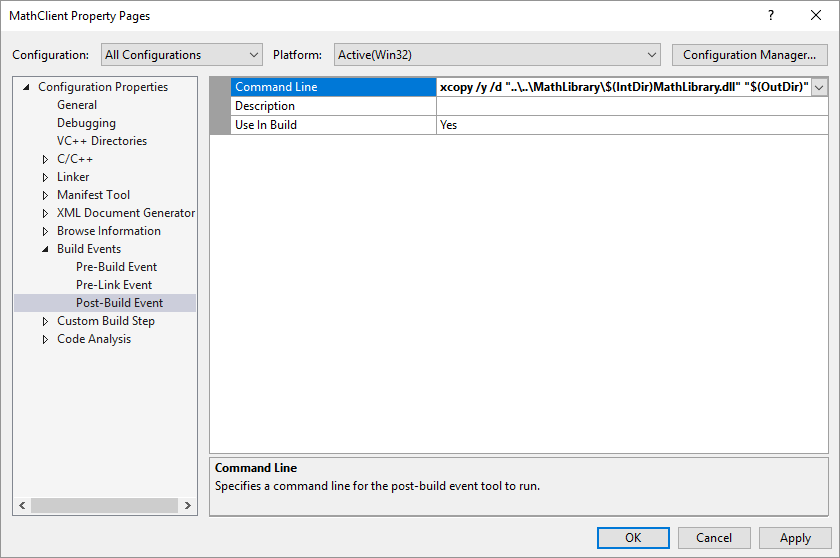

1. Choose the **OK** button to save your changes to the project properties.

Now your client app has everything it needs to build and run. Build the application by choosing **Build** > **Build Solution** on the menu bar. The **Output** window in Visual Studio should have something like the following example depending on your version of Visual Studio:

```Output
1>------ Build started: Project: MathClient, Configuration: Debug Win32 ------
1>MathClient.cpp
1>MathClient.vcxproj -> C:\Users\username\Source\Repos\MathClient\Debug\MathClient.exe
1>1 File(s) copied
========== Build: 1 succeeded, 0 failed, 0 up-to-date, 0 skipped ==========
```

Congratulations, you've created an application that calls functions in your DLL. Now run your application to see what it does. On the menu bar, choose **Debug** > **Start Without Debugging**. Visual Studio opens a command window for the program to run in. The last part of the output should look like:

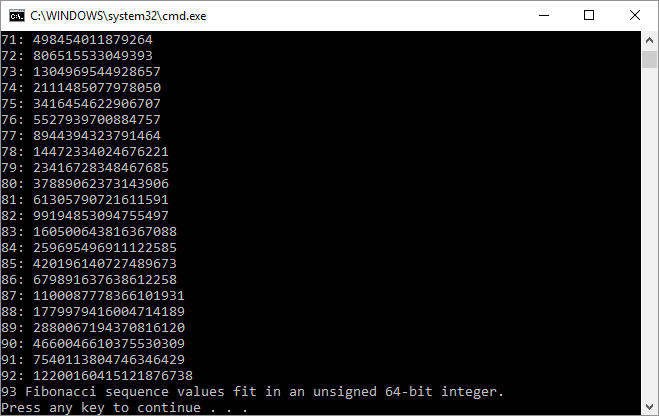

Press any key to dismiss the command window.

Now that you've created a DLL and a client application, you can experiment. Try setting breakpoints in the code of the client app, and run the app in the debugger. See what happens when you step into a library call. Add other functions to the library, or write another client app that uses your DLL.

When you deploy your app, you must also deploy the DLLs it uses. The simplest way to make the DLLs that you build, or that you include from third parties, available is to put them in the same directory as your app. It's known as *app-local deployment*. For more information about deployment, see [Deployment in Visual C++](../windows/deployment-in-visual-cpp.md).

## See also

[Calling DLL Functions from Visual Basic Applications](calling-dll-functions-from-visual-basic-applications.md)
