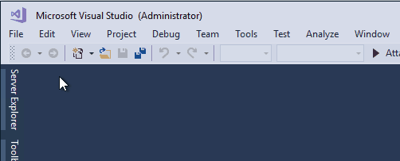
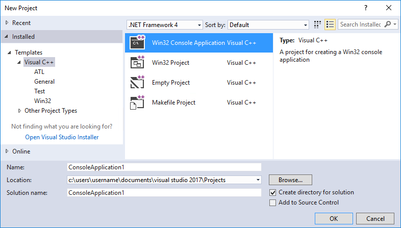
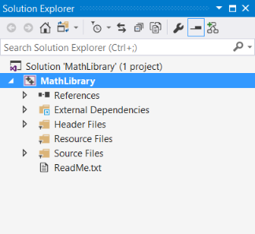
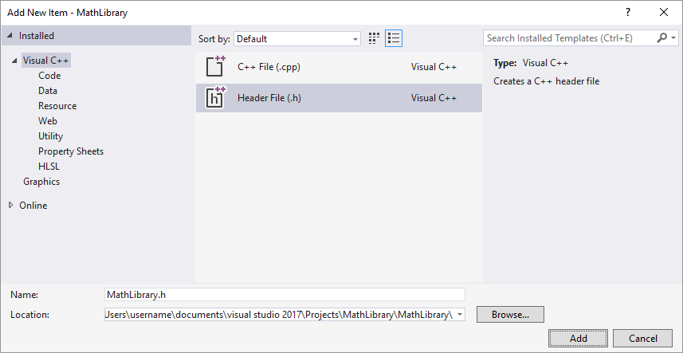

# Walkthrough: Create and use your own Dynamic Link Library (C++)  
  
This step-by-step walkthrough shows how to use the Visual Studio IDE to create your own dynamic link library (DLL) written in C++, and then use it from another C++ app. DLLs are one of the most useful kinds of Windows components. You can use them as a way to share code and resources, to shrink the size of your apps, and to make it easier to service and extend your apps. In this walkthrough, you create a DLL that implements some math functions, and then create a console app that uses the functions from the DLL. Along the way, you get an introduction to some of the programming techniques and conventions used in Windows DLLs.  
  
This walkthrough covers these tasks:  
  
-   Create a DLL project in Visual Studio.  
  
-   Add exported functions and variables to the DLL.  
  
-   Create a console app project in Visual Studio.  
  
-   Use the functions and variables imported from the DLL in the console app.  
  
-   Run the completed app.  
  
Like a statically linked library, a DLL _exports_ variables, functions, and resources by name, and your app _imports_ those names to use those variables, functions, and resources. Unlike a statically linked library, Windows connects the imports in your app to the exports in a DLL at load time or at run time, instead of connecting them at link time. Windows requires extra information that isn't part of the standard C++ compilation model to make these connections. The Visual C++ compiler implements some Microsoft-specific extensions to C++ to provide this extra information. We explain these extensions as we go.  
  
This walkthrough creates two Visual Studio solutions; one that builds the DLL, and one that builds the client app. The DLL uses the C calling convention so it can be called from apps built by using other languages, as long as the calling and linking conventions match. The client app uses _implicit linking_, where Windows links the app to the DLL at load-time. This lets the app call the DLL-supplied functions just like the functions in a statically linked library.  
  
This walkthrough doesn't cover some common situations. It doesn't show the use of C++ DLLs by other programming languages. It doesn't show how to create a resource-only DLL. It also doesn't show the use of explicit linking to load DLLs at run-time rather than at load-time. Rest assured, you can use Visual C++ to do all these things. For links to more information about DLLs, see [DLLs in Visual C++](../build/dlls-in-visual-cpp.md). For more information about implicit linking and explicit linking, see [Determining Which Linking Method to Use](../build/linking-an-executable-to-a-dll.md#determining-which-linking-method-to-use). For information about creating C++ DLLs for use with programming languages that use C-language linkage conventions, see [Exporting C++ Functions for Use in C-Language Executables](../build/exporting-cpp-functions-for-use-in-c-language-executables.md). For information about how to create DLLs for use with .NET languages, see [Calling DLL Functions from Visual Basic Applications](../build/calling-dll-functions-from-visual-basic-applications.md).  
  
## Prerequisites  
  
- A computer that runs Microsoft Windows 7 or later versions. We recommend Windows 10 for the best development experience.  
  
- A copy of Visual Studio 2017. For information on how to download and install Visual Studio, see [Install Visual Studio 2017](/visualstudio/install/install-visual-studio). When you run the installer, make sure that the **Desktop development with C++** workload is checked. Don't worry, if you didn't install this workload when you installed Visual Studio, you can run the installer again and install it now. 
  
     
  
- An understanding of the basics of using the Visual Studio IDE. If you've used Windows desktop apps before, you can probably keep up. For an introduction, see [Visual Studio IDE feature tour](/visualstudio/ide/visual-studio-ide).  
  
- An understanding of enough of the fundamentals of the C++ language to follow along. Don't worry, we don't do anything too complicated.  
  
## Create the DLL project  
  
In this set of tasks, you create a project and solution for your DLL, add code, and build it. To begin, start the Visual Studio IDE, and sign in if you need to. 

### To create a DLL project  
  
1.  On the menu bar, choose **File**, **New**, **Project**.  
  
     
  
2.  In the left pane of the **New Project** dialog box, if needed, expand **Installed**, **Templates**, and then choose **Visual C++**. In the center pane, select **Win32 Console Application**.  
  
     
  
3.  Specify a name for the project—for example, **MathLibrary**—in the **Name** box. Choose the **OK** button.  
  
     
  
4.  On the **Overview** page of the **Win32 Application Wizard** dialog box, choose the **Next** button.  
  
     
  
5.  On the **Application Settings** page, under **Application type**, select **DLL**. Choose the **Finish** button to create the project.  
  
     
  
When the wizard completes the solution, you can see the generated project and source files in the **Solution Explorer** window in Visual Studio.  
  
     
  
Right now, this DLL doesn't do very much. Next, you create a header file to declare the functions your DLL exports, and then add the function definitions to the DLL to make it more useful.  
  
### To add a header file to the DLL  
  
1.  To create a header file for your functions, on the menu bar, choose **Project**, **Add New Item**.  
  
1.  In the **Add New Item** dialog box, in the left pane, select **Visual C++**. In the center pane, select **Header File (.h)**. Specify a name for the header file—for example, **MathLibrary.h**—and then choose the **Add** button.  
  
     
  
   The template generates a blank header file, which is displayed in a new editor window.  
  
     
  
2.  Replace the contents of the header file with this code:  
  
    ```cpp  
    // MathLibrary.h - Contains declaration of interesting math functions  
    #pragma once  
    
    #include <limits.h>
    
    #ifdef MATHLIBRARY_EXPORTS  
    #define MATHLIBRARY_API __declspec(dllexport)   
    #else  
    #define MATHLIBRARY_API __declspec(dllimport)   
    #endif  
    
    // The Fibonacci recurrence relation describes a sequence F
    // where F(n) is { n = 0, a
    //               { n = 1, b
    //               { n > 1, F(n-2) + F(n-1)
    // for some initial integer values a and b.
    // If the sequence is initialized F(0) = 0, F(1) = 1,
    // then this relation produces the Fibonacci sequence,
    // 0, 1, 1, 2, 3, 5, 8, 13, 21, ...
    
    // Initialize a Fibonacci relation sequence
    // such that F(0) = a, F(1) = b. 
    // This function must be called before any other function.
    extern "C" MATHLIBRARY_API void fibonacci_init(
        const unsigned long long a = 0, const unsigned long long b = 1);
    
    // Produce the next value in the sequence.
    // Returns true on success and updates current value and index;
    // Returns false on overflow and leaves current value and index unchanged.
    extern "C" MATHLIBRARY_API bool fibonacci_next();
    
    // Get the current value in the sequence.
    extern "C" MATHLIBRARY_API unsigned long long fibonacci_current();
    
    // Get the current position in the sequence.
    extern "C" MATHLIBRARY_API unsigned fibonacci_index();
    ```  
  
This header file declares some functions to produce a generalized Fibonacci sequence, given two initial values. Default argument values 0 and 1 generate the familiar Fibonacci number sequence.  
  
Notice the preprocessor statements at the top of the file. By default, the New Project template for a DLL adds ***PROJECTNAME*\_EXPORTS** to the defined preprocessor macros for the DLL project. In this example, Visual Studio defines **MATHLIBRARY\_EXPORTS** when your **MathLibrary** DLL project is built.  
  
When the **MATHLIBRARY\_EXPORTS** macro is defined, the **MATHLIBRARY\_API** macro sets the `__declspec(dllexport)` modifier on the function declarations. This modifier tells the compiler and linker to export a function or variable from the DLL so that it can be used by other applications. When **MATHLIBRARY\_EXPORTS** is undefined, for example, when the header file is included by a client application, **MATHLIBRARY\_API** applies the `__declspec(dllimport)` modifier to the declarations. This modifier optimizes the import of the function or variable in an application. For more information, see [dllexport, dllimport](../cpp/dllexport-dllimport.md).  
  
### To add an implementation to the DLL

1.  In **Solution Explorer**, in the **Source Files** folder of the **MathLibrary** project, open **MathLibrary.cpp**.  
  
2.  Implement the functions declared in the header in this source file. Replace the contents of the **MathLibrary.cpp** file with the following code:  
  
    ```cpp  
    // MathLibrary.cpp : Defines the exported functions for the DLL application.
    #include "stdafx.h"
    #include <utility>
    #include "MathLibrary.h"
    
    // DLL internal state variables:
    static unsigned long long previous_;   // F(n-1) previous value, if any
    static unsigned long long current_;    // F(n) Current value in sequence
    static unsigned index_;                // Current position in sequence
    
    // Initialize a Fibonacci relation sequence
    // such that F(0) = a, F(1) = b. 
    // This function must be called before any other function.
    void fibonacci_init(
        const unsigned long long a,
        const unsigned long long b)a
    {
        index_ = 0;
        current_ = a;
        previous_ = b; // special case to store when initialized
    }
    
    // Produce the next value in the sequence.
    // Returns true on success, and updates current and previous values and 
    // index; returns false on overflow and leaves all values unchanged.
    bool fibonacci_next()
    {
        // check to see if we'd overflow result or position
        if ((ULLONG_MAX - previous_ < current_) || (UINT_MAX == index_))
        {
            return false;
        }
    
        // Special case for index == 0, just swap current and previous values
        if (index_ > 0)
        {
            previous_ += current_;
        }
        std::swap(current_, previous_);
        ++index_;
        return true;
    }
    
    // Get the current value in the sequence.
    unsigned long long fibonacci_current()
    {
        return current_;
    }
    
    // Get the current index position in the sequence.
    unsigned fibonacci_index()
    {
        return index_;
    }
    ```  
  
To verify that everything is working so far, compile the dynamic link library. To compile, choose **Build**, **Build Solution** on the menu bar. The output should look something like this:  
  
```Output  
1>------ Build started: Project: MathLibrary, Configuration: Debug Win32 ------
1>stdafx.cpp
1>dllmain.cpp
1>MathLibrary.cpp
1>   Creating library C:\Users\username\Documents\Visual Studio 2017\Projects\MathLibrary\Debug\MathLibrary.lib and object C:\Users\username\Documents\Visual Studio 2017\Projects\MathLibrary\Debug\MathLibrary.exp
1>MathLibrary.vcxproj -> C:\Users\username\Documents\Visual Studio 2017\Projects\MathLibrary\Debug\MathLibrary.dll
1>MathLibrary.vcxproj -> C:\Users\username\Documents\Visual Studio 2017\Projects\MathLibrary\Debug\MathLibrary.pdb (Partial PDB)
========== Build: 1 succeeded, 0 failed, 0 up-to-date, 0 skipped ==========
```  
  
> [!NOTE]
>  If you are building a project on the command line, use the [/D](../build/reference/d-preprocessor-definitions.md) compiler option to define your project's ***PROJECTNAME*_EXPORTS** preprocessor macro. Use the [/LD](../build/reference/md-mt-ld-use-run-time-library.md) compiler option to specify that the output file is a DLL. Use the [/EHsc](../build/reference/eh-exception-handling-model.md) compiler option to enable C++ exception handling.  
  
Congratulations, you've created a DLL using Visual C++! Next, you'll create a client app that uses the functions exported by the DLL.  
  
## Create a client app that uses the DLL  
  
When you create a DLL, you must think about how your DLL can be used. To compile code that calls the functions exported by a DLL, the declarations must be included in the client source code. At link time, when these calls to DLL functions are resolved, the DLL import library must be specified for the linker. And at run time, the DLL must be available to the client, in a location that the operating system can find.  
  
To make use of a DLL, whether your own or a third-party DLL, your client app project must be able to find the headers that declare the DLL exports, the import libraries for the linker, and the DLL itself. One way to do this is to copy all of these files into your client project. For third-party DLLs that are unlikely to change while your client is in development, this may be the best way to use them. However, when you also build the DLL, it's better to avoid duplication. If you make a copy of DLL files that are under development, you may accidentally change a header file in one copy but not the other, or use an out of date library. To avoid this problem, we recommend you set the include path in your client project to include the DLL header files from the DLL project. Also, set the library path in your client project to include the DLL import libraries from the DLL project. And finally, copy the built DLL from the DLL project into your build output directory. This ensures that your client app uses the same DLL code you built.  
  
### To create a client app  
  
1.  To create a C++ app that uses the DLL that you just created, on the menu bar, choose **File**, **New**, **Project**.  
  
2.  In the left pane of the **New Project** dialog, if needed, expand **Installed**, **Templates**, **Visual C++**, and then select **Win32**.  
  
3.  In the center pane, select **Win32 Console Application**.  
  
4.  Specify a name for the project, for example, **MathClient**, in the **Name** box.  
  
     
  
6.  On the **Overview** page of the **Win32 Application Wizard** dialog box, choose the **Next** button.  
  
7.  On the **Application Settings** page, under **Application type**, select **Console application**.  
  
8.  Choose the **Finish** button to create the project.  
  
When the Win32 Application Wizard finishes, a minimal console application project is created for you. The name for the main source file is the same as the project name that you chose earlier. In this example, it is named **MathClient.cpp**. You can build it, but it doesn't use your DLL yet.  
  
Next, to call the MathLibrary functions in your source code, your project must include the MathLibrary.h file. You could copy this header file into your client app project, but that might lead to changes in one copy that are not reflected in the other. To avoid this issue, you can change the **Additional Include Directories** path in your project to include the path to the original header.
  
### To add the DLL header to your include path  
  
1. Open the **Property Pages** dialog box for the **MathClient** project.  
  
2. In the left pane, expand **Configuration Properties**, **C/C++** node, and then select **General**.  
  
3. In the center pane, select the drop-down control next to the **Additional Include Directories** edit box, and then choose **\<Edit...>**.  
  
4. Select the top pane of the **Additional Include Directories** dialog box to enable an edit control.  
  
5. In the edit control, specify the path to the location of the **MathLibrary.h** header file. Because the complete path may be difficult to remember, use the browse control (**...**) at the end of the edit box to browse to the header location.  
  
6. In the **Select Directory** dialog box, navigate up two folder levels to find the **MathLibrary** solution folder, then select it, and then choose the **Select Folder** button.  
  
7. Once you've entered the path to the header file in the **Additional Include Directories** dialog box, choose the **OK** button to go back to the **Property Pages** dialog box, and then choose the **OK** button to save your changes.  
  
You can now include the **MathLibrary.h** file and use the functions it declares in your client application. Replace the contents of **MathClient.cpp** by using the following code:  
  
```cpp  
// MathClient.cpp : Client app for MathLibrary.
#include "stdafx.h"
#include <iostream>
#include <MathLibrary.h>

int main()
{
    // Initialize a Fibonacci sequence using default values 0 and 1.
    fibonacci_init();
    // Write out the Fibonacci sequence values until overflow.
    do {
        std::cout << fibonacci_index() << ": " 
            << fibonacci_current() << std::endl;
    } while (fibonacci_next());
    // Report how many sequence values were written before overflow.
    std::cout << fibonacci_index() + 1 << 
        " Fibonacci sequence values fit in an " <<
        "unsigned 64-bit integer." << std::endl;
}
```  
  
This code can be compiled, but the linker does not have the import library required to build the app yet. Once again, you could copy this file into your client app project, but that might lead to changes in one copy that are not reflected in the other. To avoid this issue, you can change the **Additional Library Directories** path in your project to include the path to the original library.
  
### To add the DLL import library to your library path  
  
1. Open the **Property Pages** dialog box for the **MathClient** project.  
  
1. In the left pane, expand the **Configuration Properties**, **Linker** node. In the center pane, select the drop-down control next to the **Additional Library Directories** edit box, and then choose **\<Edit...>**.  
  
     

1. Select the top pane of the **Additional Include Directories** dialog box to enable an edit control.  
  
1. In the edit control, specify the path to the location of the **MathLibrary.lib** file. Because the complete path may be difficult to remember, you can use the browse control (**...**) at the end of the edit box to navigate to the directory.  
  
1. In the **Select Directory** dialog box, navigate up two folder levels to find the **MathLibrary** solution folder, then select the **MathLibrary** project folder, and then choose the **Select Folder** button.  
  
1. Once you've entered the path to the header file in the **Additional Include Directories** dialog box, choose the **OK** button to go back to the **Property Pages** dialog box, and then choose the **OK** button to save your changes.  
  
Your client app can now be compiled and linked, but it still does not have everything it needs to run. When the operating system loads your app, it looks for the MathLibrary DLL. If it can't find the DLL in certain system directories, the environment path, or the local app directory, the load fails. One way to avoid this issue is to copy the DLL to the directory that contains your client executable as part of the build process. To copy the DLL, you can add a **Post-Build Event** to your project, to add a command that copies the file only if it is missing or has changed, and uses macros to copy to and from the correct locations for your configuration. 
  
### To copy the DLL in a post-build event  
  
1. Open the **Property Pages** dialog box for the **MathClient** project.  
  
1. In the Configuration drop-down box, select **All Configurations**.  
  
1. In the left pane, expand **Configuration Properties**, **Build Event**, then select **Post-Build Event**.  
  
1. In the center pane, select the drop-down control next to the **Command Line** field, and then choose **\<Edit...>**.  
  
1. In the top pane of the **Command Line** dialog box, enter this command:  
    `xcopy /y /d "..\..\MathLibrary\$(IntDir)MathLibrary.dll" "$(OutDir)"`  
  
1. Choose the **OK** button to save the command line.  
  
1. In the center pane, select the drop-down control next to the **Description** field, and then choose **\<Edit...>**.  
  
1. In the edit box in the **Description** dialog box, enter this description:  
    `Copy MathLibrary.dll to output directory` 
  
1. Choose the **OK** button the save the description, and then choose the **OK** button to save your changes to the project properties.  
  
Now your client app has everything it needs to build and run. Build the application by choosing **Build**, **Build Solution** on the menu bar. The Output window in Visual Studio might contain something like this:  
  
```Output  
1>------ Build started: Project: MathClient, Configuration: Debug Win32 ------
1>stdafx.cpp
1>MathClient.cpp
1>MathClient.vcxproj -> C:\Users\username\Documents\Visual Studio 2017\Projects\MathClient\Debug\MathClient.exe
1>MathClient.vcxproj -> C:\Users\username\Documents\Visual Studio 2017\Projects\MathClient\Debug\MathClient.pdb (Partial PDB)
1>1 File(s) copied
========== Build: 1 succeeded, 0 failed, 0 up-to-date, 0 skipped ==========
```  
  
Congratulations, you've created an application that calls functions in a DLL. Now run your application to see what it does. On the menu bar, choose **Debug**, **Start Without Debugging**. Visual Studio opens a command window for the program to run in. The last part of the output should look like this:  
  
```Output  
72: 498454011879264
73: 806515533049393
74: 1304969544928657
75: 2111485077978050
76: 3416454622906707
77: 5527939700884757
78: 8944394323791464
79: 14472334024676221
80: 23416728348467685
81: 37889062373143906
82: 61305790721611591
83: 99194853094755497
84: 160500643816367088
85: 259695496911122585
86: 420196140727489673
87: 679891637638612258
88: 1100087778366101931
89: 1779979416004714189
90: 2880067194370816120
91: 4660046610375530309
92: 7540113804746346429
93: 12200160415121876738
94 Fibonacci sequence values fit in an unsigned 64-bit integer.
Press any key to continue . . .
```  
  
Press any key to dismiss the command window.  
  
Now that you've created a DLL and a client application, you can experiment. Try setting breakpoints in the code of the client app, and run the app in the debugger. See what happens when you step into a library call. Add other functions to the library, or write another client app that uses your DLL.  
  
When you deploy your app, you must also deploy the DLLs it uses. The simplest way to make the DLLs that you build or that you include from third parties available to your app is to put them in the same directory as your app, also known as *app-local deployment*. For more information about deployment, see [Deployment in Visual C++](..\ide\deployment-in-visual-cpp.md).  
  
## See Also  
 [DLLs in Visual C++](../build/dlls-in-visual-cpp.md)   
 [Deploying Desktop Applications](../ide/deploying-native-desktop-applications-visual-cpp.md)   
 [Walkthrough: Deploying Your Program (C++)](../ide/walkthrough-deploying-your-program-cpp.md)   
 [Calling DLL Functions from Visual Basic Applications](../build/calling-dll-functions-from-visual-basic-applications.md)