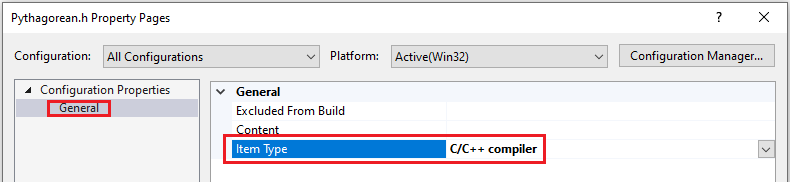
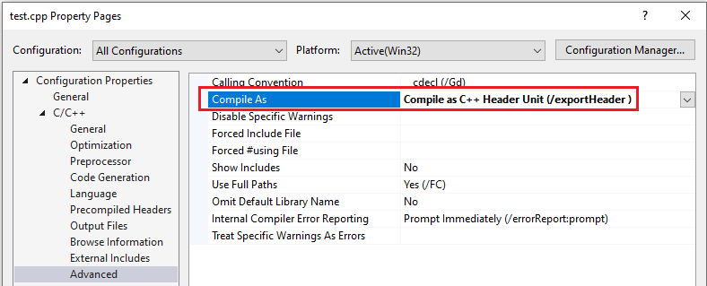

# Walkthrough: Build and import header units in Microsoft Visual C++

This article is about building and importing header units using Visual Studio 2019. See [Walkthrough: Import STL libraries using header units](walkthrough-import-stl-header-units.md) to learn specifically how to import Standard Template Library headers as header units.

Header units are a recommended alternative to [precompiled header files](creating-precompiled-header-files.md). They're easier to set up and easier to use than a [shared PCH](https://devblogs.microsoft.com/cppblog/shared-pch-usage-sample-in-visual-studio), while providing similar performance benefits. Unlike a PCH, when a header unit changes, only it and its dependencies are rebuilt.

## Prerequisites

Support for header units requires at least Visual Studio 2019 16.10.0 Preview 2.

## What is a header unit

Before you can import a header unit, it must first be compiled. Header units are a binary representation of a header file, and end with an `.ifc` extension.

An important feature of header units is that they're defined by the C++ standard, and can be used cross-platform.

Header units are also independent of the machine they're built on. One machine can produce IFCs and another machine consume them. A PCH can't do that because the persisted data structures are largely tied to the memory layout of the machine where they're compiled. 

Ideally, you should use the same compiler flags to compile the header unit and the program that imports it. Some flags, like `/EHsc`, `/MD[d]`, etc. have an impact on the semantics of the program that are captured in a header unit.

Header units provide a "module-like" experience for header files even though they lack the level of isolation provided by named modules. For example, everything in a header unit (including macro definitions) are visible, while those in a module aren't. Another difference is that header units aren't affected by macro definitions the way header files are. For example, you can't `#define` a symbol that causes the header unit to conditionally turn on and off functionality the way you can with a header file.

## Ways to compile a header unit

There are several ways to compile a file into a header unit:

-Automatically scan for header units: This approach is best suited to smaller projects, that include many different headers. See [Walkthrough: Import STL libraries as header units](walkthrough-import-stl-header-units.md#approach1) for a demonstration of this approach. The reason it is better suited to smaller projects, or for those where build time is not a crucial consideration, is because it takes extra time for the build system to scan all of the files to find what should be built into header units.

-Build a shared header units project: This approach is best suited for larger projects, and for when you want more control over the organization of the imported header units. You can build individual libraries containing the headers units you want, factored the way that makes the most sense for consumption in your project. You create a static library (or libraries) that contain the header units that you want, and then reference it from the projects that need its header imports. See [Walkthrough: Import STL libraries as header units](walkthrough-import-stl-header-units.md#approach2) for a demonstration of this approach.

Tell the build system which header units to build by changing the compilation action for a file. That approach is demonstrated here. This approach gives you file by file control over which header files are treated as header units. It's also a good way to quickly and selectively try out header units in your project.

To build header units from the headers in your codebase, you can use any of the methods above. To build and use header units for library headers, which aren't part of your codebase, use the technique described in [Walkthrough: Import STL libraries using header units](walkthrough-import-stl-header-units.md).
 
## Convert a project to use header units

In this example, you'll compile a header file as a header unit. Begin by creating the following project in Visual Studio:

1. Create a new C++ console app project.
1. Replace the source file contents as follows:
```cpp
#include "Pythagorean.h"

int main()
{
    PrintPythogoreanTriple(2,3);
    return 0;
}
```
1. Add a header file called `Pythagorean.h`, and replace its contents as follows:
```cpp
#pragma once
#include <iostream>

void PrintPythogoreanTriple(int a, int b)
{
    std::cout << "Pythagorean triple a:" << a << " b:" << b << " c:" << a*a + b*b << std::endl;
}
```

To enable header units, set the project C++ language standard to use the latest features:

1. In the left-hand pane of the project property pages, select **Configuration Properties** > **General**
1. Change the **C++ Language Standard** dropdown to **Preview-Features from the Latest C++ Working Draft**


### Compile a header file as a header unit

To compile a file as a header unit, open the file's properties by selecting it in the **Solution Explorer**. Right-click the file, and select **Properties**. Then do one of the following depending on the file type:

For header files:
- Set its **Item Type** property to **C/C++ compiler**. By default, header files have an **Item Type** of **C/C++ header**. Setting this property also sets **C/C++** > **Advanced** > **Compile As** to **Compile as C++ Header Unit (/exportHeader)** for you.


For source files:
- Set its **Compile As** property to **Compile as C++ Header Unit (/exportHeader)**.


### Change your code to import a header unit

In the source file for the example project, change `#include "Pythagorean.h"` to `import "Pythagorean.h";` (don't forget the trailing semicolon that is required for `import` statements). If the include file you are converting to a header unit is on the system include path, `#include <file>`, use `import <file>;`

Build the solution (**Build** > **Build Solution** from the main menu, or press `F6`) and run it to see that it produces the expected output: `Pythagorean triple a:2 b:3 c:13`

In your own projects, repeat this process to compile header files to header units.

If you only want to convert a few header files to header units, this is a good approach. But if you have many header files that you want to compile, and the convenience of having the build system automatically take care of it outweighs the impact on build performance, see [Walkthrough: Import STL libraries as header units](walkthrough-import-stl-header-units.md#approach1).

## See also

[Walkthrough: Import STL libraries as header units] \(walkthrough-import-stl-header-units.md#approach1) 
[Overview of modules in C++](../cpp/modules-cpp.md) \
[`/translateInclude`](./reference/translateinclude.md) \
[`/exportHeader`](./reference/module-exportheader.md) \
[`/headerUnit`](./reference/headerunit.md) \