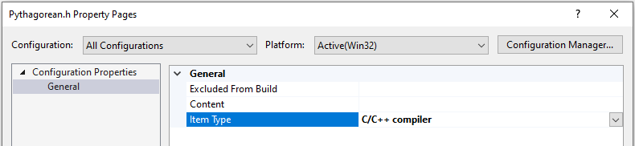

# Walkthrough: Build and import header units in Visual C++ projects

This section is about building and importing header units in Microsoft Visual C++. See [Walkthrough: Import STL libraries using header units]() to learn specifically how to import STL libraries as header units.

Header units are a simpler alternative to [precompiled header files](creating-precompiled-header-files.md). They are easier to setup and easier to use than a [shared PCH](https://devblogs.microsoft.com/cppblog/shared-pch-usage-sample-in-visual-studio), while providing similar performance benefits. Unlike a PCH, when a header unit changes, only it and its dependencies are rebuilt.

## Prerequisites

Support for header units requires Visual Studio 19.10 Preview 2.

## What is a header unit

Before you can import a header unit, it must first be compiled into a header unit. Header units are a binary representation of a header file, and end with an `.ifc` extension. Header units provide a "module-like" experience for header files even though they lack the level of isolation provided by named modules. For example, everything in a header unit (including macro definitions) are visible, while those in a module aren't. Another difference is that header units are not affected by macro definitions the way header files are. For example, you can't `#define` a symbol that causes the header unit to conditionally turn on and off functionality the way you can with a header file. Also, unlike `#include` files, header units are not  affected by the order they are imported in.

There are several ways to compile a file into a header unit:

1-Automatically scan for header units: This approach is best suited to smaller projects that include many different headers. See [Walkthrough: Import STL libraries as header units](walkthrough-import-stl-header-units.md#approach1) for a walkthrough of this approach.

2-Build a shared header units project: This approach is best suited for larger projects and when you want more control over the modularization of the imported header units. You create a static library that contains the header units, and then reference it from projects that consume the header units. See [Walkthrough: Import STL libraries as header units](walkthrough-import-stl-header-units.md#approach2) for a walkthrough of this approach.

3-Change the compilation action for a file. That's the approach demonstrated here. This approach gives you file by file control over which header files are treated as header units. It's a way to quickly and selectively try out header units.
 
## Convert a simple project to use header units

In this example you'll compile a header file as a header unit. Begin by creating the following project in Visual Studio:

1. Create a new C++ console app project.
1. Replace the source file contents as follows:
```cpp
#include "Pythagorean.h"

int main()
{
    PrintPythogoreanTriple(2,3);
    return 0;
}
```
1. Add a header file called `Pythagorean.h`, and modify it as follows:
```cpp
#pragma once
#include <iostream>

void PrintPythogoreanTriple(int a, int b)
{
    std::cout << "Pythagorean triple a:" << a << " b:" << b << " c: " << a*a + b*b << std::endl;
}
```

Change the C++ language standard for the compiler. The latest preview setting is necessary to use header units:

1. In the left-hand pane of the project property pages, select **C/C++** > **General**
1. Change the **C++ Language Standard** dropdown to **Preview - Features from the Latest C++ Working Draft**


### Set the header file to compile as a header unit

Change a header file to compile as a header unit as follows:

1. In the **Solution Explorer**, right-click the header file (`Pythagorean.h`) and select **Properties**.
1. Change the **Item Type** to **C/C++ compiler**

1. Click **OK**

You can also change the 
- For header files, set its **Item Type** to **C/C++ compiler**. By default, header files have an **Item Type** of **C/C++ header**
- If the header file extension is different from ".h", set the project-wide **Compile As** option to **Compile as C++ Header Unit (/exportHeader)**. This will cause #included files to be exported as header units.  

### Provide a list *.json thing


## Consuming header units

If you want to use modules or header units built outside of your solution/codebase, you can use C/C++ >  Additional Module dependencies & perhaps Additional Header Unit Dependencies. 


[this from](https://microsoft-my.sharepoint.com/:w:/p/gdr/Ea5Jy1oVuwxJpsiLYuem9FgBYioxSLmGER2QVPp4muq7vQ?e=4%3AW1atMJ&at=9&CID=AAA917D6-FC4D-41F0-9803-4DD2BD0B63CF&wdLOR=c6BFFEDA4-B56F-4FE8-AEFA-2F6A29107415)
Using ifc search path: 

Using ifc search path: 

`cl /ifcSearchDir [Dir1] /ifcSearchDir [Dir2] source.cpp `

In this case `ifcs` for header units (as well as named modules) will be found in the ifc search path by the names stored in the ifc. 

Using explicit `/headerUnit` reference 

`/headerUnit:angle vector=/path/to/some-file.ifc` 

The header file will be resolved by searching `<vector>` on the include path  

`/headerUnit:quote my/header.h=/path/to/some-file.ifc `

The header file will be resolved by searching `"my/header.h"` on the include path:

`/headerUnit /path/to/header=/path/to/some-file.ifc` 

The header file is explicitly specified by the path. 

In this case the resolved header path for import `<header>` or `import "header"` will be compared with the resolved header paths specified by `/headerUnit*` and the matching `.ifc` will be used (without comparing the name stored in the `.ifc`).

## Strategies for sharing C++ header units

Header units that are built as a part of a static library project, are automatically available to all directly and indirectly referencing projects. 

To use modules and header units built as a part of a dll project, their symbols have to be exported from the dll as any other C/C++ symbols and “All Modules arePublic” property should be set to true.

If you build header units for the headers in your codebase, you might want to control which ones should be automatically available to all referencing projects and which ones should be “private” by specifying  “Public C++ Modules Directories”. 

You might also want to specify “Public Include Directories” for your public headers to be automatically added to Include Directories (/I) in the referencing projects.

[Picture of header unit property pages]( see Building and using header units in VC projects.docx under Reusing built header units between different projects)

Ensure that projects that share header units are built with compatible compilation options, just as you would with shared pre-compiled headers. The compiler will issue warnings if it detects different compilation options in how the module or header unit was produced and how it is used.

If you reference two or more projects that built two or more modules with the same name or two or more header unit for the same header file,  you can use C/C++ >  Additional Module dependencies & Additional Header Unit Dependencies to resolve those collisions by specifying which module or header unit should be used for this project. Otherwise the one that is chosen is undefined.

## 3rd party

IDE usage 

People can create header_units.json in their headers directories. 

To translate 3rd party library headers, they will need to use /headerUnit:* switches.  

In VC projects they will be able to specify headers to translate as Additional Header Units Dependencies

## Project settings

project > properties

advanced > msvc toolset version **
or general > platform toolset

c/c++ > general > additional BMI directories (may be moved in newer versions?)
  also additional header unit dependencies, additional module dependencies
c/c++ > advanced
  has compile as
  has scan all source for module dependencies

## See also

[Overview of modules in C++](../cpp/modules-cpp.md)
[`/translateInclude`](./reference/translateinclude.md)
[`/exportHeader`](./reference/module-exportheader.md)
[`/headerUnit`](./reference/headerunit.md)
[Build faster using Standard Template Library (STL) header units]() to learn how to import STL libraries for faster compilation throughput.