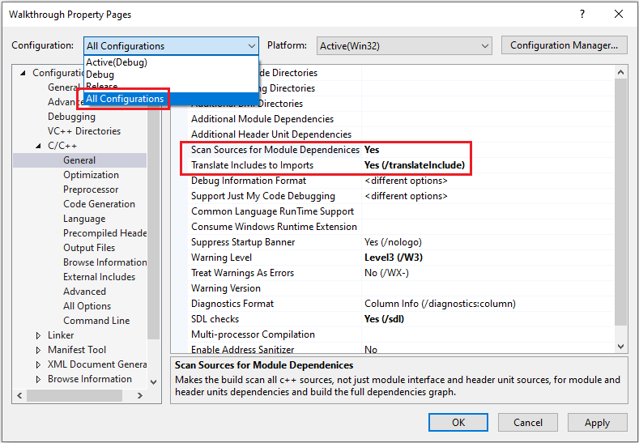
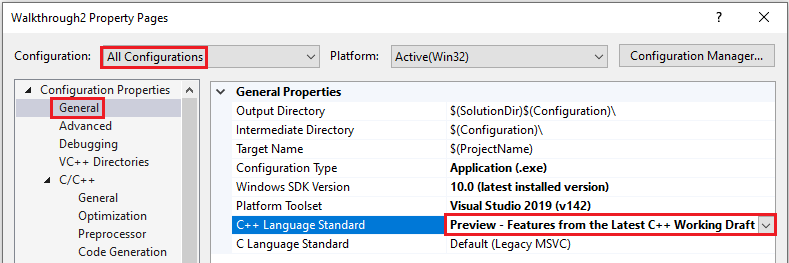
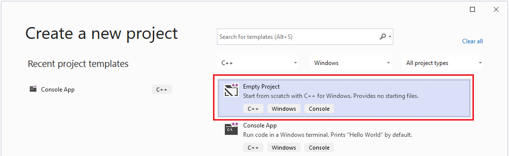
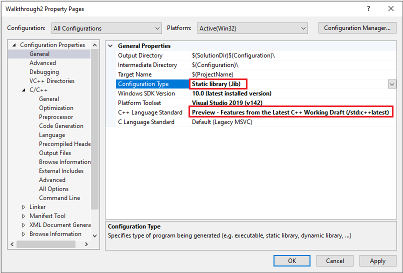

# Walkthrough: Import STL libraries as header units

This walkthrough shows two different ways to import C++ Standard Template Library (STL) libraries as header units in Visual Studio.

Importing an STL library as a header unit is a simpler alternative to [precompiled header files](creating-precompiled-header-files.md). Header units are easier to setup and easier to use than a shared precompiled header file (PCH), while providing similar performance benefits. Unlike a PCH, when a header unit changes, only it and its dependencies are rebuilt.

Before you can import an STL library this way, it must first be compiled into a header unit. Header units are a binary representation of a header file, and end with an `.ifc` extension. Header units provide a "module-like" experience for header files even though they lack the level of isolation provided by named modules. For example, macros in a header unit are visible, while those in a module aren't. Another difference is that header units are not affected by macro definitions the way header files are. For example, you can't `#define` a symbol that causes the header unit to conditionally turn on and off functionality the way you can with a header file. Also, unlike `#include` files, header units are not  affected by the order they are imported in.

## Prerequisites

Support for header units requires Visual Studio 2019 19.10 Preview 2.

## Two different approaches

Before an STL header can be imported, it needs to be compiled into a header unit. There are two main approaches to doing this, demonstrated below.

**Scan for module dependencies**

One approach, that requires minimal effort on your part, puts the burden on the build system. At a high level, it works by scanning your sources for `#include` directives, and tries to compile those header files and their dependencies into header units. It then imports the header unit instead of running the header file through the preprocessor. You don't even have to change your code from `#include <library>` to `import <library>;`. This may be a good approach for you if your codebase isn't large, or you just want to try out header units without changing your code.

It may not be the optimal approach for larger projects because it can be time consuming to scan through the files looking for files to build into header units. And it may result in reprocessing the same header files repeatedly, increasing build time. Not all header files can be automatically converted to header units. For example, headers that depend on conditional compilation via `#define` symbols, may not work as header units.

See [Approach 1: Scan for headers](#approach1), in this article, for a walkthrough of this approach.

**Create a shared library**

The recommended approach, particularly for larger projects, or for cases where you want to share a common set of header units across multiple projects, is to create a shared library that includes the STL libraries that you want to use. This library is then shared with projects that want to import those header units. It's like using [shared precompiled headers](https://devblogs.microsoft.com/cppblog/shared-pch-usage-sample-in-visual-studio/), but much easier.

See [Approach 2: Build a shared library](#approach2), in this article, for a walkthrough of this approach.

## <a name="approach1"></a>Approach 1: Scan for headers

We'll begin with the easiest way to import STL libraries as header units. As was said earlier, this approach may not be appropriate for larger projects because scanning the sources takes additional build time, especially in large projects.

This option is convenient for codebases with extensive use of different header units, and where build throughput isn't critical. This option doesn't guarantee that a header unit for a particular header will be built only once. However, header units built by referenced static libraries projects are reused.

You can import your STL libraries as header units without modifying your code by setting two Visual C++ project options:
- **Scan Sources for Module Dependencies**
- **Translate Includes to Imports**
 
These settings cause the build system to scan your source code and look for `#include` directives to compile into header units. For each successfully compiled header unit, the compiler then treats its corresponding  `#include` as an `import` and reads in the compiled header unit instead. There are other ways to indicate that a header file should be treated as a header unit besides scanning your entire project. That is covered in [Walkthrough: Build and import header units in Visual C++ projects](walkthrough-header-units.md).

To demonstrate this approach, we'll create a project that imports a couple STL libraries, and then change the project properties so that it treats the library includes as header imports.

### Create a C++ console app project

This step creates a project that includes two libraries: `<iostream>` and `<vector>`. You'll modify the project settings so that the project is scanned for potential header headers that can be compiled into header units, and the compiler will also treat `#include` as if you had written `import`.
1. With Visual Studio, create a new C++ console app project.
1. Modify the source file as follows:
```cpp
#include <iostream>
#include <vector>

int main()
{
    std::vector<int> numbers = {0, 1, 2};
    std::cout << numbers[1];
}
```

### Set project options and run the project

Use the following steps to set the options that cause the build system to scan for headers to compile into header units, and also the option that causes the compiler to treat `#include` as if you had written `import`:

1. From the main menu, choose **Project** > **Properties**. The project properties window appears.

1. Ensure that the **Configuration** dropdown is set to **All Configurations**
1. In the left-hand pane of the project property page, select **C/C++** > **General**
1. Set **Scan Sources for Module Dependencies** to **Yes**
1. Set **Translate Includes to Imports** to **Yes**

Change the C++ language standard for the compiler. The latest preview setting is necessary to use header units:

1. In the left-hand pane of the project property pages, select **General**
1. Change the **C++ Language Standard** dropdown to **Preview - Features from the Latest C++ Working Draft**



1. Click **OK** to close the project properties pages, and then build the solution: **Build** > **Build Solution** from the main menu, or press `F6`.

You can run the solution to verify that it produces the expected output: `1`

If you are updating an existing solution to use **Scan Sources for Module Dependencies**, set this property, and **Translate Includes to Imports**, in all of the projects in your solution where you want to use header units.

The primary considerations of this approach are the balance between convenience and the cost of scanning all of your files to determine which header files to build as header units.

You can fine-tune this balance by not scanning for module dependencies, and instead explicitly marking which files should be built as header units. This is explored in more detail in [Walkthrough: Build and import header units in your Visual C++ projects](walkthrough-header-units.md)

## <a name="approach2"></a>Approach 2: Build a shared library

The more flexible and more performant way to consume STL headers is to create a project, or projects, that build common header units from the STL headers you want to use. Then reference that project, or projects, from the projects that need those STL headers.

This option ensures that header units for a particular header will be built only once. It's similar to using a shared precompiled header file, but is much easier.

In this example, you'll create a project that imports `<iostream>` and `<vector>`. Once built, you'll reference this shared project from another C++ project. Then, in the referencing project, everywhere `import <iostream>` or `import <vector>` is found, it will import the built header unit for that library instead of running the contents of the library header through the preprocessor. In projects that include the same library header in multiple files, this will improve build performance similar to the way PCH files do because the header won't have to be processed repeatedly. Instead, the compiled header unit will be imported.

### Create the shared project

Begin by creating the project for the shared header units as follows:

1. Create an Empty C++ project. Call it, for the sake of this example, **SharedPrj**. **Empty C++ project** is one of the project types available on the **Create a new project** window:

1. Add a new (empty) C++ file to the project. Change the file's contents to the following:

```cpp
import <iostream>;
import <vector>;
```

### Set project properties

Next, set project properties to share the header units from this project:

1. From the Visual Studio main menu, choose **Project** > **Properties**. The project properties window appears:

1. Ensure that the **Configuration** dropdown is set to **All Configurations**
1. In the left-hand pane of the project property page, select **General**
1. Change the **Configuration Type** option to **Static library (.lib)**
1. Change **C++ Language Standard** to **Preview - Features from the Latest C++ Working Draft**
1. In the left-hand pane of the project property page, select **C/C++** > **General**

1. Set the **Scan Sources for Module Dependencies** dropdown to **Yes**
1. Set the **Translate Includes to Imports** dropdown to **Yes**. Setting this causes the build to not only produce header units for the headers you specify in your source code, but also for all headers that are included by those headers. And also those listed in the STL library’s `header-units.json` file (see [Advanced](#advanced)), below, for details about this file. This ensures minimal symbols duplication in the header units and the best build throughput.
1. Click **OK** to close the project properties pages and then build the solution: **Build** > **Build Solution** from the main menu, or press `F6`.

## Consume the STL header unit project

Next, create a project that will use the built `<vector>` and `<iostream>` STL header units:

1. With the current solution still open, from the Visual Studio menu select **File** > **Add**  > **New Project**
1. Add a C++ Console app project. Call it **Walkthrough**, for this example
1. Change the contents of its source file as follows:

```cpp
import <iostream>;
import <vector>;

int main()
{
    std::vector<int> numbers = {0, 1, 2};
    std::cout << numbers[1];
}
```

Change the C++ language standard for the compiler. The latest preview setting is necessary to use header units:
1. In the **Solution Explorer**, select right-click the **Walkthrough** project and select **Properties**. The project properties window appears.

1. In the left-hand pane of the **Walkthrough** project property pages, select **Configuration Properties** > **General**
1. Change **C++ Language Standard** to **Preview - Features from the Latest C++ Working Draft**
1. Click **OK** to close the project properties pages
1. Add a reference from the **Walkthrough** project to the **SharedPrj** project. To do so, under the **Walkthrough** project, click on the **References** node, and select **Add Reference**. Select **SharedPrj** from the list of projects. What this reference accomplishes is that the build system will use the header units built by **SharedPrj** whenever an `import` in the **Walkthrough** project matches one of the built header units in **SharedPrj**
1. Click **OK** to close the **Add Reference** dialog
1. Right-click the **Walkthrough** project and select **Set as Startup Project**

Then you can build the solution (**Build** > **Build Solution** from the main menu, or press `F6`) and run it to see that it produces the expected output: `1`

The advantage of this approach is that you can reference the static library from any project to reuse the header units in it. In this example, that's `<vector>` and `<iostream>`.  

You could make a monolithic library containing all the commonly used STL headers that you want to import from your various projects. Or, you could produce multiple shared libraries that have different groupings of STL libraries that you want to import as header units. Then reference those shared projects as needed.

The result should be increased build throughput because the header units are only built once, and then imported without having to run them through the preprocessor repeatedly. Again, it's the benefits of a PCH, but much easier to build, maintain, and use.

It's important when you do this with your own projects that you build the shared library using compiler switches that are compatible with the project that will consume it. For example, STL projects should be built with the `/EHsc` compiler switch to turn on exception handling, and so should the projects that consume the shared library.

## Advanced

Not all STL libraries, or header files for that matter, can be compiled into a header unit and imported. There's an allowlist for the STL headers that the build system consults to determine which STL libraries can be compiled into header units.

The [header-units.json](header-unit-json-reference.md) file is at the root of the include directory where your STL header files are installed. For example, `C:\Program Files (x86)\Microsoft Visual Studio\2019\Enterprise\VC\Tools\MSVC\14.20.00001\include`. It lists which STL libraries can be compiled into header units. Some can't. For example, `<cassert>` shouldn't be compiled as a header unit because it depends on a `#define` to modify its behavior, and using `#define` can't be used to change the behavior of a header unit.
 
## See also

[Walkthrough: Build and import header units in your Visual C++ projects](walkthrough-header-units.md)