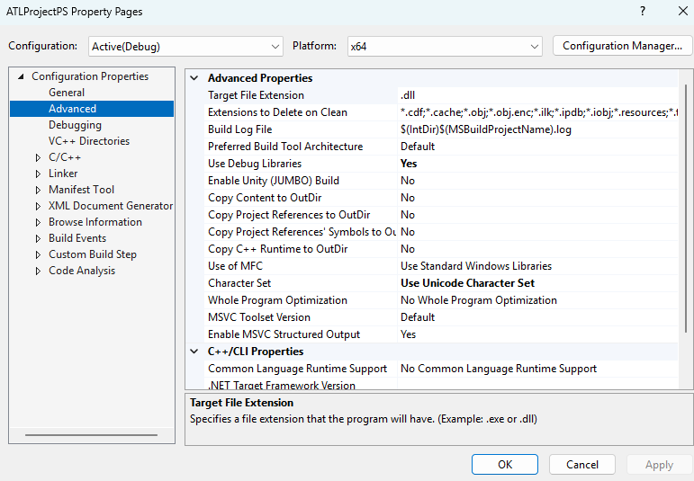
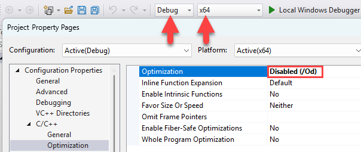
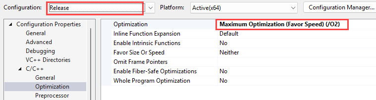
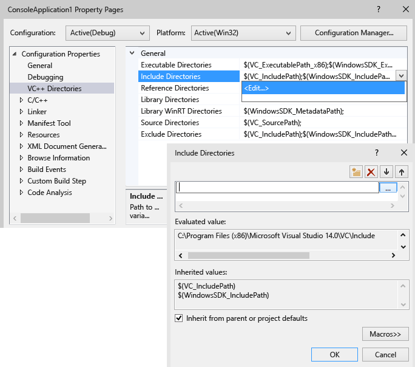

# Set compiler and build properties

In the IDE, all information that is needed to build a project is exposed as *properties*. This information includes the application name, extension (such as DLL, LIB, EXE), compiler options, linker options, debugger settings, custom build steps, and many other things. Typically, you use *property pages* ( **Project &#124; Properties**) to view and modify these properties. To access the property pages, choose **Project > \<project name> Properties** from the main menu, or right-click on the project node in **Solution Explorer** and choose **Properties**.

## Default properties

When you create a project, the system assigns values for various properties. The defaults vary somewhat depending on the kind of project and what options you choose in the app wizard. For example, an ATL project has properties related to MIDL files, but these are absent in a basic console application. The default properties are shown in the General pane in the Property Pages:

## Applying properties to build configurations and target platforms

Some properties, such as the application name, apply to all build variations, regardless of the target platform or whether it is a debug or release build. But most properties are configuration-dependent. This is because the compiler has to know what specific platform the program will run on and what specific compiler options to use in order to generate the correct code. Therefore, when you set a property, it is important to pay attention to which configuration and platform the new value should apply to. Should it apply only to Debug Win32 builds, or should it also apply to Debug ARM and Debug x64? For example, the **Optimization** property, by default, is set to **Maximize Speed (/O2)** in a Release configuration, but is disabled in the Debug configuration.

The property pages are designed so that you can always see, and if necessary modify, which configuration and platform a property value should apply to. The following illustration shows the property pages with the configuration and platform information in the list boxes at the top. When the **Optimization** property is set here, it will apply only to Debug Win32 builds, which happens to be the active configuration, as shown by the red arrows.

The following illustration shows the same project property page, but the configuration has been changed to Release. Note the different value for the Optimization property. Also note that the active configuration is still Debug. You can set properties for any configuration here; it doesn't have to be the active one.

## Target platforms

*Target platform* refers to the kind of device and/or operating system that the executable will run on. You can build a project for more than one platform. The available target platforms for C++ projects depend on the kind of project; they include but are not limited to Win32, x64, ARM, Android, and iOS.     The **x86** target platform that you might see in **Configuration Manager** is identical to **Win32** in native C++ projects. Win32 means 32-bit Windows and **x64** means 64-bit Windows. For more information about these two platforms, see [Running 32-bit applications](/windows/desktop/WinProg64/running-32-bit-applications).

The **Any CPU** target platform value that you might see in **Configuration Manager** has no effect on native C++ projects; it is relevant for C++/CLI and other .NET project types. For more information, see [/CLRIMAGETYPE (Specify Type of CLR Image)](reference/clrimagetype-specify-type-of-clr-image.md).

For more information about setting properties for a Debug build, see:

- [Project settings for a C++ debug configuration](/visualstudio/debugger/project-settings-for-a-cpp-debug-configuration)
- [Debugger Settings and Preparation](/visualstudio/debugger/debugger-settings-and-preparation)
- [Debugging Preparation: Visual C++ Project Types](/visualstudio/debugger/debugging-preparation-visual-cpp-project-types)
- [Specify symbol (.pdb) and source files in the Visual Studio debugger](/visualstudio/debugger/specify-symbol-dot-pdb-and-source-files-in-the-visual-studio-debugger)

## C++ compiler and linker options

C++ compiler and linker options are located under the **C/C++** and **Linker** nodes in the left pane under **Configuration Properties**. These translate directly to command-line options that will be passed to the compiler. To read documentation about a specific option, select the option in the center pane and press **F1**. Or, you can browse documentation for all the options at [Compiler Options](reference/compiler-options.md) and [Linker Options](reference/linker-options.md). 

The **Property Pages** dialog box shows only the property pages that are relevant to the current project. For example, if the project does not have an .idl file, the MIDL property page is not displayed. For more information about the setting on each property pages, see [Property Pages (C++)](reference/property-pages-visual-cpp.md). 

## Directory and path values

MSBuild supports the use of compile-time constants called "macros" for certain string values include directories and paths. These are exposed in the property pages, where you can refer to and modify them by using the [Property Editor](#property_editor). 

The following illustration shows the property pages for a Visual C++ project. In the left pane, the **VC++ Directories** *rule* is selected, and the right pane lists the properties that are associated with that rule. The `$(...)` values are called *macros*. A *macro* is a compile-time constant that can refer to a value that is defined by Visual Studio or the MSBuild system, or to a user-defined value. By using macros instead of hard-coded values such as directory paths, you can more easily share property settings between machines and between versions of Visual Studio, and you can better ensure that your project settings participate correctly in [property inheritance](project-property-inheritance.md). 

You can use the Property Editor to view the values of all available macros. Macros are discussed in the [Property page macros](#bkmkPropertiesVersusMacros) section later in this article.)

### Predefined macros

*global macros* 
Applies to all items in a project configuration. Has the syntax `$(name)`. An example of a global macro is `$(VCInstallDir)`, which stores the root directory of your Visual Studio installation. A global macro corresponds to a `PropertyGroup` in MSBuild.

*item macros* 
Has the syntax `%(name)`. For a file, an item macro applies only to that file—for example, you can use `%(AdditionalIncludeDirectories)` to specify include directories that apply only to a particular file. This kind of item macro corresponds to an `ItemGroup` metadata in MSBuild. When it's used in the context of a project configuration, an item macro applies to all files of a certain type. For example, the C/C++ **Preprocessor Definitions** configuration property can take a `%(PreprocessorDefinitions)` item macro that applies to all .cpp files in the project. This kind of item macro corresponds to an `ItemDefinitionGroup` metadata in MSBuild. For more information, see [Item Definitions](/visualstudio/msbuild/item-definitions).

### User-defined macros

You can create *user-defined macros* to use as variables in project builds. For example, you could create a user-defined macro that provides a value to a custom build step or a custom build tool. A user-defined macro is a name/value pair. In a project file, use the **$(**<em>name</em>**)** notation to access the value.

A user-defined macro is stored in a property sheet. If your project does not already contain a property sheet, you can create one by following the steps under [Creating reusable property configurations](#bkmkPropertySheets).

#### To create a user-defined macro

1. In the **Property Manager** window (on the menu bar, choose **View**, **Property Manager**), open the shortcut menu for a property sheet (its name ends in .user) and then choose Properties. The **Property Pages** dialog box for that property sheet opens.

1. In the left pane of the dialog box, select **User Macros**. In the right pane, choose the **Add Macro** button to open the **Add User Macro** dialog box.

1. In the dialog box, specify a name and value for the macro. Optionally, select the **Set this macro as an environment variable in the build environment** check box.

## <a name="property_editor">Property Editor</a>

You can use the Property Editor to modify certain string properties and select macros as values. To access the Property Editor, select a property on a property page and then choose the down arrow button on the right. If the drop-down list contains **\<Edit>**, then you can choose it to display the Property Editor for that property.

In the Property Editor, you can choose the **Macros** button to view the available macros and their current values. The following illustration shows the Property Editor for the **Additional Include Directories** property after the **Macros** button was chosen. When the **Inherit from parent or project defaults** check box is selected and you add a new value, it is appended to any values that are currently being inherited. If you clear the check box, your new value replaces the inherited values. In most cases, leave the check box selected.

## Add an include directory to the set of default directories

When you add an include directory to a project, it is important not to override all the default directories. The correct way to add a directory is to append the new path, for example "C:\MyNewIncludeDir\", and then to Append the **$(IncludePath)** macro to the property value.

## Quickly browse and search all properties

The **All Options** property page (under the **Configuration Properties &#124; C/C++** node in the **Property Pages** dialog box) provides a quick way to browse and search the properties that are available in the current context. It has a special search box and a simple syntax to help you filter results:

No prefix: 
Search in property names only (case-insensitive substring).

'/' or '-' : 
Search only in compiler switches (case-insensitive prefix)

v: 
Search only in values (case-insensitive substring).

## Set environment variables for a build

The Visual C++ compiler (cl.exe) recognizes certain environment variables, specifically LIB, LIBPATH, PATH, and INCLUDE. When you build with the IDE, the properties that are set in the [VC++ Directories Property Page](reference/vcpp-directories-property-page.md) property page are used to set those environment variables. If LIB, LIBPATH, and INCLUDE values have already been set, for example by a Developer Command Prompt, they are replaced with the values of the corresponding MSBuild properties. The build then prepends the value of the VC++ Directories executable directories property to PATH. You can set a user-defined environment variable by created a user-defined macro and then checking the box that says **Set this macro as an environment variable in the build environment**.

## Set environment variables for a debugging session

In the left pane of the project's **Property Pages** dialog box, expand **Configuration Properties** and then select **Debugging**.

In the right pane, modify the **Environment** or **Merge Environment** project settings and then choose the **OK** button.

## In this section

[Share or resuse Visual Studio project settings](create-reusable-property-configurations.md) 
How to create a .props file with custom build settings that can be shared or resused.

[Project property inheritance](project-property-inheritance.md) 
Describes the order of evaluation for the .props, .targets, .vcxproj files and environment variables in the build process.

[Modify properties and targets without changing the project file](modify-project-properties-without-changing-project-file.md) 
How to create temporary build settings without having to modify a project file. 

## See also

[Creating and Managing Visual C++ Projects](creating-and-managing-visual-cpp-projects.md) 
[.vcxproj and .props file structure](reference/vcxproj-file-structure.md) 
[Property page XML files](reference/property-page-xml-files.md) 
