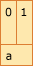
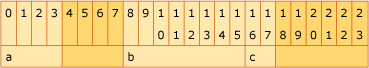
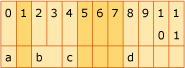
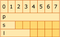

# x64 software conventions

This section describes the C++ calling convention methodology for x64, the 64-bit extension to the x86 architecture.

## Overview of x64 calling conventions

Two important differences between x86 and x64 are the 64-bit addressing capability and a flat set of 16 64-bit registers for general use. Given the expanded register set, x64 uses the [__fastcall](../cpp/fastcall.md) calling convention and a RISC-based exception-handling model. The **`__fastcall`** convention uses registers for the first four arguments and the stack frame to pass additional arguments. For details on the x64 calling convention, including register usage, stack parameters, return values, and stack unwinding, see [x64 calling convention](x64-calling-convention.md).

## Enable optimization for x64

The following compiler option helps you optimize your application for x64:

- [/favor (Optimize for Architecture Specifics)](../build/reference/favor-optimize-for-architecture-specifics.md)

## Types and storage

This section describes the enumeration and storage of data types for the x64 architecture.

### Scalar types

Although it's possible to access data with any alignment, it's recommended to align data on its natural boundary, or some multiple, to avoid performance loss. Enums are constant integers and are treated as 32-bit integers. The following table describes the type definition and recommended storage for data as it pertains to alignment using the following alignment values:

- Byte - 8 bits

- Word - 16 bits

- Doubleword - 32 bits

- Quadword - 64 bits

- Octaword - 128 bits

|Scalar Type|C Data Type|Storage Size (in bytes)|Recommended Alignment|
|-|-|-|-|
|**`INT8`**|**`char`**|1|Byte|
|**`UINT8`**|**`unsigned char`**|1|Byte|
|**`INT16`**|**`short`**|2|Word|
|**`UINT16`**|**`unsigned short`**|2|Word|
|**`INT32`**|**`int`**, **`long`**|4|Doubleword|
|**`UINT32`**|**`unsigned int`**, **`unsigned long`**|4|Doubleword|
|**`INT64`**|**`__int64`**|8|Quadword|
|**`UINT64`**|**`unsigned __int64`**|8|Quadword|
|**`FP32`** (single precision)|**`float`**|4|Doubleword|
|**`FP64`** (double precision)|**`double`**|8|Quadword|
|**`POINTER`**|__\*__|8|Quadword|
|**`__m64`**|**`struct __m64`**|8|Quadword|
|**`__m128`**|**`struct __m128`**|16|Octaword|

### Aggregates and unions

Other types, such as arrays, structs, and unions, have stricter alignment requirements that ensure consistent aggregate and union storage and data retrieval. Here are the definitions for array, structure, and union:

- Array

   Contains an ordered group of adjacent data objects. Each object is called an *element*. All elements within an array have the same size and data type.

- Structure

   Contains an ordered group of data objects. Unlike the elements of an array, the data objects within a structure can have different data types and sizes. Each data object in a structure is called a *member*.

- Union

   An object that holds any one of a set of named members. The members of the named set can be of any type. The storage allocated for a union is equal to the storage required for the largest member of that union, plus any padding required for alignment.

The following table shows the strongly suggested alignment for the scalar members of unions and structures.

|Scalar Type|C Data Type|Required Alignment|
|-|-|-|
|**`INT8`**|**`char`**|Byte|
|**`UINT8`**|**`unsigned char`**|Byte|
|**`INT16`**|**`short`**|Word|
|**`UINT16`**|**`unsigned short`**|Word|
|**`INT32`**|**`int`**, **`long`**|Doubleword|
|**`UINT32`**|**`unsigned int`**, **`unsigned long`**|Doubleword|
|**`INT64`**|**`__int64`**|Quadword|
|**`UINT64`**|**`unsigned __int64`**|Quadword|
|**`FP32`** (single precision)|**`float`**|Doubleword|
|**`FP64`** (double precision)|**`double`**|Quadword|
|**`POINTER`**|<strong>\*</strong>|Quadword|
|**`__m64`**|**`struct __m64`**|Quadword|
|**`__m128`**|**`struct __m128`**|Octaword|

The following aggregate alignment rules apply:

- The alignment of an array is the same as the alignment of one of the elements of the array.

- The alignment of the beginning of a structure or a union is the maximum alignment of any individual member. Each member within the structure or union must be placed at its proper alignment as defined in the previous table, which may require implicit internal padding, depending on the previous member.

- Structure size must be an integral multiple of its alignment, which may require padding after the last member. Since structures and unions can be grouped in arrays, each array element of a structure or union must begin and end at the proper alignment previously determined.

- It is possible to align data in such a way as to be greater than the alignment requirements as long as the previous rules are maintained.

- An individual compiler may adjust the packing of a structure for size reasons. For example [/Zp (Struct Member Alignment)](../build/reference/zp-struct-member-alignment.md) allows for adjusting the packing of structures.

### Examples of Structure Alignment

The following four examples each declare an aligned structure or union, and the corresponding figures illustrate the layout of that structure or union in memory. Each column in a figure represents a byte of memory, and the number in the column indicates the displacement of that byte. The name in the second row of each figure corresponds to the name of a variable in the declaration. The shaded columns indicate padding that is required to achieve the specified alignment.

#### Example 1

```C
// Total size = 2 bytes, alignment = 2 bytes (word).

_declspec(align(2)) struct {
    short a;      // +0; size = 2 bytes
}
```



#### Example 2

```C
// Total size = 24 bytes, alignment = 8 bytes (quadword).

_declspec(align(8)) struct {
    int a;       // +0; size = 4 bytes
    double b;    // +8; size = 8 bytes
    short c;     // +16; size = 2 bytes
}
```



#### Example 3

```C
// Total size = 12 bytes, alignment = 4 bytes (doubleword).

_declspec(align(4)) struct {
    char a;       // +0; size = 1 byte
    short b;      // +2; size = 2 bytes
    char c;       // +4; size = 1 byte
    int d;        // +8; size = 4 bytes
}
```



#### Example 4

```C
// Total size = 8 bytes, alignment = 8 bytes (quadword).

_declspec(align(8)) union {
    char *p;      // +0; size = 8 bytes
    short s;      // +0; size = 2 bytes
    long l;       // +0; size = 4 bytes
}
```



### Bitfields

Structure bit fields are limited to 64 bits and can be of type signed int, unsigned int, int64, or unsigned int64. Bit fields that cross the type boundary will skip bits to align the bitfield to the next type alignment. For example, integer bitfields may not cross a 32-bit boundry.

### Conflicts with the x86 compiler

Data types that are larger than 4 bytes are not automatically aligned on the stack when you use the x86 compiler to compile an application. Because the architecture for the x86 compiler is a 4 byte aligned stack, anything larger than 4 bytes, for example, a 64-bit integer, cannot be automatically aligned to an 8-byte address.

Working with unaligned data has two implications.

- It may take longer to access unaligned locations than it takes to access aligned locations.

- Unaligned locations cannot be used in interlocked operations.

If you require more strict alignment, use `__declspec(align(N))` on your variable declarations. This causes the compiler to dynamically align the stack to meet your specifications. However, dynamically adjusting the stack at run time may cause slower execution of your application.

## Register usage

The x64 architecture provides for 16 general-purpose registers (hereafter referred to as integer registers) as well as 16 XMM/YMM registers available for floating-point use. Volatile registers are scratch registers presumed by the caller to be destroyed across a call. Nonvolatile registers are required to retain their values across a function call and must be saved by the callee if used.

### Register volatility and preservation

The following table describes how each register is used across function calls:

|Register|Status|Use|
|-|-|-|
|RAX|Volatile|Return value register|
|RCX|Volatile|First integer argument|
|RDX|Volatile|Second integer argument|
|R8|Volatile|Third integer argument|
|R9|Volatile|Fourth integer argument|
|R10:R11|Volatile|Must be preserved as needed by caller; used in syscall/sysret instructions|
|R12:R15|Nonvolatile|Must be preserved by callee|
|RDI|Nonvolatile|Must be preserved by callee|
|RSI|Nonvolatile|Must be preserved by callee|
|RBX|Nonvolatile|Must be preserved by callee|
|RBP|Nonvolatile|May be used as a frame pointer; must be preserved by callee|
|RSP|Nonvolatile|Stack pointer|
|XMM0, YMM0|Volatile|First FP argument; first vector-type argument when **`__vectorcall`** is used|
|XMM1, YMM1|Volatile|Second FP argument; second vector-type argument when **`__vectorcall`** is used|
|XMM2, YMM2|Volatile|Third FP argument; third vector-type argument when **`__vectorcall`** is used|
|XMM3, YMM3|Volatile|Fourth FP argument; fourth vector-type argument when **`__vectorcall`** is used|
|XMM4, YMM4|Volatile|Must be preserved as needed by caller; fifth vector-type argument when **`__vectorcall`** is used|
|XMM5, YMM5|Volatile|Must be preserved as needed by caller; sixth vector-type argument when **`__vectorcall`** is used|
|XMM6:XMM15, YMM6:YMM15|Nonvolatile (XMM), Volatile (upper half of YMM)|Must be preserved by callee. YMM registers must be preserved as needed by caller.|

On function exit and on function entry to C Runtime Library calls and Windows system calls, the direction flag in the CPU flags register is expected to be cleared.

## Stack usage

For details on stack allocation, alignment, function types and stack frames on x64, see [x64 stack usage](stack-usage.md).

## Prolog and epilog

Every function that allocates stack space, calls other functions, saves nonvolatile registers, or uses exception handling must have a prolog whose address limits are described in the unwind data associated with the respective function table entry, and epilogs at each exit to a function. For details on the required prolog and epilog code on x64, see [x64 prolog and epilog](prolog-and-epilog.md).

## x64 exception handling

For information on the conventions and data structures used to implement structured exception handling and C++ exception handling behavior on the x64, see [x64 exception handling](exception-handling-x64.md).

## Intrinsics and inline assembly

One of the constraints for the x64 compiler is to have no inline assembler support. This means that functions that cannot be written in C or C++ will either have to be written as subroutines or as intrinsic functions supported by the compiler. Certain functions are performance sensitive while others are not. Performance-sensitive functions should be implemented as intrinsic functions.

The intrinsics supported by the compiler are described in [Compiler Intrinsics](../intrinsics/compiler-intrinsics.md).

## Image format

The x64 executable image format is PE32+. Executable images (both DLLs and EXEs) are restricted to a maximum size of 2 gigabytes, so relative addressing with a 32-bit displacement can be used to address static image data. This data includes the import address table, string constants, static global data, and so on.

## See also

[Calling Conventions](../cpp/calling-conventions.md)
