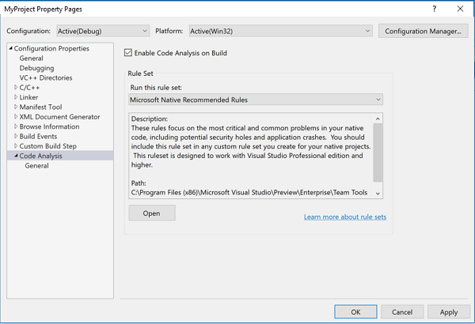
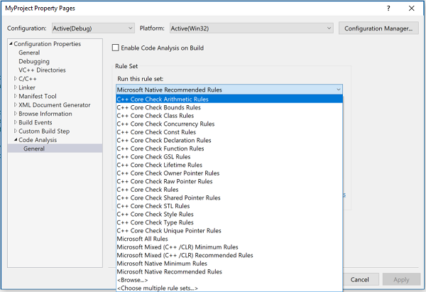

# Use the C++ Core Guidelines checkers

The C++ Core Guidelines are a portable set of guidelines, rules, and best practices about coding in C++ created by C++ experts and designers. Visual Studio currently supports a subset of these rules as part of its code analysis tools for C++. The core guideline checkers are installed by default in Visual Studio 2017 and Visual Studio 2019. They're [available as a NuGet package for Visual Studio 2015](#vs2015_corecheck).

## The C++ Core Guidelines Project

Created by Bjarne Stroustrup and others, the C++ Core Guidelines are a guide to using modern C++ safely and effectively. The Guidelines emphasize static type safety and resource safety. They identify ways to eliminate or minimize the most error-prone parts of the language. They also suggest how to make your code simpler, more reliable, and have better performance. These guidelines are maintained by the Standard C++ Foundation. To learn more, see the documentation, [C++ Core Guidelines](https://isocpp.github.io/CppCoreGuidelines/CppCoreGuidelines), and access the C++ Core Guidelines documentation project files on [GitHub](https://github.com/isocpp/CppCoreGuidelines).

## Enable the C++ Core Check guidelines in Code Analysis

::: moniker range="<=msvc-150"

A subset of C++ Core Check rules is included in the Microsoft Native Recommended rule set. It's the ruleset that runs by default when code analysis is enabled.

### To enable code analysis on your project

1. Open the  **Property Pages** dialog for your project.

1. Select the **Configuration Properties** > **Code Analysis** property page.

1. Select the **Enable Code Analysis on Build** checkbox.



To enable additional Core Check rules, open the dropdown list and choose which rule sets you want to include:



::: moniker-end
::: moniker range=">=msvc-160"

A subset of C++ Core Check rules is included in the Microsoft Native Recommended rule set. It's the ruleset that runs by default when Microsoft code analysis is enabled.

### To enable code analysis on your project:

1. Open the  **Property Pages** dialog for your project.

1. Select the **Configuration Properties** > **Code Analysis** property page.

1. Set the **Enable Code Analysis on Build** and **Enable Microsoft Code Analysis** properties.

You can also choose to run all the supported C++ Core Check rules, or select your own subset to run:

### To enable additional Core Check rules

1. Open the  **Property Pages** dialog for your project.

1. Select the **Configuration Properties** > **Code Analysis** > **Microsoft** property page.

1. Open the **Active Rules** dropdown list and select **Choose multiple rule sets**.

1. In the **Add or Remove Rule Sets** dialog, choose which rule sets you want to include.

::: moniker-end

## Examples

Here's an example of some of the issues that the C++ Core Check rules can find:

```cpp
// CoreCheckExample.cpp
// Add CppCoreCheck package and enable code analysis in build for warnings.

int main()
{
    int arr[10];           // warning C26494
    int* p = arr;          // warning C26485

    [[gsl::suppress(bounds.1)]] // This attribute suppresses Bounds rule #1
    {
        int* q = p + 1;    // warning C26481 (suppressed)
        p = q++;           // warning C26481 (suppressed)
    }

    return 0;
}
```

This example demonstrates a few of the warnings that the C++ Core Check rules can find:

- C26494 is rule Type.5: Always initialize an object.

- C26485 is rule Bounds.3: No array-to-pointer decay.

- C26481 is rule Bounds.1: Don't use pointer arithmetic. Use `span` instead.

Install and enable the C++ Core Check code analysis rulesets, then compile this code. Code analysis outputs the first two warnings, and suppresses the third. Here's the build output from the example code in Visual Studio 2015:

```Output
1>------ Build started: Project: CoreCheckExample, Configuration: Debug Win32 ------
1>  CoreCheckExample.cpp
1>  CoreCheckExample.vcxproj -> C:\Users\username\documents\visual studio 2015\Projects\CoreCheckExample\Debug\CoreCheckExample.exe
1>  CoreCheckExample.vcxproj -> C:\Users\username\documents\visual studio 2015\Projects\CoreCheckExample\Debug\CoreCheckExample.pdb (Full PDB)
c:\users\username\documents\visual studio 2015\projects\corecheckexample\corecheckexample\corecheckexample.cpp(6): warning C26494: Variable 'arr' is uninitialized. Always initialize an object. (type.5: http://go.microsoft.com/fwlink/p/?LinkID=620421)
c:\users\username\documents\visual studio 2015\projects\corecheckexample\corecheckexample\corecheckexample.cpp(7): warning C26485: Expression 'arr': No array to pointer decay. (bounds.3: http://go.microsoft.com/fwlink/p/?LinkID=620415)
========== Build: 1 succeeded, 0 failed, 0 up-to-date, 0 skipped ==========
```

The C++ Core Guidelines are there to help you write better and safer code. However, you may find an instance where a rule or a profile shouldn't be applied. It's easy to suppress it directly in the code. You can use the `[[gsl::suppress]]` attribute to keep C++ Core Check from detecting and reporting any violation of a rule in the following code block. You can mark individual statements to suppress specific rules. You can even suppress the entire bounds profile by writing `[[gsl::suppress(bounds)]]` without including a specific rule number.

## Supported rule sets

As new rules are added to the C++ Core Guidelines Checker, the number of warnings that are produced for pre-existing code may increase. You can use predefined rule sets to filter which kinds of rules to enable. You'll find reference articles for most rules under
[Visual Studio C++ Core Check Reference](code-analysis-for-cpp-corecheck.md).

- **Arithmetic Rules**: Rules to detect arithmetic [overflow](https://github.com/isocpp/CppCoreGuidelines/blob/master/CppCoreGuidelines.md#Res-overflow), [signed-unsigned operations](https://github.com/isocpp/CppCoreGuidelines/blob/master/CppCoreGuidelines.md#Res-unsigned), and [bit manipulation](https://github.com/isocpp/CppCoreGuidelines/blob/master/CppCoreGuidelines.md#Res-nonnegative).<sup>15.6</sup>

- **Bounds Rules**: Enforce the [Bounds profile of the C++ Core Guidelines](https://github.com/isocpp/CppCoreGuidelines/blob/master/CppCoreGuidelines.md#probounds-bounds-safety-profile).<sup>15.3</sup>

- **Class Rules**: A few rules that focus on proper use of special member functions and virtual specifications. They're a subset of the checks recommended for [classes and class hierarchies](https://github.com/isocpp/CppCoreGuidelines/blob/master/CppCoreGuidelines.md#S-class).<sup>15.5</sup>

- **Concurrency Rules**: A single rule, which catches bad guard object declarations. For more information, see [guidelines related to concurrency](https://github.com/isocpp/CppCoreGuidelines/blob/master/CppCoreGuidelines.md#S-concurrency).<sup>15.5</sup>

- **Const Rules**: Enforce [const-related checks from the C++ Core Guidelines](https://github.com/isocpp/CppCoreGuidelines/blob/master/CppCoreGuidelines.md#con-constants-and-immutability).<sup>15.3</sup>

- **Declaration Rules**: A couple of rules from the [interfaces guidelines](https://github.com/isocpp/CppCoreGuidelines/blob/master/CppCoreGuidelines.md#S-interfaces) that focus on how global variables are declared.<sup>15.5</sup>

- **Enum Rules**: These rules enforce [enum-related checks from the C++ Core Guidelines](https://github.com/isocpp/CppCoreGuidelines/blob/master/CppCoreGuidelines.md#S-enum).<sup>16.3</sup>

- **Experimental Rules** These are experimental C++ Core Check rules that are useful but not ready for everyday use. Try them out and [provide feedback](https://aka.ms/feedback/suggest?space=62).<sup>16.0</sup>

- **Function Rules**: Two checks that help with adoption of the **`noexcept`** specifier. They're part of the guidelines for [clear function design and implementation](https://github.com/isocpp/CppCoreGuidelines/blob/master/CppCoreGuidelines.md#S-functions).<sup>15.5</sup>

- **GSL Rules**: These rules enforce checks related to the [Guidelines Support Library from the C++ Core Guidelines](https://github.com/isocpp/CppCoreGuidelines/blob/master/CppCoreGuidelines.md#S-gsl).<sup>15.7</sup>

- **Lifetime Rules**: These rules enforce the [Lifetime profile of the C++ Core Guidelines](https://github.com/isocpp/CppCoreGuidelines/blob/master/CppCoreGuidelines.md#prolifetime-lifetime-safety-profile).<sup>15.7</sup>

- **Owner Pointer Rules**: Enforce [resource-management checks related to owner\<T> from the C++ Core Guidelines](https://github.com/isocpp/CppCoreGuidelines/blob/master/CppCoreGuidelines.md#r-resource-management).<sup>15.3</sup>

- **Raw Pointer Rules**: Enforce [resource-management checks related to raw pointers from the C++ Core Guidelines](https://github.com/isocpp/CppCoreGuidelines/blob/master/CppCoreGuidelines.md#r-resource-management).<sup>15.3</sup>

- **Shared pointer Rules**: It's part of [resource management](https://github.com/isocpp/CppCoreGuidelines/blob/master/CppCoreGuidelines.md#S-resource) guidelines enforcement.<sup>15.5</sup> We added a few rules specific to how shared pointers are passed into functions or used locally.

- **STL Rules**: These rules enforce checks related to the [C++ Standard Library (STL) from the C++ Core Guidelines](https://github.com/isocpp/CppCoreGuidelines/blob/master/CppCoreGuidelines.md#S-stdlib).<sup>15.7</sup>

- **Style Rules**: One simple but important check, which bans use of [goto](https://github.com/isocpp/CppCoreGuidelines/blob/master/CppCoreGuidelines.md#Res-goto).<sup>15.5</sup> It's the first step to improve your coding style and use of expressions and statements in C++.

- **Type Rules**: Enforce the [Type profile of the C++ Core Guidelines](https://github.com/isocpp/CppCoreGuidelines/blob/master/CppCoreGuidelines.md#prosafety-type-safety-profile).<sup>15.3</sup>

- **Unique Pointer Rules**: Enforce [resource-management checks related to types with unique pointer semantics from the C++ Core Guidelines](https://github.com/isocpp/CppCoreGuidelines/blob/master/CppCoreGuidelines.md#r-resource-management).<sup>15.3</sup>

- **C++ Core Check Rules**: This rule set contains all the currently implemented checks from the [C++ Core Guidelines](https://github.com/isocpp/CppCoreGuidelines/blob/master/CppCoreGuidelines.md#c-core-guidelines), except for the Experimental rules.

<sup>15.3</sup> These rules first appeared in Visual Studio 2017 version 15.3\
<sup>15.5</sup> These rules first appeared in Visual Studio 2017 version 15.5\
<sup>15.6</sup> These rules first appeared in Visual Studio 2017 version 15.6\
<sup>15.7</sup> These rules first appeared in Visual Studio 2017 version 15.7\
<sup>16.0</sup> These rules first appeared in Visual Studio 2019 version 16.0\
<sup>16.3</sup> These rules first appeared in Visual Studio 2019 version 16.3

You can choose to limit warnings to just one or a few of the groups. The **Native Minimum** and **Native Recommended** rule sets include C++ Core Check rules and other PREfast checks.

::: moniker range="<=msvc-150"

To see the available rule sets, open the **Project Properties** dialog. In the **Property Pages** dialog box, select the **Configuration Properties** > **Code Analysis** > **General** property page. Then, open the dropdown in the **Rule Sets** combo-box to see the available rule sets. To build a custom combination of rule sets, select **Choose multiple rule sets**. The **Add or Remove Rule Sets** dialog lists the rules you can choose from. For more information about using Rule Sets in Visual Studio, see [Use rule sets to specify the C++ rules to run](using-rule-sets-to-specify-the-cpp-rules-to-run.md).

::: moniker-end
::: moniker range=">=msvc-160"

To see the available rule sets, open the **Project Properties** dialog. In the **Property Pages** dialog box, select the **Configuration Properties** > **Code Analysis** > **Microsoft** property page. Then, open the dropdown in the **Active Rules** combo-box to see the available rule sets. To build a custom combination of rule sets, select **Choose multiple rule sets**. The **Add or Remove Rule Sets** dialog lists the rules you can choose from. For more information about using Rule Sets in Visual Studio, see [Use rule sets to specify the C++ rules to run](using-rule-sets-to-specify-the-cpp-rules-to-run.md).

::: moniker-end

## Macros

The C++ Core Guidelines Checker comes with a header file, which defines macros that make it easier to suppress entire categories of warnings in code:

```cpp
ALL_CPPCORECHECK_WARNINGS
CPPCORECHECK_TYPE_WARNINGS
CPPCORECHECK_RAW_POINTER_WARNINGS
CPPCORECHECK_CONST_WARNINGS
CPPCORECHECK_OWNER_POINTER_WARNINGS
CPPCORECHECK_UNIQUE_POINTER_WARNINGS
CPPCORECHECK_BOUNDS_WARNINGS
```

These macros correspond to the rule sets and expand into a space-separated list of warning numbers. By using the appropriate pragma constructs, you can configure the effective set of rules that is interesting for a project or a section of code. In the following example, code analysis warns only about missing constant modifiers:

```cpp
#include <CppCoreCheck\Warnings.h>
#pragma warning(disable: ALL_CPPCORECHECK_WARNINGS)
#pragma warning(default: CPPCORECHECK_CONST_WARNINGS)
```

## Attributes

The Microsoft C++ compiler has limited support for the `[[gsl::suppress]]` attribute. It can be used to suppress warnings on expression and block statements inside functions.

```cpp
// Suppress only warnings from the 'r.11' rule in expression.
[[gsl::suppress(r.11)]] new int;

// Suppress all warnings from the 'r' rule group (resource management) in block.
[[gsl::suppress(r)]]
{
    new int;
}

// Suppress only one specific warning number.
// For declarations, you may need to use the surrounding block.
// Macros are not expanded inside of attributes.
// Use plain numbers instead of macros from the warnings.h.
[[gsl::suppress(26400)]]
{
    int *p = new int;
}
```

## Suppress analysis by using command-line options

Instead of #pragmas, you can use command-line options in the file's property page to suppress warnings for a project or a single file. For example, to disable the warning C26400 for a file:

1. Right-click the file in **Solution Explorer** and choose **Properties**.

1. In the **Property Pages** dialog box, select the **Configuration Properties** > **C/C++** > **Command Line** property page.

1. In the **Additional Options** edit box, add *`/wd26400`*.

You can use the command-line option to temporarily disable all code analysis for a file by specifying **`/analyze-`**. You'll see warning *D9025 overriding '/analyze' with '/analyze-'*, which reminds you to re-enable code analysis later.

## <a name="corecheck_per_file"></a> Enable the C++ Core Guidelines Checker on specific project files

Sometimes it's useful to do focused code analysis and still use the Visual Studio IDE. Try the following sample scenario for large projects. It can save build time and make it easier to filter results:

1. In the command shell, set the `esp.extension` and `esp.annotationbuildlevel` environment variables.

1. To inherit these variables, open Visual Studio from the command shell.

1. Load your project and open its properties.

1. Enable code analysis, pick the appropriate rule sets, but don't enable code analysis extensions.

1. Go to the file you want to analyze with the C++ Core Guidelines Checker and open its properties.

1. Choose **Configuration Properties** > **C/C++** > **Command Line** > **Additional Options** and add *`/analyze:plugin EspXEngine.dll`*

1. Disable the use of precompiled header (**Configuration Properties** > **C/C++** > **Precompiled Headers**). It's necessary because the extensions engine may attempt to read its internal information from the precompiled header (PCH). If the PCH was compiled with default project options, it won't be compatible.

1. Rebuild the project. The common PREFast checks should run on all files. Because the C++ Core Guidelines Checker isn't enabled by default, it should only run on the file that's configured to use it.

## How to use the C++ Core Guidelines Checker outside of Visual Studio

You can use the C++ Core Guidelines checks in automated builds.

### MSBuild

The Native Code Analysis checker (PREfast) is integrated into MSBuild environment by custom targets files. You can use project properties to enable it, and add the C++ Core Guidelines Checker (which is based on PREfast):

```xml
  <PropertyGroup>
    <EnableCppCoreCheck>true</EnableCppCoreCheck>
    <CodeAnalysisRuleSet>CppCoreCheckRules.ruleset</CodeAnalysisRuleSet>
    <RunCodeAnalysis>true</RunCodeAnalysis>
  </PropertyGroup>
```

Make sure you add these properties before the import of the *`Microsoft.Cpp.targets`* file. You can pick specific rule sets or create a custom rule set. Or, use the default rule set that includes other PREfast checks.

You can run the C++ Core Checker only on specified files. Use the same approach as [described earlier](#corecheck_per_file), but use MSBuild files. The environment variables can be set by using the `BuildMacro` item:

```xml
<ItemGroup>
    <BuildMacro Include="Esp_AnnotationBuildLevel">
      <EnvironmentVariable>true</EnvironmentVariable>
      <Value>Ignore</Value>
    </BuildMacro>
    <BuildMacro Include="Esp_Extensions">
      <EnvironmentVariable>true</EnvironmentVariable>
      <Value>CppCoreCheck.dll</Value>
    </BuildMacro>
</ItemGroup>
```

If you don't want to modify the project file, you can pass properties on the command line:

```cmd
msbuild /p:EnableCppCoreCheck=true /p:RunCodeAnalysis=true /p:CodeAnalysisRuleSet=CppCoreCheckRules.ruleset ...
```

### Non-MSBuild projects

If you use a build system that doesn't rely on MSBuild, you can still run the checker. To use it, you need to get familiar with some internals of the Code Analysis engine configuration. We don't guarantee support for these internals in future versions of Visual Studio.

Code Analysis requires a few environment variables and compiler command-line options. We recommend you use the **Native Tools Command Prompt** environment so you don't have to search for specific paths for the compiler, include directories, and so on.

- **Environment variables**
  - `set esp.extensions=cppcorecheck.dll` This tells the engine to load the C++ Core Guidelines module.
  - `set esp.annotationbuildlevel=ignore` This disables the logic that processes SAL annotations. Annotations don't affect code analysis in the C++ Core Guidelines Checker, yet their processing takes time (sometimes a long time). This setting is optional, but highly recommended.
  - `set caexcludepath=%include%` We highly recommend that you disable warnings that fire on standard headers. You can add more paths here, for example the path to the common headers in your project.

- **Command-line options**
  - **`/analyze`**  Enables code analysis (consider also using **`/analyze:only`** and **`/analyze:quiet`**).
  - **`/analyze:plugin EspXEngine.dll`** This option loads the Code Analysis Extensions engine into the PREfast. This engine, in turn, loads the C++ Core Guidelines Checker.

## Use the Guideline Support Library

The Guideline Support Library (GSL) is designed to help you follow the Core Guidelines. The GSL includes definitions that let you replace error-prone constructs with safer alternatives. For example, you can replace a `T*, length` pair of parameters with the `span<T>` type. The GSL project is available on GitHub at [https://github.com/Microsoft/GSL](https://github.com/Microsoft/GSL). The library is open-source, so you can view the sources, make comments, or contribute. You can also use the [vcpkg](../build/vcpkg.md) package manager to download and install the library locally.

::: moniker range="msvc-140"

## <a name="vs2015_corecheck"></a> Use the C++ Core Check guidelines in Visual Studio 2015 projects

If you use Visual Studio 2015, the C++ Core Check code analysis rule sets aren't installed by default. Additional steps are needed before you can enable the C++ Core Check code analysis tools in Visual Studio 2015. Microsoft provides support for Visual Studio 2015 projects by using a NuGet package. The package is named Microsoft.CppCoreCheck, and it's available at [http://www.nuget.org/packages/Microsoft.CppCoreCheck](https://www.nuget.org/packages/Microsoft.CppCoreCheck). This package requires you have at least Visual Studio 2015 with Update 1 installed.

The package also installs another package as a dependency, the header-only Guideline Support Library (GSL). The GSL is also available on GitHub at [https://github.com/Microsoft/GSL](https://github.com/Microsoft/GSL).

Because of the way the code analysis rules get loaded within Visual Studio 2015, you must install the `Microsoft.CppCoreCheck` NuGet package into each C++ project that you want to check.

### To add the Microsoft.CppCoreCheck package to your project in Visual Studio 2015

1. In **Solution Explorer**, right-click to open the context menu of your project in the solution that you want to add the package to. Choose **Manage NuGet Packages** to open the **NuGet Package Manager**.

1. In the **NuGet Package Manager** window, search for Microsoft.CppCoreCheck.

    

1. Select the Microsoft.CppCoreCheck package and then choose the **Install** button to add the rules to your project.

   The NuGet package adds an additional MSBuild *`.targets`* file to your project that is invoked when you enable code analysis on your project. The *`.targets`* file adds the C++ Core Check rules as an additional extension to the Visual Studio code analysis tool. When the package is installed, you can use the Property Pages dialog to enable or disable the released and experimental rules.

::: moniker-end

## See also

- [Visual Studio C++ Core Check Reference](code-analysis-for-cpp-corecheck.md)
