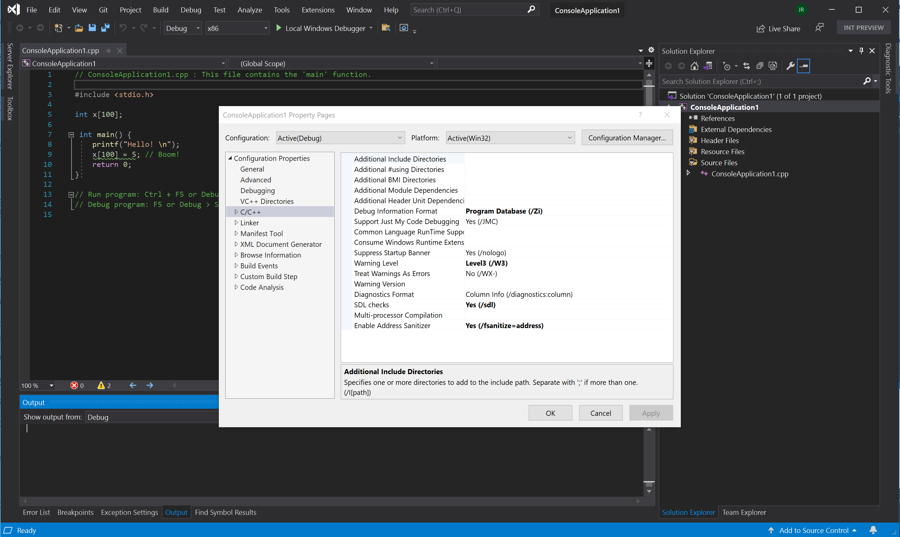
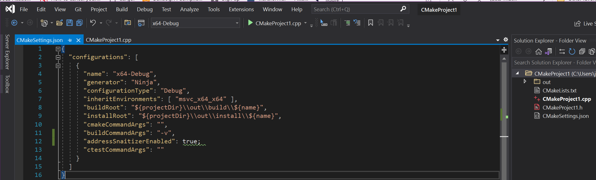

# Address Sanitizer

## Overview

The C & C++ languages are powerful, but can suffer from a class of bugs which affect **program correctness** and **program security**. Starting with Visual Studio 2019 16.9 the Microsoft Visual C++ compiler and IDE support the Address Sanitizer technology which will light up [hard-to-find bugs](#error-types) with **zero false positives**.

Use this flag to reduce your time spent on:

- Basic correctness
- Cross platform portability
- Security
- Stress testing
- Integrating new code

The Address Sanitizer is a compiler and runtime [introduced by Google](https://www.usenix.org/conference/atc12/technical-sessions/presentation/serebryany). Compiling with `-fsanitize=address` is a powerful alternative to both [/RTC](https://docs.microsoft.com/en-us/cpp/build/reference/rtc-run-time-error-checks?view=msvc-160), and [/analyze](https://docs.microsoft.com/en-us/cpp/build/reference/analyze-code-analysis?view=msvc-160). It provides run-time bug-finding technologies which directly leverage your existing build systems and existing test assets.

 Projects can enable the Address Sanitizer with a project setting, or a single additional compiler switch: **-fanitize=address**. The new flag is compatible with all levels of optimization and configurations of x86 and x64, with several incompatibilities: [edit-and-continue](https://docs.microsoft.com/en-us/visualstudio/debugger/edit-and-continue-visual-cpp?view=vs-2019), [incremental linking](https://docs.microsoft.com/en-us/cpp/build/reference/incremental-link-incrementally?view=msvc-160), and [/RTC](https://docs.microsoft.com/en-us/cpp/build/reference/rtc-run-time-error-checks?view=msvc-160).

The Address Sanitizer is integrated with the Visual Studio the project system, CMake system and the IDE. 

Microsoft's Address Sanitizer technology enables integration with the Visual Studio IDE and it can optionally create a crash dump file when the sanitizer finds a bug at runtime. Set the `ASAN_SAVE_DUMPS="MyFileName.dmpx"` environment variable prior to running your program, and a crash dump file will be created with extra meta-data for efficient, post-mortem debugging of **precisely diagnosed bugs**. These files facilitate using the Address Sanitizer in:

- On-premise single machine or distributed testing
- Cloud based workflows for testing

### Installing the Address Sanitizer

Simply  [**install the Address Sanitizer functionality**]().

After installing, you can build your executables with the `-fsanitize=address` compiler switch using any of the following:

   - Command line
   - Visual Studio project system 
   - Visual Studio CMake integration

 Recompile, then simply run your program normally. This will light up [many types of precisely diagnosed bugs](#errors). These [errors can be reported in three ways](#TBD): in the debugger IDE, on the command line or stored in a new type of dump file for precise off-line processing.

### Using the Address Sanitizer 

Microsoft recommends using the Address Sanitizer in these **three standard workflows**:

- **Developer inner loop**
    - Visual Studio - debugger IDE
    - Visual Studio - [Command line](#Using-the-Address-Sanitizer-from-a-Developer-Command-Prompt)
    - Visual Studio - [Project system](#Using-the-Address-Sanitizer-from-Visual-Studio)
    - Visual Studio - [CMake]([CMake](#Using-the-Address-Sanitizer-from-Visual-Studio:-CMake))

- **CI/CD** - continuous integration / continuous development
    - Error reporting - [New Address Sanitizer dump files]()

- **Fuzzing** - building with the [libFuzzer](https://llvm.org/docs/LibFuzzer.html) wrapper
    - [Azure OneFuzz](https://www.microsoft.com/security/blog/2020/09/15/microsoft-onefuzz-framework-open-source-developer-tool-fix-bugs/)
    - Local Machine

This article will cover the information needed to enable the three workflows listed above. The information will be specific to the **platform dependent** Windows 10 implementation of the Address Sanitizer and supplement existing documentation from [Google, Apple and GCC](#Google,-Apple-and-GCC-documentation).

> [!NOTE] Current support is limited to x86 and AMD64 on Windows 10. **Customer feedback** would help us prioritize shipping these sanitizers in the future: -fsanitize=thread, -fsanitize=leak, -fsanitize=memory, -fsanitize=hwaddress or -fsanitize=undefined.

## Using the Address Sanitizer from a Developer Command Prompt

Compile with `-fsanitize=address` to enable Address Sanitizer. The compiler flag `-fsanitize=address` is compatible with all existing C++ or C optimization levels (e.g., `/Od`, `/O1`, `/O2`, `/O2 /GL` and `PGO`), works with static and dynamic CRTs (e.g. `/MD`, `/MDd`, `/MT`, `/MTd`) and can be used to create an .EXE or .DLL. Debug information is required for optimal formatting of call stacks. In this example we explicitly pass `/Zi`.

The Address Sanitizer libraries (.lib files) will be linked for you. For more detail, and for guidelines on partitioned build systems, see [building to target the Address Sanitizer runtime](./asan-building.md).

### Example - basic global buffer overflow:

```cpp
    // basic-global-overflow.cpp
    #include <stdio.h>
    int x[100];
    int main() {
        printf("Hello!\n");
        x[100] = 5; // Boom!
        return 0;
    }
```

Using a Developer Command Prompt for VS 2019, compile main.cpp using `-fsanitize=address -Zi`


Running the resulting **main.exe** at the command line, will result in the formatted error report seen below.

Consider the overlayed, red boxes which high light seven key pieces of information:


**From top to bottom**

1. This is a global-buffer-overflow
2. A write of 4 bytes (32-bits) was outside any user defined variable.
3. The store took place in function `main()` defined in file `basic-global-overflow.cpp` on line 7.
4. The variable, named `x`, defined in basic-global-overflow.cpp on line 3 starting at column 8
5. This global variable `x` is of size 400 bytes
6. The exact [shadow byte](./asan-shadowbytes.md) describing the address targeted by the store had a value of `0xf9`
7. The shadow byte legend says `0xf9` is an area of padding to the right of `int x[100]`

**Note:**  The function names in the call stack are produced through the [LLVM symbolizer](https://llvm.org/docs/CommandGuide/llvm-symbolizer.html) which is invoked by the runtime upon error.

## Using the Address Sanitizer from Visual Studio

Address Sanitizer is integrated with the Visual Studio IDE. You can turn on the Address Sanitizer for an MSBuild project by right-clicking on the project in Solution Explorer, choosing Properties, navigating under C/C++ > General, and changing the **Enable Address Sanitizer**



**To build** from the IDE, we ask you to knowingly opt out of [these incompatible flags](.asan-incompatible-flags.md):

-  turn OFF [edit and continue](https://docs.microsoft.com/en-us/visualstudio/debugger/how-to-enable-and-disable-edit-and-continue?view=vs-2019)
- turn OFF [runtime checks]( )
- turn OFF [incremental linking]( )

To build and run under the debugger, **hit F5**. The following VS window will result:


## Using the Address Sanitizer from Visual Studio: CMake

To enable ASan for [a CMake project created to target Windows](https://docs.microsoft.com/en-us/cpp/build/cmake-projects-in-visual-studio?view=msvc-160), do the following:

Open the Configurations dropdown at the top of the IDE and click on Manage Configurations. 


This will open the CMake Project Settings UI, which is saved in a CMakeSettings.json file.

Click the **Edit JSON** link in the UI. This will switch the view to raw .json.

Add the following property: **“addressSanitizerEnabled”: true**

The following image is of CMakeSettings.json after that change:



Save this JSON file with `ctrl-s` then `hit F5`to recompile and run under the debugger. 

The following screen shot captures the error from the CMake build.

 

## Address Sanitizer crash dumps - cloud and distributed workflows

To produce a new type of dump file which can be viewed in Visual Studio on another machine at a later date:

                                set ASAN_SAVE_DUMPS="MyFileName.dmpx"

As of Visual Studio 16.9 will be able to display the **precisely diagnosed error**, stored in MyFileName.dmpx, with your source code.

[This new crash dump functionality](./asan-offline-address-sanitizer-crash-dumps.md) is an enabler for cloud based workflows and distributed testing.

## Error types

The following list of runtime errors can be exposed when you run your binaries compiled Address Sanitizer:

- [stack-use-after-scope](./examples-stack-use-after-scope.md)
- [stack-buffer-overflow](./examples-stack-buffer-overflow.md)
- [stack-buffer-underflow](./examples-stack-buffer-underflow.md)
- [stack-use-after-return](./examples-stack-use-after-return.md)
- [heap-buffer-overflow](./examples-heap-buffer-overflow.md)
- [heap-use-after-free](./examples-heap-use-after-free.md)
- [double-free](./examples-double-free.md)
- [dynamic-stack-buffer-overflow](./examples-dynamic-stack-buffer-overflow.md)
- [global-overflow](./examples-global-overflow.md)
- [calloc-overflow](./examples-calloc-overflow.md)
- [new-delete-type-mismatch](./examples-new-delete-type-mismatch.md)
- [memcpy-param-overlap](./examples-memcpy-param-overlap.md)
- [strcat-param-overlap](./examples-strcat-param-overlap.md)
- [allocation-size-too-big](./examples-allocation-size-too-big.md)
- [invalid-aligned-alloc-alignment](./examples-invalid-aligned-alloc-alignment.md)
- [use-after-poison](./examples-use-after-poison.md)
- [alloc-dealloc-mismatch](./examples-alloc-dealloc-mismatch.md)

## Differences with Clang 12.0

Visual C++ currently differs in two functional areas:

- **stack-use-after-scope** - this is on by default and can't be turned off.
- **stack-use-after-return** - this is not available by just setting ASAN_OPTIONS

These decisions were made to reduce the test matrix required to ship this first version.

We did NOT ship features that could lead to false positives in this first release. That discipline enforced an effective testing integrity necessary when considering inter-op with decades of exiting code. The following functionalities will be shipped later:

 - [Initialization Order Fiasco](https://github.com/google/sanitizers/wiki/AddressSanitizerInitializationOrderFiasco)
 - [Intra Object Overflow](https://github.com/google/sanitizers/wiki/AddressSanitizerIntraObjectOverflow)
 - [Container Overflow](https://github.com/google/sanitizers/wiki/AddressSanitizerContainerOverflow)
 - [Pointer Subtraction/Comparison](https://gcc.gnu.org/onlinedocs/gcc/Instrumentation-Options.html)

See [Building for the Address Sanitizer with MSVC](./asan-building.md) for further details.

## Existing industry documentation

Extensive documentation already exists for these language and platform dependent implementations of the Address Sanitizer technology.

- [Google](https://github.com/google/sanitizers/wiki/AddressSanitizer)
- [Apple](https://developer.apple.com/documentation/xcode/diagnosing_memory_thread_and_crash_issues_early)
- [GCC](https://gcc.gnu.org/onlinedocs/gcc/Instrumentation-Options.html)

This seminal paper on the [Address Sanitizer](https://www.usenix.org/system/files/conference/atc12/atc12-final39.pdf) describes the implementation.

## See also

- [Building for the Address Sanitizer with Visual Studio](./asan-building.md)

- [Address Sanitizer runtime](./address-sanitizer-runtime.md)

These structure all further details into the tools and the run times they target.

----
----
----
