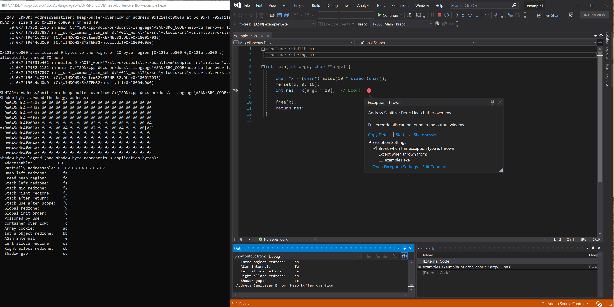

# Heap buffer overflow

## Example - classic heap buffer overflow

```cpp
#include <stdlib.h>
#include <string.h>

int main(int argc, char **argv) {
    char *x = (char*)malloc(10 * sizeof(char));
    memset(x, 0, 10);
    int res = x[argc * 10];  // Boom!

    free(x);
    return res;
}
```

## Resulting error



## Example - improper down cast
```cpp
class Parent {
 public:
  int field;
};

class Child : public Parent {
 public:
  int extra_field;
};

int main(void) {
  Parent *p = new Parent;
  Child *c = (Child*)p;  // Boom! 
  c->extra_field = 42;

  return 0;
}
```

## Resulting error


## Example - strncpy into heap
!
```cpp
#include <string.h>
#include <stdlib.h>

int main(int argc, char **argv) {

    char *hello = (char*)malloc(6);
    strcpy(hello, "hello");

    char *short_buffer = (char*)malloc(9);
    strncpy(short_buffer, hello, 10);  // Boom!

    return short_buffer[8];
}
```

## Resulting error


