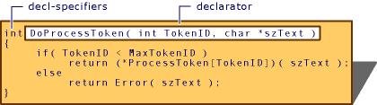

# Functions (C++)
A function is a block of code that performs some operation. A function can optionally define input parameters that enable callers to pass arguments into the function. A function can optionally return a value as output. Functions are useful for encapsulating common operations in a single reusable block, ideally with a name that clearly describes what the function does. The following function accepts two integers from a caller and returns their sum; `a` and `b` are *parameters* of type `int`.  
  
```  
int sum(int a, int b)  
{  
    return a + b;  
}  
```  
  
 The function can invoked, or *called*, from any number of places in the program. The values that are passed to the function are the *arguments*, whose types must be compatible with the parameter types in the function definition.  
  
```  
int main()  
{  
    int i = sum(10, 32);  
    int j = sum(i, 66);  
    cout << "The value of j is" << j << endl; // 108  
}  
```  
  
 There is no practical limit to function length, but good design aims for functions that perform a single well-defined task. Complex algorithms should be broken up into easy-to-understand simpler functions whenever possible.  
  
 Functions that are defined at class scope are called member functions. In C++, unlike other languages, a function can also be defined at namespace scope (including the implicit global namespace). Such functions are called *free functions* or *non-member functions*; they are used extensively in the Standard Library.  
  
## Parts of a function declaration  
 A minimal function *declaration* consists of the return type, function name, and parameter list (which may be empty), along with optional keywords that provide additional instructions to the compiler. A function definition consists of a declaration, plus the *body*, which is all the code between the curly braces. A function declaration followed by a semicolon may appear in multiple places in a program. It must appear prior to any calls to that function in each translation unit. The function definition must appear only once in the program, according to the One Definition Rule (ODR).  
  
 The required parts of a function declaration are:  
  
1.  The return type, which specifies the type of the value that the function returns, or  `void` if no value is returned. In C++11, auto is a valid return type that instructs the compiler to infer the type from the return statement. In C++14, decltype(auto) is also allowed. For more information, see Type Deduction in Return Types below.  
  
2.  The function name, which must begin with a letter or underscore and cannot contain spaces. In general, leading underscores in the Standard Library function names indicate private member functions, or non-member functions that are not intended for use by your code.  
  
3.  The parameter list, a brace delimited, comma-separated set of zero or more parameters that specify the type and optionally a local name by which the values may be accessed inside the function body.  
  
 Optional parts of a function declaration are:  
  
1.  `constexpr`, which indicates that the return value of the function is a constant value can be computed at compile time.  
  
    ```  
  
              constexpr float exp(float x, int n)  
    {  
        return n == 0 ? 1 :  
            n % 2 == 0 ? exp(x * x, n / 2) :  
            exp(x * x, (n - 1) / 2) * x;  
    };  
    ```  
  
2.  Its `linkage` specification, `extern` or `static`.  
  
    ```  
    Declare printf with C linkage.  
    extern "C" int printf( const char *fmt, ... );  
  
    ```  
  
     For more information, see [Program and Linkage](../cpp/program-and-linkage-cpp.md).  
  
3.  `inline`, which instructs the compiler to replace every call to the function with the function code itself. inlining can help performance in scenarios where a function executes quickly and is invoked repeatedly in a performance-critical section of code.  
  
    ```  
    inline double Account::GetBalance()  
    {  
        return balance;  
    }  
    ```  
  
     For more information, see [Inline Functions](../cpp/inline-functions-cpp.md).  
  
4.  `noexcept`, which specifies whether or not the function can throw an exception. In the following example, the function does not throw an exception if the `is_pod` expression evaluates to `true`.  
  
    ```  
    #include <type_traits>  
  
    template <typename T>  
    T copy_object(T& obj) noexcept(std::is_pod<T>) {...}  
    ```  
  
     For more information, see [noexcept](../cpp/noexcept-cpp.md).  
  
5.  (Member functions only) The cv-qualifiers, which specify whether the function is `const` or `volatile`.  
  
6.  (Member functions only) `virtual`, `override`, or `final`. `virtual` specifies that a function can be overridden in a derived class. `override` means that a function in a derived class is overriding a virtual function. `final` means a function cannot be overridden in any further derived class. For more information, see [Virtual Functions](../cpp/virtual-functions.md).  
  
7.  (member functions only) `static` applied to a member function means that the function is not associated with any object instances of the class.  
  
8.  (Non-static member functions only) The ref-qualifier, which specifies to the compiler which overload of a function to choose when the implicit object parameter (*this) is an rvalue reference vs. an lvalue reference.  
  
 The following figure shows the parts of a function definition. The shaded area is the function body.  
  
   
Parts of a Function Definition  
  
## Function definitions  
 Variables declared inside the body are called local variables or locals. They go out of scope when the function exits; therefore, a function should never return a reference to a local!  
  
## Function Templates  
 A function template is similar to a class template; it generates concrete functions based on the template arguments. In many cases, the template is able to infer the type arguments and therefore it isn't necessary to explicitly specify them.  
  
```  
template<typename Lhs, typename Rhs>  
auto Add2(const Lhs& lhs, const Rhs& rhs)  
{  
    return lhs + rhs;  
}  
  
auto a = Add2(3.13, 2.895); // a is a double  
auto b = Add2(string{ "Hello" }, string{ " World" }); // b is a std::string  
```  
  
 For more information, see [Function Templates](../cpp/function-templates.md)  
  
## Function parameters and arguments  
 A function has a comma-separated parameter list of zero or more types, each of which has a name by which it can be accessed inside the function body. A function template may specify additional type or value parameters. The caller passes arguments, which are concrete values whose types are compatible with the parameter list.  
  
 By default, arguments are passed to the function by value, which means the function receives a copy of the object being passed. For large objects, making a copy can be expensive and is not always necessary. To cause arguments to be passed by reference (specifically lvalue reference), add a reference quaitifer to the parameter:  
  
```  
void DoSomething(std::string& input){...}  
```  
  
 When a function modifies an argument that is passed by reference, it modifies the original object, not a local copy. To prevent a function from modifying such an argument, qualify the parameter as const&:  
  
```  
void DoSomething(const std::string& input){...}  
```  
  
 **C++ 11:**  To explicitly handle arguments that are passed by rvalue-reference OR by lvalue-reference, use a double-ampersand on the parameter to indicate a universal reference:  
  
```  
void DoSomething(const std::string&& input){...}  
```  
  
 A function declared with the single keyword `void` in the parameter declaration list takes no arguments, as long as the keyword `void` is the first and only member of the argument declaration list. Arguments of type `void` elsewhere in the list produce errors. For example:  
  
```  
  
// OK same as GetTickCount()  
long GetTickCount( void );   
```  
  
 Note that, while it is illegal to specify a `void` argument except as outlined here, types derived from type `void` (such as pointers to `void` and arrays of `void`) can appear anywhere the argument declaration list.  
  
### Default Arguments  
 The last parameter or parameters in a function signature may be assigned a default argument, which means that the caller may leave out the argument when calling the function unless they want to specify some other value.  
  
```  
int DoSomething(int num,   
    string str,   
    Allocator& alloc = defaultAllocator)  
{ ... }  
  
// OK both parameters are at end  
int DoSomethingElse(int num,   
    string str = string{ "Working" },   
    Allocator& alloc = defaultAllocator)  
{ ... }  
  
// C2548: 'DoMore': missing default parameter for parameter 2  
int DoMore(int num = 5, // Not a trailing parameter!  
    string str,  
    Allocator& = defaultAllocator)  
{...}  
```  
  
 For more information, see [Default Arguments](../cpp/default-arguments.md).  
  
## Function return types  
 A function may not return another function, or a built-in array; however it can return pointers to these types, or a *lambda*, which produces a function object. Except for these cases, a function may return a value of any type that is in scope, or it may return no value, in which case the return type is `void`.  
  
### Trailing return types  
 An "ordinary" return type is located on the left side of the function signature. A *trailing return type* is located on the right most side of the signature and is preceded by the -> operator. Trailing return types are especially useful in function templates when the type of the return value depends on template parameters.  
  
```  
template<typename Lhs, typename Rhs>  
auto Add(const Lhs& lhs, const Rhs& rhs) -> decltype(lhs + rhs)  
{  
    return lhs + rhs;   
}  
```  
  
 When `auto` is used in conjunction with a trailing return type, it just serves as a placeholder for whatever the decltype expression produces, and does not itself perform type deduction.  
  
###  <a name="type_deduction"></a> Type deduction in return types (C++14)  
 In C++14, you can use `auto` to instruct the compiler to infer the return type from the function body without having to provide a trailing return type. Note that `auto` always deduces to a return-by-value. Use `auto&&` to instruct the compiler to deduce a reference.  
  
 In this example, `auto` will be deduced as a non-const value copy of the sum of lhs and rhs.  
  
```  
template<typename Lhs, typename Rhs>  
auto Add2(const Lhs& lhs, const Rhs& rhs)  
{  
    return lhs + rhs; //returns a non-const object by value  
}  
```  
  
 Note that `auto` also does not preserve the const-ness of the type it deduces. For forwarding functions whose return value needs to preserve the const-ness or ref-ness of its arguments, you can use the `decltype(auto)` keyword, which uses the `decltype` type inference rules and preserves all the type information. `decltype(auto)` may be used as an ordinary return value on the left side, or as a trailing return value.  
  
 The following example (based on code from [N3493](http://www.open-std.org/JTC1/SC22/WG21/docs/papers/2013/n3493.html)), shows `decltype(auto)` being used to enable perfect forwarding of function arguments in a return type that isn't known until the template is instantiated.  
  
```  
template<typename F, typename Tuple = tuple<T...>, int... I>  
decltype(auto) apply_(F&& f, Tuple&& args, index_sequence<I...>)   
{  
    return std::forward<F>(f)(std::get<I>(std::forward<Tuple>(args))...);  
}  
  
template<typename F, typename Tuple = tuple<T...>,  
    typename Indices = make_index_sequence<tuple_size<Tuple>::value >>  
   decltype( auto)  
    apply(F&& f, Tuple&& args)      
{  
    return apply_(std::forward<F>(f), std::forward<Tuple>(args), Indices());  
}  
}  
```  
  
## Function local variables  
 A variable that is declared inside a function body is called a *local variable* or simply a *local*. Non-static locals are only visible inside the function body and, if they are declared on the stack go out of scope when the function exits. When you construct a local variable and return it by value, the compiler can usually perform the return value optimization to avoid unnecessary copy operations. If you return a local variable by reference, the compiler will issue a warning because any attempt by the caller to use that reference will occur after the local has been destroyed.  
  
 Local static objects are destroyed during termination specified by `atexit`. If a static object was not constructed because the program's flow of control bypassed its declaration, no attempt is made to destroy that object.  
  
### Static local variables  
 In C++ a local variable may be declared as static. The variable is only visible inside the function body, but a single copy of the variable exists for all instances of the function.  
  
## Function pointers  
 C++ supports function pointers in the same manner as the C language. However a more type-safe alternative is usually to use a function object.  
  
 It is recommended that `typedef` be used to declare an alias for the function pointer type if declaring a function that returns a function pointer type.  For example  
  
```  
typedef int (*fp)(int);  
fp myFunction(char* s); // function returning function pointer  
```  
  
 If this is not done, the proper syntax for the function declaration may be deduced from the declarator syntax for the function pointer by replacing the identifier (`fp` in the above example) with the functions name and argument list, as follows:  
  
```  
int (*myFunction(char* s))(int);  
```  
  
 The preceding declaration is equivalent to the declaration using typedef above.  
  
## See Also  
 [Function Overloading](../cpp/function-overloading.md)   
 [Functions with Variable Argument Lists](../cpp/functions-with-variable-argument-lists-cpp.md)   
 [Explicitly Defaulted and Deleted Functions](../cpp/explicitly-defaulted-and-deleted-functions.md)   
 [Argument-Dependent Name (Koenig) Lookup on Functions](../cpp/argument-dependent-name-koenig-lookup-on-functions.md)   
 [Default Arguments](../cpp/default-arguments.md)   
 [Inline Functions](../cpp/inline-functions-cpp.md)