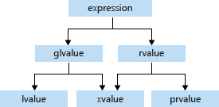

# Lvalues and Rvalues (C++)

Every C++ expression has a type, and belongs to a *value category*. The value categories are the basis for rules that compilers must follow when creating, copying, and moving temporary objects during expression evaluation.

The C++17 standard defines expression value categories as follows:

- A *glvalue* is an expression whose evaluation determines the identity of an object, bit-field, or function.
- A *prvalue* is an expression whose evaluation initializes an object or a bit-field, or computes the value of the operand of an operator, as specified by the context in which it appears.
- An *xvalue* is a glvalue that denotes an object or bit-field whose resources can be reused (usually because it is near the end of its lifetime). Example: Certain kinds of expressions involving rvalue references (8.3.2) yield xvalues, such as a call to a function whose return type is an rvalue reference or a cast to an rvalue reference type.
- An *lvalue* is a glvalue that is not an xvalue.
- An *rvalue* is a prvalue or an xvalue.

The following diagram illustrates the relationships between the categories:



An lvalue has an address that your program can access. Examples of lvalue expressions include variable names, including **`const`** variables, array elements, function calls that return an lvalue reference, bit-fields, unions, and class members.

A prvalue expression has no address that is accessible by your program. Examples of prvalue expressions include literals, function calls that return a non-reference type, and temporary objects that are created during expression evalution but accessible only by the compiler.

An xvalue expression has an address that no longer accessible by your program but can be used to initialize an rvalue reference, which provides access to the expression. Examples include function calls that return an rvalue reference, and the array subscript, member and pointer to member expressions where the array or object is an rvalue reference.

## Example

The following example demonstrates several correct and incorrect usages of lvalues and rvalues:

```cpp
// lvalues_and_rvalues2.cpp
int main()
{
    int i, j, *p;

    // Correct usage: the variable i is an lvalue and the literal 7 is a prvalue.
    i = 7;

    // Incorrect usage: The left operand must be an lvalue (C2106).`j * 4` is a prvalue.
    7 = i; // C2106
    j * 4 = 7; // C2106

    // Correct usage: the dereferenced pointer is an lvalue.
    *p = i;

    // Correct usage: the conditional operator returns an lvalue.
    ((i < 3) ? i : j) = 7;

    // Incorrect usage: the constant ci is a non-modifiable lvalue (C3892).
    const int ci = 7;
    ci = 9; // C3892
}
```

> [!NOTE]
> The examples in this topic illustrate correct and incorrect usage when operators are not overloaded. By overloading operators, you can make an expression such as `j * 4` an lvalue.

The terms *lvalue* and *rvalue* are often used when you refer to object references. For more information about references, see [Lvalue Reference Declarator: &](../cpp/lvalue-reference-declarator-amp.md) and [Rvalue Reference Declarator: &&](../cpp/rvalue-reference-declarator-amp-amp.md).

## See also

[Basic Concepts](../cpp/basic-concepts-cpp.md)<br/>
[Lvalue Reference Declarator: &](../cpp/lvalue-reference-declarator-amp.md)<br/>
[Rvalue Reference Declarator: &&](../cpp/rvalue-reference-declarator-amp-amp.md)
