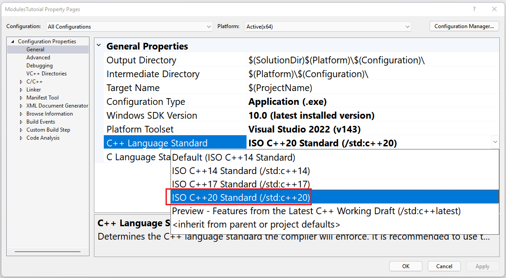
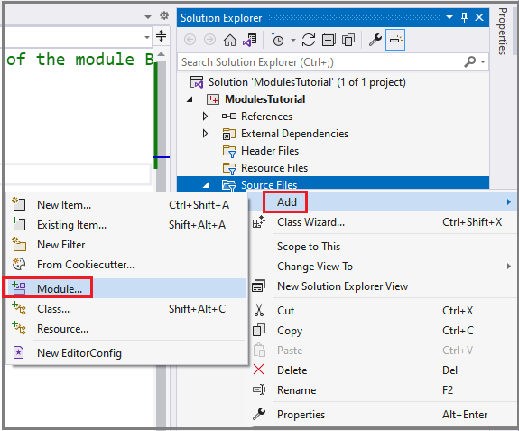

# Named modules tutorial (C++)

This tutorial is about creating C++20 modules. Modules replace header files. You'll learn how modules are an improvement on header files.

In this tutorial, learn how to:

- Create and import a module
- Create a primary module interface unit
- Create a module partition file
- Create a module unit implementation file

## Prerequisites

This tutorial requires Visual Studio 2022 17.1.0 or later.

You might get IntelliSense errors while working on the code example in this tutorial. Work on the IntelliSense engine is catching up with the compiler. IntelliSense errors can be ignored and won't prevent the code example from building. To track progress on the IntelliSense work, see this [issue](https://developercommunity.visualstudio.com/t/When-importing-a-C20-module-or-header-/1550846).

## What are C++ modules

Header files are how declarations and definitions are shared between source files in C++. Header files are fragile and difficult to compose. They may compile differently depending on the order you include them in, or on the macros that are or aren't defined. They can slow compilation time because they're reprocessed for each source file that includes them.

C++20 introduces a modern approach to componentizing C++ programs: *modules*.

Like header files, modules allow you to share declarations and definitions across source files. But unlike header files, modules don't leak macro definitions or private implementation details.

Modules are easier to compose because their semantics don't change because of macro definitions or what else has been imported, the order of imports, and so on. They also make it easier to control what is visible to consumers.

Modules provide extra safety guarantees that header files don't. The compiler and linker work together to prevent possible name collision issues, and provide stronger one definition rule ([ODR](https://stroustrup.com/glossary.html#Gone-definition-rule)) guarantees.

A strong ownership model avoids clashes between names at link time because the linker attaches exported names to the module that exports them. This model allows the Microsoft Visual C++ compiler to prevent undefined behavior caused by linking different modules that report similar names in the same program. For more information, see [Strong Ownership](https://devblogs.microsoft.com/cppblog/standard-c20-modules-support-with-msvc-in-visual-studio-2019-version-16-8/#strong-ownership).

A module is made up of one or more source code files compiled into a binary file. The binary file describes all the exported types, functions, and templates in the module. When a source file imports a module, the compiler reads in the binary file that contains the contents of the module. Reading the binary file is much faster than processing a header file. Also, the binary file is reused by the compiler every time the module is imported, saving even more time. Because a module is built once rather than every time it's imported, build time can be reduced, sometimes dramatically.

More importantly, modules don't have the fragility problems that header files do. Importing a module doesn't change the module's semantics, or the semantics of any other imported module. Macros, preprocessor directives, and non-exported names declared in a module aren't visible to the source file that imports it. You can import modules in any order and it won't change the meaning of the modules.

Modules can be used side by side with header files. This feature is convenient if you're migrating a code base to use modules because you can do it in stages.

In some cases, a header file can be imported as a header unit rather than as an `#include` file. Header units are the recommended alternative to [precompiled header files](../build/creating-precompiled-header-files.md) (PCH). They're easier to set up and use than [shared PCH](https://devblogs.microsoft.com/cppblog/shared-pch-usage-sample-in-visual-studio) files, but they provide similar performance benefits. For more information, see [Walkthrough: Build and import header units in Microsoft Visual C++](../build/walkthrough-header-units.md).

Your code can consume modules in the same project, or any referenced projects, automatically by using project-to-project references to static library projects.

## Create the project

As we build a simple project, we'll look at various aspects of modules. The project will implement an API using a module instead of a header file.

In Visual Studio 2022 or later, choose **Create a new project** and then the **Console App** (for C++) project type. If this project type isn't available, you may not have selected the **Desktop development with C++** workload when you installed Visual Studio. You can use the Visual Studio Installer to add the C++ workload.

Give the new project the name *`ModulesTutorial`* and create the project.

Because modules are a C++20 feature, use the [`/std:c++20` or `/std:c++latest`](../build/reference/std-specify-language-standard-version.md) compiler option. In the **Solution Explorer**, right-click on the project name `ModulesTutorial`, then choose **Properties**. In the project Property Pages dialog, change **Configuration** to **All Configurations** and **Platform** to **All Platforms**. Select **Configuration Properties** > **General** in the tree view pane on the left. Select the **C++ Language Standard** property. Use the dropdown to change the property value to **ISO C++20 Standard (/std:c++20)**. Select **OK** to accept the change.



## Create the primary module interface unit

A module consists of one or more files. One of these files must be what is called the *primary module interface unit*. It defines what the module exports; that is, what importers of the module will see. There can only be one primary module interface unit per module.

To add a primary module interface unit, in **Solution Explorer**, right-click **Source Files** then select **Add** > **Module**.



In the **Add New Item** dialog that appears, give the new module the name *`BasicPlane.Figures.ixx`* and choose **Add**.

The default contents of the created module file has two lines:

```cpp
export module BasicPlane;

export void MyFunc();
```

The `export module` keywords in the first line declare that this file is a module interface unit. There's a subtle point here: for every named module, there must be exactly one module interface unit with no module partition specified. That module unit is called the *primary module interface unit*.

The primary module interface unit is where you declare the functions, types, templates, other modules, and module partitions to expose when source files import the module. A module can consist of multiple files, but only the primary module interface file identifies what to expose.

Replace the contents of *`BasicPlane.Figures.ixx`* file with:

```cpp
export module BasicPlane.Figures; // the export module keywords mark this file as a primary module interface unit
```

This line identifies this file as the primary module interface and gives the module a name: `BasicPlane.Figures`. The period in the module name has no special meaning to the compiler. A period can be used to convey how your module is organized. If you have multiple module files that work together, you can use periods to indicate a separation of concerns. In this tutorial, we'll use periods to indicate different functional areas of the API.

This name is also where the "named" in "named module" comes from. The files that are part of this module use this name to identify themselves as part of the named module. A named module is the collection of module units with the same module name.

We should talk about the API we'll implement for a moment before going further. It impacts the choices we make next. The API represents different shapes. We're only going to provide a couple shapes in this example: `Point` and `Rectangle`. `Point` is meant to be used as part of more complex shapes, such as `Rectangle`.

To illustrate some features of modules, we'll factor this API into pieces. One piece will be the `Point` API. The other part will be `Rectangle`. Imagine that this API will grow into something more complex. The division is useful for separating concerns or easing code maintenance.

So far, we've created the primary module interface that will expose this API. Let's now build the `Point` API. We want it to be part of this module. For reasons of logical organization, and potential build efficiency, we want to make this part of the API easily understandable on its own. To do so, we'll create a *module partition* file.

A module partition file is a piece, or component, of a module. What makes it unique is that it can be treated as an individual piece of the module, but only within the module. Module partitions can't be consumed outside of a module. Module partitions are useful for dividing the module implementation into manageable pieces.

When you import a partition into the primary module, all its declarations become visible to the primary module regardless of whether they're exported. Partitions can be imported into any partition interface, primary module interface, or module unit that belongs to the named module.

## Create a module partition file

### `Point` module partition

To create a module partition file, in the **Solution Explorer** right-click **Source Files**, then select **Add** > **Module**. Name the file *`BasicPlane.Figures-Point.ixx`* and choose **Add**.

Because it's a module partition file, we've added a hyphen and the name of the partition to the module name. This convention aids the compiler in the command-line case because the compiler uses name lookup rules based on the module name to find the compiled *`.ifc`* file for the partition. This way you don't have to provide explicit `/reference` command-line arguments to find the partitions that belong to the module. It's also helpful for organizing the files that belong to a module by name because you can easily see which files belong to which modules.

Replace the contents of *`BasicPlane.Figures-Point.ixx`* with:

```cpp
export module BasicPlane.Figures:Point; // defines a module partition, Point, that's part of the module BasicPlane.Figures

export struct Point
{
    int x, y;
};
```

The file starts with `export module`. These keywords are also how the primary module interface begins. What makes this file different is the colon (`:`) following the module name, followed by the partition name. This naming convention identifies the file as a *module partition*. Because it defines the module interface for a partition, it isn't considered the primary module interface.

The name `BasicPlane.Figures:Point` identifies this partition as part of the module `BasicPlane.Figures`. (Remember, the period in the name has no special meaning to the compiler). The colon indicates that this file contains a module partition named `Point` that belongs to the module `BasicPlane.Figures`. We can import this partition into other files that are part of this named module.

In this file, the `export` keyword makes `struct Point` visible to consumers.

### `Rectangle` module partition

The next partition we'll define is `Rectangle`. Create another module file using the same steps as before: In **Solution Explorer**, right-click on **Source Files**, then select **Add** > **Module**. Name the file *`BasicPlane.Figures-Rectangle.ixx`* and select **Add**.

Replace the contents of *`BasicPlane.Figures-Rectangle.ixx`* with:

```cpp
export module BasicPlane.Figures:Rectangle; // defines the module partition Rectangle

import :Point;

export struct Rectangle // make this struct visible to importers
{
    Point ul, lr;
};

// These functions are declared, but will
// be defined in a module implementation file
export int area(const Rectangle& r);
export int height(const Rectangle& r);
export int width(const Rectangle& r);
```

The file begins with `export module BasicPlane.Figures:Rectangle;` which declares a module partition that's part of the module `BasicPlane.Figures`. The `:Rectangle` added to the module name defines it as a partition of the module `BasicPlane.Figures`. It can be imported individually into any of the module files that are part of this named module.

Next, `import :Point;` shows how to import a module partition. The `import` statement makes all the exported types, functions, and templates in the module partition visible to the module. You don't have to specify the module name. The compiler knows that this file belongs to the `BasicPlane.Figures` module because of the `export module BasicPlane.Figures:Rectangle;` at the top of the file.

Next, the code exports the definition of `struct Rectangle` and declarations for some functions that return various properties of the rectangle. The `export` keyword indicates whether to make what it precedes visible to consumers of the module. It's used to make the functions `area`, `height`, and `width` visible outside of the module.

All definitions and declarations in a module partition are visible to the importing module unit whether they have the `export` keyword or not. The `export` keyword governs whether the definition, declaration, or typedef will be visible outside of the module when you export the partition in the primary module interface.

Names are made visible to consumers of a module in several ways:

- Put the keyword `export` in front of each type, function, and so on, that you want to export.
- If you put `export` in front of a namespace, for example `export namespace N { ... }`, everything defined within the braces is exported. But if elsewhere in the module you define `namespace N { struct S {...};}`, then `struct S` isn't available to consumers of the module. It's not available because that namespace declaration isn't prefaced by `export`, even though there's another namespace with the same name that is.
- If a type, function, and so on, shouldn't be exported, omit the `export` keyword. It will be visible to other files that are part of the module, but not to importers of the module.
- Use `module :private;` to mark the beginning of the private module partition. The private module partition is a section of the module where declarations are only visible to that file. They aren't visible to files that import this module or to other files that are part of this module. Think of it as a section that is static local to the file. This section is visible only within the file.
- To make an imported module or module partition visible, use `export import`. An example is shown in the next section.

## Compose the module partitions

Now that we have the two parts of the API defined, let's bring them together so that files that import this module can access them as a whole.

All module partitions must be exposed as part of the module definition that they belong to. Partitions are exposed in the primary module interface. Open the *`BasicPlane.Figures.ixx`* file, which defines the primary module interface. Replace its contents with:

```cpp
export module BasicPlane.Figures; // keywords export module marks this as a primary module interface unit

export import :Point; // bring in the Point partition, and export it to consumers of this module
export import :Rectangle; // bring in the Rectangle partition, and export it to consumers of this module
```

The two lines that begin with `export import` are new here. When combined like this, these two keywords instruct the compiler to import the specified module and make it visible to consumers of this module. In this case, the colon (`:`) in the module name indicates that we are importing a module partition.

The imported names don't include the full module name. For example, the `:Point` partition was declared as `export module BasicPlane.Figures:Point`. Yet here we're importing `:Point`. Because we're in the primary module interface file for the module `BasicPlane.Figures`, the module name is implied, and only the partition name is specified.

So far, we've defined the primary module interface, which exposes the API surface we want to make available. But we've only declared, not defined, `area()`, `height()`, or `width()`. We'll do that next by creating a module implementation file.

## Create a module unit implementation file

Module unit implementation files don't end with an *`.ixx`* extension--they're normal *`.cpp`* files. Add a module unit implementation file by creating a source file with a right-click in the **Solution Explorer** on **Source Files**, select **Add** > **New item** and then select **C++ File (.cpp)**. Give the new file the name *`BasicPlane.Figures-Rectangle.cpp`*, then choose **Add**.

The naming convention for the module partition's implementation file follows the naming convention for a partition. But it has a *`.cpp`* extension because it's an implementation file.

Replace the contents of the `BasicPlane.Figures-Rectangle.cpp` file with:

```cpp
module;

// global module fragment area. Put #include directives here 

module BasicPlane.Figures:Rectangle;

int area(const Rectangle& r) { return width(r) * height(r); }
int height(const Rectangle& r) { return r.ul.y - r.lr.y; }
int width(const Rectangle& r) { return r.lr.x - r.ul.x; }
```

This file begins with `module;` which introduces a special area of the module called the *global module fragment*. It precedes the code for the named module and is where you can use preprocessor directives such as `#include`. Code in the global module fragment isn't owned or exported by the module interface.

When you include a header file, you generally don't want it to be treated as an exported part of the module. You typically include the header file as an implementation detail that shouldn't be part of the module interface. There may be advanced cases where want to do that, but generally you don't. No separate metadata (*`.ifc`* files) are generated for `#include` directives in the global module fragment. Global module fragments provide a good place to include header files such as *`windows.h`*, or on Linux, *`unistd.h`*.

The module implementation file we're building doesn't include any libraries because it doesn't need them as part of its implementation. But if it did, this area is where the `#include` directives would go.

The line `module BasicPlane.Figures:Rectangle;` indicates that this file is part of the named module `BasicPlane.Figures`. The compiler automatically brings the types and functions exposed by the primary module interface into this file. A module implementation unit doesn't have the `export` keyword before the `module` keyword in its module declaration.

Next are the definition of the functions `area()`, `height()`, and `width()`. They were declared in the `Rectangle` partition in *`BasicPlane.Figures-Rectangle.ixx`*. Because the primary module interface for this module imported the `Point` and `Rectangle` module partitions, those types are visible here in the module unit implementation file. An interesting feature of module implementation units: The compiler automatically makes everything in the corresponding module primary interface visible to the file. No `imports <module-name>` is needed.

Anything you declare within an implementation unit is only visible to the module that it belongs to.

## Import the module

Now we'll make use of the module we've defined. Open the *`ModulesTutorial.cpp`* file. It was created automatically as part of the project. It currently contains the function `main()`. Replace its contents with:

```cpp
#include <iostream>

import BasicPlane.Figures;

int main()
{
    Rectangle r{ {1,8}, {11,3} };

    std::cout << "area: " << area(r) << '\n';
    std::cout << "width: " << width(r) << '\n';

    return 0;
}
```

The statement `import BasicPlane.Figures;` makes all the exported functions and types from the `BasicPlane.Figures` module visible to this file. It can come before or after any `#include` directives.

The app then uses the types and functions from the module to output the area and width of the defined rectangle:

```output
area: 50
width: 10
```

## Anatomy of a module

Let's now look in more detail at the various module files.

### Primary module interface

A module consists of one or more files. One of them defines the interface that importers will see. This file contains the *Primary module interface*. There can only be one primary module interface per module. As pointed out earlier, the exported module interface unit doesn't specify a module partition.

It has an *`.ixx`* extension by default. However, you can treat a source file with any extension as a module interface file. To do so, set the **Compile As** property in the **Advanced** tab for the source file's properties page to **Compile As Module (/interface)**:


The basic outline of a module interface definition file is:

```cpp
module; // optional. Defines the beginning of the global module fragment

// #include directives go here but only apply to this file and
// aren't shared with other module implementation files.
// Macro definitions aren't visible outside this file, or to importers.
// import statements aren't allowed here. They go in the module preamble, below.

export module [module-name]; // Required. Marks the beginning of the module preamble

// import statements go here. They're available to all files that belong to the named module
// Put #includes in in the global module fragment, above

// After any import statements, the module purview begins here
// Put exported functions, types, and templates here

module :private; // optional. The start of the private module partition.

// Everything after this point is visible only within this file, and isn't 
// visible to any of the other files that belong to the named module.
```

This file must begin with either `module;` to indicate the beginning of the global module fragment, or `export module [module-name];` to indicate the start of the *module purview*.

The module purview is where functions, types, templates, and so on, go that you want to expose from the module.

It's also where you can expose other modules or module partitions via the `export import` keywords, as shown in the *`BasicPlane.Figures.ixx`* file.

The primary interface file must export all the interface partitions defined for the module directly or indirectly, or the program is ill-formed.

The private module partition is where you can put things that you want to be only visible in this file.

Module interface units preface the keyword `module` with the keyword `export`.

For a more in-depth look at module syntax, see [Modules](modules-cpp.md).

### Module implementation units

Module implementation units belong to a named module. The named module they belong to is indicated by the `module [module-name]` statement in the file. Module implementation units provide implementation details that, for code hygiene or other reasons, you don't want to put in the primary module interface or in a module partition file.

Module implementation units are useful for breaking up a large module into smaller pieces, which can result in faster build times. This technique is covered briefly in the [Best practices](#module-best-practices) section.

Module implementation unit files have a *`.cpp`* extension. The basic outline of a module implementation unit file is:

```cpp
// optional #include or import statements. These only apply to this file
// imports in the associated module's interface are automatically available to this file

module [module-name]; // required. Identifies which named module this implementation unit belongs to

// implementation
```

### Module partition files

Module partitions provide a way to componentize a module into different pieces, or *partitions*. Module partitions are meant to be imported only in files that are part of the named module. They can't be imported outside of the named module.

A partition has an interface file, and zero or more implementation files. A module partition shares ownership of all the declarations in the entire module.

All names exported by partition interface files must be imported and re-exported (`export import`) by the primary interface file. A partition's name must begin with the module name, followed by a colon, and then the name of the partition.

The basic outline of a partition interface file looks like this:

```cpp
module; // optional. Defines the beginning of the global module fragment

// This is where #include directives go. They only apply to this file and aren't shared
// with other module implementation files.
// Macro definitions aren't visible outside of this file or to importers
// import statements aren't allowed here. They go in the module preamble, below

export module [Module-name]:[Partition name]; // Required. Marks the beginning of the module preamble

// import statements go here. 
// To access declarations in another partition, import the partition. Only use the partition name, not the module name.
// For example, import :Point;
// #include directives don't go here. The recommended place is in the global module fragment, above

// export imports statements go here

// after import, export import statements, the module purview begins
// put exported functions, types, and templates for the partition here

module :private; // optional. Everything after this point is visible only within this file, and isn't 
                         // visible to any of the other files that belong to the named module.
...
```

## Module best practices

A module and the code that imports it must be compiled with the same compiler options.

### Module naming

- You can use periods ('.') in your module names but they have no special meaning to the compiler. Use them to convey meaning to the users of your module. For example, start with the library or project top namespace. Finish with a name that describes the module's functionality. `BasicPlane.Figures` is meant to convey an API for geometric planes, and specifically figures that can be represented on a plane.
- The name of the file that contains the module primary interface is generally the name of the module. For example, given the module name `BasicPlane.Figures`, the name of the file containing the primary interface would be named *`BasicPlane.Figures.ixx`*.
- The name of a module partition file is generally `<primary-module-name>-<module-partition-name>` where the name of the module is followed by a hyphen ('-') and then the name of the partition. For example, *`BasicPlane.Figures-Rectangle.ixx`*

If you're building from the command line and you use this naming convention for module partitions, then you won't have to explicitly add `/reference` for each module partition file. The compiler will look for them automatically based on the name of the module. The name of the compiled partition file (ending with an *`.ifc`* extension) is generated from the module name. Consider the module name `BasicPlane.Figures:Rectangle`: the compiler will anticipate that the corresponding compiled partition file for `Rectangle` is named `BasicPlane.Figures-Rectangle.ifc`. The compiler uses this naming scheme to make it easier to use module partitions by automatically finding the interface unit files for partitions.

You can name them using your own convention. But then you'll need to specify corresponding [`/reference`](../build/reference/module-reference.md) arguments to the command-line compiler.

### Factor modules

Use module implementation files and partitions to factor your module for easier code maintenance and potentially faster compilation times.

For example, moving the implementation of a module out of the module interface definition file and into a module implementation file means that changes to the implementation won't necessarily cause every file that imports the module to recompile (unless you have `inline` implementations).

Module partitions make it easier to logically factor a large module. They can be used to improve compilation time so that changes to a portion of the implementation don't cause all the module's files to be recompiled.

## Summary

In this tutorial, you've been introduced to the basics of C++20 modules. You've created a primary module interface, defined a module partition, and built a module implementation file.

## See also

[Overview of modules in C++](modules-cpp.md)\
[`module`, `import`, `export` keywords](import-export-module.md)\
[A Tour of C++ Modules in Visual Studio](https://devblogs.microsoft.com/cppblog/a-tour-of-cpp-modules-in-visual-studio)\
[Practical C++20 Modules and the future of tooling around C++ Modules](https://www.youtube.com/watch?v=ow2zV0Udd9M)\
[Moving a project to C++ named Modules](https://devblogs.microsoft.com/cppblog/moving-a-project-to-cpp-named-modules)\
[Walkthrough: Build and import header units in Microsoft Visual C++](..\build\walkthrough-header-units.md)
