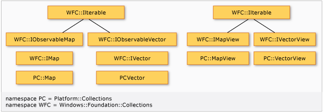
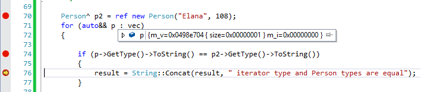

# Collections (C++/CX)

In a C++/CX program, you can make free use of Standard Template Library (STL) containers, or any other user-defined collection type. However, when you pass collections back and forth across the Windows Runtime application binary interface (ABI)—for example, to a XAML control or to a JavaScript client—you must use Windows Runtime collection types.

The Windows Runtime defines the interfaces for collections and related types, and C++/CX provides the concrete C++ implementations in the collection.h header file. This illustration shows the relationships between the collection types:



- The [Platform::Collections::Vector class](../cppcx/platform-collections-vector-class.md) resembles the [std::vector class](../standard-library/vector-class.md).

- The [Platform::Collections::Map Class](../cppcx/platform-collections-map-class.md) class resembles the [std::map class](../standard-library/map-class.md).

- [Platform::Collections::VectorView Class](../cppcx/platform-collections-vectorview-class.md) and[Platform::Collections::MapView Class](../cppcx/platform-collections-mapview-class.md) are read-only versions of `Vector` and `Map`.

- Iterators are defined in the [Platform::Collections Namespace](../cppcx/platform-collections-namespace.md). These iterators satisfy the requirements for STL iterators and enable the use of [std::find](../standard-library/algorithm-functions.md#find),  [std::count_if](../standard-library/algorithm-functions.md#count_if), and other STL algorithms on any [Windows::Foundation::Collections](/uwp/api/windows.foundation.collections) interface type or [Platform::Collections](../cppcx/platform-collections-namespace.md) concrete type. For example, this means that you can iterate a collection in a Windows Runtime component that's created in C# and apply an STL algorithm to it.

   > [!IMPORTANT]
   > Proxy iterators `VectorIterator` and `VectorViewIterator` utilize proxy objects `VectoryProxy<T>` and `ArrowProxy<T>` to enable usage with STL containers. For more information, see "VectorProxy elements" later in this article.

- The C++/CX collection types support the same thread safety guarantees that STL containers support.

- [Windows::Foundation::Collections::IObservableVector](/uwp/api/windows.foundation.collections.iobservablevector-1) and [Windows::Foundation::Collections::IObservableMap](/uwp/api/windows.foundation.collections.iobservablemap-2) define events that are fired when the collection changes in various ways. By implementing these interfaces,  [Platform::Collections::Map](../cppcx/platform-collections-map-class.md) and [Platform::Collections::Vector](../cppcx/platform-collections-vector-class.md) support databinding with XAML collections. For example, if you have a `Vector` that is data-bound to a `Grid`, when you add an item to a collection, the change is reflected in the Grid UI.

## Vector usage

When your class has to pass a sequence container to another Windows Runtime component, use [Windows::Foundation::Collections:: IVector\<T>](/uwp/api/windows.foundation.collections.ivector-1) as the parameter or return type, and [Platform::Collections::Vector\<T>](../cppcx/platform-collections-vector-class.md) as the concrete implementation. If you attempt to use a `Vector` type in a public return value or parameter, compiler error C3986 will be raised. You can fix the error by changing the `Vector` to an `IVector`.

> [!IMPORTANT]
> If you are passing a sequence within your own program, then use either `Vector` or `std::vector` because they are more efficient than `IVector`. Use `IVector` only when you pass the container across the ABI.
>
> The Windows Runtime type system does not support the concept of jagged arrays and therefore you cannot pass an `IVector<Platform::Array<T>>` as a return value or method parameter. To pass a jagged array or a sequence of sequences across the ABI, use `IVector<IVector<T>^>`.

`Vector<T>` provides the methods that are required for adding, removing, and accessing items in the collection, and it is implicitly convertible to `IVector<T>`. You can also use STL algorithms on instances of `Vector<T>`. The following example demonstrates some basic usage. The [begin function](../cppcx/begin-function.md) and [end function](../cppcx/end-function.md) here are from the `Platform::Collections` namespace, not the `std` namespace.

[!code-cpp[cx_collections#01](../cppcx/codesnippet/CPP/collections/class1.cpp#01)]

If you have existing code that uses `std::vector` and you want to reuse it in a Windows Runtime component, just use one of the `Vector` constructors that takes a `std::vector` or a pair of iterators to construct a `Vector` at the point where you pass the collection across the ABI. The following example shows how to use the `Vector` move constructor for efficient initialization from a `std::vector`. After the move operation, the original `vec` variable is no longer valid.

[!code-cpp[cx_collections#02](../cppcx/codesnippet/CPP/collections/class1.cpp#02)]

If you have a vector of strings that you must pass across the ABI at some future point, you must decide whether to create the strings initially as `std::wstring` types or as `Platform::String^` types. If you have to do a lot of processing on the strings, then use `wstring`. Otherwise, create the strings as `Platform::String^` types and avoid the cost of converting them later. You must also decide whether to put these strings into a `std:vector` or `Platform::Collections::Vector` internally. As a general practice, use `std::vector` and then create a `Platform::Vector` from it only when you pass the container across the ABI.

## Value types in Vector

Any element to be stored in a [Platform::Collections::Vector](../cppcx/platform-collections-vector-class.md) must support equality comparison, either implicitly or by using a custom [std::equal_to](../standard-library/equal-to-struct.md) comparator that you provide. All reference types and all scalar types implicitly support equality comparisons. For non-scalar value types such as [Windows::Foundation::DateTime](/uwp/api/windows.foundation.datetime), or for custom comparisons—for example, `objA->UniqueID == objB->UniqueID`—you must provide a custom function object.

## VectorProxy elements

[Platform::Collections::VectorIterator](../cppcx/platform-collections-vectoriterator-class.md) and [Platform::Collections::VectorViewIterator](../cppcx/platform-collections-vectorviewiterator-class.md) enable the use of `range for` loops and algorithms like [std::sort](../standard-library/algorithm-functions.md#sort) with an [IVector\<T>](/uwp/api/windows.foundation.collections.ivector-1) container. But `IVector` elements cannot be accessed through C++ pointer dereference; they can be accessed only through [GetAt](/uwp/api/windows.foundation.collections.ivector-1.getat) and [SetAt](/uwp/api/windows.foundation.collections.ivector-1.setat) methods. Therefore, these iterators use the proxy classes `Platform::Details::VectorProxy<T>` and `Platform::Details::ArrowProxy<T>` to provide access to the individual elements through __\*__, __->__, and __\[]__ operators, as required by the Standard Library. Strictly speaking, given an `IVector<Person^> vec`, the type of `*begin(vec)` is `VectorProxy<Person^>`. However, the proxy object is almost always transparent to your code. These proxy objects are not documented because they are only for internal use by the iterators, but it is useful to know how the mechanism works.

When you use a `range for` loop over `IVector` containers, use `auto&&` to enable the iterator variable to bind correctly to the `VectorProxy` elements. If you use **`auto`** or `auto&`, compiler warning C4239 is raised and `VectoryProxy` is mentioned in the warning text.

The following illustration shows a `range for` loop over an `IVector<Person^>`. Notice that execution is stopped on the breakpoint on line 64. The **QuickWatch** window shows that the iterator variable `p` is in fact a `VectorProxy<Person^>` that has `m_v` and `m_i` member variables. However, when you call `GetType` on this variable, it returns the identical type to the `Person` instance `p2`. The takeaway is that although `VectorProxy` and `ArrowProxy` might appear in **QuickWatch**, the debugger certain compiler errors, or other places, you typically don't have to explicitly code for them.



One scenario in which you have to code around the proxy object is when you have to perform a **`dynamic_cast`** on the elements—for example, when you are looking for XAML objects of a particular type in a `UIElement` element collection. In this case, you must first cast the element to [Platform::Object](../cppcx/platform-object-class.md)^ and then perform the dynamic cast:

```cpp
void FindButton(UIElementCollection^ col)
{
    // Use auto&& to avoid warning C4239
    for (auto&& elem : col)
    {
        Button^ temp = dynamic_cast<Button^>(static_cast<Object^>(elem));
        if (nullptr != temp)
        {
            // Use temp...
        }
    }
}
```

## Map usage

This example shows how to insert items and look them up in a [Platform::Collections::Map](../cppcx/platform-collections-map-class.md), and then return the `Map` as a read-only [Windows::Foundation::Collections::IMapView](/uwp/api/windows.foundation.collections.imapview-2) type.

[!code-cpp[cx_collections#04](../cppcx/codesnippet/CPP/collections/class1.cpp#04)]

In general, for internal map functionality, prefer the `std::map` type for performance reasons. If you have to pass the container across the ABI, construct a [Platform::Collections::Map](../cppcx/platform-collections-map-class.md) from the [std::map](../standard-library/map-class.md) and return the `Map` as an [Windows::Foundation::Collections::IMap](/uwp/api/windows.foundation.collections.imap-2). If you attempt to use a `Map` type in a public return value or parameter, compiler error C3986 will be raised. You can fix the error by changing the `Map` to an `IMap`. In some cases—for example, if you are not making a large number of lookups or insertions, and you are passing the collection across the ABI frequently—it might be less expensive to use `Platform::Collections::Map` from the beginning and avoid the cost of converting the `std::map`. In any case, avoid lookup and insert operations on an `IMap` because these are the least performant of the three types. Convert to `IMap` only at the point that you pass the container across the ABI.

## Value types in Map

Elements in a [Platform::Collections::Map](../cppcx/platform-collections-map-class.md) are ordered. Any element to be stored in a `Map` must support less-than comparison with strict weak ordering, either implicitly or by using a custom [stl::less](../standard-library/less-struct.md) comparator that you provide. Scalar types support the comparison implicitly. For non-scalar value types such as `Windows::Foundation::DateTime`, or for custom comparisons—for example, `objA->UniqueID < objB->UniqueID`—you must provide a custom comparator.

## Collection types

Collections fall into four categories: modifiable versions and read-only versions of sequence collections and associative collections. In addition, C++/CX enhances collections by providing three iterator classes that simplify the accessing of collections.

Elements of a modifiable collection can be changed, but elements of a read-only collection, which is known as a *view*, can only be read. Elements of a [Platform::Collections::Vector](../cppcx/platform-collections-vector-class.md) or[Platform::Collections::VectorView](../cppcx/platform-collections-vectorview-class.md) collection can be accessed by using an iterator or the collection's [Vector::GetAt](../cppcx/platform-collections-vector-class.md#getat) and an index. Elements of an associative collection can be accessed by using the collection's [Map::Lookup](../cppcx/platform-collections-map-class.md#lookup) and a key.

[Platform::Collections::Map Class](../cppcx/platform-collections-map-class.md)<br/>
A modifiable, associative collection. Map elements are key-value pairs. Looking up a key to retrieve its associated value, and iterating through all key-value pairs, are both supported.

`Map` and `MapView` are templated on `<K, V, C = std::less<K>>`; therefore, you can customize the comparator.  Additionally, `Vector` and `VectorView` are templated on `<T, E = std::equal_to<T>>` so that you can customize the behavior of `IndexOf()`. This is important mostly for `Vector` and `VectorView` of value structs. For example, to create a Vector\<Windows::Foundation::DateTime>, you must provide a custom comparator because DateTime does not overload the == operator.

[Platform::Collections::MapView Class](../cppcx/platform-collections-mapview-class.md)<br/>
A read-only version of a `Map`.

[Platform::Collections::Vector Class](../cppcx/platform-collections-vector-class.md)<br/>
A modifiable sequence collection. `Vector<T>` supports constant-time random access and amortized-constant-time [Append](../cppcx/platform-collections-vector-class.md#append) operations..

[Platform::Collections::VectorView Class](../cppcx/platform-collections-vectorview-class.md)<br/>
A read-only version of a `Vector`.

[Platform::Collections::InputIterator Class](../cppcx/platform-collections-inputiterator-class.md)<br/>
An STL iterator that satisfies the requirements of an STL input iterator.

[Platform::Collections::VectorIterator Class](../cppcx/platform-collections-vectoriterator-class.md)<br/>
An STL iterator that satisfies the requirements of an STL mutable random-access iterator.

[Platform::Collections::VectorViewIterator Class](../cppcx/platform-collections-vectorviewiterator-class.md)<br/>
An STL iterator that satisfies the requirements of an STL  **`const`** random-access iterator.

### begin() and end() functions

To simplify the use of the STL to process `Vector`, `VectorView`, `Map`, `MapView`, and arbitrary `Windows::Foundation::Collections` objects, C++/CX supports overloads of the [begin Function](../cppcx/begin-function.md) and [end Function](../cppcx/end-function.md) non-member functions.

The following table lists the available iterators and functions.

|Iterators|Functions|
|---------------|---------------|
|[Platform::Collections::VectorIterator\<T>](../cppcx/platform-collections-vectoriterator-class.md)<br /><br /> (Internally stores [Windows::Foundation::Collections:: IVector\<T>](/uwp/api/windows.foundation.collections.ivector-1) and int.)|[begin](../cppcx/begin-function.md)/ [end](../cppcx/end-function.md)([Windows::Foundation::Collections:: IVector\<T>](/uwp/api/windows.foundation.collections.ivector-1))|
|[Platform::Collections::VectorViewIterator\<T>](../cppcx/platform-collections-vectorviewiterator-class.md)<br /><br /> (Internally stores [IVectorView\<T>](/uwp/api/windows.foundation.collections.ivectorview-1)^ and int.)|[begin](../cppcx/begin-function.md)/ [end](../cppcx/end-function.md) ([IVectorView\<T>](/uwp/api/windows.foundation.collections.ivectorview-1)^)|
|[Platform::Collections::InputIterator\<T>](../cppcx/platform-collections-inputiterator-class.md)<br /><br /> (Internally stores [IIterator\<T>](/uwp/api/windows.foundation.collections.iiterator-1)^ and T.)|[begin](../cppcx/begin-function.md)/ [end](../cppcx/end-function.md) ([IIterable\<T>](/uwp/api/windows.foundation.collections.iiterable-1))|
|[Platform::Collections::InputIterator<IKeyValuePair\<K, V>^>](../cppcx/platform-collections-inputiterator-class.md)<br /><br /> (Internally stores [IIterator\<T>](/uwp/api/windows.foundation.collections.iiterator-1)^ and T.)|[begin](../cppcx/begin-function.md)/ [end](../cppcx/end-function.md) ([IMap\<K,V>](/uwp/api/windows.foundation.collections.imap-2).|
|[Platform::Collections::InputIterator<IKeyValuePair\<K, V>^>](../cppcx/platform-collections-inputiterator-class.md)<br /><br /> (Internally stores [IIterator\<T>](/uwp/api/windows.foundation.collections.iiterator-1)^ and T.)|[begin](../cppcx/begin-function.md)/ [end](../cppcx/end-function.md) ([Windows::Foundation::Collections::IMapView](/uwp/api/windows.foundation.collections.imapview-2))|

### Collection change events

`Vector` and `Map` support databinding in XAML collections by implementing events that occur when a collection object is changed or reset, or when any element of a collection is inserted, removed, or changed. You can write your own types that support databinding, although you cannot inherit from `Map` or `Vector` because those types are sealed.

The [Windows::Foundation::Collections::VectorChangedEventHandler](/uwp/api/windows.foundation.collections.vectorchangedeventhandler-1) and [Windows::Foundation::Collections::MapChangedEventHandler](/uwp/api/windows.foundation.collections.mapchangedeventhandler-2) delegates specify the signatures for event handlers for collection change events. The [Windows::Foundation::Collections::CollectionChange](/uwp/api/windows.foundation.collections.collectionchange) public enum class, and `Platform::Collection::Details::MapChangedEventArgs` and `Platform::Collections::Details::VectorChangedEventArgs` ref classes, store the event arguments to determine what caused the event. The `*EventArgs` types are defined in the `Details` namespace because you don't have to construct or consume them explicitly when you use `Map` or `Vector`.

## See also

[Type System](../cppcx/type-system-c-cx.md)<br/>
[C++/CX Language Reference](../cppcx/visual-c-language-reference-c-cx.md)<br/>
[Namespaces Reference](../cppcx/namespaces-reference-c-cx.md)
