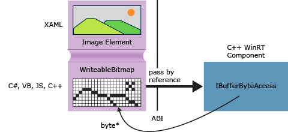

# Obtaining pointers to data buffers (C++/CX)

In the Windows Runtime the [Windows::Storage::Streams::IBuffer](/uwp/api/windows.storage.streams.ibuffer) interface provides a language-neutral, stream-based means to access data buffers. In C++ you can get a raw pointer to the underlying byte array by using the Windows Runtime Library IBufferByteAccess interface that is defined in robuffer.h. By using this approach you can modify the byte array in-place without making any unnecessary copies of the data.

The following diagram shows a XAML image element, whose source is a [Windows::UI::Xaml::Media::Imaging WriteableBitmap](/uwp/api/windows.ui.xaml.media.imaging.writeablebitmap). A client app that's written in any language can pass a reference to the `WriteableBitmap` to C++ code and then C++ can use the reference to get at the underlying buffer. In a Universal Windows Platform app that's written in C++, you can use the function in the following example directly in the source code without packaging it in a Windows Runtime component.



## GetPointerToPixelData

The following method accepts an [Windows::Storage::Streams::IBuffer](/uwp/api/windows.storage.streams.ibuffer) and returns a raw pointer to the underlying byte array. To call the function, pass in a [WriteableBitmap::PixelBuffer](/uwp/api/windows.ui.xaml.media.imaging.writeablebitmap.pixelbuffer) property.

```cpp
#include <wrl.h>
#include <robuffer.h>
using namespace Windows::Storage::Streams;
using namespace Microsoft::WRL;
typedef uint8 byte;
// Retrieves the raw pixel data from the provided IBuffer object.
// Warning: The lifetime of the returned buffer is controlled by
// the lifetime of the buffer object that's passed to this method.
// When the buffer has been released, the pointer becomes invalid
// and must not be used.
byte* Class1::GetPointerToPixelData(IBuffer^ pixelBuffer, unsigned int *length)
{
    if (length != nullptr)
    {
        *length = pixelBuffer ->Length;
    }
    // Query the IBufferByteAccess interface.
    ComPtr<IBufferByteAccess> bufferByteAccess;
    reinterpret_cast<IInspectable*>( pixelBuffer)->QueryInterface(IID_PPV_ARGS(&bufferByteAccess));

    // Retrieve the buffer data.
    byte* pixels = nullptr;
    bufferByteAccess->Buffer(&pixels);
    return pixels;
}
```

## Complete Example

The following steps show how to create a C# Universal Windows Platform app that passes a `WriteableBitmap` to a C++ Windows Runtime component DLL. The C++ code obtains a pointer to the pixel buffer and performs a simple in-place modification on the image. As an alternative, you can create the client app in Visual Basic, JavaScript, or C++ instead of C#. If you use C++, you don't need the component DLL; you can just add these methods directly to the MainPage class or some other class that you define.

#### Create the client

1. Use the Blank app project template to create a C# Universal Windows Platform app.

1. In MainPage.xaml

   - Use this XAML to replace the `Grid` element:

        ```xml
        <Grid Background="{StaticResource ApplicationPageBackgroundThemeBrush}">
            <StackPanel HorizontalAlignment="Left" Margin="176,110,0,0" VerticalAlignment="Top" Width="932">
                <Image x:Name="Pic"/>
                <Button Content="Process Image" HorizontalAlignment="Stretch" VerticalAlignment="Stretch" Height="47" Click="Button_Click_1"/>
            </StackPanel>
        </Grid>
        ```

1. In MainPage.xaml.cs

   1. Add these namespace declarations:

        ```csharp
        using Windows.Storage;
        using Windows.Storage.FileProperties;
        using Windows.UI.Xaml.Media.Imaging;
        using Windows.Storage.Streams;
        using Windows.Storage.Pickers;
        ```

   1. Add a `WriteableBitmap` member variable to the `MainPage` class and name it `m_bm`.

        ```csharp
        private WriteableBitmap m_bm;
        ```

   1. Use the following code to replace the `OnNavigatedTo` method stub. This opens the file picker when the app is started. (Notice that the `async` keyword is added to the function signature).

        ```csharp
        async protected override void OnNavigatedTo(NavigationEventArgs e)
        {
            FileOpenPicker openPicker = new FileOpenPicker();
            openPicker.ViewMode = PickerViewMode.Thumbnail;
            openPicker.SuggestedStartLocation = PickerLocationId.PicturesLibrary;
            openPicker.FileTypeFilter.Add(".jpg");
            openPicker.FileTypeFilter.Add(".jpeg");
            openPicker.FileTypeFilter.Add(".png");

            StorageFile file = await openPicker.PickSingleFileAsync();
            if (file != null)
            {
                // Get the size of the image for the WriteableBitmap constructor.
                ImageProperties props = await file.Properties.GetImagePropertiesAsync();
                m_bm = new WriteableBitmap((int)props.Height, (int)props.Width);
                m_bm.SetSource(await file.OpenReadAsync());
                Pic.Source = m_bm;
            }
            else
            {
                //  Handle error...
            }
        }
        ```

   1. Add the event handler for the button click. (Because the `ImageManipCPP` namespace reference hasn't been created yet, it might have a wavy underline in the editor window.)

        ```csharp
        async private void Button_Click_1(object sender, RoutedEventArgs e)
        {
            ImageManipCPP.Class1 obj = new ImageManipCPP.Class1();
            await obj.Negativize(m_bm);
            Pic.Source = m_bm;
        }
        ```

#### Create the C++ component

1. Add a new C++ Windows Runtime component to the existing solution, and name it `ImageManipCPP`. Add a reference to it in the C# project by right-clicking on that project in **Solution Explorer** and choosing **Add**, **Reference**.

1. In Class1.h

   1. Add this **`typedef`** at the second line, just after `#pragma once`:

        ```cpp
        typedef uint8 byte;
        ```

   1. Add the `WebHostHidden` attribute just above the beginning of the `Class1` declaration.

        ```cpp
        [Windows::Foundation::Metadata::WebHostHidden]
        ```

   1. Add this public method signature to `Class1`:

        ```cpp
        Windows::Foundation::IAsyncAction^ Negativize(Windows::UI::Xaml::Media::Imaging::WriteableBitmap^ bm);
        ```

   1. Add the signature from the `GetPointerToPixelData` method that is shown in the earlier code snippet. Make sure that this method is private.

1. In Class1.cpp

   1. Add these `#include` directives and namespace declarations:

        ```cpp
        #include <ppltasks.h>
        #include <wrl.h>
        #include <robuffer.h>

        using namespace Windows::Storage;
        using namespace Windows::UI::Xaml::Media::Imaging;
        using namespace Windows::Storage::Streams;
        using namespace Microsoft::WRL;
        ```

   1. Add the implementation of `GetPointerToPixelData` from the earlier code snippet.

   1. Add the implementation of `Negativize`. This method creates an effect that resembles a film negative by reversing the value of each RGB value in the pixel. We make the method asynchronous because on larger images it might take a perceptible amount of time to complete.

        ```cpp
        IAsyncAction^ Class1::Negativize(WriteableBitmap^ bm)
        {
            unsigned int length;
            byte* sourcePixels = GetPointerToPixelData(bm->PixelBuffer, &length);
            const unsigned int width = bm->PixelWidth;
            const unsigned int height = bm->PixelHeight;

            return create_async([this, width, height, sourcePixels]
            {
                byte* temp = sourcePixels;
                for(unsigned int k = 0; k < height; k++)
                {
                    for (unsigned int i = 0; i < (width * 4); i += 4)
                    {
                        int pos = k * (width * 4) + (i);
                        temp[pos] = ~temp[pos];
                        temp[pos + 1] = ~temp[pos + 1] / 3;
                        temp[pos + 2] = ~temp[pos + 2] / 2;
                        temp[pos + 3] = ~temp[pos + 3];
                    }
                }
            });

        }
        ```

      > [!NOTE]
      > This method might run faster if you use AMP or the Parallel Patterns Library to parallelize the operation.

1. Ensure that you have at least one picture in your pictures folder, and then press F5 to compile and run the program.
