# Build an OpenGL ES application on Android and iOS

You can create Visual Studio solutions and projects for iOS apps and Android apps that share common code. This article guides you through a combined solution template. It creates both an iOS app, and an Android Native Activity app. The apps have C++ code in common that uses OpenGL ES to display the same animated rotating cube on each platform. OpenGL ES (OpenGL for Embedded Systems or GLES) is a 2D and 3D graphics API. It's supported on many mobile devices.

## Requirements

Meet all the system requirements to create an OpenGL ES app for iOS and Android. If you haven't already, install the Mobile Development with C++ workload in the Visual Studio Installer. To get the OpenGL ES templates, and to build for iOS, include the optional C++ iOS development tools. To build for Android, install the C++ Android development tools and the required third-party tools: Android NDK, Apache Ant, and Google Android Emulator.

For better emulator performance on Intel platforms, one option is to install the Intel Hardware Accelerated Execution Manager (HAXM). For detailed instructions, see [Install cross-platform mobile development with C++](../cross-platform/install-visual-cpp-for-cross-platform-mobile-development.md).

To build and test the iOS app, you'll need a Mac computer. Set it up according to the installation instructions. For more information about how to set up for iOS development, see [Install and configure tools to build using iOS](../cross-platform/install-and-configure-tools-to-build-using-ios.md).

## Create a new OpenGLES Application project

In this tutorial, you first create a new OpenGL ES Application project. and then build and run the default app in an Android emulator. Next you build the app for iOS and run the app on an iOS device.

::: moniker range="msvc-150"

1. In Visual Studio, choose **File** > **New** > **Project**.

1. In the **New Project** dialog box, under **Templates**, choose **Visual C++** > **Cross Platform**, and then choose the **OpenGLES Application (Android, iOS)** template.

1. Give the app a name like *MyOpenGLESApp*, and then choose **OK**.

   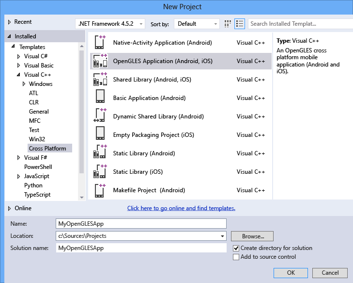

   Visual Studio creates the new solution and opens Solution Explorer.

   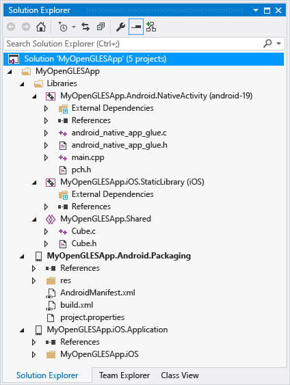

::: moniker-end

::: moniker range=">=msvc-160"

1. In Visual Studio, choose **File** > **New** > **Project**.

1. In the **Create a new project** dialog box, select the **OpenGLES Application (Android, iOS)** template, and then choose **Next**.

1. In the **Configure your new project** dialog box, enter a name like *MyOpenGLESApp* in **Project name**, and then choose **Create**.

   Visual Studio creates the new solution and opens Solution Explorer.

   

::: moniker-end

The new OpenGL ES Application solution includes three library projects and two application projects. The Libraries folder includes a shared code project. And, two platform-specific projects that reference the shared code:

- `MyOpenGLESApp.Android.NativeActivity` contains the references and glue code that implements your app as a Native Activity on Android. The entry points from the glue code are implemented in *main.cpp*, which includes the common shared code in `MyOpenGLESApp.Shared`. Precompiled headers are in *pch.h*. This Native Activity app project is compiled into a shared library (*.so*) file, which is picked up by the `MyOpenGLESApp.Android.Packaging` project.

- `MyOpenGLESApp.iOS.StaticLibrary` creates an iOS static library (*.a*) file that contains the shared code in `MyOpenGLESApp.Shared`. It's linked to the app created by the `MyOpenGLESApp.iOS.Application` project.

- `MyOpenGLESApp.Shared` contains the shared code that works across platforms. It uses preprocessor macros for conditional compilation of platform-specific code. The shared code is picked up by project reference in both `MyOpenGLESApp.Android.NativeActivity` and `MyOpenGLESApp.iOS.StaticLibrary`.

The solution has two projects to build the apps for the Android and iOS platforms:

- `MyOpenGLESApp.Android.Packaging` creates the *.apk* file for deployment on an Android device or emulator. This file contains the resources and AndroidManifest.xml file where you set manifest properties. It also contains the *build.xml* file that controls the Ant build process. It's set as the startup project by default, so that it can be deployed and run directly from Visual Studio.

- `MyOpenGLESApp.iOS.Application` contains the resources and Objective-C glue code to create an iOS app that links to the C++ static library code in `MyOpenGLESApp.iOS.StaticLibrary`. This project creates a build package that is transferred to your Mac by Visual Studio and the remote agent. When you build this project, Visual Studio sends the files and commands to build and deploy your app on the Mac.

## Build and run the Android app

The solution created by the template sets the Android app as the default project.  You can build and run this app to verify your installation and setup. For an initial test, run the app on one of the device profiles installed by the emulator for Android. If you prefer to test your app on another target, you can load the target emulator. Or, connect a device to your computer.

### To build and run the Android Native Activity app

1. If it isn't already selected, choose **x86** from the **Solution Platforms** drop-down list.

   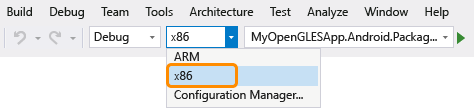

   Use x86 to target the emulator. To target a device, choose the solution platform based on the device processor. If the **Solution Platforms** list isn't displayed, choose **Solution Platforms** from the **Add/Remove Buttons** list, and then choose your platform.

1. In **Solution Explorer**, open the shortcut menu for `MyOpenGLESApp.Android.Packaging` project and then choose **Build**.

   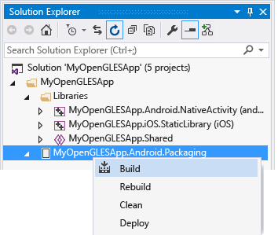

   The Output window displays the output of the build process for the Android shared library and the Android app.

   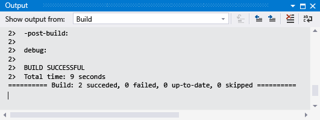

1. Choose one of the emulated Android device profiles as your deployment target.

   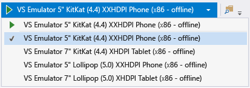

   You may have installed other emulators, or connected an Android device. You can choose them in the deployment target dropdown list. To run the app, the built Solution Platform must match the platform of the target device.

1. Press **F5** to start debugging, or **Shift**+**F5** to start without debugging.

   Visual Studio starts the emulator, which takes several seconds to load and deploy your code. Here's how the app appears in the emulator:

   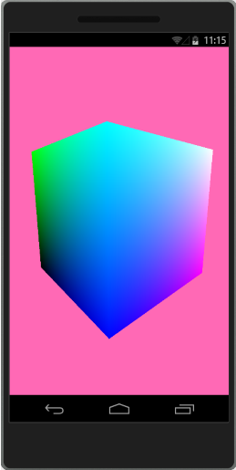

   Once your app has started, you can set breakpoints and use the debugger to step through code, examine locals, and watch values.

1. Press **Shift**+**F5** to stop debugging.

   The emulator is a separate process that continues to run. You can edit, compile, and deploy your code multiple times to the same emulator. Your app appears in the app collection on the emulator, and it can be started from there directly.

   The generated Android Native Activity app and library projects put the C++ shared code in a dynamic library. It includes "glue" code to interface with the Android platform. Most of the app code is in the library. The manifest, resources, and build instructions are in the packaging project. The shared code is called from main.cpp in the NativeActivity project. For more information about how to program an Android Native Activity, see the Android Developer NDK [Concepts](https://developer.android.com/ndk/guides/concepts.html) page.

   Visual Studio builds Android Native Activity projects by using the Android NDK. It uses Clang as the platform toolset. Visual Studio maps the project's properties into the compile, link, and debug commands on the target platform. For details, open the **Property Pages** dialog for the MyOpenGLESApp.Android.NativeActivity project. For more information about the command-line switches, see the [Clang Compiler User's Manual](https://clang.llvm.org/docs/UsersManual.html).

## Build and run the iOS app on an iOS device

You create and edit the iOS app project in Visual Studio. Because of licensing restrictions, it must be built and deployed from a Mac. Visual Studio communicates with a remote agent running on the Mac to transfer project files and execute build, deployment, and debugging commands. Set up and configure your Mac and Visual Studio to communicate before you can build the iOS app. For detailed instructions, see [Install and configure tools to build using iOS](../cross-platform/install-and-configure-tools-to-build-using-ios.md). Run the remote agent on your Mac, and pair it with Visual Studio. Then you can build and run the iOS app to verify your installation and setup.

To deploy your app to an iOS device, first set up automatic signing in Xcode. Automatic signing creates a provisioning profile to sign a build of the app.

### To set up automatic signing on Xcode

1. If you haven't already, install [Xcode](https://developer.apple.com/xcode/) on your Mac.

1. Open the Xcode app on your Mac.

1. Create a new **Single View Application** Xcode project. Fill in the required fields during project creation. The values can be arbitrary, as the project is only used to create a provisioning profile that's used later to sign a build of the app.

1. Add your Apple ID that's enrolled in an [Apple Developer Program](https://developer.apple.com/programs/) account to Xcode. Your Apple ID is used as a signing identity to sign apps. To add your signing identity in Xcode, open the **Xcode** menu and choose **Preferences**. Select **Accounts** and click the Add button (+) to add your Apple ID. For detailed instructions, see [Add your Apple ID account](https://help.apple.com/xcode/mac/current/#/devaf282080a).

1. From the Xcode project's "General" settings, change the value of **Bundle Identifier** to `com.<NameOfVSProject>`, where `<NameOfVSProject>` is the same name as the Visual Studio solution project you created. For example, if you created a project called `MyOpenGLESApp` on Visual Studio, then set **Bundle Identifier** to `com.MyOpenGLESApp`.

   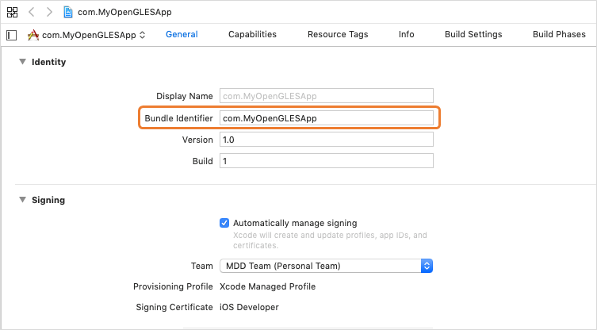

1. To enable automatic signing, check. Automatically manage signing**.

   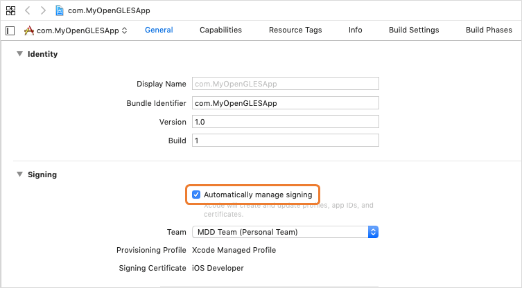

1. Select the team name of the Apple ID you added as the development **Team**.

   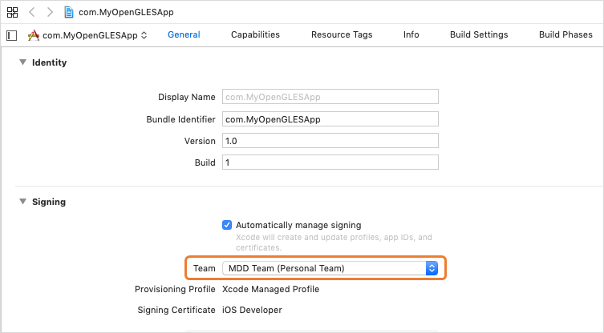

### To build and run the iOS app on an iOS device

1. Run the remote agent on your Mac, and verify that Visual Studio is paired to the remote agent. To start the remote agent, open a Terminal app window and enter `vcremote`. For more information, see [Configure the remote agent in Visual Studio](../cross-platform/install-and-configure-tools-to-build-using-ios.md#ConfigureVS).

   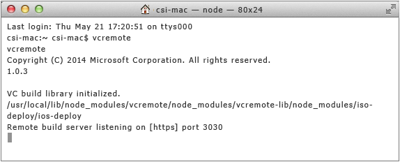

1. Attach an iOS device to your Mac. When you attach your device to a computer for the first time, an alert asks whether you trust the computer to access your device. Enable the device to trust the Mac computer.

1. On Visual Studio, if it isn't already selected, choose the solution platform from the **Solution Platforms** drop-down list based on your device processor. In this example, it's an **ARM64** processor.

   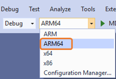

1. In Solution Explorer, open the shortcut menu for the MyOpenGLESApp.iOS.Application project and choose **Unload Project** to unload the project.

1. Again, open the shortcut menu for the unloaded MyOpenGLESApp.iOS.Application project and choose **Edit project.pbxproj** to edit the project file. In the `project.pbxproj` file, look for the `buildSettings` attribute and add `DEVELOPMENT_TEAM` using your Apple Team ID. The screenshot below shows an example value of `123456ABC` for the Apple Team ID. You can find the value of your Apple Team ID from Xcode. Go to **Build Settings** and hover over your development team name to show a tooltip. The tooltip shows your team ID.

   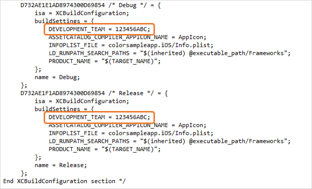

1. Close the `project.pbxproj` file, then open the shortcut menu for the unloaded MyOpenGLESApp.iOS.Application project and choose **Reload Project** to reload the project.

1. Now build the MyOpenGLESApp.iOS.Application project by opening the shortcut menu for the project and choosing **Build**.

   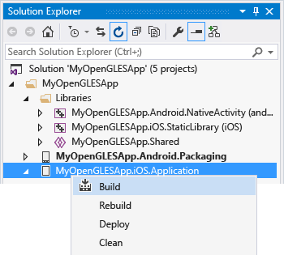

   The Output window displays the output of the build process. It shows results for the iOS static library and the iOS app. On the Mac, the Terminal window running the remote agent shows the command and file transfer activity.

   On your Mac computer, you may be prompted to allow codesign to access your keychain. Choose **Allow** to continue.

1. Choose your iOS device on the toolbar to run the app on your device attached to your Mac. If the app doesn't start, verify that the device gives permission for your deployed application to execute on the device. This permission can be set by going to **Settings** > **General** > **Device Management** on the device. Select your Developer App account, trust your account, and verify the app. Try to run the app again from Visual Studio.

   

   Once your app has started, you can set breakpoints and use the Visual Studio debugger to examine locals, see the call stack, and watch values.

   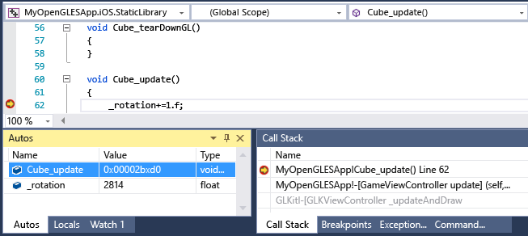

1. Press **Shift**+**F5** to stop debugging.

   The generated iOS app and library projects put the C++ code in a static library that implements only the shared code. Most of the application code is in the `Application` project. The calls to the shared library code in this template project are made in the *GameViewController.m* file. To build your iOS app, Visual Studio uses the Xcode platform toolset, which requires communication with a remote client that is running on a Mac.

   Visual Studio transfers the project files to the remote client. Then it sends commands to build the app using Xcode. The remote client sends build status information back to Visual Studio. When the app has built successfully, Visual Studio can send commands to run and debug the app. The debugger in Visual Studio controls the app running on your iOS device attached to your Mac. Visual Studio maps project properties to the options used to compile, link, and debug on the target iOS platform. For compiler command-line option details, open the **Property Pages** dialog for the MyOpenGLESApp.iOS.StaticLibrary project.

## Customize your apps

You can modify the shared C++ code to add or change common functionality. Change the calls to the shared code in the `MyOpenGLESApp.Android.NativeActivity` and `MyOpenGLESApp.iOS.Application` projects to match. You can use preprocessor macros to specify platform-specific sections in your common code. The preprocessor macro `__ANDROID__` is predefined when you build for Android. The preprocessor macro `__APPLE__` is predefined when you build for iOS.

To see the IntelliSense for a particular project platform, choose the project in the context switcher dropdown. It's in the Navigation bar at the top of the editor window.

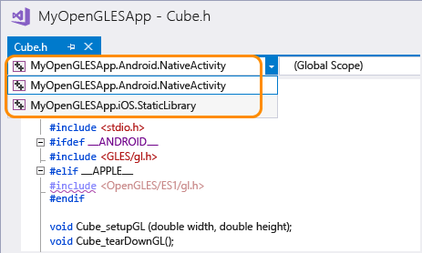

IntelliSense issues in code that's used by the current project are marked with a red wavy line. A purple wavy line marks issue in other projects. Visual Studio doesn't support code colorization or IntelliSense for Java or Objective-C files. However, you can still modify the source files and resources. Use them to set your application name, icon, and other implementation details.
