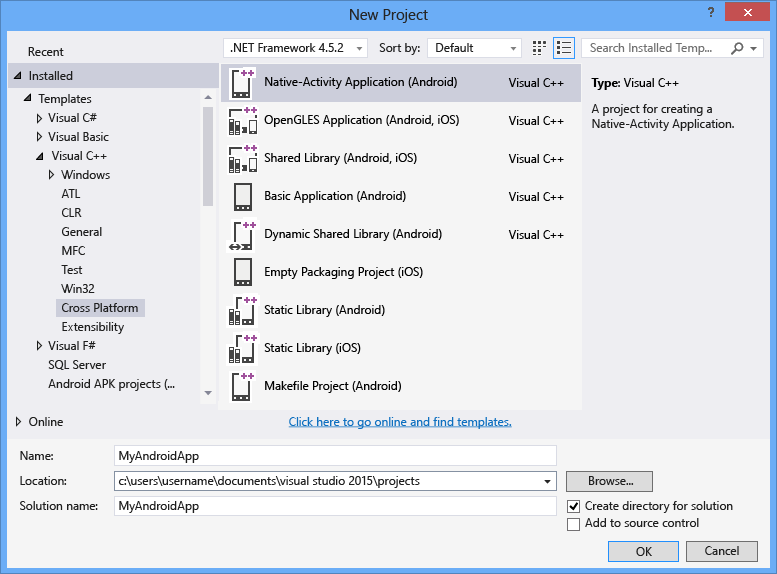
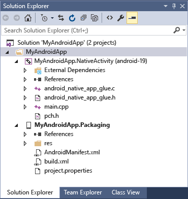
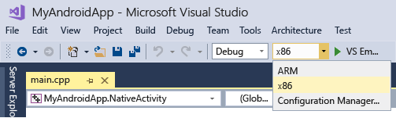
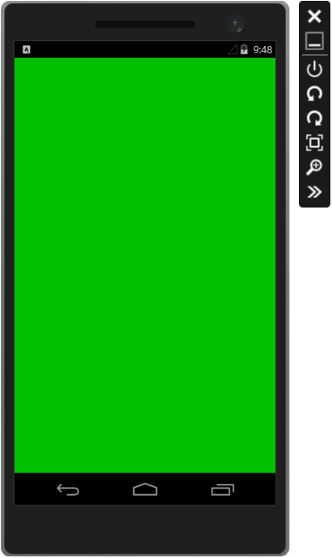

# Create an Android Native Activity App

When you install the cross-platform **Mobile development with C++** workload, Visual Studio can be used to create fully functional Android Native Activity apps. The Android Native Development Kit (NDK) is a toolset that allows you to implement the majority of your Android app using pure C/C++ code. Some Java JNI code acts as glue to allow your C/C++ code to interact with Android. The Android NDK introduced the ability to create Native Activity apps with Android API Level 9. Native Activity code is popular for creating gaming and graphic intensive apps that use Unreal Engine or OpenGL. This topic will guide you through creation of a simple Native Activity app that uses OpenGL. Additional topics walk through the developer lifecycle of editing, building, debugging and deploying Native Activity code.

## Requirements

Before you can create an Android Native Activity app, you must make sure you've met all system requirements, and installed the **Mobile development with C++** workload in Visual Studio. For more information, see [Install cross-platform mobile development with C++](../cross-platform/install-visual-cpp-for-cross-platform-mobile-development.md). Make sure that the required third-party tools and SDKs are included in the installation, and that an Android emulator is installed.

## Create a new Native Activity project

In this tutorial, you'll first create a new Android Native Activity project and then build and run the default app in an Android emulator.

::: moniker range="msvc-150"

1. In Visual Studio, choose **File** > **New** > **Project**.

1. In the **New Project** dialog box, under **Templates**, choose **Visual C++** > **Cross Platform**, and then choose the **Native-Activity Application (Android)** template.

1. Give the app a name like *MyAndroidApp*, and then choose **OK**.

   

   Visual Studio creates the new solution and opens Solution Explorer.

   

::: moniker-end

::: moniker range=">=msvc-160"

1. In Visual Studio, choose **File** > **New** > **Project**.

1. In the **Create a new project** dialog box, select the **Native-Activity Application (Android)** template, and then choose **Next**.

1. In the **Configure your new project** dialog box, enter a name like *MyAndroidApp* in **Project name**, and then choose **Create**.

   Visual Studio creates the new solution and opens Solution Explorer.

::: moniker-end

The new Android Native Activity app solution includes two projects:

- `MyAndroidApp.NativeActivity` contains the references and glue code for your app to run as a Native Activity on Android. The implementation of the entry points from the glue code are in *main.cpp*. Precompiled headers are in *pch.h*. This Native Activity app project is compiled into a shared library *.so* file which is picked up by the Packaging project.

- `MyAndroidApp.Packaging` creates the *.apk* file for deployment on an Android device or emulator. This contains the resources and *AndroidManifest.xml* file where you set manifest properties. It also contains the *build.xml* file that controls the Ant build process. It's set as the startup project by default, so that it can be deployed and run directly from Visual Studio.

## Build and run the default Android Native Activity app

Build and run the app generated by the template to verify your installation and setup. For this initial test, run the app on one of the device profiles installed by the Android emulator. If you prefer to test your app on another target, you can load the target emulator or connect the device to your computer.

## To build and run the default Native Activity app

1. If it is not already selected, choose **x86** from the **Solution Platforms** dropdown list.

     

     If the **Solution Platforms** list isn't showing, choose **Solution Platforms** from the **Add/Remove Buttons** list, and then choose your platform.

1. On the menu bar, choose **Build** > **Build Solution**.

     The Output window displays the output of the build process for the two projects in the solution.

1. Choose one of the Android emulator profiles as your deployment target.

     If you have installed other emulators or connected an Android device, you can choose them in the deployment target dropdown list.

1. Press **F5** to start debugging, or **Shift**+**F5** to start without debugging.

   Here's what the default app looks like in an Android emulator.

   

   Visual Studio starts the emulator, which takes a few seconds to load and deploy your code. Once your app has started, you can set breakpoints and use the debugger to step through code, examine locals, and watch values.

1. Press **Shift**+**F5** to stop debugging.

   The emulator is a separate process that continues to run. You can edit, compile, and deploy your code multiple times to the same emulator.
