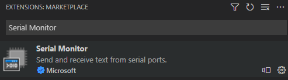

# Install the Embedded extensions in VSCode

Embedded tools like a [Peripheral Viewer](./peripheral-view.md), [RTOS Viewer](./rtos-view.md), and a [Serial Monitor](./serial-monitor.md) are supported in VSCode. This means that you now can use Microsoft tools to help debug your embedded applications in VSCode.

## Visual Studio Code setup

1. Type Visual Studio Code in the Windows search box:

    

1. Look for Visual Studio Code under **Apps** and double-click it. When Visual Studio Code opens, open the **Extensions Pane**.

    

### Install the Embedded Tools extension

1. Search for and install the [Embedded Tools](https://marketplace.visualstudio.com/items?itemName=ms-vscode.vscode-embedded-tools) extension.

    

1. Search for and install the [Serial Monitor](https://marketplace.visualstudio.com/items?itemName=ms-vscode.vscode-serial-monitor) extension.

    
