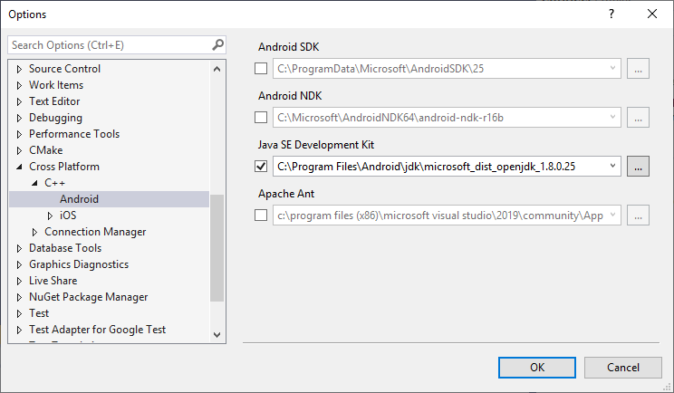

# Install cross-platform mobile development with C++

You can use C++ in Visual Studio to build Windows Desktop apps, Universal Windows Platform (UWP) apps, and Linux apps. And now, you can build C++ apps for Android and iOS. The **Mobile development with C++** workload is an installable set of components in Visual Studio. It includes cross-platform iOS, Android, and UWP Visual Studio templates. The workload installs the cross-platform tools and SDKs you need to get started quickly. You won't have to locate, download, and configure them yourself. You can use these tools in Visual Studio to easily create, edit, debug, and test your cross-platform projects.

This article describes how to install the tools and third-party software required to develop cross-platform apps in C++ using Visual Studio. For an overview, see [Visual C++ cross-platform mobile](https://visualstudio.microsoft.com/vs/features/cplusplus-mdd/)

## Requirements

::: moniker range="msvc-150"

- For installation requirements, see [Visual Studio product family system requirements](/visualstudio/productinfo/vs2017-system-requirements-vs).

   > [!IMPORTANT]
   > If you are using Windows 7 or Windows Server 2008 R2, you can develop code for Windows Desktop applications, Android Native Activity apps and libraries, and apps and code libraries for iOS, but not Windows Store or UWP apps.

::: moniker-end
::: moniker range=">=msvc-160"

- For installation requirements, see [Visual Studio product family system requirements](/visualstudio/releases/2019/system-requirements).

   > [!IMPORTANT]
   > If you are using Windows 7 or Windows Server 2008 R2, you can develop code for Windows Desktop applications, Android Native Activity apps and libraries, and apps and code libraries for iOS, but not Windows Phone or UWP apps.

::: moniker-end

To build apps for specific device platforms, there are some additional requirements:

- The x86 Android emulators that come with the Android SDK work best on computers that can use hardware acceleration, such as the Intel Hardware Accelerated Execution Manager (HAXM). For more information, see [Hardware acceleration for emulator performance (Hyper-V & HAXM)](/xamarin/android/get-started/installation/android-emulator/hardware-acceleration?tabs=vswin&pivots=windows).

- Building code for iOS requires an Apple ID, an iOS Developer Program account, and a Mac computer that can run [Xcode](https://developer.apple.com/xcode/) version 10.2 or later on OS X Mavericks (version 10.9) or later versions. For a link to installation steps, see [Install tools for iOS](#install-tools-for-ios).

- Windows Phone emulators require a computer that can run Hyper-V. The Hyper-V feature in Windows must be enabled before you can install and run the emulators. For more information, see the emulator's [system requirements](/visualstudio/cross-platform/system-requirements-for-the-visual-studio-emulator-for-android).

## Get the tools

Mobile development with C++ is available in Visual Studio Community, Professional, and Enterprise editions. To get Visual Studio, go to the [Visual Studio downloads](https://visualstudio.microsoft.com/downloads/) page. The cross-platform mobile development tools are available starting in Visual Studio 2015.

## Install the tools

The Visual Studio Installer includes a **Mobile development with C++** workload. This workload installs the C++ language tools, templates, and components required for Android and iOS development in Visual Studio. It includes the GCC and Clang tool sets needed for Android builds and debugging. The workload installs the Android SDK, and components to communicate with a Mac for iOS development. It also installs third-party tools and software development kits required to support iOS and Android app development. Most of these third-party tools are open-source software required for Android platform support.

- Android Native Development Kit (NDK), Apache Ant, and the C++ Android development tools are required to build C++ code that targets the Android platform.

  > [!NOTE]
  > Some tools in the Android NDK don't support Unicode characters in file paths and file names. If a project or source file has Unicode characters in its path or file name, the project will fail to build.

- The Google Android Emulator and Intel Hardware Accelerated Execution Manager (HAXM) are optional, but recommended, components. (The Intel HAXM drivers only work on Intel processors, and are incompatible with some VMs, including Hyper-V.) You can develop and debug directly on an Android device, but it's often easier to use an emulator on your desktop for debugging.

- C++ iOS development tools are required to build C++ code that targets the iOS platform.

> [!NOTE]
> If you're using Visual Studio 2015, see [Install Visual C++ for Cross-Platform Mobile Development (Visual Studio 2015)](install-visual-cpp-for-cross-platform-mobile-development.md?view=msvc-140&preserve-view=true)

### Install the Mobile development with C++ workload

1. Run the **Visual Studio Installer** from the **Start** menu.

1. If you've already installed Visual Studio, choose the **Modify** button for the installed version of Visual Studio you'd like to modify. Otherwise, choose **Install** to install Visual Studio.

1. With the **Workloads** tab selected, scroll down and select the **Mobile development with C++** workload in the Visual Studio Installer. When this workload is selected, other required components for C++ development are also selected. You can also choose other workloads and individual components to install at the same time. To build cross-platform code that also targets UWP, select the **Universal Windows Platform development** workload.

1. In the **Installation details** pane, expand **Mobile development with C++**. In the **Optional** section, you can choose additional versions of the NDK, the Google Android Emulator, the Intel Hardware Accelerated Execution Manager, and the IncrediBuild build acceleration tool.

1. By default, one or more Android SDK setup components are included by the workload. Additional versions of the Android SDK are available. To add one to your installation, choose the **Individual components** tab, then scroll down to the **SDKs, libraries, and frameworks** section to make your selection.

1. Choose the **Modify** or **Install** button to install the **Mobile development with C++** workload and your other selected workloads and optional components.

   When installation is complete, close the installer and then restart your computer. Some setup actions for the third-party components don't take effect until the computer is restarted.

   > [!IMPORTANT]
   > You must restart to make sure everything is installed correctly.

1. Open Visual Studio.

## Install tools for iOS

You can use Visual Studio to edit, debug, and deploy iOS code to the iOS Simulator. Or, to an iOS device. Because of licensing restrictions, the code must be built remotely on a Mac. To build and run iOS apps using Visual Studio, first set up and configure the remote agent on your Mac. For detailed installation instructions, prerequisites and configuration options, see [Install and configure tools to build using iOS](../cross-platform/install-and-configure-tools-to-build-using-ios.md). If you're not building for iOS, you can skip this step.

## Install or update dependencies manually

You don't have to install all the third-party dependencies when you install the **Mobile development with C++** workload (or in Visual Studio 2015, the Visual C++ Mobile Development option). Install them later by using the steps in [Install the tools](#install-the-tools). The Visual Studio Installer is updated regularly to install the latest third-party components. Use it to install updated SDKs and NDKs. You can also install or update them independently of Visual Studio.

You can run the SDK Manager app in the Android SDK directory again to update the SDK. And, to install optional tools and additional API levels. Updates may fail to install unless you use **Run as administrator** to run the SDK Manager app. If you have problems building an Android app, check the SDK Manager for updates to your installed SDKs.

To use some of the Android SDK emulators, you may need to set up hardware acceleration. For more information, see [Hardware acceleration for emulator performance (Hyper-V & HAXM)](/xamarin/android/get-started/installation/android-emulator/hardware-acceleration?tabs=vswin).

In most cases, Visual Studio can detect the configurations for the third-party software you've installed. It maintains the installation paths in internal environment variables. You can override the default paths of these cross-platform development tools in the Visual Studio IDE.

### To set the paths for third-party tools

1. On the Visual Studio menu bar, select **Tools** > **Options**.

1. In the **Options** dialog box, select **Cross Platform** > **C++** > **Android**.

   

1. To change the path used by a tool, check the checkbox next to the path, and edit the folder path in the textbox. You can also use the browse button (**...**) to open a **Select location** dialog to choose the folder.

1. Choose **OK** to save the custom tool folder locations.

## See also

[Install and configure tools to build using iOS](install-and-configure-tools-to-build-using-ios.md)\
[Visual C++ cross-platform mobile](https://visualstudio.microsoft.com/vs/features/cplusplus-mdd/)
