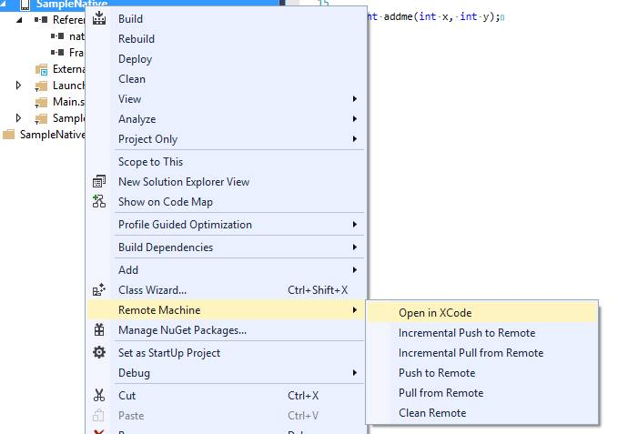
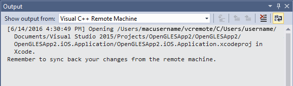

# Sync changes between Xcode and Visual Studio

The mobile development with C++ components in Visual Studio include remote capabilities for syncing your work between your PC and your Mac. When your Visual Studio and Mac machines are paired, new options are available for iOS Application projects in Visual Studio that you can use to open your project in Xcode, move your code between Xcode and Visual Studio, and clean the temporary Xcode project directory.

To use the Remote Machine options, your project must be an iOS Application project, and Visual Studio must be paired with your Mac. For prerequisites and instructions on how to pair a Mac, see [Install and configure tools to build using iOS](../cross-platform/install-and-configure-tools-to-build-using-ios.md).

## The Remote Machine menu

In **Solution Explorer**, right-click on an iOS Application project to show the context menu. Select the **Remote Machine** item to show the remote options available.

These commands let you open your project in Xcode, move local changes or the entire project between Visual Studio and Xcode, and clean the temporary files on the remote machine.

## Open in Xcode

To open the project in Xcode from Visual Studio, on the **Remote Machine** submenu, choose **Open in Xcode** to open the selected project on the paired remote machine. The `vcremote` server is used to open Xcode on your Mac and navigate to a temporary directory created on your Mac that contains a copy of the project. Visual Studio pops up a dialog that shows the temporary directory used for the project. The actions taken on the remote machine are also shown in the **Output** window in Visual Studio. To see them, you may need to select **Visual C++ Remote Machine** in the **Show output from** dropdown at the top of the **Output** window.

On your Mac, you can use all the Xcode tools to edit your code and resources, storyboards and actions. In Visual Studio, your iOS Application project is annotated with "Opened in Xcode" to indicate that changes may be made on the remote machine. Once your edits are complete, you can use the Pull from Remote or Incremental Pull from Remote commands to copy the changes back into your Visual Studio project.

## Push to Remote and Incremental Push to Remote

If you have made changes to your iOS Application project in Visual Studio, the Push to Remote and Incremental Push to Remote commands can be used to move the changed project files to the paired remote machine. The Push to Remote command copies all project files to the remote machine. The Incremental Push to Remote command only copies changed files to the remote machine. For large projects with small changes, the incremental command can save time and bandwidth.

To copy the project files to your Mac, in Visual Studio in **Solution Explorer**, right-click the iOS Application project to open the context menu. Select **Remote Machine** and choose either **Push to Remote** or **Incremental Push to Remote** to copy project files from Visual Studio to your Mac.

## Pull from Remote and Incremental Pull from Remote

After you make any changes to your project in Xcode, move the changes back to Visual Studio to keep the projects in sync.

To copy the project files from your Mac, in Visual Studio in **Solution Explorer**, right-click the iOS Application project to open the context menu. Select **Remote Machine** and choose either **Pull from Remote** or **Incremental Pull from Remote** to copy project files from your Mac to Visual Studio.

## Clean Remote

You can use the Clean Remote command to delete the files in the temporary project directory on the remote machine. The contents of the directory, including any source files or build products, are removed on your Mac. Be sure you have synced any changes you want to keep back to Visual Studio by using Pull from Remote or Incremental Pull from Remote before you use the Clean Remote command.

To clean the temporary project directory on the remote machine, in Visual Studio in **Solution Explorer**, right-click the iOS Application project to open the context menu. Select **Remote Machine** and choose **Clean Remote** to remove the project directory files from your Mac.
